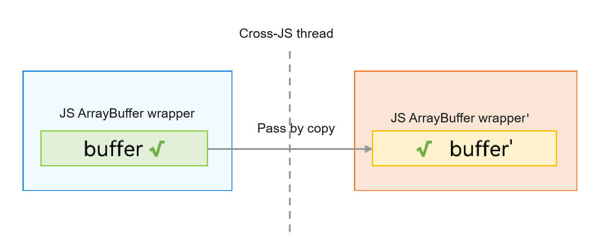
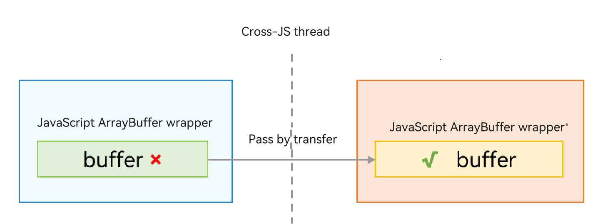

# ArrayBuffer Object

An ArrayBuffer consists of two components: the underlying native memory area that stores data, and the JS object wrapper that encapsulates operations. This JS object wrapper is allocated on the virtual machine's local heap. When passed across threads, the JS object wrapper needs to be serialized and deserialized for pass-by-copy, whereas the native memory area can be transferred in two ways: pass-by-copy and pass-by-transfer.

When pass-by-copy (recursive traversal) is used for the native memory area, both threads can independently access the ArrayBuffer object after the transmission. This transmission mode not only requires rebuilding the JS wrapper but also involves copying the native memory, resulting in lower transfer efficiency. The following figure shows the communication process.



If pass-by-transfer is used for the native memory area, the original thread can no longer use the ArrayBuffer object. During inter-thread communication, only the JS wrapper needs to be reconstructed, and the native memory does not need to be copied, resulting in higher efficiency. The following figure shows the communication process.



ArrayBuffer objects can be used to represent resources such as images. In application development, processing images (such as adjusting brightness, saturation, and size) can be time-consuming. To avoid blocking the UI main thread for extended periods, images can be passed to a child thread for processing. Passing ArrayBuffer objects by transfer results in higher transmission performance, but the original thread can no longer access the ArrayBuffer objects. If both threads need to access the objects, pass-by-copy is the only option. Otherwise, pass-by-transfer is recommended for better performance.

The following sections describe how to transfer images across ArkTS threads using both methods.

## Pass-by-Copy

In ArkTS, TaskPool defaults to passing ArrayBuffer data by transfer. By calling the **setTransferList()** interface, you can specify which parts of the data should be passed by transfer, while the rest can be switched to pass-by-copy.

First, implement an interface for processing the ArrayBuffer. The interface will be executed in the Task.

Then, pass the ArrayBuffer data to the Task by copy and process it.

Finally, the UI main thread receives the ArrayBuffer data returned after the Task execution and concatenates the data for display.

```ts
// Index.ets
import { taskpool } from '@kit.ArkTS';
import { BusinessError } from '@kit.BasicServicesKit';

@Concurrent
function adjustImageValue(arrayBuffer: ArrayBuffer): ArrayBuffer {
  // Perform operations on the ArrayBuffer.
  return arrayBuffer;  // The return value is passed by transfer by default.
}

function createImageTask(arrayBuffer: ArrayBuffer, isParamsByTransfer: boolean): taskpool.Task {
  let task: taskpool.Task = new taskpool.Task(adjustImageValue, arrayBuffer);
  if (!isParamsByTransfer) { // Whether to use pass-by-transfer.
    // Pass an empty array [] to indicate that all ArrayBuffer parameters should be passed by copy.
    task.setTransferList([]);
  }
  return task;
}

@Entry
@Component
struct Index {
  @State message: string = 'Hello World';

  build() {
    RelativeContainer() {
      Text(this.message)
        .id('HelloWorld')
        .fontSize(50)
        .fontWeight(FontWeight.Bold)
        .alignRules({
          center: { anchor: '__container__', align: VerticalAlign.Center },
          middle: { anchor: '__container__', align: HorizontalAlign.Center }
        })
        .onClick(() => {
          let taskNum = 4;
          let arrayBuffer = new ArrayBuffer(1024 * 1024);
          let taskPoolGroup = new taskpool.TaskGroup();
          // Create taskNum tasks.
          for (let i: number = 0; i < taskNum; i++) {
            let arrayBufferSlice: ArrayBuffer = arrayBuffer.slice(arrayBuffer.byteLength / taskNum * i, arrayBuffer.byteLength / taskNum * (i + 1));
            // To pass the ArrayBuffer object by copy, set isParamsByTransfer to false.
            taskPoolGroup.addTask(createImageTask(arrayBufferSlice, false));
          }
          // Execute the tasks.
          taskpool.execute(taskPoolGroup).then((data) => {
            // Concatenate the results to obtain the final result.
          }).catch((e: BusinessError) => {
            console.error(e.message);
          })
        })
    }
    .height('100%')
    .width('100%')
  }
}
```
<!-- @[copy_arraybuffer_transfer](https://gitee.com/openharmony/applications_app_samples/blob/master/code/DocsSample/ArkTs/ArkTsConcurrent/ConcurrentThreadCommunication/InterThreadCommunicationObjects/CommunicationObjects/entry/src/main/ets/managers/ArrayBufferObject.ets) -->

## Pass-by-Transfer

TaskPool defaults to passing ArrayBuffer data by transfer, and the original thread can no longer use the ArrayBuffer passed to the child thread. To achieve this, simply remove the **task.setTransferList** interface call in the preceding code, meaning the second parameter of **createImageTask** should be **true**.

<!--no_check-->