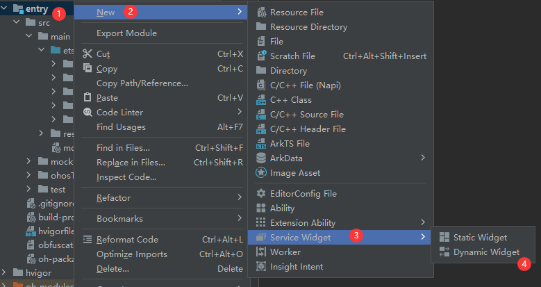
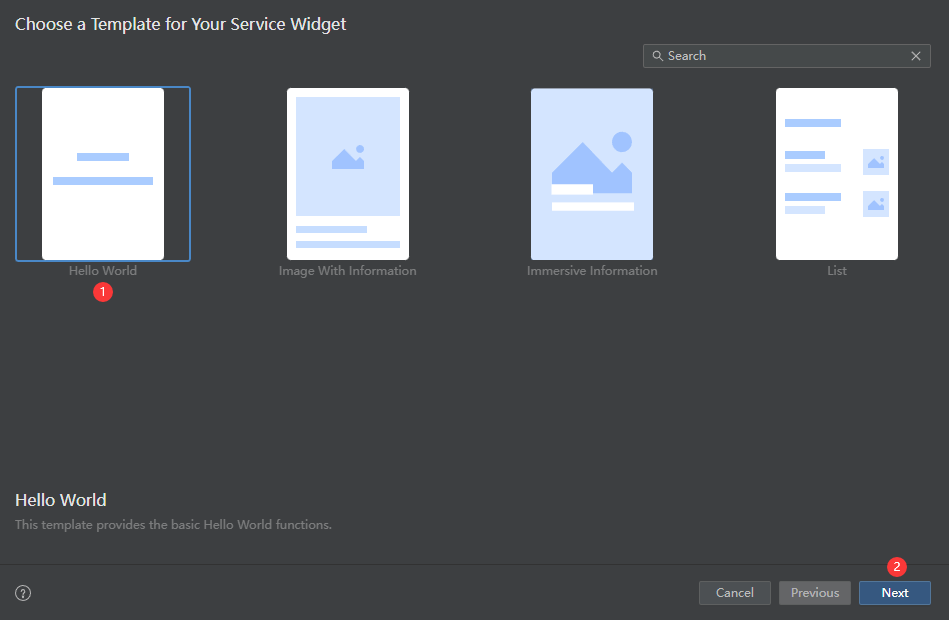
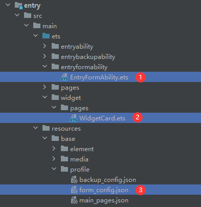

# Creating an ArkTS Widget

You can create a widget in either of the following modes:

- When creating a project, select **Application**. The project created this way does not have a widget by default. You can right-click a module folder and choose **New** > **Service Widget** to create a widget.
- When creating a project, select **Atomic Service**. You can right-click a module folder and choose **New** > **Service Widget** to create a widget.

> **NOTE**
>
> The UI may be different in DevEco Studio of a different version.

To create an ArkTS widget in an existing project, perform the following steps:

1. Right-click a module folder and choose **New** > **Service Widget**.
   
> **NOTE**
>
> For a project developed using API version 10 or later based on the stage model, you can create a dynamic or static widget from the **Service Widget** menu. After a service widget is created, you can change its type by setting **isDynamic** in the [form_config.json](arkts-ui-widget-configuration.md) configuration file. If **isDynamic** is left empty or set to **true**, the widget is a dynamic widget. If **isDynamic** is set to **false**, the widget is a static widget.
   
2. Select a widget template based on the actual service scenario.
   
   

3. Set **Language** to **ArkTS** and click **Finish**.

   

   After an ArkTS widget is created, the following widget-related files are automatically added to the project directory: **EntryFormAbility.ets** (widget lifecycle management file), **WidgetCard.ets** (widget page file), and **form_config.json** (widget configuration file).

   
