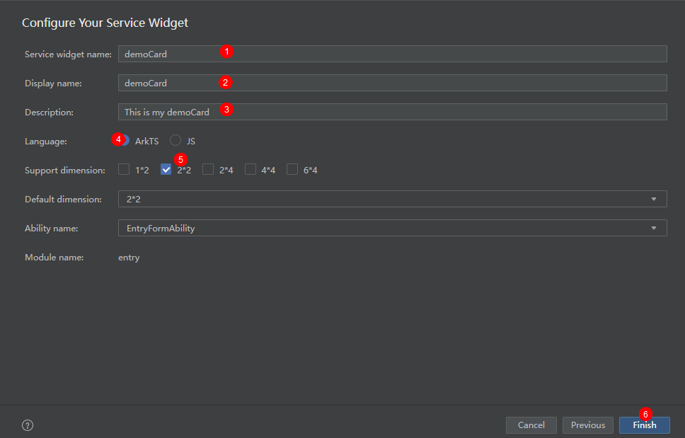

# Creating an ArkTS Widget
## How to Create
You can create a widget in either of the following modes:

- When creating a project, select **Application**, and then right-click a module folder and choose **New** > **Service Widget** to create a widget.
- When creating a project, select **Atomic Service**, and then right-click a module folder and choose **New** > **Service Widget** to create a widget.

>**NOTE**
>
>The UI may be different in DevEco Studio of a different version.

To create an ArkTS widget in an existing project, perform the following steps:

1. Right-click a module folder and choose **New** > **Service Widget**. 
   
>**NOTE**
>
>For a project developed using API version 10 or later based on the stage model, you can create a dynamic or static widget from the **Service Widget** menu. You can also change the widget type by setting the **isDynamic** parameter in the [form_config.json file](arkts-ui-widget-configuration.md) of the widget. If **isDynamic** is left unspecified or set to **true**, the widget is a [dynamic widget](./arkts-ui-widget-configuration.md#isdynamic-field). If **isDynamic** is set to **false**, the widget is a [static widget](./arkts-ui-widget-configuration.md#isdynamic-field).
   
2. Select a widget template based on the actual service scenario. 
   

3. Set **Language** to **ArkTS**, set **Support dimension** to the desired widget size, and then set **Default dimension** to the default widget dimension. You can refer to or modify the widget dimension in the [form_config.json](arkts-ui-widget-configuration.md) file. Then, you can click **Finish** to create an ArkTS widget. 
   
   
   You are advised to name the widget based on the actual scenario. After an ArkTS widget is created, the following widget-related files are automatically added to the project directory: **EntryFormAbility.ets** (widget lifecycle management file), **WidgetCard.ets** (widget page file), and **form_config.json** (widget configuration file). 
   
## Project Structure
**Figure 1** ArkTS widget project directory and related modules 

- [FormExtensionAbility](../reference/apis-form-kit/js-apis-app-form-formExtensionAbility.md): provides lifecycle callbacks invoked when a widget is created, destroyed, or updated.

- [FormExtensionContext](../reference/apis-form-kit/js-apis-inner-application-formExtensionContext.md): provides context for FormExtensionAbilities. You can use the APIs of this module to start FormExtensionAbilities.

- [formProvider](../reference/apis-form-kit/js-apis-app-form-formProvider.md): provides capabilities such as obtaining widget information, updating widgets, and setting the widget update time.

- [formInfo](../reference/apis-form-kit/js-apis-app-form-formInfo.md): provides types and enums related to the widget information and state.

- [formBindingData](../reference/apis-form-kit/js-apis-app-form-formBindingData.md): provides APIs for widget data binding. You can use the APIs to create a **FormBindingData** object and obtain related information.

- [Page layout (WidgetCard.ets)](arkts-ui-widget-page-overview.md): provides the widget UI development capability based on ArkUI.
   - [General capabilities of ArkTS widgets](arkts-ui-widget-page-overview.md#page-capabilities-supported-by-arkts-widgets): provide components, attributes, and APIs that can be used in ArkTS widgets.
   - [Capabilities exclusive to ArkTS widgets](arkts-ui-widget-event-overview.md): include the **postCardAction** API used for interaction between the widget internal and the provider application and can be called only in the widget.

- [Widget configuration](arkts-ui-widget-configuration.md): includes FormExtensionAbility configuration and widget configuration.
   - Configure the FormExtensionAbility information under **extensionAbilities** in the [module.json5 file](../quick-start/module-configuration-file.md).
   - Configure the widget configuration information (**WidgetCard.ets**) in the [form_config.json](arkts-ui-widget-configuration.md) file in **resources/base/profile**.
