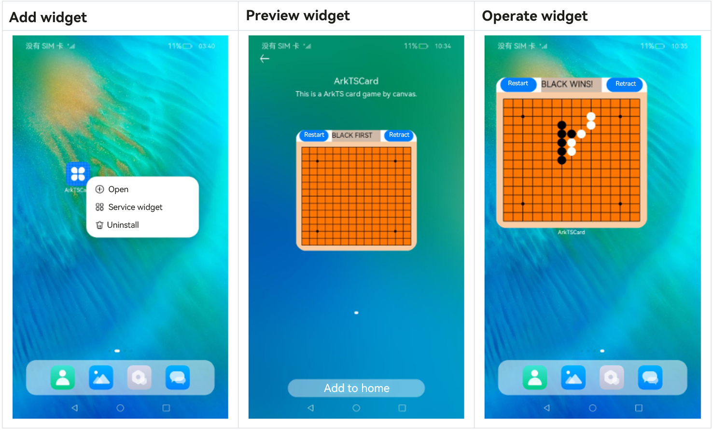

# Introduction to Form Kit
Form Kit provides an effective way of presenting information on the UI – service widget. A service widget (also called widget) is a set of UI components that display important information or operations specific to an application. It provides users with direct access to a desired application service, without the need to open the application first. A widget is usually displayed as part of the UI of another application (which can only be a system application, such as the home screen) and provides basic interactive features such as opening a UI page or sending a message.

## Service Widget Architecture
**Figure 1** Service widget architecture 

Before you get started, it would be helpful if you have a basic understanding of the following concepts:
- Widget host: an application that displays the widget content and controls the widget location. An example is the home screen in the preceding figure.
  - Application icon: an icon for entry to an application, clicking which starts the application process. The icon content does not support interactions.
  - Widget: an interactive UI in various sizes. It may provide buttons to implement different features, such as the button to [update the widget content](arkts-ui-widget-event-formextensionability.md) or [switch to an application](arkts-ui-widget-event-router.md).
- Widget provider: an application that provides widget content to be displayed. It controls the display content, display logic, and component click events triggered on a widget.
  - FormExtensionAbility: a widget service logic module, which provides lifecycle callbacks invoked when a widget is created, destroyed, or updated.
  - Widget page: a widget UI module, which contains display and interaction information such as components, layouts, and events.

Below is the typical procedure of using a widget:

**Figure 2** Typical procedure of using a widget

1. Touch and hold an application icon on the home screen to display the shortcut menu.
2. Touch **Service widget** to access the preview screen.
3. Touch the **Add to home** button. The widget is then added to the home screen.

## Features
- Instant access: Widgets present important information about atomic services and applications, allowing users to access desired services instantly via shortcut gestures.
- Always online: Multiple widget refresh mechanisms, such as scheduler and proxy, are in place to ensure that widgets are always online.
- Restricted support: The components, events, animations, data management, state management, and API capabilities supported by widgets are restricted, striking a balance between performance, power consumption, security, and reliability.

## Development Modes

Form Kit can be developed in the stage (recommended) or FA model.

- In the stage model, you can develop ArkTS widgets with the ArkTS-based declarative development paradigm or JS widgets with the web-like development paradigm.
- In the FA model, you can develop JS widgets with the web-like development paradigm.

ArkTS widgets and JS widgets have different implementation principles and features. The following table lists the differences in capabilities.

| Category        | JS Widget   | ArkTS Widget |
| ------------ | --------- | ---------- |
| Development paradigm    | Web-like paradigm | Declarative paradigm |
| Component capability    | Supported     | Supported      |
| Layout capability    | Supported     | Supported      |
| Event capability    | Supported     | Supported      |
| Custom animation  | Not supported   | Supported      |
| Custom drawing  | Not supported   | Supported      |
| Logic code execution | Not supported   | Supported      |

## Related Kits
- Ability Kit: Form Kit relies on the Extension abilities of Ability Kit for its internal implementation and interacts with Ability Kit during lifecycle scheduling.
- ArkUI: Form Kit widget hosts can use some components, events, animations, and state management capabilities provided by ArkUI on their pages.

## Constraints
ArkTS widgets are subject to the following constraints:
- When importing modules, you can import only the modules marked with "supported in ArkTS widgets."
- Only partial components, events, animations, data management, state management, and API capabilities of the [declarative paradigm](../ui/arkts-ui-development-overview.md) are supported.
- The event processing of the widget is independent of that of the widget host. To prevent gesture conflicts, avoid using swipers in the widget when the widget host supports left and right swipes.
- Shared packages cannot be imported. The native programming language cannot be used for development.
- Instant preview, breakpoint debugging, hot reload, and timeout setting (**setTimeOut**) are not supported.

JS widgets are subject to the following constraints:
- Animation customization, drawing customization, and logic code execution are not supported.
