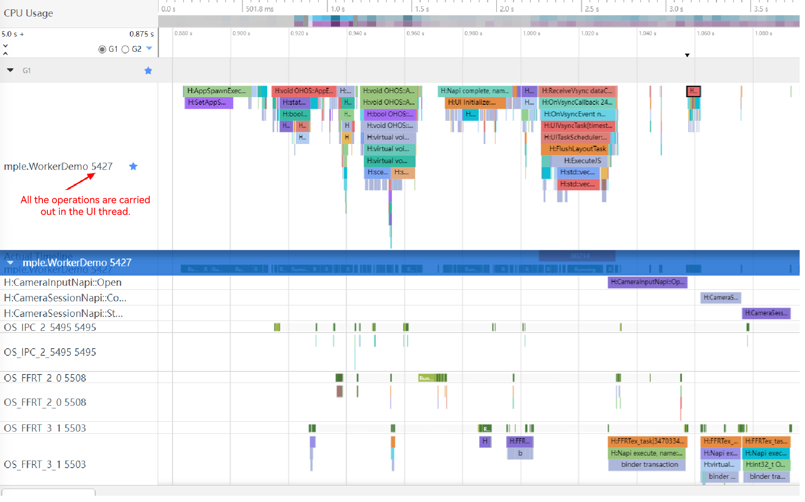
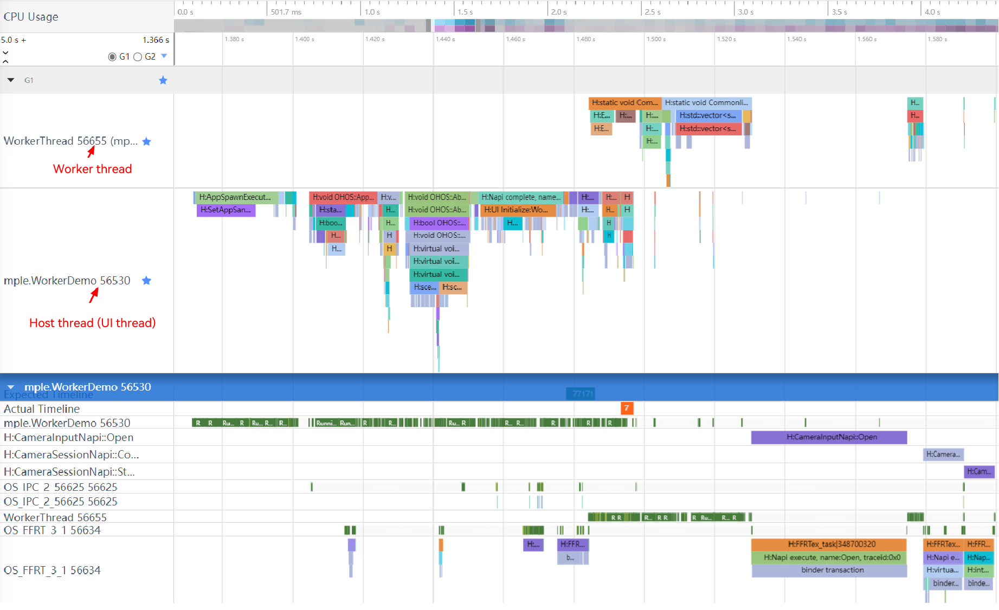

# Using the Camera in the Worker Thread (ArkTS)

[Worker](../../arkts-utils/worker-introduction.md) is mainly used to offer applications a multithreaded environment. It enables applications to perform time-consuming operations in background threads. This greatly prevents computing-intensive or high-latency tasks from blocking the running of the main thread.

When using camera capabilities, you often need to create camera sessions and continuously receive and process preview, photo, and video streams to achieve the desired camera functionalities. If these resource-demanding operations are performed in the main thread (UI thread), UI rendering may be blocked. Therefore, you are advised to implement the camera functionalities in the worker thread.

## How to Develop

1. Create a worker thread file and configure the worker.

   DevEco Studio supports one-click generation of worker threads. Right-click any position in the {moduleName} directory and choose **New > Worker** to generate the template file and configuration information of the worker thread. You do not need to configure the related fields in **build-profile.json5**.

   Example of the CameraWorker.ets file:

   ```ts
   import { ErrorEvent, MessageEvents, ThreadWorkerGlobalScope, worker } from '@kit.ArkTS';
   import CameraService from '../CameraService';
   
   const workerPort: ThreadWorkerGlobalScope = worker.workerPort;
   
   // Custom message format.
   interface MessageInfo {
     hasResolve: boolean;
     type: string;
     context: Context; // The worker thread cannot use getContext() to obtain the context of the host thread. Instead, the context must be passed through messages from the host thread to the worker thread.
     surfaceId: string;
   }
   
   workerPort.onmessage = async (e: MessageEvents) => {
     const messageInfo: MessageInfo = e.data;
     console.info(`worker onmessage type:${messageInfo.type}`)
     if ('initCamera' === messageInfo.type) {
       // The worker thread receives a camera initialization message from the host thread.
       console.info(`worker initCamera surfaceId:${messageInfo.surfaceId}`)
       // Initialize the camera in the worker thread.
       await CameraService.initCamera(messageInfo.context, messageInfo.surfaceId);
     } else if ('releaseCamera' === messageInfo.type) {
       // The worker thread receives a camera release message from the host thread.
       console.info('worker releaseCamera.');
       // Release the camera in the worker thread.
       await CameraService.releaseCamera();
     }
   }
   
   workerPort.onmessageerror = (e: MessageEvents) => {
   }
   
   workerPort.onerror = (e: ErrorEvent) => {
   }
   ```
   
2. Create a camera service proxy class, in which all APIs provided by Camera Kit method are called.

   ```ts
   import { BusinessError } from '@kit.BasicServicesKit';
   import { camera } from '@kit.CameraKit';
   
   class CameraService {
     private imageWidth: number = 1920;
     private imageHeight: number = 1080;
     private cameraManager: camera.CameraManager | undefined = undefined;
     private cameras: Array<camera.CameraDevice> | Array<camera.CameraDevice> = [];
     private cameraInput: camera.CameraInput | undefined = undefined;
     private previewOutput: camera.PreviewOutput | undefined = undefined;
     private photoOutput: camera.PhotoOutput | undefined = undefined;
     private session: camera.PhotoSession | camera.VideoSession | undefined = undefined;
   
     // Initialize a camera.
     async initCamera(context: Context, surfaceId: string): Promise<void> {
       console.info(`initCamera surfaceId: ${surfaceId}`);
       try {
         await this.releaseCamera();
         // Obtain a camera manager instance.
         this.cameraManager = camera.getCameraManager(context);
         if (this.cameraManager === undefined) {
           console.error('cameraManager is undefined');
           return;
         }
         this.cameras = this.cameraManager.getSupportedCameras();
   
         // Create a cameraInput object.
         this.cameraInput = this.cameraManager.createCameraInput(this.cameras[0]);
         if (this.cameraInput === undefined) {
           console.error('Failed to create the camera input.');
           return;
         }
         // Open a camera.
         await this.cameraInput.open();
   
         let previewProfile: camera.Profile = {
           format: camera.CameraFormat.CAMERA_FORMAT_YUV_420_SP,
           size: {
             width: this.imageWidth,
             height: this.imageHeight
           }
         };
         // Create a preview output stream.
         this.previewOutput = this.cameraManager.createPreviewOutput(previewProfile, surfaceId);
         if (this.previewOutput === undefined) {
           console.error('Failed to create the preview stream.');
           return;
         }
   
         let photoProfile: camera.Profile = {
           format: camera.CameraFormat.CAMERA_FORMAT_JPEG,
           size: {
             width: this.imageWidth,
             height: this.imageHeight
           }
         };
         // Create a photo output stream.
         this.photoOutput = this.cameraManager.createPhotoOutput(photoProfile);
         if (this.photoOutput === undefined) {
           console.error('Failed to create the photoOutput.');
           return;
         }
   
         // Create a camera session and start the session.
         this.session = this.cameraManager.createSession(camera.SceneMode.NORMAL_PHOTO) as camera.PhotoSession;
         this.session.beginConfig();
         this.session.addInput(this.cameraInput);
         this.session.addOutput(this.previewOutput);
         this.session.addOutput(this.photoOutput);
         await this.session.commitConfig();
         await this.session.start();
       } catch (error) {
         let err = error as BusinessError;
         console.error(`initCamera fail: ${JSON.stringify(err)}`);
       }
     }
   
     // Release the camera resource.
     async releaseCamera(): Promise<void> {
       console.info('releaseCamera is called');
       try {
         await this.previewOutput?.release();
         await this.photoOutput?.release();
         await this.session?.release();
         await this.cameraInput?.close();
       } catch (error) {
         let err = error as BusinessError;
         console.error(`releaseCamera fail: error: ${JSON.stringify(err)}`);
       } finally {
         this.previewOutput = undefined;
         this.photoOutput = undefined;
         this.cameraManager = undefined;
         this.session = undefined;
         this.cameraInput = undefined;
       }
       console.info('releaseCamera success');
     }
   }
   
   export default new CameraService();
   ```

3. Create a component to display the preview stream, create a ThreadWorker instance in the page-related lifecycle, and initialize and release the camera in the worker thread.

   ```ts
   import { worker } from '@kit.ArkTS';
   
   @Entry
   @Component
   struct Index {
     private mXComponentController: XComponentController = new XComponentController();
     private surfaceId: string = '';
     @State imageWidth: number = 1920;
     @State imageHeight: number = 1080;
     // Create a ThreadWorker object to obtain a worker instance.
     private workerInstance: worker.ThreadWorker = new worker.ThreadWorker('entry/ets/workers/CameraWorker.ets');
   
     onPageShow(): void {
       if ('' !== this.surfaceId) {
         // Send a message to the worker thread through the worker instance to initialize the camera.
         this.workerInstance.postMessage({
           type: 'initCamera',
           context: getContext(this),
           surfaceId: this.surfaceId,
         })
       }
     }
   
     onPageHide(): void {
       // Send a message to the worker thread through the worker instance to destroy the camera.
       this.workerInstance.postMessage({
         type: 'releaseCamera',
       })
     }
   
     build() {
       Column() {
         Column() {
           XComponent({
             id: 'componentId',
             type: 'surface',
             controller: this.mXComponentController
           })
             .onLoad(async () => {
               console.info('onLoad is called');
               // Initialize the XComponent to obtain the surface ID of the preview stream.
               this.surfaceId = this.mXComponentController.getXComponentSurfaceId();
               let surfaceRect: SurfaceRect = {
                 surfaceWidth: this.imageHeight,
                 surfaceHeight: this.imageWidth
               };
               this.mXComponentController.setXComponentSurfaceRect(surfaceRect);
               console.info(`onLoad surfaceId: ${this.surfaceId}`);
               if (!this.workerInstance) {
                 console.error('create stage worker failed');
                 return;
               }
               // The host thread sends a camera initialization message to the worker thread.
               this.workerInstance.postMessage({
                 type: 'initCamera',
                 context: getContext(this), // Pass the context of the host thread to the worker thread.
                 surfaceId: this.surfaceId, // Pass the surface ID to the worker thread.
               })
             })// The width and height of the surface are opposite to those of the XComponent.
             .width(px2vp(this.imageHeight))
             .height(px2vp(this.imageWidth))
   
         }.justifyContent(FlexAlign.Center)
         .height('90%')
   
         Text('WorkerDemo')
           .fontSize(36)
       }
       .justifyContent(FlexAlign.End)
       .height('100%')
       .width('100%')
     }
   }
   ```

## Trace Comparison

Worker not used:



Worker used:


