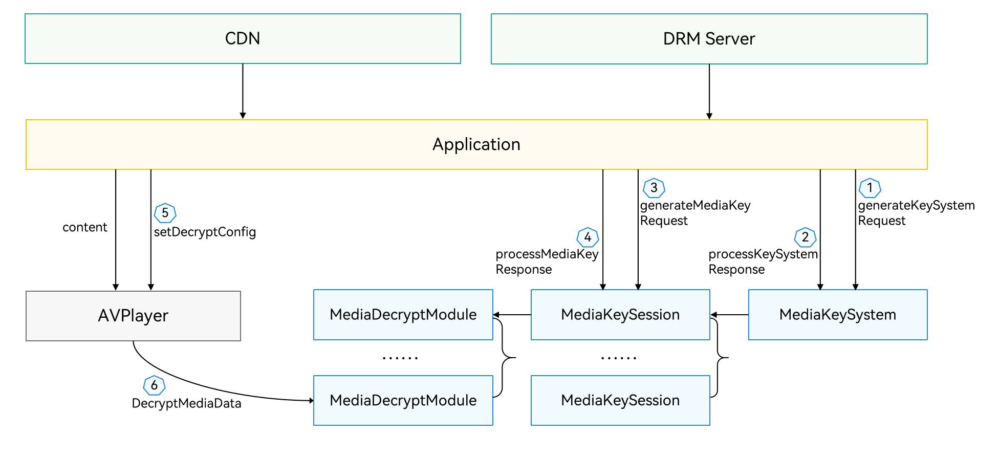

# Introduction to DRM Kit

Digital Rights Management Kit (DRM Kit) is a digital rights protection service that supports authorization and decryption of DRM-encrypted content. It provides features such as DRM plugin management, DRM certificate management, DRM license management, DRM content authorization, and DRM content decryption. It enables the integration of DRM solutions, certificate provisioning for DRM solutions, content authorization, and content decryption.

## Available Capabilities

With DRM Kit, DRM solution integrators can seamlessly integrate DRM solutions into their systems. Application developers can leverage these integrations to authorize and decrypt DRM-encrypted content, thereby enabling the playback of DRM-protected content.

- DRM plugin management: By implementing the DRM HDI provided by DRM Kit, you can support various DRM solutions. This is typically handled by DRM solution integrators.

- DRM certificate management: supports the request and processing of device certificates for DRM solutions, and enables certificate provisioning for the corresponding DRM solutions.

- DRM license management: supports the request, processing, and deletion of offline licenses.

- DRM content authorization: includes online license requests and processing, loading of offline licenses, querying the status of media keys, and authorizing DRM content based on the permissions specified in the DRM license.

- DRM content decryption: Supported media protocols include HLS and DASH; container formats include MP4 and TS; video encoding format is H.264<!--RP2--><!--RP2End-->; audio encoding format is AAC.

> **NOTE**
>
> DRM certificate management, DRM license management, DRM content authorization, and DRM content decryption all depend on the implementation of the corresponding DRM solutions. You can independently extend the supported media protocols, container formats, and audio/video encoding formats.

## Features

- **License and decryption session management**

  DRM Kit supports multiple MediaKeySession instances, allowing for license requests and settings within sessions. Decryption sessions can be bound to licenses.

- **Secure video channels**

  DRM Kit supports secure video channels, ensuring secure decryption, decoding, rendering, and output. However, the kit only provides the APIs for secure decryption. The actual secure decryption, decoding, rendering, and output rely on the implementation of the DRM solution and the operating system.

## Basic Concepts

Be familiar with the following basic concepts before development:

- DRM plugin

  A DRM solution driver integrated into the system, implementing the DRM HDI and providing DRM-related features.<!--RP1--><!--RP1End-->

- MediaKeySystem

  Used to manage DRM certificates and MediaKeySession lifecycle.

- MediaKeySession

  Used to manage licenses and decrypt media content. Its lifecycle is managed by MediaKeySystem.

- DRM information (MediaKeySystemInfo)
  
  Descriptive information for DRM content encryption, such as the DRM solution UUID and PSSH data.

- PSSH

  Protection System Specific Header Box, which contains data used by the DRM solution to describe how DRM content is encrypted.

- DRM certificate

  A certificate required by DRM solutions for normal operation. Different DRM solutions have different DRM certificates.

- DRM certificate provisioning
  
  A process used by DRM solutions to provision certificates. The process varies among different DRM solutions. For specific requirements, refer to the implementation guidelines of the DRM solution.

- License
  
  Used by DRM solutions to implement DRM authorization for devices. Common permission control policies include security levels, output control, start playback time, and end playback time. Different DRM solutions may use different license formats and support different permission control policies.

- Audio/Video Data Frame Encryption Information (cencInfo)
  
  Descriptive information for encryption of audio/video data frames, such as encryption algorithms and modes, KeyId, IV, and subsample information.

## Workflow

DRM plugin management is typically implemented by DRM solution integrators.<!--Del--> For details, see[DRM Solution Development](drm-solution-dev-guide.md).<!--DelEnd-->

The following figure shows the process of integrating DRM Kit into your application.

The working process includes:

1. Creation of MediaKeySystem and MediaKeySession instances: The application obtains the DRM information of the content and creates MediaKeySystem and MediaKeySession instances based on the solution UUID in the DRM information. This can be done using service-provided DRM descriptions or through the mediaKeySystemInfoUpdate event or MediaKeySystemInfo callback from Media Kit or AVCodec Kit.

2. Certificate provisioning: When a MediaKeySession instance is created, if there is no DRM certificate or if the certificate is invalid, DRM Kit will trigger an event requiring DRM certificate provisioning (keySystemRequired). At this point, the certificate provisioning API of MediaKeySystem is called to complete the provisioning. Alternatively, based on the DRM solution's requirements, the DRM certificate status can be checked. If there is no valid certificate, the certificate provisioning API of MediaKeySystem can be proactively invoked. If the certificate is valid or if no provisioning is required, this step can be skipped.

3. License retrieval: The application calls the license-related API of MediaKeySession based on the PSSH data in the DRM event to request and process the DRM license.

4. DRM content decryption: The application sets MediaKeySession to Media Kit or AVCodec Kit to support DRM content decryption. When AVCodec Kit is used, the cencInfo of the audio/video data frames can be set and placed into the AVBuffer, enabling decryption and decoding of the audio/video data frames during the PushInputBuffer call.

5. License update or expiration: During content playback, if a license update is required, MediaKeySession will trigger a license update event (keyRequired), prompting a re-request for the DRM license. If MediaKeySession triggers a license expiration event (keyExpired), DRM content playback should be stopped.
