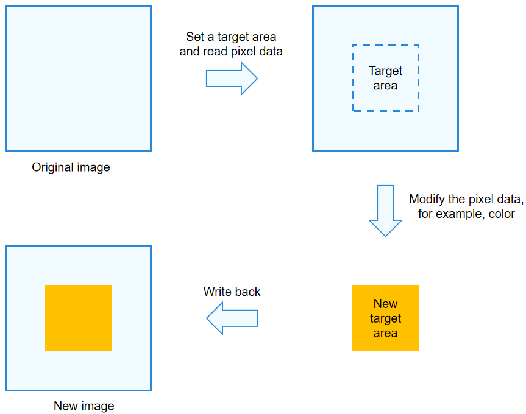

# Using PixelMap for PixelMap Operations

To process a certain area in an image, you can perform PixelMap operations, which are usually used to beautify the image.

As shown in the figure below, the pixel data of a rectangle in an image is read, modified, and then written back to the corresponding area of the original image.

**Figure 1** PixelMap operation



## How to Develop

Read [Image](../../reference/apis-image-kit/js-apis-image.md#pixelmap7) for APIs related to PixelMap operations.

1. Complete [image decoding](image-decoding.md) and obtain a **PixelMap** object.

2. Obtain information from the **PixelMap** object.

   ```ts
   import { image } from '@kit.ImageKit';
   // Obtain the total number of bytes of this PixelMap object.
   let pixelBytesNumber : number = pixelMap.getPixelBytesNumber();
   // Obtain the number of bytes per row of this PixelMap object.
   let rowCount : number = pixelMap.getBytesNumberPerRow();
   // Obtain the pixel density of the image. Pixel density refers to the number of pixels per inch of an image. A larger value of the pixel density indicates a finer image.
   let getDensity : number = pixelMap.getDensity();
   ```

3. Read and modify the pixel data of the target area, and write the modified data back to the original image.

   ```ts
   import { BusinessError } from '@kit.BasicServicesKit';
   // Scenario 1: Read the pixel data of the entire image and write the modified data to an array buffer.
   const readBuffer = new ArrayBuffer(pixelBytesNumber);
   pixelMap.readPixelsToBuffer(readBuffer).then(() => {
     console.info('Succeeded in reading image pixel data.');
   }).catch((error : BusinessError) => {
     console.error('Failed to read image pixel data. And the error is: ' + error);
   })
   
   // Scenario 2: Read the pixel data in a specified area and write the modified data to area.pixels.
   const area : image.PositionArea = {
     pixels: new ArrayBuffer(8),
     offset: 0,
     stride: 8,
     region: { size: { height: 1, width: 2 }, x: 0, y: 0 }
   }
   pixelMap.readPixels(area).then(() => {
     console.info('Succeeded in reading the image data in the area.');
   }).catch((error : BusinessError) => {
     console.error('Failed to read the image data in the area. And the error is: ' + error);
   })
   
   // The read image data can be used independently (by creating a PixelMap object) or modified as required.
   // Write area.pixels to the specified area.
   pixelMap.writePixels(area).then(() => {
     console.info('Succeeded to write pixelMap into the specified area.');
   })
   
   // Write the image data result to the PixelMap object.
   const writeColor = new ArrayBuffer(96);
   pixelMap.writeBufferToPixels(writeColor, () => {});
   ```

## Cloning (Deep Copying) a PixelMap

1. Complete [image decoding](image-decoding.md) and obtain a **PixelMap** object.

2. Clone (deep copy) this **PixelMap** object to obtain a new PixelMap.
   > **NOTE**
   > 
   > If **srcPixelFormat** specified for the new PixelMap is different from the pixel format of the current PixelMap, the color of the new PixelMap is different from that of the current PixelMap.

     ```ts
      /**
       * Clone (deep copy) a PixelMap.
       *
       * @param pixelMap - PixelMap to clone.
       * @param desiredPixelFormat - Pixel format of the new PixelMap. If this parameter is not specified, the pixel format of the current PixelMap is used.
       * @return Returns a new PixelMap.
       **/
      clonePixelMap(pixelMap: PixelMap, desiredPixelFormat?: image.PixelMapFormat): PixelMap {
        // Obtain the image information of the current PixelMap.
        const imageInfo = pixelMap.getImageInfoSync();
        // Read the pixels of the current PixelMap and write the result to a buffer array based on the pixel format of the PixelMap.
        const buffer = new ArrayBuffer(pixelMap.getPixelBytesNumber());
        pixelMap.readPixelsToBufferSync(buffer);
        // Generate initialization options based on the image information of the current PixelMap.
        const options: image.InitializationOptions = {
          // Pixel format of the current PixelMap.
          srcPixelFormat: imageInfo.pixelFormat,
          // Pixel format of the new PixelMap.
          pixelFormat: desiredPixelFormat ?? imageInfo.pixelFormat,
          // Size of the current PixelMap.
          size: imageInfo.size
        };
        // Generate a new PixelMap based on the initialization options and buffer array.
        return image.createPixelMapSync(buffer, options);
      }
     ```

<!--RP1-->
<!--RP1End-->
