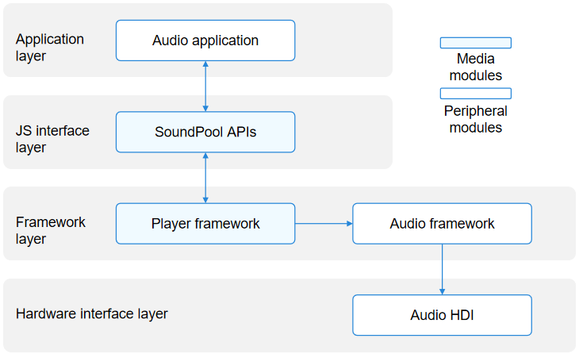
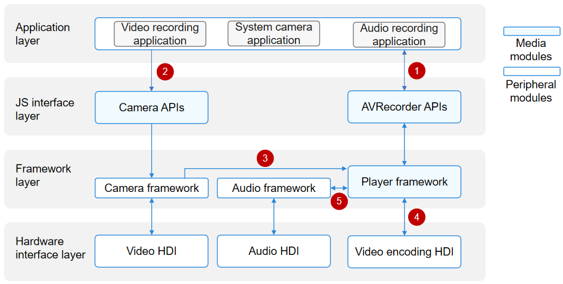
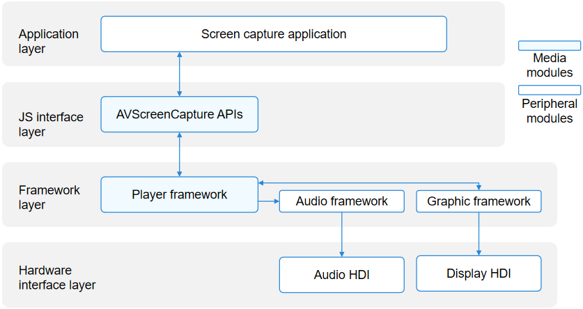

# Introduction to Media Kit

Media Kit provides the [AVPlayer](#avplayer), [SoundPool](#soundpool), [AVRecorder](#avrecorder), [AVScreenCapture](#avscreencapture), [AVMetadataExtractor] (#avmetadataextractor), and [AVImageGenerator] (#avimagegenerator) classes for playing and recording audio/video, and obtaining audio/video metadata and video thumbnails.

From this guide, you will learn how to use the APIs provided by Media Kit to develop a wealth of audio and video playback or recording scenarios. For example, you can use the SoundPool to implement simple prompt tones so that a drip sound is played upon the receipt of a new message; you can use the AVPlayer to develop a music player, which can loop a piece of music.

## Highlights

- Lightweight media engine
  
   Less system resources (threads and memory) are required. Audio and video playback and recording, flexible pipeline assembly, and source, demuxer, and codec plugins are supported.

- HDR video

   The native data structures and interfaces are provided to support the capture and playback of HDR VIVID. Third-party applications can deliver a more immersive experience by leveraging the HDR capability of the system.

- Sound pool

   Short sound effects (such as the camera shutter sound effect and system notification sound effect) are often required during application development. You can call the SoundPool APIs to implement one-time loading of short sounds and multiple times of low-latency playback.

## Development Description

This development guide applies only to audio and video playback or recording, which are implemented by Media Kit. The UI, image processing, media storage, or other related capabilities are not covered.

Before developing features related to audio and video playback or recording, you are advised to understand the following concepts:

- Playback process: network protocol > container format > audio and video codec > graphics/audio rendering

- Network protocols: HLS, HTTP-FLV, HTTP, HTTPS, and more

- Container formats: mp4, mkv, mpeg-ts, and more

- Encoding format: H.264, H.265, and more

For details about the streaming media development process, see [Using AVPlayer to Play Streaming Media](streaming-media-playback-development-guide.md).

## AVPlayer

The AVPlayer transcodes audio and video media assets (such as MP4, MP3, MKV, and MPEG-TS) into renderable images and hearable audio analog signals, and plays the audio and video through output devices.

The AVPlayer provides the integrated playback capability. This means that your application only needs to provide streaming media sources to implement media playback. It does not need to parse or decode data.

### Audio Playback

The figure below shows the interaction when the AVPlayer class is used to develop a music application.

**Figure 1** Interaction with external modules for audio playback 

When a music application calls the AVPlayer APIs at the JS interface layer to implement audio playback, the player framework at the framework layer parses the media asset into audio data streams (in PCM format). The audio data streams are then decoded by software and output to the audio framework. The audio framework outputs the audio data streams to the audio HDI for rendering. A complete audio playback process requires the cooperation of the application, player framework, audio framework, and audio HDI.

In Figure 1, the numbers indicate the process where data is transferred to external modules.

1. The application transfers the media asset to the AVPlayer instance.

2. The player framework outputs the audio PCM data streams to the audio framework, which then outputs the data streams to the audio HDI.

### Video Playback

The figure below shows the interaction when the AVPlayer class is used to develop a video application.

**Figure 2** Interaction with external modules for video playback 

When a video application calls the AVPlayer APIs at the JS interface layer to implement audio and video playback, the player framework at the framework layer parses the media asset into separate audio data streams and video data streams. The audio data streams are then decoded by software and output to the audio framework. The audio framework outputs the audio data streams to the audio HDI at the hardware interface layer to implement audio playback. The video data streams are then decoded by hardware (recommended) or software and output to the graphic framework. The graphic framework outputs the video data streams to the display HDI at the hardware interface layer to implement graphics rendering.

A complete video playback process requires the cooperation of the application, XComponent, player framework, graphic framework, audio framework, display HDI, and audio HDI.

In Figure 2, the numbers indicate the process where data is transferred to external modules.

1. The application obtains a window surface ID from the XComponent. For details about how to obtain the window surface ID, see [XComponent](../../reference/apis-arkui/arkui-ts/ts-basic-components-xcomponent.md).

2. The application transfers the media asset and surface ID to the AVPlayer instance.

3. The player framework outputs the video elementary streams (ESs) to the decoding HDI to obtain video frames (NV12/NV21/RGBA).

4. The player framework outputs the audio PCM data streams to the audio framework, which then outputs the data streams to the audio HDI.

5. The player framework outputs the video frames (NV12/NV21/RGBA) to the graphic framework, which then outputs the video frames to the display HDI.

### Supported Formats and Protocols

Audio and video containers and codecs are domains specific to content creators. You are advised to use the mainstream playback formats, rather than custom ones to avoid playback failures, frame freezing, and artifacts. The system will not be affected by incompatibility issues. If such an issue occurs, you can exit playback.

The table below lists the supported protocols.

| Scenario| Description| 
| -------- | -------- |
| Local VOD| The file descriptor is supported, but the file path is not.|
| Network VoD| HTTP, HTTPS, HLS, and DASH are supported.|
| Live webcasting| HLS and HTTP-FLV are supported.|

The table below lists the supported audio playback formats.

| Audio Container Format| Description| 
| -------- | -------- |
| m4a | Audio format: AAC| 
| aac | Audio format: AAC| 
| mp3 | Audio format: MP3| 
| ogg | Audio format: VORBIS | 
| wav | Audio format: PCM| 
| amr | Audio format: AMR| 

<!--Del-->
> **NOTE**
> 
> The supported video formats are further classified into mandatory and optional ones. All vendors must support mandatory ones and can determine whether to implement optional ones based on their service requirements. You are advised to perform compatibility processing to ensure that all the application functions are compatible on different platforms.

| Video Format| Mandatory or Not|
| -------- | -------- |
| H26510+      | Yes|
| H264      | Yes|
<!--DelEnd-->

The table below lists the supported playback formats and mainstream resolutions.

| Video Container Format| Description| Resolution| 
| -------- | -------- | -------- |
| mp4 | Video formats: H.26510+ and H.264 Audio formats: AAC and MP3| Mainstream resolutions, such as 4K, 1080p, 720p, 480p, and 270p|
| mkv | Video formats: H.26510+ and H.264 Audio formats: AAC and MP3| Mainstream resolutions, such as 4K, 1080p, 720p, 480p, and 270p|
| ts | Video formats: H.26510+ and H.264 Audio formats: AAC and MP3| Mainstream resolutions, such as 4K, 1080p, 720p, 480p, and 270p|

The table below lists the supported subtitle formats.

| Subtitle Container Format| Protocol| Loading Mode|
| -------- | -------- | -------- |
| srt | File descriptor (FD) for local video on-demand (VOD), and HTTP/HTTPS/HLS/DASH for network VOD| External subtitle|
| vtt | FD for local VOD, and HTTP/HTTPS/HLS/DASH for network VOD| External subtitle|
| webvtt | DASH for network VOD| Built-in subtitle|

> **NOTE**
> 
> When DASH streams include built-in subtitles, external subtitles cannot be used.

## SoundPool

The SoundPool transcodes audio assets (such as MP3, M4A, and WAV) into audio analog signals and plays the signals through output devices.

The SoundPool provides the capability of playing short sounds. This means that your application only needs to provide audio asset sources to implement sound playback. It does not need to parse or decode data.

### Audio Playback

The figure below shows the interaction when the SoundPool class is used to develop an audio application.

**Figure 3** Interaction with external modules for sound playback 

When an audio application calls the SoundPool APIs at the JS interface layer to implement sound playback, the player framework at the framework layer parses the media asset into audio data streams (in PCM format). The audio data streams are then decoded by software and output to the audio framework. The audio framework outputs the audio data streams to the audio HDI for rendering. A complete audio playback process requires the cooperation of the application, player framework, audio framework, and audio HDI.

In Figure 3, the numbers indicate the process where data is transferred to external modules.

1. The application transfers the media asset to the SoundPool instance.

2. The player framework outputs the audio PCM data streams to the audio framework, which then outputs the data streams to the audio HDI.

### Supported Formats and Protocols

Audio containers and codecs are domains specific to content creators. You are advised to use the mainstream playback formats, rather than custom ones to avoid playback failures and frame freezing. The system will not be affected by incompatibility issues. If such an issue occurs, you can exit playback.

The table below lists the supported protocols.

| Scenario| Description| 
| -------- | -------- |
| Local VOD| The file descriptor is supported, but the file path is not.|

The table below lists the supported audio playback formats.

| Audio Container Format| Description| 
| -------- | -------- |
| m4a | Audio format: AAC| 
| aac | Audio format: AAC| 
| mp3 | Audio format: MP3| 
| ogg | Audio format: VORBIS | 
| wav | Audio format: PCM| 

## AVRecorder

The AVRecorder captures audio signals, receives video signals, encodes the audio and video signals, and saves them to files. With the AVRecorder, you can easily implement audio and video recording, including starting, pausing, resuming, and stopping recording, and releasing resources. You can also specify parameters such as the encoding format, container format, and file path for recording.

**Figure 4** Interaction with external modules for video recording 

- Audio recording: When an application calls the AVRecorder APIs at the JS interface layer to implement audio recording, the player framework at the framework layer invokes the audio framework to capture audio data through the audio HDI. The audio data is then encoded by software and saved into a file.

- Video recording: When an application calls the AVRecorder APIs at the JS interface layer to implement video recording, the camera framework is first invoked to capture image data. Through the video encoding HDI, the camera framework sends the data to the player framework at the framework layer. The player framework encodes the image data through the video HDI and saves the encoded image data into a file.

With the AVRecorder, you can implement pure audio recording, pure video recording, and audio and video recording.

In Figure 4, the numbers indicate the process where data is transferred to external modules.

1. The application obtains a surface ID from the player framework through the AVRecorder instance.

2. The application sets the surface ID for the camera framework, which obtains the surface corresponding to the surface ID. The camera framework captures image data through the video HDI and sends the data to the player framework at the framework layer.

3. The camera framework transfers the video data to the player framework through the surface.

4. The player framework encodes video data through the video HDI.

5. The player framework sets the audio parameters for the audio framework and obtains the audio data from the audio framework.

### Supported Formats

The table below lists the supported audio sources.

| Type| Description| 
| -------- | -------- |
| mic | The system microphone is used as the audio source input.| 

The table below lists the supported video sources.

| Type| Description| 
| -------- | -------- |
| surface_yuv | The input surface carries raw data.| 
| surface_es | The input surface carries ES data.| 

The table below lists the supported audio and video encoding formats.

| Encoding Format| Description| 
| -------- | -------- |
| audio/mp4a-latm | Audio encoding format MP4A-LATM.|
| video/hevc | Video encoding format HEVC.| 
| video/avc | Video encoding format AVC.| 
| audio/mpeg | Audio encoding format MPEG.| 
| audio/g711mu | Audio encoding format G.711 μ-law.| 

The table below lists the supported output file formats.

| Format| Description| 
| -------- | -------- |
| mp4 | Video container format MP4.| 
| m4a | Audio container format M4A.| 
| mp3 | Audio container format MP3.| 
| wav | Audio container format WAV.| 

## AVScreenCapture
The AVScreenCapture captures audio and video signals and saves screen data to files by means of encoding, helping you easily implement screen capture. It consists of two sets of APIs: one for storing screen recordings and the other for obtaining streams during screen capture. It allows the caller to specify parameters such as the encoding format, container format, and file path for screen capture.

**Figure 5** Interaction with external modules for screen capture 

- Audio recording: When an application calls the AVScreenCapture APIs at the JS or native interface layer to implement audio recording, the player framework at the framework layer invokes the audio framework to capture audio data through the audio HDI. The audio data is then encoded by software and saved into a file.
- Screen capture: When an app calls the AVScreenCapture APIs at the JS or native API layer to implement screen capture, the player framework at the framework layer invokes the graphic framework to capture screen data. The screen data is then encoded by software and saved into a file.

### Supported Formats
The table below lists the supported audio sources.

| Type| Description| 
| -------- | -------- |
| MIC | The system microphone is used as the audio source input.| 
| ALL_PLAYBACK | Internal recording is used as the audio source input.| 

The table below lists the supported video sources.

| Type| Description| 
| -------- | -------- |
| SURFACE_RGBA | The output buffer is RGBA data.| 

The table below lists the supported audio encoding formats.

| Audio Encoding Format| Description| 
| -------- | -------- |
| AAC_LC | AAC_LC.|

The table below lists the supported video encoding formats.

| Video Encoding Format| Description| 
| -------- | -------- |
| H264 | H.264.|

The table below lists the supported output file formats.

| Format| Description| 
| -------- | -------- |
| mp4 | Video container format MP4.| 
| m4a | Audio container format M4A.| 

## AVMetadataExtractor
The AVMetadataExtractor is used to obtain audio and video metadata. With the AVMetadataExtractor, you can extract rich metadata information from original media assets. For example, for an audio asset, you can obtain its details, such as the title, artist, album name, and duration. The process of obtaining the metadata of a video asset is similar. The only difference is that the process of obtaining the album cover is not required for a video asset, because no album cover is available in the video asset.

The full process of obtaining the metadata of an audio asset includes creating an AVMetadataExtractor instance, setting resources, obtaining the metadata, obtaining the album cover (optional), and releasing the instance.

### Supported Formats
For details about the supported audio and video sources, see [Demuxing Media Data](../avcodec/audio-video-demuxer.md).

## AVImageGenerator
The AVImageGenerator is used to obtain video thumbnails. With the AVImageGenerator, you can obtain video frames at a specified time from original media assets.

### Supported Formats
For details about the supported video sources, see [Video Decoding](../avcodec/video-decoding.md).
