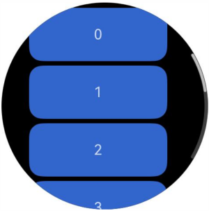

# ArcScrollBar

The **ArcScrollBar** component is designed to be used with scrollable components such as [List](ts-container-list.md), [Grid](ts-container-grid.md), and [Scroll](ts-container-scroll.md) to provide a circular scrollbar.

>  **NOTE**
>
>  - This component is supported since API version 16. Updates will be marked with a superscript to indicate their earliest API version.
>  - If no width or height is set for the **ArcScrollBar** component, it will inherit the size of its parent component.


## Child Components

Not supported

## APIs

ArcScrollBar(options: ArcScrollBarOptions)

Creates an instance of the **ArcScrollBar** component.

**Atomic service API**: This API can be used in atomic services since API version 16.

**System capability**: SystemCapability.ArkUI.ArkUI.Full

**Parameters**

| Name| Type| Mandatory| Description|
| -------- | -------- | -------- | -------- |
| options |  [ArcScrollBarOptions](#arcscrollbaroptions)| Yes| Parameters of the **ArcScrollBar** component.|

## ArcScrollBarOptions

Represents the parameters used to construct an **ArcScrollBar** component.

**Atomic service API**: This API can be used in atomic services since API version 16.

**System capability**: SystemCapability.ArkUI.ArkUI.Full

| Name| Type| Mandatory| Description|
| -------- | -------- | -------- | -------- |
| scroller | [Scroller](ts-container-scroll.md#scroller) | Yes| Scroller, which can be bound to scrollable components for scrolling control.|
| state | [BarState](ts-appendix-enums.md#barstate) | No| State of the scrollbar.<br>Default value: **BarState.Auto**|

>  **NOTE**
> 
> **ArcScrollBar** must be bound to a scrollable component through **scroller** to achieve synchronization. Only a one-to-one binding is allowed between **ArcScrollBar** and a scrollable component.

## Example

This example demonstrates how to use **ArcScrollBar** with a **Scroll** component to create an external circular scrollbar.

```ts
import { ArcScrollBar } from '@kit.ArkUI';

@Entry
@Component
struct ArcScrollBarExample {
  private scroller: Scroller = new Scroller()
  private arr: number[] = [0, 1, 2, 3, 4, 5, 6, 7, 8, 9];

  build() {
    Column() {
      Stack({ alignContent: Alignment.Center }) {
        Scroll(this.scroller) {
          Flex({ direction: FlexDirection.Column }) {
            ForEach(this.arr, (item: number) => {
              Row() {
                Text(item.toString())
                  .width('80%')
                  .height(60)
                  .backgroundColor('#3366CC')
                  .borderRadius(15)
                  .fontSize(16)
                  .textAlign(TextAlign.Center)
                  .margin({ top: 5 })
              }
            }, (item: number) => item.toString())
          }.margin({ right: 15 })
        }
        .width('90%')
        .scrollBar(BarState.Off)
        .scrollable(ScrollDirection.Vertical)
        .edgeEffect(EdgeEffect.Spring)

        ArcScrollBar({ scroller: this.scroller, state: BarState.Auto })
      }
      .width('100%')
      .height('100%')
    }
    .justifyContent(FlexAlign.Center)
    .width('100%')
    .height('100%')
    .clip(new Circle({ width: '100%', height: '100%' }))
  }
}
```


