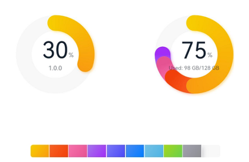
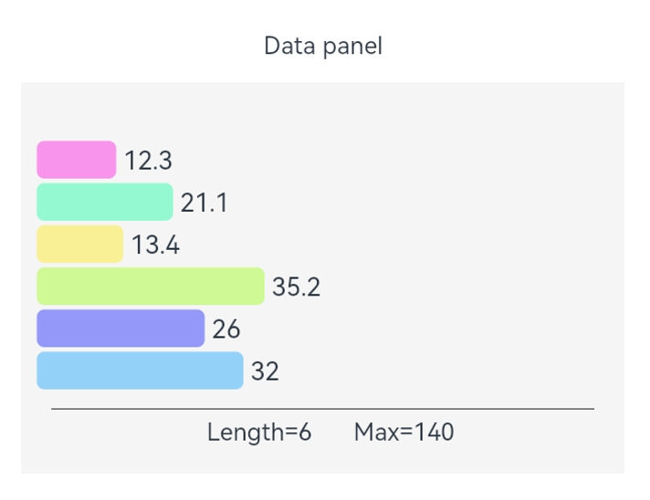

# DataPanel

The **\<DataPanel>** component displays proportions in a chart.

>  **NOTE**
>
> This component is supported since API version 7. Updates will be marked with a superscript to indicate their earliest API version.


## Child Components

Not supported


## APIs

DataPanel(options: DataPanelOptions)

**Widget capability**: This API can be used in ArkTS widgets since API version 9.

**Atomic service API**: This API can be used in atomic services since API version 11.

**Parameters**

| Name| Type| Mandatory| Description|
| -------- | -------- | -------- | -------- |
| options |  [DataPanelOptions](#datapaneloptions)| Yes| Parameters of the data panel.|

## DataPanelOptions

**Atomic service API**: This API can be used in atomic services since API version 11.

| Name           | Type  | Mandatory | Description|
| ----------------- | -------- | ----- | -------- |
| values            | number[]   | Yes   | Data value list. A maximum of nine values are supported. If more than nine values are set, only the first nine ones are used. A value less than 0 evaluates to the value **0**.|
| max               | number     | No   |   - When set to a value greater than 0, this parameter indicates the maximum value in the **values** list.<br>- When set to a value equal to or smaller than 0, this parameter indicates the sum of values in the **values** list. The values are displayed in proportion.<br>Default value: **100**|
| type<sup>8+</sup> | [DataPanelType](#datapaneltype8) | No| Type of the data panel (dynamic modification is not supported).<br>Default value: **DataPanelType.Circle**|


## DataPanelType<sup>8+</sup>

This API can be used in ArkTS widgets since API version 9.

**Atomic service API**: This API can be used in atomic services since API version 11.

| Name| Description|
| -------| ------------ |
| Line   | Line data panel.|
| Circle | Circle data panel.|


## Attributes

In addition to the [universal attributes](ts-universal-attributes-size.md), the following attributes are supported.

### closeEffect

closeEffect(value: boolean)

Sets whether to disable the rotation and shadow effects for the component. This attribute enables or disables the shadow effect only when [trackShadow](#trackshadow10) is not set. The shadow effect enabled through this attribute is in the default style.

**Widget capability**: This API can be used in ArkTS widgets since API version 9.

**Atomic service API**: This API can be used in atomic services since API version 11.

**System capability**: SystemCapability.ArkUI.ArkUI.Full

**Parameters**

| Name| Type   | Mandatory| Description                                                  |
| ------ | ------- | ---- | ------------------------------------------------------ |
| value  | boolean | Yes  | Whether to disable the rotation and shadow effects for the component.<br>Default value: **false**|

### valueColors<sup>10+</sup>

valueColors(value: Array<ResourceColor | LinearGradient>)

Sets an array of data segment colors.

**Atomic service API**: This API can be used in atomic services since API version 11.

**System capability**: SystemCapability.ArkUI.ArkUI.Full

**Parameters**

| Name| Type                                                        | Mandatory| Description                                                       |
| ------ | ------------------------------------------------------------ | ---- | ----------------------------------------------------------- |
| value  | Array<[ResourceColor](ts-types.md#resourcecolor) \| [LinearGradient](#lineargradient10)> | Yes  | Array of data segment colors. A value of the **ResourceColor** type indicates a solid color, and A value of the **LinearGradient** type indicates a color gradient.|

### trackBackgroundColor<sup>10+</sup>

trackBackgroundColor(value: ResourceColor)

Sets the background color.

**Atomic service API**: This API can be used in atomic services since API version 11.

**System capability**: SystemCapability.ArkUI.ArkUI.Full

**Parameters**

| Name| Type                                      | Mandatory| Description                                                        |
| ------ | ------------------------------------------ | ---- | ------------------------------------------------------------ |
| value  | [ResourceColor](ts-types.md#resourcecolor) | Yes  | Background color.<br>The value is in hexadecimal ARGB notation. The first two digits indicate opacity.<br>Default value: **'#08182431'**|

### strokeWidth<sup>10+</sup>

strokeWidth(value: Length)

Sets the stroke width of the border. This attribute does not take effect when the data panel type is **DataPanelType.Line**.

**Atomic service API**: This API can be used in atomic services since API version 11.

**System capability**: SystemCapability.ArkUI.ArkUI.Full

**Parameters**

| Name| Type                        | Mandatory| Description                                                        |
| ------ | ---------------------------- | ---- | ------------------------------------------------------------ |
| value  | [Length](ts-types.md#length) | Yes  | Stroke width of the border.<br>Default value: **24**<br>Unit: vp<br>**NOTE**<br>A value less than 0 evaluates to the default value.|

### trackShadow<sup>10+</sup>

trackShadow(value: DataPanelShadowOptions)

Sets the shadow style.

**Atomic service API**: This API can be used in atomic services since API version 11.

**System capability**: SystemCapability.ArkUI.ArkUI.Full

**Parameters**

| Name| Type                                                       | Mandatory| Description                                                 |
| ------ | ----------------------------------------------------------- | ---- | ----------------------------------------------------- |
| value  | [DataPanelShadowOptions](#datapanelshadowoptions10) | Yes  | Shadow style.<br>**NOTE**<br>If this attribute is set to **null**, the shadow effect is disabled.|

### contentModifier<sup>12+</sup>

contentModifier(modifier: ContentModifier\<DataPanelConfiguration>)

Creates a content modifier.

**System capability**: SystemCapability.ArkUI.ArkUI.Full

**Parameters**

| Name| Type                                         | Mandatory| Description                                            |
| ------ | --------------------------------------------- | ---- | ------------------------------------------------ |
| modifier  | [ContentModifier\<DataPanelConfiguration>](#datapanelconfiguration12) | Yes  | Content modifier to apply to the current component.<br>**modifier**: content modifier. You need a custom class to implement the **ContentModifier** API.|


## DataPanelShadowOptions<sup>10+</sup>

Inherits from [MultiShadowOptions](ts-types.md#multishadowoptions10) and has all attributes of **MultiShadowOptions**.

**Atomic service API**: This API can be used in atomic services since API version 11.

| Name         | Type| Mandatory| Description|
| ------------- | ------- | ---- | -------- |
| colors | Array<[ResourceColor](ts-types.md#resourcecolor) \| [LinearGradient](#lineargradient10)> | No| Array of shadow colors for data segments.<br>Default value: same as the value of **valueColors**<br>**NOTE**<br>If the number of the set shadow colors is less than that of the data segments, the number of the displayed shadow colors is the same as the former.<br>If the number of the set shadow colors is greater than that of the data segments, the number of the displayed shadow colors is the same as the latter.|

## LinearGradient<sup>10+</sup>

Describes the linear gradient.

LinearGradient(colorStops: ColorStop[])

**Atomic service API**: This API can be used in atomic services since API version 11.

| Name         | Type| Mandatory| Description|
| ------------- | ------- | ---- | -------- |
| colorStops | [ColorStop](#colorstop10)[] | Yes| Gradient colors and color stops.|


## ColorStop<sup>10+</sup>

Describes the gradient color stop.

**Atomic service API**: This API can be used in atomic services since API version 11.

| Name         | Type| Mandatory| Description|
| ------------- | ------- | ---- | -------- |
| color | [ResourceColor](ts-types.md#resourcecolor) | Yes| Color value.|
| offset | [Length](ts-types.md#length) | Yes| Gradient color stop (proportion value between 0 and 1). A value less than 0 evaluates to the value **0**. A value greater than 1 evaluates to the value **1**.<br>**NOTE**<br>If the value is a string that represents a number, it will be converted to a number.<br>For example, **'10vp'** is converted to 10, and **'10%'** is converted to 0.1.|

## DataPanelConfiguration<sup>12+</sup>

You need a custom class to implement the **ContentModifier** API.

| Name | Type   |    Default Value     |  Description             |
| ------ | ------ | ------ |-------------------------------- |
| values | number[] | - | Current values of the data panel. The maximum length is 9.|
| maxValue | number | 100 | Maximum value displayed in the data panel.|

## Example

### Example 1

```ts
// xxx.ets
@Entry
@Component
struct DataPanelExample {
  public valueArr: number[] = [10, 10, 10, 10, 10, 10, 10, 10, 10]

  build() {
    Column({ space: 5 }) {
      Row() {
        Stack() {
          DataPanel({ values: [30], max: 100, type: DataPanelType.Circle }).width(168).height(168)
          Column() {
            Text('30').fontSize(35).fontColor('#182431')
            Text('1.0.0').fontSize(9.33).lineHeight(12.83).fontWeight(500).opacity(0.6)
          }

          Text('%')
            .fontSize(9.33)
            .lineHeight(12.83)
            .fontWeight(500)
            .opacity(0.6)
            .position({ x: 104.42, y: 78.17 })
        }.margin({ right: 44 })

        Stack() {
          DataPanel({ values: [50, 12, 8, 5], max: 100, type: DataPanelType.Circle }).width(168).height(168)
          Column() {
            Text('75').fontSize(35).fontColor('#182431')
            Text('Used: 98 GB/128 GB') .fontSize(8.17).lineHeight(11.08).fontWeight(500).opacity(0.6)
          }

          Text('%')
            .fontSize(9.33)
            .lineHeight(12.83)
            .fontWeight(500)
            .opacity(0.6)
            .position({ x: 104.42, y: 78.17 })
        }
      }.margin({ bottom: 59 })

      DataPanel({ values: this.valueArr, max: 100, type: DataPanelType.Line }).width(300).height(20)
    }.width('100%').margin({ top: 5 })
  }
}
```



### Example 2

```ts
// xxx.ets
@Entry
@Component
struct LinearGradientDataPanelExample {
  public values1: number[] = [20, 20, 20, 20]
  public color1: LinearGradient = new LinearGradient([{ color: "#65EEC9A3", offset: 0 }, { color: "#FFEF629F", offset: 1 }])
  public color2: LinearGradient = new LinearGradient([{ color: "#FF67F9D4", offset: 0 }, { color: "#FFFF9554", offset: 1 }])
  public colorShadow1: LinearGradient = new LinearGradient([{ color: "#65EEC9A3", offset: 0 }, { color: "#65EF629F", offset: 1 }])
  public colorShadow2: LinearGradient = new LinearGradient([{ color: "#65e26709", offset: 0 }, { color: "#65efbd08", offset: 1 }])
  public colorShadow3: LinearGradient = new LinearGradient([{ color: "#6572B513", offset: 0 }, { color: "#6508efa6", offset: 1 }])
  public colorShadow4: LinearGradient = new LinearGradient([{ color: "#65ed08f5", offset: 0 }, { color: "#65ef0849", offset: 1 }])
  @State color3: string = '#00FF00'
  @State color4: string = '#20FF0000'
  @State bgColor: string = '#08182431'
  @State offsetX: number = 15
  @State offsetY: number = 15
  @State radius: number = 5
  @State colorArray: Array<LinearGradient | ResourceColor> = [this.color1, this.color2, this.color3, this.color4]
  @State shadowColorArray: Array<LinearGradient | ResourceColor> = [this.colorShadow1, this.colorShadow2, this.colorShadow3, this.colorShadow4]

  build() {
    Column({ space: 5 }) {
      Text('LinearGradient').fontSize(9).fontColor(0xCCCCCC).textAlign(TextAlign.Start).width('100%').margin({ top: 20, left: 20})
      DataPanel({ values: this.values1, max: 100, type: DataPanelType.Circle })
        .width(300)
        .height(300)
        .valueColors(this.colorArray)
        .trackShadow({
          radius: this.radius,
          colors: this.shadowColorArray,
          offsetX: this.offsetX,
          offsetY: this.offsetY
        })
        .strokeWidth(30)
        .trackBackgroundColor(this.bgColor)
    }.width('100%').margin({ top: 5 })
  }
}
```


### Example 3

```ts
// xxx.ets
@Builder
function buildDataPanel(config: DataPanelConfiguration) {
  Column() {
    Column() {
      ForEach(config.values, (item: number, index: number) => {
        ChildItem({ item: item, index: index, max:config.maxValue})
      }, (item: string) => item)
    }.padding(10)
    Line().width(360).backgroundColor("#ff373737").margin({bottom:5})
    Row() {
      Text('Length=' + config.values.length + '    ').margin({ left: 10 }).align(Alignment.Start)
      Text('Max=' + config.maxValue).margin({ left: 10 }).align(Alignment.Start)
    }
  }
}

class DataPanelBuilder implements ContentModifier<DataPanelConfiguration> {
  constructor() {
  }
  applyContent () : WrappedBuilder<[DataPanelConfiguration]> {
    return wrapBuilder(buildDataPanel)
  }
}

@Entry
@Component
struct Index {
  build() {
    Column() {
      Text("Data panel").margin({ top: 12 });
      Row() {
        DataPanel({ values: [12.3, 21.1, 13.4, 35.2, 26.0, 32.0], max: 140, type: DataPanelType.Circle })
          .width(400).height(260)
          .padding({ top: 10 })
          .contentModifier(new DataPanelBuilder())
      }.margin(15).backgroundColor("#fff5f5f5")
    }
  }
}

@Component
struct ChildItem {
  @Prop item: number;
  @Prop index: number;
  @Prop max: number;
  public color1: string = "#65ff00dd"
  public color2: string = "#6500ff99"
  public color3: string = "#65ffe600"
  public color4: string = "#6595ff00"
  public color5: string = "#65000dff"
  public color6: string = "#650099ff"
  public colorArray: Array<string> = [this.color1, this.color2, this.color3, this.color4, this.color5, this.color6]

  build() {
    RelativeContainer() {
      Row() {
        Rect().height(25).width(this.item * 600 / this.max).foregroundColor(this.colorArray[this.index]).radius(5)
          .align(Alignment.Start)
        Text(" "+this.item)
          .fontSize(17)
      }
    }.height(28)
  }
}
```

