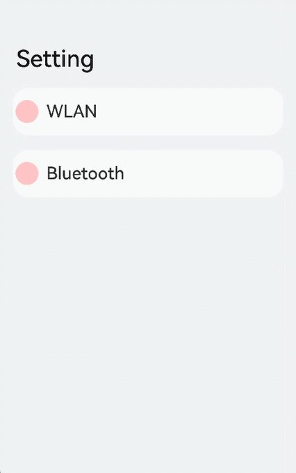

# NavRouter

The **NavRouter** component provides default processing logic for responding to clicks, eliminating the need for manual logic definition.

> **NOTE**
>
> This component is deprecated since API version 13. You are advised to use [NavPathStack](ts-basic-components-navigation.md#navpathstack10) in conjunction with the **navDestination** attribute for page routing.
>
> This component is supported since API version 9. Updates will be marked with a superscript to indicate their earliest API version.

## Child Components

This component must contain two child components, the second of which must be [NavDestination](ts-basic-components-navdestination.md).

> **NOTE**
>
>  
> 1. If there is only one child component, the navigation to the **NavDestination** component does not work.
> 2. If there is only the **NavDestination** child component, the navigation does not work.
> 3. If there are more than two child components, the excess child components are not displayed.
> 4. If the second child component is not **NavDestination**, the navigation does not work.

## APIs

### NavRouter

NavRouter()

**Atomic service API**: This API can be used in atomic services since API version 11.

**System capability**: SystemCapability.ArkUI.ArkUI.Full

### NavRouter<sup>10+</sup>

NavRouter(value: RouteInfo)

Provides route information so that clicking the **NavRouter** component redirects the user to the specified navigation destination page.

**Atomic service API**: This API can be used in atomic services since API version 11.

**System capability**: SystemCapability.ArkUI.ArkUI.Full

**Parameters**

| Name    | Type                               | Mandatory  | Description         |
| ------- | ----------------------------------- | ---- | ------------- |
| value   | [RouteInfo](#routeinfo10) | Yes   | Route information.|

## Attributes

In addition to the [universal attributes](ts-universal-attributes-size.md), the following attributes are supported.

### mode<sup>10+</sup>

mode(mode: NavRouteMode)

Sets the route mode used for redirecting the user from the **NavRouter** component to the specified navigation destination page.

**Atomic service API**: This API can be used in atomic services since API version 11.

**System capability**: SystemCapability.ArkUI.ArkUI.Full

**Parameters**

| Name                          | Type                                    | Mandatory                                  | Description                                      |
| ----------------------------- | ---------------------------------------- | ---------------------------------------- | ---------------------------------------- |
| mode                  | [NavRouteMode](#navroutemode)                                  | Yes                                | Route mode used for redirection.<br>Default value: **NavRouteMode.PUSH_WITH_RECREATE**|

## RouteInfo<sup>10+</sup>

**Atomic service API**: This API can be used in atomic services since API version 11.

**System capability**: SystemCapability.ArkUI.ArkUI.Full

| Name                | Type                                                    | Mandatory| Description                                                        |
| -------------------- | ------------------------------------------------------------ | ---- | ------------------------------------------------------------ |
| name             | string            | Yes  | Name of the navigation destination page to be redirected to.|
| param             | unknown            | No  | Parameter transferred during redirection.|

## NavRouteMode

**Atomic service API**: This API can be used in atomic services since API version 11.

| Name   | Description            |
| ----- | ---------------- |
| PUSH_WITH_RECREATE | The new navigation destination page replaces the current one. The current page is destroyed, but the information about this page is retained in the navigation stack.|
| PUSH   | The new navigation destination page overwrites the current one. The current page is not destroyed, and the information about this page is retained in the navigation stack.|
| REPLACE   | The new navigation destination page replaces the current one. The current page is destroyed, and the information about this page is removed from the navigation stack.|

## Events

### onStateChange

onStateChange(callback: (isActivated: boolean) => void)

Called when the component activation status changes. **onStateChange(true)** is called when the **NavRouter** component is activated and its **NavDestination** child component is loaded. **onStateChange(false)** is called when the **NavDestination** child component is not displayed.

**Atomic service API**: This API can be used in atomic services since API version 11.

**System capability**: SystemCapability.ArkUI.ArkUI.Full

**Parameters**

| Name     | Type   | Mandatory| Description                                   |
| ----------- | ------- | ---- | --------------------------------------- |
| isActivated | boolean | Yes  | Component activation status. The value **true** means that component is activated, and **false** means the opposite.|

## Example

```ts
// xxx.ets
@Entry
@Component
struct NavRouterExample {
  @State isActiveWLAN: boolean = false
  @State isActiveBluetooth: boolean = false

  build() {
    Navigation() {
      NavRouter() {
        Row() {
          Row()
            .width(30)
            .height(30)
            .borderRadius(30)
            .margin({ left: 3, right: 10 })
            .backgroundColor(Color.Pink)
          Text(`WLAN`)
            .fontSize(22)
            .fontWeight(500)
            .textAlign(TextAlign.Center)
        }
        .width('90%')
        .height(60)

        NavDestination() {
          Flex({ direction: FlexDirection.Row }) {
            Text('No WLAN available.').fontSize(30).padding({ left: 15 })
          }
        }.title("WLAN")
      }
      .margin({ top: 10, bottom: 10 })
      .backgroundColor(this.isActiveWLAN ? '#ccc' : '#fff')
      .borderRadius(20)
      .mode(NavRouteMode.PUSH_WITH_RECREATE)
      .onStateChange((isActivated: boolean) => {
        this.isActiveWLAN = isActivated
      })

      NavRouter() {
        Row() {
          Row()
            .width(30)
            .height(30)
            .borderRadius(30)
            .margin({ left: 3, right: 10 })
            .backgroundColor(Color.Pink)
          Text (`Bluetooth`)
            .fontSize(22)
            .fontWeight(500)
            .textAlign(TextAlign.Center)
        }
        .width('90%')
        .height(60)

        NavDestination() {
          Flex({ direction: FlexDirection.Row }) {
            Text ('No Bluetooth device available.') .fontSize (30).padding ({ left:15 })
          }
        }.title("Bluetooth")
      }
      .margin({ top: 10, bottom: 10 })
      .backgroundColor(this.isActiveBluetooth ? '#ccc' : '#fff')
      .borderRadius(20)
      .mode(NavRouteMode.REPLACE)
      .onStateChange((isActivated: boolean) => {
        this.isActiveBluetooth = isActivated
      })
    }
    .height('100%')
    .width('100%')
    .title ('Settings')
    .backgroundColor("#F2F3F5")
    .titleMode(NavigationTitleMode.Free)
    .mode(NavigationMode.Auto)
  }
}
```


