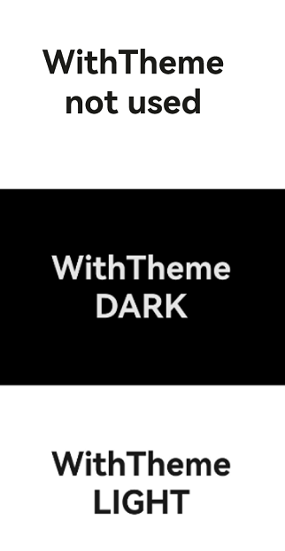

# WithTheme

The **WithTheme** component is designed to customize the theme style for a specific part of an application page. It allows for the setting of light and dark modes for child components, as well as the use of custom color schemes.

> **NOTE**
>
> This component is supported since API version 12. Updates will be marked with a superscript to indicate their earliest API version.

## Child Components

This component supports only one child component.

## APIs

WithTheme(options: WithThemeOptions)

**Parameters**

| Name                           | Type                                 | Mandatory | Description         |
|--------------------------------|---------------------------------------|-----|---------------|
| options | [WithThemeOptions](#withthemeoptions) | Yes  | Color scheme for components within the scope.|

## Attributes

The [universal attributes](ts-universal-attributes-size.md) are not supported.

## Events

The [universal events](ts-universal-events-click.md) are not supported.

## WithThemeOptions
Defines the default theme and color mode for components within the **WithTheme** scope.

**Atomic service API**: This API can be used in atomic services since API version 12.

**Parameters**

| Name                   | Type                                                   | Mandatory| Description                                                            |
|------------------------|---------------------------------------------------------| ---- |------------------------------------------------------------------|
| theme     | [CustomTheme](../js-apis-arkui-theme.md#customtheme)    | No  | Default theme for components in the **WithTheme** scope.<br> Default value: **undefined**, indicating that the styles will follow the system's default theme.<br>|
| colorMode | [ThemeColorMode](ts-appendix-enums.md#themecolormode10) | No  | Color mode for components in the **WithTheme** scope.<br>Default value: **ThemeColorMode.System**<br>   |

## Example

This example demonstrates how to use **WithTheme** to set the color mode, which is effective only when a **dark.json** resource file is included.


Example of the **dark.json** file content:
  ```ts
    {
      "color": [
        {
          "name": "start_window_background",
          "value": "#FFFFFF"
        }
      ]
    }
  ```

```ts
// Specify the local color mode.
@Entry
@Component
struct Index {
  build() {
    Column() {
    // System default
      Column() {
        Text('WithTheme not used')
          .fontSize(40)
          .fontWeight(FontWeight.Bold)
      }
      .justifyContent(FlexAlign.Center)
      .width('100%')
      .height('33%')
      .backgroundColor($r('sys.color.background_primary'))
      // Set the component to the dark mode.
      WithTheme({ colorMode: ThemeColorMode.DARK }) {
        Column() {
          Text('WithTheme')
            .fontSize(40)
            .fontWeight(FontWeight.Bold)
          Text('DARK')
            .fontSize(40)
            .fontWeight(FontWeight.Bold)
        }
        .justifyContent(FlexAlign.Center)
        .width('100%')
        .height('33%')
        .backgroundColor($r('sys.color.background_primary'))
      }
      // Set the component to the light mode.
      WithTheme({ colorMode: ThemeColorMode.LIGHT }) {
        Column() {
          Text('WithTheme')
            .fontSize(40)
            .fontWeight(FontWeight.Bold)
          Text('LIGHT')
            .fontSize(40)
            .fontWeight(FontWeight.Bold)
        }
        .justifyContent(FlexAlign.Center)
        .width('100%')
        .height('33%')
        .backgroundColor($r('sys.color.background_primary'))
      }
    }
    .height('100%')
    .expandSafeArea([SafeAreaType.SYSTEM], [SafeAreaEdge.TOP, SafeAreaEdge.END, SafeAreaEdge.BOTTOM, SafeAreaEdge.START])
  }
}
```


```ts
// Customize the default theme for components in the WithTheme scope.
import { CustomTheme, CustomColors } from '@kit.ArkUI';

class GreenColors implements CustomColors {
  fontPrimary = '#ff049404';
  fontEmphasize = '#FF00541F';
  fontOnPrimary = '#FFFFFFFF';
  compBackgroundTertiary = '#1111FF11';
  backgroundEmphasize = '#FF00541F';
  compEmphasizeSecondary = '#3322FF22';
}

class RedColors implements CustomColors {
  fontPrimary = '#fff32b3c';
  fontEmphasize = '#FFD53032';
  fontOnPrimary = '#FFFFFFFF';
  compBackgroundTertiary = '#44FF2222';
  backgroundEmphasize = '#FFD00000';
  compEmphasizeSecondary = '#33FF1111';
}

class PageCustomTheme implements CustomTheme {
  colors?: CustomColors

  constructor(colors: CustomColors) {
    this.colors = colors
  }
}

@Entry
@Component
struct IndexPage {
  static readonly themeCount = 3;
  themeNames: string[] = ['System', 'Custom (green)', 'Custom (red)'];
  themeArray: (CustomTheme | undefined)[] = [
    undefined, // System
    new PageCustomTheme(new GreenColors()),
    new PageCustomTheme(new RedColors())
  ]
  @State themeIndex: number = 0;

  build() {
    Column() {
      Column({ space: '8vp' }) {
        Text('WithTheme not used')
        // Click the button to change the theme.
        Button(`Switch Theme: ${this.themeNames[this.themeIndex]}`)
          .onClick(() => {
            this.themeIndex = (this.themeIndex + 1) % IndexPage.themeCount;
          })

        // Default button color
        Button('Button.style(NORMAL) with System Theme')
          .buttonStyle(ButtonStyleMode.NORMAL)
        Button('Button.style(EMP..ED) with System Theme')
          .buttonStyle(ButtonStyleMode.EMPHASIZED)
        Button('Button.style(TEXTUAL) with System Theme')
          .buttonStyle(ButtonStyleMode.TEXTUAL)
      }
      .margin({
        top: '50vp'
      })

      WithTheme({ theme: this.themeArray[this.themeIndex] }) {
        // WithTheme scope
        Column({ space: '8vp' }) {
          Text('WithTheme used')
          Button('Button.style(NORMAL) with Custom Theme')
            .buttonStyle(ButtonStyleMode.NORMAL)
          Button('Button.style(EMP..ED) with Custom Theme')
            .buttonStyle(ButtonStyleMode.EMPHASIZED)
          Button('Button.style(TEXTUAL) with Custom Theme')
            .buttonStyle(ButtonStyleMode.TEXTUAL)
        }
        .width('100%')
      }
    }
  }
}
```

