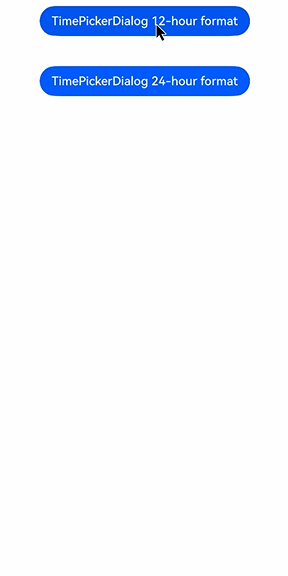
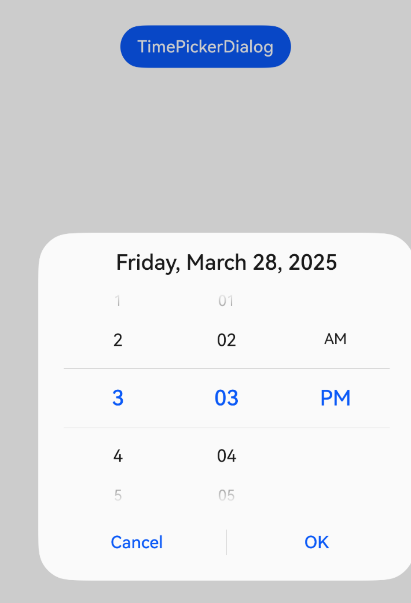
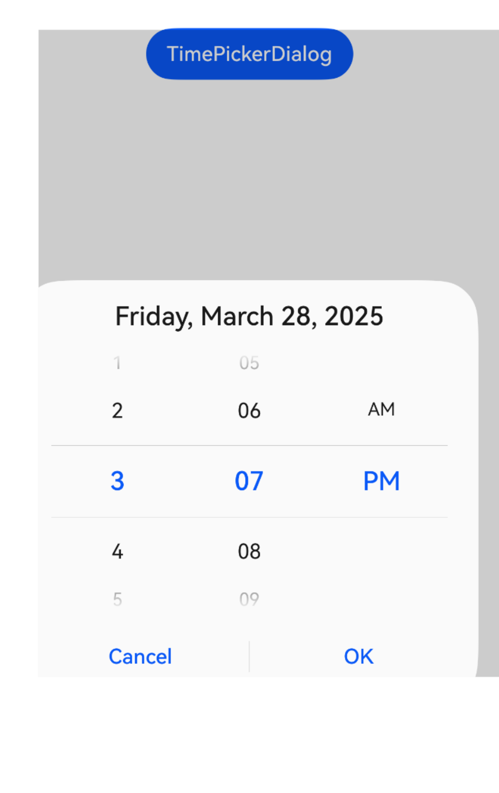
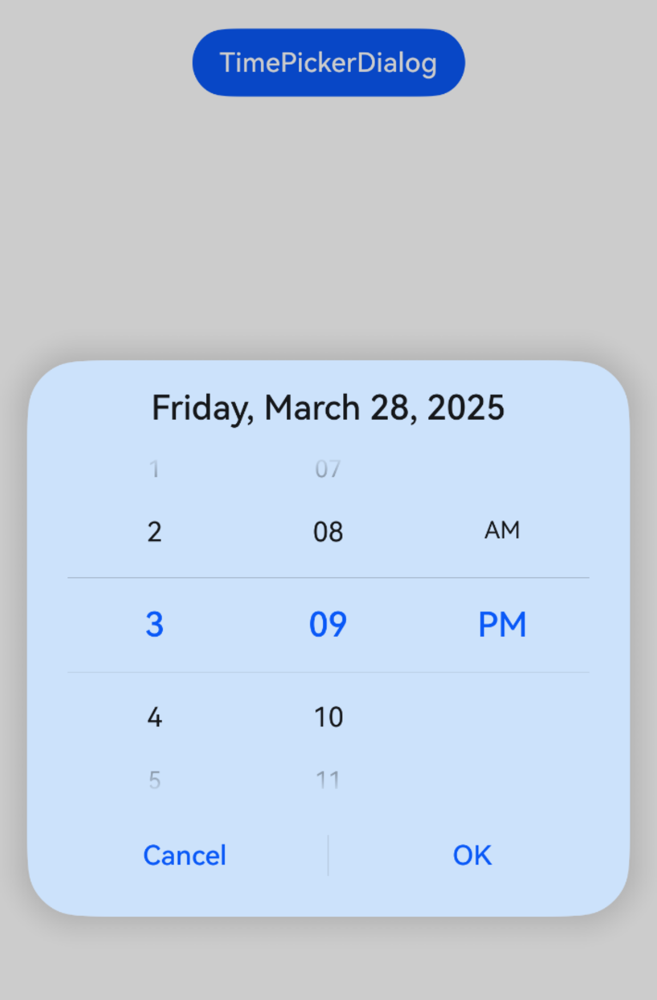

# Time Picker Dialog Box (TimePickerDialog)

A time picker dialog box is a dialog box that allows users to select a time from the 24-hour range through scrolling.

>  **NOTE**
>
> The APIs of this module are supported since API version 8. Updates will be marked with a superscript to indicate their earliest API version.
>
> The functionality of this module depends on UI context. This means that the APIs of this module cannot be used where the UI context is unclear. For details, see [UIContext](../js-apis-arkui-UIContext.md#uicontext).
>
> Since API version 10, you can use the [showTimePickerDialog](../js-apis-arkui-UIContext.md#showtimepickerdialog) API in [UIContext](../js-apis-arkui-UIContext.md#uicontext), which ensures that the time picker dialog box is shown in the intended UI instance.

## TimePickerDialog

### show

static show(options?: TimePickerDialogOptions)

Shows a time picker dialog box.

**Atomic service API**: This API can be used in atomic services since API version 11.

**System capability**: SystemCapability.ArkUI.ArkUI.Full

**Parameters**

| Name | Type                                                       | Mandatory| Description                      |
| ------- | ----------------------------------------------------------- | ---- | -------------------------- |
| options | [TimePickerDialogOptions](#timepickerdialogoptions) | No  | Parameters of the time picker dialog box.|

## TimePickerDialogOptions

Inherited from [TimePickerOptions](ts-basic-components-timepicker.md#timepickeroptions).

**System capability**: SystemCapability.ArkUI.ArkUI.Full

| Name| Type| Mandatory| Description|
| -------- | -------- | -------- | -------- |
| useMilitaryTime | boolean | No| Whether to display time in 24-hour format. The 12-hour format is used by default.<br>Default value: **false**<br>**NOTE**<br>When in the 12-hour format, the AM/PM zone does not change depending on the hour portion.<br>**Atomic service API**: This API can be used in atomic services since API version 11.|
| disappearTextStyle<sup>10+</sup> | [PickerTextStyle](ts-basic-components-datepicker.md#pickertextstyle10) | No| Font color, font size, and font weight for the top and bottom items.<br>Default value:<br>{<br>color: '#ff182431',<br>font: {<br>size: '14fp', <br>weight: FontWeight.Regular<br>}<br>}<br>**Atomic service API**: This API can be used in atomic services since API version 11.|
| textStyle<sup>10+</sup> | [PickerTextStyle](ts-basic-components-datepicker.md#pickertextstyle10) | No| Font color, font size, and font weight of all items except the top, bottom, and selected items.<br>Default value:<br>{<br>color: '#ff182431',<br>font: {<br>size: '16fp', <br>weight: FontWeight.Regular<br>}<br>}<br>**Atomic service API**: This API can be used in atomic services since API version 11.|
| selectedTextStyle<sup>10+</sup> | [PickerTextStyle](ts-basic-components-datepicker.md#pickertextstyle10) | No| Font color, font size, and font weight of the selected item.<br>Default value:<br>{<br>color: '#ff007dff',<br>font: {<br>size: '20vp', <br>weight: FontWeight.Medium<br>}<br>}<br>**Atomic service API**: This API can be used in atomic services since API version 11.|
| acceptButtonStyle<sup>12+</sup> | [PickerDialogButtonStyle](ts-methods-datepicker-dialog.md#pickerdialogbuttonstyle12) | No| Style of the accept button.<br>**NOTE**<br>In the **acceptButtonStyle** and **cancelButtonStyle** configurations, only one **primary** field can be set to **true** at most. If both the **primary** fields are set to **true**, neither will take effect.<br>**Atomic service API**: This API can be used in atomic services since API version 12.|
| cancelButtonStyle<sup>12+</sup> | [PickerDialogButtonStyle](ts-methods-datepicker-dialog.md#pickerdialogbuttonstyle12) | No| Style of the cancel button.<br>**NOTE**<br>In the **acceptButtonStyle** and **cancelButtonStyle** configurations, only one **primary** field can be set to **true** at most. If both the **primary** fields are set to **true**, neither will take effect.<br>**Atomic service API**: This API can be used in atomic services since API version 12.|
| alignment<sup>10+</sup>  | [DialogAlignment](ts-methods-alert-dialog-box.md#dialogalignment) | No  | Alignment mode of the dialog box in the vertical direction.<br>Default value: **DialogAlignment.Default**<br>**Atomic service API**: This API can be used in atomic services since API version 11.|
| offset<sup>10+</sup>     | [Offset](ts-types.md#offset) | No    | Offset of the dialog box based on the **alignment** settings.<br>Default value: **{ dx: 0 , dy: 0 }**<br>**Atomic service API**: This API can be used in atomic services since API version 11.|
| maskRect<sup>10+</sup>| [Rectangle](ts-methods-alert-dialog-box.md#rectangle8) | No    | Mask area of the dialog box. Events outside the mask area are transparently transmitted, and events within the mask area are not.<br>Default value: **{ x: 0, y: 0, width: '100%', height: '100%' }**<br>**Atomic service API**: This API can be used in atomic services since API version 11.|
| onAccept | (value: [TimePickerResult](ts-basic-components-timepicker.md#TimePickerResult)) => void | No| Callback invoked when the OK button in the dialog box is clicked.<br>**Atomic service API**: This API can be used in atomic services since API version 11.|
| onCancel | () => void | No| Callback invoked when the Cancel button in the dialog box is clicked.<br>**Atomic service API**: This API can be used in atomic services since API version 11.|
| onChange | (value: [TimePickerResult](ts-basic-components-timepicker.md#TimePickerResult)) => void | No| Callback invoked when the selected time changes.<br>**Atomic service API**: This API can be used in atomic services since API version 11.|
| backgroundColor<sup>11+</sup> | [ResourceColor](ts-types.md#resourcecolor)  | No| Backplane color of the dialog box.<br>Default value: **Color.Transparent**<br>**NOTE**<br>When **backgroundColor** is set to a non-transparent color, **backgroundBlurStyle** must be set to **BlurStyle.NONE**; otherwise, the color display may not meet the expected effect.<br>**Atomic service API**: This API can be used in atomic services since API version 12.|
| backgroundBlurStyle<sup>11+</sup> | [BlurStyle](ts-universal-attributes-background.md#blurstyle9) | No| Background blur style of the dialog box.<br>Default value: **BlurStyle.COMPONENT_ULTRA_THICK**<br>**NOTE**<br>Setting this parameter to **BlurStyle.NONE** disables the background blur. When **backgroundBlurStyle** is set to a value other than **NONE**, do not set **backgroundColor**. If you do, the color display may not produce the expected visual effect.<br>**Atomic service API**: This API can be used in atomic services since API version 12.|
| onDidAppear<sup>12+</sup> | () => void | No| Event callback when the dialog box appears.<br>**NOTE**<br>1. The normal timing sequence is as follows: onWillAppear > onDidAppear > (onAccept/onCancel/onChange) > onWillDisappear > onDidDisappear.<br>2. You can set the callback event for changing the dialog box display effect in **onDidAppear**. The settings take effect next time the dialog box appears.<br>3. If the user closes the dialog box immediately after it appears, **onWillDisappear** is invoked before **onDidAppear**.<br>4. If the dialog box is closed before its entrance animation is finished, this callback is not invoked.<br>**Atomic service API**: This API can be used in atomic services since API version 12.|
| onDidDisappear<sup>12+</sup> | () => void | No| Event callback when the dialog box disappears.<br>**NOTE**<br>1. The normal timing sequence is as follows: onWillAppear > onDidAppear > (onAccept/onCancel/onChange) > onWillDisappear > onDidDisappear.<br>**Atomic service API**: This API can be used in atomic services since API version 12.|
| onWillAppear<sup>12+</sup> | () => void | No| Event callback when the dialog box is about to appear.<br>**NOTE**<br>1. The normal timing sequence is as follows: onWillAppear > onDidAppear > (onAccept/onCancel/onChange) > onWillDisappear > onDidDisappear.<br>2. You can set the callback event for changing the dialog box display effect in **onWillAppear**. The settings take effect next time the dialog box appears.<br>**Atomic service API**: This API can be used in atomic services since API version 12.|
| onWillDisappear<sup>12+</sup> | () => void | No| Event callback when the dialog box is about to disappear.<br>**NOTE**<br>1. The normal timing sequence is as follows: onWillAppear > onDidAppear > (onAccept/onCancel/onChange) > onWillDisappear > onDidDisappear.<br>2. If the user closes the dialog box immediately after it appears, **onWillDisappear** is invoked before **onDidAppear**.<br>**Atomic service API**: This API can be used in atomic services since API version 12.|
| shadow<sup>12+</sup>              | [ShadowOptions](ts-universal-attributes-image-effect.md#shadowoptions) \| [ShadowStyle](ts-universal-attributes-image-effect.md#shadowstyle10) | No  | Shadow of the dialog box.<br>Default value on 2-in-1 devices: **ShadowStyle.OUTER_FLOATING_MD** when the dialog box is focused and **ShadowStyle.OUTER_FLOATING_SM** otherwise<br>**Atomic service API**: This API can be used in atomic services since API version 12.|
| dateTimeOptions<sup>12+</sup> | [DateTimeOptions](../../apis-localization-kit/js-apis-intl.md#datetimeoptions) | No| Whether to display a leading zero for the hours and minutes. Currently only the configuration of the **hour** and **minute** parameters is supported.<br>Default value:<br>**hour**: In the 24-hour format, it defaults to **2-digit**, which means a leading zero is used; In the 12-hour format, it defaults to **numeric**, which means no leading zero is used.<br>**minute**: defaults to **2-digit**, which means a leading zero is used.<br>**Atomic service API**: This API can be used in atomic services since API version 12.|
| enableHoverMode<sup>14+</sup>     | boolean | No  | Whether to enable the hover mode.<br>Default value: **false**, meaning not to enable the hover mode.<br>**Atomic service API**: This API can be used in atomic services since API version 14.|
| hoverModeArea<sup>14+</sup>       | [HoverModeAreaType](ts-appendix-enums.md#hovermodeareatype14) | No  | Display area of the dialog box in hover mode.<br>Default value: **HoverModeAreaType.BOTTOM_SCREEN**<br>**Atomic service API**: This API can be used in atomic services since API version 14.|

## Example

>  **NOTE**
>
> For clarity in UI execution context, you are advised to use the [showTimePickerDialog](../js-apis-arkui-UIContext.md#showtimepickerdialog) API in [UIContext](../js-apis-arkui-UIContext.md#uicontext).

### Example 1: Setting the Display Time Format

This example demonstrates how to set the display time using **useMilitaryTime**, **dateTimeOptions**, and **format**.

```ts
@Entry
@Component
struct TimePickerDialogExample {
  private selectTime: Date = new Date('2020-12-25T08:30:00')

  build() {
    Column() {
      Button("TimePickerDialog 12-hour format")
        .margin(20)
        .onClick(() => {
          TimePickerDialog.show({
            selected: this.selectTime,
            format: TimePickerFormat.HOUR_MINUTE,
            useMilitaryTime: false,
            dateTimeOptions: { hour: "numeric", minute: "2-digit" },
            onAccept: (value: TimePickerResult) => {
              // Set selectTime to the time when the OK button is clicked. In this way, when the dialog box is displayed again, the selected time is the time when the operation was confirmed last time.
              if (value.hour != undefined && value.minute != undefined) {
                this.selectTime.setHours(value.hour, value.minute)
                console.info("TimePickerDialog:onAccept()" + JSON.stringify(value))
              }
            },
            onCancel: () => {
              console.info("TimePickerDialog:onCancel()")
            },
            onChange: (value: TimePickerResult) => {
              console.info("TimePickerDialog:onChange()" + JSON.stringify(value))
            },
            onDidAppear: () => {
              console.info("TimePickerDialog:onDidAppear()")
            },
            onDidDisappear: () => {
              console.info("TimePickerDialog:onDidDisappear()")
            },
            onWillAppear: () => {
              console.info("TimePickerDialog:onWillAppear()")
            },
            onWillDisappear: () => {
              console.info("TimePickerDialog:onWillDisappear()")
            }
          })
        })
      Button("TimePickerDialog 24-hour format")
        .margin(20)
        .onClick(() => {
          TimePickerDialog.show({
            selected: this.selectTime,
            format: TimePickerFormat.HOUR_MINUTE_SECOND,
            useMilitaryTime: true,
            onAccept: (value: TimePickerResult) => {
              if (value.hour != undefined && value.minute != undefined) {
                this.selectTime.setHours(value.hour, value.minute)
                console.info("TimePickerDialog:onAccept()" + JSON.stringify(value))
              }
            },
          })
        })
    }.width('100%')
  }
}
```




### Example 2: Customizing the Style

In this example, **disappearTextStyle**, **textStyle**, **selectedTextStyle**, **acceptButtonStyle**, and **cancelButtonStyle** are configured to customize the text and button style.

```ts
// xxx.ets
@Entry
@Component
struct TimePickerDialogExample {
  private selectTime: Date = new Date('2020-12-25T08:30:00')

  build() {
    Column() {
      Button("TimePickerDialog 24-hour format")
        .margin(20)
        .onClick(() => {
          TimePickerDialog.show({
            disappearTextStyle: { color: '#297bec', font: { size: 15, weight: FontWeight.Lighter } },
            textStyle: { color: Color.Black, font: { size: 20, weight: FontWeight.Normal } },
            selectedTextStyle: { color: Color.Blue, font: { size: 30, weight: FontWeight.Bolder } },
            acceptButtonStyle: {
              type: ButtonType.Normal,
              style: ButtonStyleMode.NORMAL,
              role: ButtonRole.NORMAL,
              fontColor: 'rgb(81, 81, 216)',
              fontSize: '26fp',
              fontWeight: FontWeight.Bolder,
              fontStyle: FontStyle.Normal,
              fontFamily: 'sans-serif',
              backgroundColor: '#A6ACAF',
              borderRadius: 20
            },
            cancelButtonStyle: {
              type: ButtonType.Normal,
              style: ButtonStyleMode.NORMAL,
              role: ButtonRole.NORMAL,
              fontColor: Color.Blue,
              fontSize: '16fp',
              fontWeight: FontWeight.Normal,
              fontStyle: FontStyle.Italic,
              fontFamily: 'sans-serif',
              backgroundColor: '#50182431',
              borderRadius: 10
            },
            onAccept: (value: TimePickerResult) => {
              if (value.hour != undefined && value.minute != undefined) {
                this.selectTime.setHours(value.hour, value.minute)
                console.info("TimePickerDialog:onAccept()" + JSON.stringify(value))
              }
            }
          })
        })
    }.width('100%')
  }
}
```


### Example 3: Configuring a Dialog Box in the Hover State

This example demonstrates how to set the layout area of a dialog box in hover mode on a foldable device.

```ts
@Entry
@Component
struct TimePickerDialogExample {
  private selectTime: Date = new Date('2020-12-25T08:30:00');

  build() {
    Column() {
      Button("TimePickerDialog 12-hour format")
        .margin(20)
        .onClick(() => {
          TimePickerDialog.show ({ // You are advised to use this.getUIContext().showTimePickerDialog().
            selected: this.selectTime,
            disappearTextStyle: { color: Color.Red, font: { size: 15, weight: FontWeight.Lighter } },
            textStyle: { color: Color.Black, font: { size: 20, weight: FontWeight.Normal } },
            selectedTextStyle: { color: Color.Blue, font: { size: 30, weight: FontWeight.Bolder } },
            onAccept: (value: TimePickerResult) => {
              // Set selectTime to the time when the OK button is clicked. In this way, when the dialog box is displayed again, the selected time is the time when the operation was confirmed last time.
              if (value.hour != undefined && value.minute != undefined) {
                this.selectTime.setHours(value.hour, value.minute);
                console.info("TimePickerDialog:onAccept()" + JSON.stringify(value));
              }
            },
            onCancel: () => {
              console.info("TimePickerDialog:onCancel()");
            },
            onChange: (value: TimePickerResult) => {
              console.info("TimePickerDialog:onChange()" + JSON.stringify(value));
            },
            onDidAppear: () => {
              console.info("TimePickerDialog:onDidAppear()");
            },
            onDidDisappear: () => {
              console.info("TimePickerDialog:onDidDisappear()");
            },
            onWillAppear: () => {
              console.info("TimePickerDialog:onWillAppear()");
            },
            onWillDisappear: () => {
              console.info("TimePickerDialog:onWillDisappear()");
            },
            enableHoverMode: true,
            hoverModeArea: HoverModeAreaType.TOP_SCREEN
          })
        })
    }.width('100%')
  }
}
```


### Example 4: Setting the Dialog Box Position

This example demonstrates how to set the position of a dialog box using **alignment** and **offset**.

```ts
// xxx.ets
@Entry
@Component
struct TimePickerDialogExample {
  private selectTime: Date = new Date('2020-12-25T08:30:00')

  build() {
    Column() {
      Button("TimePickerDialog")
        .margin(20)
        .onClick(() => {
          TimePickerDialog.show({
            alignment: DialogAlignment.Center,
            offset: { dx: 20 , dy: 0 },
            onAccept: (value: TimePickerResult) => {
              // Set selectTime to the time when the OK button is clicked. In this way, when the dialog box is displayed again, the selected time is the time when the operation was confirmed last time.
              if (value.hour != undefined && value.minute != undefined) {
                this.selectTime.setHours(value.hour, value.minute)
                console.info("TimePickerDialog:onAccept()" + JSON.stringify(value))
              }
            }
          })
        })
    }.width('100%')
  }
}
```



### Example 5: Setting the Mask Area

This example demonstrates how to set the mask area using **maskRect**.

```ts
// xxx.ets
@Entry
@Component
struct TimePickerDialogExample {
  private selectTime: Date = new Date('2020-12-25T08:30:00')

  build() {
    Column() {
      Button("TimePickerDialog")
        .margin(20)
        .onClick(() => {
          TimePickerDialog.show({
            maskRect: { x: 30, y: 60, width: '100%', height: '60%' },
            onAccept: (value: TimePickerResult) => {
              // Set selectTime to the time when the OK button is clicked. In this way, when the dialog box is displayed again, the selected time is the time when the operation was confirmed last time.
              if (value.hour != undefined && value.minute != undefined) {
                this.selectTime.setHours(value.hour, value.minute)
                console.info("TimePickerDialog:onAccept()" + JSON.stringify(value))
              }
            }
          })
        })
    }.width('100%')
  }
}
```



### Example 6: Setting the Background

This example demonstrates how to set the mask area using **maskRect**.

```ts
// xxx.ets
@Entry
@Component
struct TimePickerDialogExample {
  private selectTime: Date = new Date('2020-12-25T08:30:00')

  build() {
    Column() {
      Button("TimePickerDialog")
        .margin(20)
        .onClick(() => {
          TimePickerDialog.show({
            backgroundColor: 'rgb(204, 226, 251)',
            backgroundBlurStyle: BlurStyle.NONE,
            shadow: ShadowStyle.OUTER_FLOATING_SM,
            onAccept: (value: TimePickerResult) => {
              // Set selectTime to the time when the OK button is clicked. In this way, when the dialog box is displayed again, the selected time is the time when the operation was confirmed last time.
              if (value.hour != undefined && value.minute != undefined) {
                this.selectTime.setHours(value.hour, value.minute)
                console.info("TimePickerDialog:onAccept()" + JSON.stringify(value))
              }
            }
          })
        })
    }.width('100%')
  }
}
```

<!--no_check-->