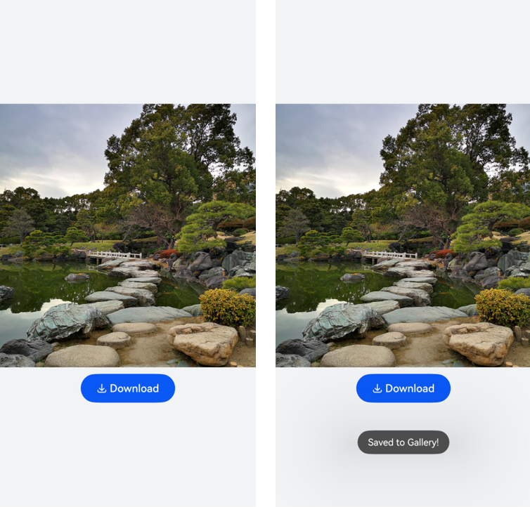

# Using SaveButton

The **SaveButton** component comes with the privilege for saving data, which allows an application to temporarily save data without any authorization.

When it is tapped, the application obtains the permission to access the **mediaLibrary** APIs within 10 seconds. You can use this component when your application needs to save images or videos to the media library.

This component allows for simpler operations than Pickers, which have to start a system application and have the user select a directory for saving the image or video.

The following figure shows the effect of the **SaveButton** component.
  


## Constraints

- When a user clicks **SaveButton** in the application for the first time, a dialog box will be displayed to request user authorization. If the user clicks **Deny**, the dialog box will be closed and the application does not have the permission. When the user clicks **LocationButton** again, the user authorization dialog box will be displayed again. If the user clicks **Allow**, the dialog box will be closed and the application is granted the temporary location permission. After that, if the user clicks **LocationButton** again, no dialog box will be displayed.

- The interval for calling **onClick()** to trigger a **mediaLibrary** API cannot exceed 10 seconds after **SaveButton** is tapped.

- Each time the component is tapped, the application obtains only one-time perform for API calling.

- The **SaveButton** component must be visible and legible to users. You need to properly configure the component attributes such as the size and color to prevent authorization failures. If the authorization fails due to invalid component style, check the device error logs.

## How to Develop

For example, to save the image in the dialog box shown above, the application only needs to use the image saving feature for a short period of time in the foreground. In this case, you can the **SaveButton** component to obtain temporary permission to save the image without requesting the related permission for the application.

1. Import the dependencies.
   
   ```ts
   import { photoAccessHelper } from '@kit.MediaLibraryKit';
   import { fileIo } from '@kit.CoreFileKit';
   ```

2. Set the image asset and add the **SaveButton** component.
   
   **SaveButton** is a button-like component consisting of an icon, text, and background. Either the icon or text is mandatory, and the background is mandatory. The icon and text cannot be customized. You can only select from the existing options. When declaring the API for creating a security component, you can determine whether to pass in parameters. If parameters are passed in, the component is created based on the specified parameters. If no parameter is passed in, a component with default icon, text, and background is created.

   The following example uses the default parameters. For details, see [SaveButton](../../reference/apis-arkui/arkui-ts/ts-security-components-savebutton.md). In addition, all security components inherit the [Security Component Universal Attributes](../../reference/apis-arkui/arkui-ts/ts-securitycomponent-attributes.md), which can be used to customize styles.
   
   ```ts
   import { photoAccessHelper } from '@kit.MediaLibraryKit';
   import { fileIo } from '@kit.CoreFileKit';
   import { common } from '@kit.AbilityKit';
   import { promptAction } from '@kit.ArkUI';
   import { BusinessError } from '@kit.BasicServicesKit';
   
   async function savePhotoToGallery(context: common.UIAbilityContext) {
     let helper = photoAccessHelper.getPhotoAccessHelper(context);
     try {
       // After onClick is triggered, call createAsset API within 5 seconds to create an image. After 5 seconds have elapsed, the permission to call createAsset is revoked.
       let uri = await helper.createAsset(photoAccessHelper.PhotoType.IMAGE, 'jpg');
       // Open the file based on its URI. The write process is not time bound.
       let file = await fileIo.open(uri, fileIo.OpenMode.READ_WRITE | fileIo.OpenMode.CREATE);
       // Replace $r('app.media.startIcon') with the image resource file you use.
       context.resourceManager.getMediaContent($r('app.media.startIcon').id, 0)
         .then(async value => {
           let media = value.buffer;
           // Write data to the file in the media library.
           await fileIo.write(file.fd, media);
           await fileIo.close(file.fd);
           promptAction.showToast({message: 'Saved to album.'});
         });
     }
     catch (error) {
       const err: BusinessError = error as BusinessError;
       console.error(`Failed to save photo. Code is ${err.code}, message is ${err.message}`);
     }
   }
   
   @Entry
   @Component
   struct Index {
     build() {
       Row() {
         Column({ space: 10 }) {
           // Replace $r('app.media.startIcon') with the image resource file you use.
           Image($r('app.media.startIcon'))
             .height(400)
             .width('100%')
   
           SaveButton()
             .padding({top: 12, bottom: 12, left: 24, right: 24})
             .onClick(async (event: ClickEvent, result: SaveButtonOnClickResult) => {
               if (result === SaveButtonOnClickResult.SUCCESS) {
                 const context: common.UIAbilityContext = getContext(this) as common.UIAbilityContext;
                 // Obtain temporary authorization to save the image without requesting the related permission for the application.
                 savePhotoToGallery(context);
               } else {
                 promptAction.showToast ({ message: 'Failed to set the permission.' })
               }
             })
         }
         .width('100%')
       }
       .height('100%')
       .backgroundColor(0xF1F3F5)
     }
   }
   ```
