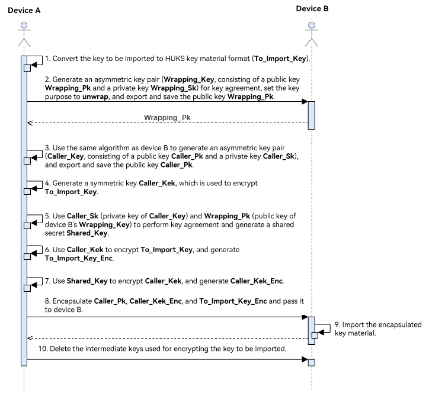

# Key Import Overview and Algorithm Specifications

You can import an externally generated key (for example, a key generated after key agreement or generated by a server) into HUKS for management. Once a key is imported into HUKS, the plaintext can be accessed only in a secure environment in its lifecycle. This ensures that no one can obtain the plaintext of the key.

A key can be imported in plaintext or in encrypted (wrapped) mode.

## Plaintext Import

Importing a key in plaintext may expose the plaintext to a non-secure environment. This import mode applies to lightweight devices or security-insensitive services.

- Plaintext import is recommended to import the public key of an asymmetric key pair.

- It is not recommended to import symmetric keys or asymmetric key pairs.
  > **NOTE** 
  > The mini-system devices support plaintext import but not encrypted import.

## Encrypted Import

In this mode, the key to be imported is encrypted (wrapped) and then imported to HUKS through an end-to-end encrypted transmission channel established between the service and HUKS. This mode applies to security-sensitive services due to higher security than plaintext import. However, it involves more complex key material and operations.

- Encrypted import is recommended to import symmetric keys or asymmetric key pairs.

The following figure illustrates the development sequence of encrypted import.

To import an encrypted key, you need to use the HUKS APIs to generate a key pair (used to encrypt the key to be imported), export the public key, import the encrypted key, and delete the key pair.

The [public key material](huks-concepts.md#public-key-material-format) exported is encapsulated in X.509 format. The encrypted key material to be imported must be encapsulated in **LengthData< /sub>-Data** format.

> **NOTE**
>
> - The encrypted import supports key agreement algorithms ECDH and X25519. The generated **Shared_Key** uses the AES-GCM algorithm to encrypt **Caller_Kek**. For details about the cipher suites, see [HuksUnwrapSuite](../../reference/apis-universal-keystore-kit/js-apis-huks.md#huksunwrapsuite9).
> - The mini-system devices support plaintext import but not encrypted import.

### Key Material Format for Encrypted Import

| Content| Length|
| -------- | -------- |
| Service public key **Caller_Pk** length (LCaller_Pk)| 4 bytes|
| Service public key **Caller_Pk**| LCaller_Pk bytes|
| Shared_Key **AAD2** length (LAAD2)| 4 bytes|
| Shared_Key **AAD2**| LAAD2 bytes|
| Shared_Key **Nonce2** length (LNonce2)| 4 bytes|
| Shared_Key **Nonce2**| LNonce2 bytes|
| Shared_Key **AEAD2** length (LAEAD2)| 4 bytes|
| Shared_Key **AEAD2**| LAEAD2 bytes|
| **Caller_Kek_enc** length (LCaller_Kek_enc)| 4 bytes|
| Caller_Kek ciphertext **Caller_Kek_enc**| LCaller_Kek_enc bytes|
| Caller_Kek **AAD3** length (LAAD3)| 4 bytes|
| Caller_Kek **AAD3**| LAAD3 bytes|
| Caller_Kek **Nonce3** length (LNonce3)| 4 bytes|
| Caller_Kek **Nonce3**| LNonce3 bytes|
| Caller_Kek **AEAD3** length (LAEAD3)| 4 bytes|
| Caller_Kek **AEAD3**| LAEAD3 bytes|
| **To_Import_Key_size** length (LTo_Import_Key_size)| 4 bytes|
| Key plaintext material length **To_Import_Key_size**| LTo_Import_Key_size bytes|
| **To_Import_Key_enc** length (LTo_Import_Key_enc)| 4 bytes|
| To_Import_Key ciphertext **To_Import_Key_enc**| LTo_Import_Key_enc bytes|

## Supported Algorithms

The following table lists the supported key import specifications.
<!--Del-->
The key management service specifications include mandatory specifications and optional specifications. Mandatory specifications are algorithm specifications that must be supported. Optional specifications can be used based on actual situation. Before using the optional specifications, refer to the documents provided by the vendor to ensure that the specifications are supported.

**You are advised to use mandatory specifications in your development for compatibility purposes.**
<!--DelEnd-->
**Specifications for Standard-System Devices**
| Algorithm| Supported Key Length (Bit)| API Version| <!--DelCol4-->Mandatory|
| -------- | -------- | -------- | -------- |
| AES | 128, 192, 256| 8+ | Yes|
| <!--DelRow-->RSA | 512, 768, 1024| 8+ | No|
| RSA | 2048, 3072, 4096| 8+ | Yes|
| HMAC | An integer multiple of 8, ranging from 8 to 1024 (inclusive)| 8+ | Yes|
| <!--DelRow-->ECC | 224 | 8+ | No|
| ECC | 256, 384, 521| 8+ | Yes|
| ED25519 | 256 | 8+ | Yes|
| X25519 | 256 | 8+ | Yes|
| <!--DelRow-->DSA | An integer multiple of 8, ranging from 512 to 1024 (inclusive) | 8+ | No|
| DH | 2048 | 8+ | Yes|
| <!--DelRow-->DH | 3072, 4096| 8+ | No|
| SM2 | 256 | 9+ | Yes|
| SM4 | 128 | 9+ | Yes|

**Specifications for Mimi-System Devices**

<!--Del-->
Before implementing the specifications for mini-system devices, determine whether your device supports the related specifications.
<!--DelEnd-->

| Algorithm| Supported Key Length (Bit)| API Version|
| -------- | -------- | -------- |
| AES | 128, 192, 256| 12+ |
| DES | 64 | 12+ |
| 3DES | 128, 192| 12+ |
| RSA |  An integer multiple of 8, ranging from 1024 to 2048 (inclusive)| 12+ |
| HMAC | An integer multiple of 8, ranging from 8 to 1024 (inclusive)| 12+ |
| CMAC | 128 | 12+ |

## Key Import Formats
HUKS supports various types of keys in different formats. The following table lists the key types and key material formats supported by HUKS.
| Key Type| Algorithm| Import Format|
| -------- | -------- | -------- |
| Symmetric key| - | Raw data|
| Asymmetric key pair| - | [Key pair material format](huks-concepts.md#key-pair-material-format)|
| Public key of an asymmetric key pair| Ed25519, X25519| Raw data. For details, see [Importing the X25519 Key and Public Key] (huks-import-key-in-plaintext-arkts.md#importing-the-public-key-of-an-x25519-key-pair).|
| Public key of an asymmetric key pair| RSA, ECC, ECDH, DSA, DH, SM2| DER format defined in X.509|
