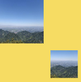

# Drawing Custom Graphics Using the Canvas (Canvas)


**Canvas** provides a canvas component for drawing custom graphics. You can use the **CanvasRenderingContext2D** and **OffscreenCanvasRenderingContext2D** objects to draw graphics on the **Canvas** component. The drawing objects can be basic shapes, text, and images.


## Drawing Custom Graphics on the Canvas

You can draw custom graphics on the canvas in any of the following ways:


- Use [CanvasRenderingContext2D](../reference/apis-arkui/arkui-ts/ts-canvasrenderingcontext2d.md).

  ```ts
  @Entry
  @Component
  struct CanvasExample1 {
    // Configure the parameters of the CanvasRenderingContext2D object, including whether to enable anti-aliasing. The value true indicates that anti-aliasing is enabled.
    private settings: RenderingContextSettings = new RenderingContextSettings(true)
    // Create a CanvasRenderingContext2D object by calling CanvasRenderingContext2D object in Canvas.
    private context: CanvasRenderingContext2D = new CanvasRenderingContext2D(this.settings)
  
    build() {
      Flex({ direction: FlexDirection.Column, alignItems: ItemAlign.Center, justifyContent: FlexAlign.Center }) {
        // Invoke the CanvasRenderingContext2D object in Canvas.
        Canvas(this.context)
          .width('100%')
          .height('100%')
          .backgroundColor('#F5DC62')
          .onReady(() => {
            // You can draw content here.
            this.context.strokeRect(50, 50, 200, 150);
          })
      }
      .width('100%')
      .height('100%')
    }
  }
  
  ```

  .jpg)

- Drawing offscreen onto a canvas is a process where content to draw onto the canvas is first drawn in the buffer, and then converted into a picture, and finally the picture is drawn on the canvas. This process increases the drawing efficiency. Specifically, the implementation is as follows:
  1. Use the **transferToImageBitmap** API to create an **ImageBitmap** object for the image that is recently rendered off the screen canvas.
  2. Use the **transferFromImageBitmap** API of the **CanvasRenderingContext2D** object to display the given **ImageBitmap** object.

    For details, see [OffscreenCanvasRenderingContext2D](../reference/apis-arkui/arkui-ts/ts-offscreencanvasrenderingcontext2d.md).

  ```ts
  @Entry
  @Component
  struct CanvasExample2 {
  // Configure the parameters of the CanvasRenderingContext2D and OffscreenCanvasRenderingContext2D objects, including whether to enable anti-aliasing. The value true indicates that anti-aliasing is enabled.
    private settings: RenderingContextSettings = new RenderingContextSettings(true)
    private context: CanvasRenderingContext2D = new CanvasRenderingContext2D(this.settings)
  // Create an OffscreenCanvas object. width indicates the width of the offscreen canvas, and height indicates the height of the offscreen canvas.
    private offCanvas: OffscreenCanvas = new OffscreenCanvas(600, 600)
   
    build() {
      Flex({ direction: FlexDirection.Column, alignItems: ItemAlign.Center, justifyContent: FlexAlign.Center }) {
        Canvas(this.context)
          .width('100%')
          .height('100%')
          .backgroundColor('#F5DC62')
          .onReady(() =>{
            let offContext = this.offCanvas.getContext("2d", this.settings)
            // You can draw content here.
            offContext.strokeRect(50, 50, 200, 150);
            // Display the image rendered by the offscreen drawing value on the common canvas.
            let image = this.offCanvas.transferToImageBitmap();
            this.context.transferFromImageBitmap(image);
          })
      }
      .width('100%')
      .height('100%')
    }
  }

  ```

  .jpg)

  >**NOTE**
  >
  >The APIs called for drawing on the canvas through the **CanvasRenderingContext2D** and **OffscreenCanvasRenderingContext2D** objects are the same. Unless otherwise specified, the value unit of the parameters in these APIs is vp.

- Before loading the Lottie animation on the canvas, download the Lottie as follows:

  ```ts
  import lottie from '@ohos/lottie'
  ```

  For details about the APIs, see [Lottie](https://gitee.com/openharmony-tpc/lottieETS).


## Initializing the Canvas Component

**onReady(event: () =&gt; void)** is the event callback when the **Canvas** component initialization is complete. After this event is called, the determined width and height of the **Canvas** component can be obtained. The **CanvasRenderingContext2D** and **OffscreenCanvasRenderingContext2D** objects can then be used to call related APIs to draw graphics.

```ts
Canvas(this.context)
  .width('100%')
  .height('100%')
  .backgroundColor('#F5DC62')
  .onReady(() => {
    this.context.fillStyle = '#0097D4';
    this.context.fillRect(50, 50, 100, 100);
  })
```

.jpg)


## Canvas Component Drawing Modes

After **onReady()** is invoked, you can use the **Canvas** component for drawing. Alternatively, you can separately define the **Path2d** object to build an ideal path without the **Canvas** component and **onReady()** lifecycle callback, and then use the **Canvas** component for drawing after **onReady()** is invoked.

- After the **onReady()** callback of the **Canvas** component is invoked, use the **CanvasRenderingContext2D** and **OffscreenCanvasRenderingContext2D** objects to call related APIs for drawing.

  ```ts
  Canvas(this.context)
    .width('100%')
    .height('100%')
    .backgroundColor('#F5DC62')
    .onReady(() =>{
      this.context.beginPath();
      this.context.moveTo(50, 50);
      this.context.lineTo(280, 160);
      this.context.stroke();
     })
  ```

  .jpg)

- Define an individual **path2d** object to build an ideal path, and then call the **stroke** or **fill** API of the **CanvasRenderingContext2D** and **OffscreenCanvasRenderingContext2D** objects to draw the path. For details, see [Path2D](../reference/apis-arkui/arkui-ts/ts-components-canvas-path2d.md).

  ```ts
  Canvas(this.context)
    .width('100%')
    .height('100%')
    .backgroundColor('#F5DC62')
    .onReady(() =>{
       let region = new Path2D();
       region.arc(100, 75, 50, 0, 6.28);
       this.context.stroke(region);
    })
  ```

  .jpg)


## Common Usage of the Canvas Component

**OffscreenCanvasRenderingContext2D** and **CanvasRenderingContext2D** provide a large number of attributes and methods, which can be used to draw text and graphics and process pixels. They are the core of the **Canvas** component. Common APIs include [fill](../reference/apis-arkui/arkui-ts/ts-canvasrenderingcontext2d.md#fill), [clip](../reference/apis-arkui/arkui-ts/ts-canvasrenderingcontext2d.md#clip), and [stroke](../reference/apis-arkui/arkui-ts/ts-canvasrenderingcontext2d.md#stroke). In addition, attributes such as [fillStyle](../reference/apis-arkui/arkui-ts/ts-canvasrenderingcontext2d.md#fillstyle), [globalAlpha](../reference/apis-arkui/arkui-ts/ts-canvasrenderingcontext2d.md#globalalpha), and [strokeStyle](../reference/apis-arkui/arkui-ts/ts-canvasrenderingcontext2d.md#strokestyle) are provided to spruce up the graphics. This topic describes typical usage of the canvas.

- Draw a basic shape.
  You can draw a basic shape by calling APIs such as [arc](../reference/apis-arkui/arkui-ts/ts-canvasrenderingcontext2d.md#arc), [ellipse](../reference/apis-arkui/arkui-ts/ts-canvasrenderingcontext2d.md#ellipse), and [rect](../reference/apis-arkui/arkui-ts/ts-canvasrenderingcontext2d.md#rect).

  ```ts
  Canvas(this.context)
    .width('100%')
    .height('100%')
    .backgroundColor('#F5DC62')
    .onReady(() =>{
       // Draw a rectangle.
       this.context.beginPath();
       this.context.rect(100, 50, 100, 100);
       this.context.stroke();
       // Draw a circle on the canvas.
       this.context.beginPath();
       this.context.arc(150, 250, 50, 0, 6.28);
       this.context.stroke();
       // Draw an oval on the canvas.
       this.context.beginPath();
       this.context.ellipse(150, 450, 50, 100, Math.PI * 0.25, Math.PI * 0, Math.PI * 2);
       this.context.stroke();
    })
  ```

  .jpg)

- Draw text.

  You can use APIs such as [fillText](../reference/apis-arkui/arkui-ts/ts-canvasrenderingcontext2d.md#filltext) and [strokeText](../reference/apis-arkui/arkui-ts/ts-canvasrenderingcontext2d.md#stroketext) to draw text.

  ```ts
  Canvas(this.context)
    .width('100%')
    .height('100%')
    .backgroundColor('#F5DC62')
    .onReady(() => {
      // Draw filled text on the canvas.
      this.context.font = '50px bolder sans-serif';
      this.context.fillText("Hello World!", 50, 100);
      // Draw a text stroke on the canvas.
      this.context.strokeStyle = "#ff0000"
      this.context.lineWidth = 2
      this.context.font = '50px bolder sans-serif';
      this.context.strokeText("Hello World!", 50, 150);
    })
  ```

  .jpg)

- Draw text with a custom font.

  You can use the [font](../reference/apis-arkui/arkui-ts/ts-canvasrenderingcontext2d.md#font) API to load a custom font, and then use the [fillText](../reference/apis-arkui/arkui-ts/ts-canvasrenderingcontext2d.md#filltext) and [strokeText](../reference/apis-arkui/arkui-ts/ts-canvasrenderingcontext2d.md#stroketext) APIs to draw text.

  ```ts
  Canvas(this.context)
    .width('100%')
    .height('100%')
    .backgroundColor('#F5DC62')
    .onReady(() =>{
      // Load a custom font.
      this.context.font = '30vp customFont'
      this.context.fillText("Hello World!", 20, 50)
      this.context.strokeText("Hello World!", 20, 100)
    })
  ```

  

- Draw images and processes image pixel information.

  You can draw an image by calling APIs such as [drawImage](../reference/apis-arkui/arkui-ts/ts-canvasrenderingcontext2d.md#drawimage) and [putImageData](../reference/apis-arkui/arkui-ts/ts-canvasrenderingcontext2d.md#putimagedata). You can also process image pixel information by calling APIs such as [createImageData](../reference/apis-arkui/arkui-ts/ts-canvasrenderingcontext2d.md#createimagedata), [getPixelMap](../reference/apis-arkui/arkui-ts/ts-canvasrenderingcontext2d.md#getpixelmap), and [getImageData](../reference/apis-arkui/arkui-ts/ts-canvasrenderingcontext2d.md#getimagedata).

  ```ts
  @Entry
  @Component
  struct GetImageData {
   private settings: RenderingContextSettings = new RenderingContextSettings(true)
   private context: CanvasRenderingContext2D = new CanvasRenderingContext2D(this.settings)
   private offCanvas: OffscreenCanvas = new OffscreenCanvas(600, 600)
   private img:ImageBitmap = new ImageBitmap("/common/images/1234.png")

    build() {
      Flex({ direction: FlexDirection.Column, alignItems: ItemAlign.Center, justifyContent: FlexAlign.Center }) {
        Canvas(this.context)
          .width('100%')
          .height('100%')
          .backgroundColor('#F5DC62')
          .onReady(() =>{
            let offContext = this.offCanvas.getContext("2d", this.settings)
            // Use the drawImage API to draw an image in the area with the width and height of 130 starting from (0, 0).
            offContext.drawImage(this.img,0,0,130,130);
            // Use the getImageData API to obtain the image data with the width and height of 130 starting from (50, 50).
            let imagedata = offContext.getImageData(50,50,130,130);
            // Use the putImageData API to draw the obtained image data in the area starting from (150, 150).
            offContext.putImageData(imagedata,150,150);
            // Draw the offscreen drawing content to the canvas.
            let image = this.offCanvas.transferToImageBitmap();
            this.context.transferFromImageBitmap(image);
          })
      }
      .width('100%')
      .height('100%')
    }
  }
  ```

  

- Other usage

  **Canvas** also provides other usage. For example, regarding [CanvasGradient](../reference/apis-arkui/arkui-ts/ts-components-canvas-canvasgradient.md), you can create a linear gradient with [createLinearGradient](../reference/apis-arkui/arkui-ts/ts-canvasrenderingcontext2d.md#createlineargradient) or create a radial gradient with [createRadialGradient](../reference/apis-arkui/arkui-ts/ts-canvasrenderingcontext2d.md#createradialgradient), among others.

  ```ts
    Canvas(this.context)
    .width('100%')
    .height('100%')
    .backgroundColor('#F5DC62')
    .onReady(() =>{
       // Create a CanvasGradient object with radial gradient colors.
       let grad = this.context.createRadialGradient(200,200,50, 200,200,200)
       // Set the gradient color stop for the CanvasGradient object, including the offset and colors.
       grad.addColorStop(0.0, '#E87361');
       grad.addColorStop(0.5, '#FFFFF0');
       grad.addColorStop(1.0, '#BDDB69');
       // Fill the rectangle with the CanvasGradient object.
       this.context.fillStyle = grad;
       this.context.fillRect(0, 0, 400, 400);
    })
  ```

  .jpg)


## Example Scenario

- Draw a basic shape.

  ```ts
  @Entry
  @Component
  struct ClearRect {
   private settings: RenderingContextSettings = new RenderingContextSettings(true);
   private context: CanvasRenderingContext2D = new CanvasRenderingContext2D(this.settings);

    build() {
      Flex({ direction: FlexDirection.Column, alignItems: ItemAlign.Center, justifyContent: FlexAlign.Center }) {
        Canvas(this.context)
          .width('100%')
          .height('100%')
          .backgroundColor('#F5DC62')
          .onReady(() =>{
            // Set the fill color to blue.
            this.context.fillStyle = '#0097D4';
            // Take (50, 50) as the upper left corner and draw a rectangle with the width and height of 200.
            this.context.fillRect(50,50,200,200);
            // Use (70, 70) as the upper left corner and clear the area with the width of 150 and height of 100.
            this.context.clearRect(70,70,150,100);
        })
      }
      .width('100%')
      .height('100%')
    }
  }

  ```

  .jpg)

- Draw an irregular shape.

  ```ts
  @Entry
  @Component
  struct Path2d {
    private settings: RenderingContextSettings = new RenderingContextSettings(true);
    private context: CanvasRenderingContext2D = new CanvasRenderingContext2D(this.settings);
    
    build() {
      Row() {
        Column() {
          Canvas(this.context)
            .width('100%')
            .height('100%')
            .backgroundColor('#F5DC62')
            .onReady(() =>{
              // Use the Path2D API to create a pentagon.
              let path = new Path2D();
              path.moveTo(150, 50);
              path.lineTo(50, 150);
              path.lineTo(100, 250);
              path.lineTo(200, 250);
              path.lineTo(250, 150);
              path.closePath();
              // Set the fill color to blue.
              this.context.fillStyle = '#0097D4';
              // Draw the pentagon described by Path2D in the canvas in fill mode.
              this.context.fill(path);
            })
        }
        .width('100%')
      }
      .height('100%')
    }
  }
  ```

  
