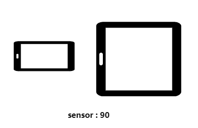
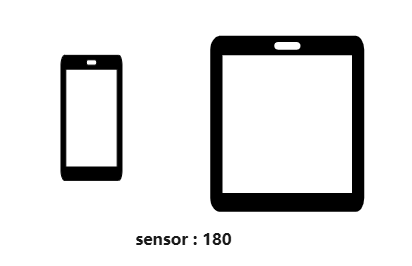

# Window Subsystem Changelog

## cl.display.1 Changed the rotation and orientation Attributes of Display Objects

**Access Level**

Public API

**Reason for Change**

The orientation of electronic components on different devices such as smartphones and tablets varies. This variation causes a discrepancy between the natural direction of sensors and the physical orientation of the screen. As a result, the rotation and orientation changes in the Display object on tablets do not align with those on smartphones. This inconsistency can be confusing for users and necessitates special handling based on the device type, which can impact usability.

**Change Impact**

This change is a non-compatible change.

After the change, the display orientation on tablets will be changed to be the same as that on mobile phones.

The following show the comparison before and after the change.

| Device Rotation Direction| Tablet Before Change| Tablet After Change|  Mobile Phone|
|---------|---------|---------|---------|
|  | rotation: 1   orientation: 0 | rotation: 0   orientation: 0  | rotation: 0   orientation: 0  |
|  | rotation: 2   orientation: 3 | rotation: 1   orientation: 1 |rotation: 1   orientation: 1 |
|  | rotation: 3   orientation:  2| rotation: 2   orientation: 2 | rotation: 2   orientation: 2 |
|  | rotation: 0   orientation: 1 | rotation: 3   orientation: 3 | rotation: 3   orientation: 3 |

**Start API Level**

7

**Change Since**

OpenHarmony SDK 5.0.2.1

**Key API/Component Changes**

**rotation** and **orientation** attributes of the Display object in the @ohos.display.d.ts file

**Adaptation Guide**

Listen for landscape/portrait mode changes on tablets.

Call **display.on('change')** to listen for display attribute changes and obtain the **rotation** and **orientation** values from the Display object. Determine the landscape or portrait state based on these values for tablets, and pay attention to any changes to these values.

With the charging port facing downward (rotation set at **0**) as the reference point, and rotating the tablet clockwise by 0, 90, 180, and 270 degrees, the correlation between **rotation** and **orientation** values on tablets is detailed in the table below.

|Clockwise Rotation Angle|Value of rotation Before Change | Value of rotation After Change   | Value of orientation Before Change | Value of orientation After Change|
|-------      |-------        | --------          | ---------------   |---------------   |
|0            |1              |  0                |  0                |0                 |
|90           |2              |  1                |  3                |1                 |
|180          |3              |  2                |  2                |2                 |
|270          |0              |  3                |  1                |3                 |
