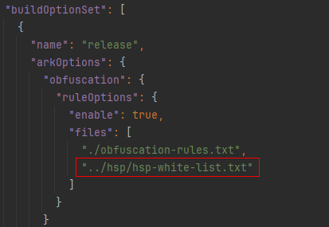

# ArkGuard混淆常见问题

## 如何排查功能异常

### 排查功能异常步骤
1. 先在obfuscation-rules.txt配置-disable-obfuscation选项关闭混淆，确认问题是否由混淆引起。
2. 若确认是开启混淆后功能出现异常，请先阅读文档了解[-enable-property-obfuscation](source-obfuscation.md#-enable-property-obfuscation)、[-enable-toplevel-obfuscation](source-obfuscation.md#-enable-toplevel-obfuscation)、[-enable-filename-obfuscation](source-obfuscation.md#-enable-filename-obfuscation)、[-enable-export-obfuscation](source-obfuscation.md#-enable-export-obfuscation)等混淆规则的能力以及哪些语法场景需要配置白名单来保证应用功能正常。下文简要介绍默认开启的四项选项功能，细节还请阅读对应选项的完整描述。  
    1. [-enable-toplevel-obfuscation](source-obfuscation.md#-enable-toplevel-obfuscation)为顶层作用域名称混淆开关。
    2. [-enable-property-obfuscation](source-obfuscation.md#-enable-property-obfuscation)为属性混淆开关，配置白名单的主要场景为网络数据访问、json字段访问、动态属性访问、调用so库接口等不能混淆场景，需要使用[-keep-property-name](source-obfuscation.md#-keep-property-name)来保留指定的属性名称。
    3. [-enable-export-obfuscation](source-obfuscation.md#-enable-export-obfuscation)为导出名称混淆，一般与`-enable-toplevel-obfuscation`和`-enable-property-obfuscation`选项配合使用；配置白名单的主要场景为模块对外接口不能混淆，需要使用[-keep-global-name](source-obfuscation.md#-keep-global-name)来指定保留导出/导入名称。
    4. [-enable-filename-obfuscation](source-obfuscation.md#-enable-filename-obfuscation)为文件名混淆，配置白名单的主要场景为动态import或运行时直接加载的文件路径，需要使用[-keep-file-name](source-obfuscation.md#-keep-file-name)来保留这些文件路径及名称。
3. 参考[常见报错案例](#常见报错案例)，若是相似场景可参考对应的解决方法快速解决。
4. 若常见案例中未找到相似案例，建议依据各项配置功能正向定位（若不需要相应功能，可删除对应配置项）。
5. 应用运行时崩溃分析方法：
    1.打开应用运行日志或者点击DevEco Studio中出现的Crash弹窗，找到运行时崩溃栈。
    2.应用运行时崩溃栈中的行号为[编译产物](source-obfuscation-guide.md#查看混淆效果)的行号，方法名也可能为混淆后名称；因此排查时建议直接根据崩溃栈查看编译产物，进而分析哪些名称不能被混淆，然后将其配置进白名单中。
6. 应用在运行时未崩溃但出现功能异常的分析方法（比如白屏）：
    1.打开应用运行日志：选择HiLog，检索与功能异常直接相关的日志，定位问题发生的上下文。
    2.定位异常代码段：通过分析日志，找到导致功能异常的具体代码块。
    3.增强日志输出：在疑似异常的功能代码中，对处理的数据字段增加日志记录。
    4.分析并确定关键字段：通过对新增日志输出的分析，识别是否由于混淆导致该字段的数据异常。
    5.配置白名单保护关键字段：将确认在混淆后对应用功能产生直接影响的关键字段添加到白名单中。

#### 排查非预期的混淆能力
若出现预期外的混淆效果，检查是否是依赖的本地模块/三方库开启了某些混淆选项。

示例：
假设当前模块未配置`-compact`，但是混淆的中间产物中代码都被压缩成一行，可按照以下步骤排查混淆选项：

1. 查看当前模块的oh-package.json5中的dependencies，此字段记录了当前模块的依赖信息。
2. 在依赖的模块/三方库中的混淆配置文件内检索"-compact"：
    * 在本地依赖的library中的consumer-rules.txt文件中检索"-compact"。
    * 在工程目录下的oh_modules文件夹中，对全部的obfuscation.txt文件检索"-compact"。

**说明**：
三方库中obfuscation.txt不建议配置如下开关选项，这些选项会在主模块开启混淆时生效，进而出现预期外的混淆效果，甚至会出现应用运行时崩溃。因此建议联系发布此三方库方删除这些选项并重新出包。
```
-enable-property-obfuscation
-enable-string-property-obfuscation
-enable-toplevel-obfuscation
-remove-log
-compact
```

## 常见报错案例

### 开启-enable-property-obfuscation选项可能出现的问题

**案例一：报错内容为 Cannot read property 'xxx' of undefined**

```
// 混淆前
const jsonData = ('./1.json')
let jsonStr = JSON.parse(jsonData)
let jsonObj = jsonStr.jsonProperty

// 混淆后
const jsonData = ('./1.json')
let jsonStr = JSON.parse(jsonData)
let jsonObj = jsonStr.i
```

开启属性混淆后，"jsonProperty" 被混淆成随机字符 "i"，但json文件中为原始名称，从而导致值为undefined。

**解决方案：** 使用`-keep-property-name`选项将json文件里的字段配置到白名单。

**案例二：使用了数据库相关的字段，开启属性混淆后，出现报错**

报错内容为 `table Account has no column named a23 in 'INSET INTO Account(a23)'`。

代码里使用了数据库字段，混淆时该SQL语句中字段名称被混淆，但数据库中字段为原始名称，从而导致报错。

**解决方案：** 使用`-keep-property-name`选项将使用到的数据库字段配置到白名单。

### 同时开启-enable-export-obfuscation和-enable-toplevel-obfuscation选项可能出现的问题

**当开启这两个选项时，主模块调用其他模块方法时涉及的方法名称混淆情况如下：**

| 主模块 | 依赖模块 | 导入与导出的名称混淆情况 |
| ------- | ------- | ----------------------------|
| HAP/HSP | HSP     | HSP和主模块是独立编译的，混淆后名称会不一致，因此都需要配置白名单 |
| HAP/HSP | 本地HAR | 本地HAR与主模块一起编译，混淆后名称一致 |
| HAP/HSP | 三方库  | 三方库中导出的名称及其属性会被收集到白名单，因此导入和导出时都不会被混淆 |

HSP需要将给其他模块用的方法配置到白名单中。因为主模块里也需要配置相同的白名单，所以推荐将HSP配置了白名单的混淆文件(假设名称为hsp-white-list.txt)添加到依赖它的模块的混淆配置项里，即下图files字段里。



**案例一：动态导入某个类，类定义的地方被混淆，导入类名时却没有混淆，导致报错**

```
// 混淆前
export class Test1 {}

let mytest = (await import('./file')).Test1

// 混淆后
export class w1 {}

let mytest = (await import('./file')).Test1
```

导出的类 "Test1" 是一个顶层作用域名，当 "Test1" 被动态使用时，它是一个属性。因为没有开启`-enable-property-obfuscation`选项，所以名称混淆了，但属性没有混淆。

**解决方案：** 使用`-keep-global-name`选项将 "Test1" 配置到白名单。

**案例二：在使用namespace中的方法时，该方法定义的地方被混淆了，但使用的地方却没有被混淆，导致报错**

```
// 混淆前
export namespace ns1 {
  export class person1 {}
}

import {ns1} from './file1'
let person1 = new ns1.person1()

// 混淆后
export namespace a3 {
  export class b2 {}
}

import {a3} from './file1'
let person1 = new a3.person1()
```

namespace里的 "person1" 属于export元素，当通过 "ns1.person1" 调用时，它被视为一个属性。由于未开`-enable-property-obfuscation`选项，导致在使用时未对其进行混淆。

**解决方案：**

1. 开启`-enable-property-obfuscation`选项。
2. 将namespace里导出的方法使用`-keep-global-name`选项添加到白名单。

**案例三：使用了`declare global`，混淆后报语法错误**

```
// 混淆前
declare global {
  var age : string
}

// 混淆后
declare a2 {
  var b2 : string
}
```

报错内容为 `SyntaxError: Unexpected token`。

**解决方案：** 使用`-keep-global-name`选项将`__global`配置到白名单中。

### 未开启-enable-string-property-obfuscation混淆选项，字符串字面量属性名却被混淆，导致字符串字面量属性名的值为undefined

```
person["age"] = 22; // 混淆前

person["b"] = 22; // 混淆后
```

**解决方案：**

1. 确认是否有依赖的HAR开启了字符串属性名混淆，若开启了，则会影响主工程，需将其关闭。
2. 若不能关闭`-enable-string-property-obfuscation`选项，将属性名配置到白名单中。
3. 若依赖的HAR未开启字符串属性名混淆，同时SDK版本小于4.1.5.3，请更新SDK。

### 开启-enable-filename-obfuscation选项后，可能会出现的问题

**案例一：报错为 Error Failed to get a resolved OhmUrl for 'D:code/MyApplication/f12/library1/pages/d.ets' imported by 'undefined'**

工程的目录结构如下图所示，模块library1的外层还有目录 "directory"，开启文件名混淆后，"directory" 被混淆为f12，导致路径找不到。


**解决方案：**

1. 如果工程的目录结构和报错内容都相似，请将SDK更新至最低5.0.0.26版本。
2. 使用`-keep-file-name`将模块外层的目录名 "directory" 配置到白名单中。

**案例二：报错为 Cannot find module 'ets/appability/AppAbility' which is application Entry Point**

由于系统会在应用运行时加载ability文件，用户需要手动配置相应的白名单，防止指定文件被混淆，导致运行失败。

**解决方案：** 使用`-keep-file-name`选项，将`src/main/module.json5`文件中，'srcEntry'字段所对应的路径配置到白名单中。

```
-keep-file-name
appability
AppAbility
```

### 使用-keep-global-name选项配置白名单时，可能会出现的问题

报错内容为 `Cannot read properties of undefined (reading 'has')`。

**解决方案：** 将SDK更新至最低4.1.6.3版本。

### HAP与HSP依赖相同的本地源码HAR模块，可能会出现的问题

* 若开启文件名混淆，会出现以下问题：
  * 问题一：单例功能异常问题。原因是HAP与HSP独立执行构建与混淆流程，本地源码HAR模块在HAP与HSP的包中可能会出现相同的文件名被混淆成不同文件名的情况。
  * 问题二：接口调用失败问题。原因是HAP与HSP独立执行构建与混淆流程，本地源码HAR模块在HAP与HSP的包中可能会出现不同的文件名被混淆成相同的文件名的情况。
* 若开启`-enable-export-obfuscation`和`-enable-toplevel-obfuscation`选项，在应用运行时会出现加载接口失败的问题。
原因是HAP与HSP独立执行构建与混淆流程，本地源码HAR模块中暴露的接口在HAP与HSP中被混淆成不同的名称。

**解决方案：**

1. 将HAP与HSP共同依赖的本地源码HAR改造为[字节码HAR](https://developer.huawei.com/consumer/cn/doc/harmonyos-guides-V5/ide-hvigor-build-har-V5#section179161312181613)，这样此HAR在被依赖时不会被二次混淆。
2. 将HAP与HSP共同依赖的本地源码HAR以[release模式构建打包](https://developer.huawei.com/consumer/cn/doc/harmonyos-guides-V5/ide-hvigor-build-har-V5#section19788284410)，这样此HAR在被依赖时，其文件名与对外接口不会被混淆。

### 同时开启-enable-property-obfuscation和-keep选项可能会出现的问题

**问题现象**

使用如下混淆配置：

```
-enable-property-obfuscation
-keep
./file1.ts
```

并且在`file2.ts`中导入`file1.ts`的接口。此时，接口中有属性的类型为对象类型，该对象类型的属性在`file1.ts`中被保留，在`file2.ts`中被混淆，从而导致调用时引发功能异常。示例如下：

```
// 混淆前
// file1.ts
export interface MyInfo {
  age: number;
  address: {
    city1: string;
  }
}

// file2.ts
import { MyInfo } from './file1';
const person: MyInfo = {
  age: 20,
  address: {
    city1: "shanghai"
  }
}

// 混淆后，file1.ts的代码被保留
// file2.ts
import { MyInfo } from './file1';
const person: MyInfo = {
  age: 20,
  address: {
    i: "shanghai"
  }
}
```

**问题原因**

`-keep`选项保留`file1.ts`文件时，`file1.ts`中代码不会被混淆。对于导出属性（如address）所属类型内的属性，不会被自动收集在属性白名单中。因此，该类型内的属性在其他文件中被使用时，会被混淆。

**解决方案**

方案一：使用`interface`定义该属性的类型，并使用`export`进行导出，这样该属性会被自动被收集到属性白名单中。示例如下：

```
// file1.ts
export interface AddressType {
  city1: string
}
export interface MyInfo {
  age: number;
  address: AddressType;
}
```

方案二：使用`-keep-property-name`选项，将未直接导出的类型内的属性配置到属性白名单中。示例如下：

```
-keep-property-name
city1
```
