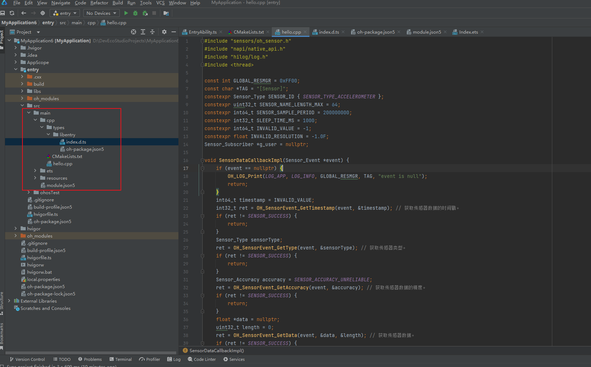

# 传感器开发指导(C/C++)


## 场景介绍

当设备需要获取传感器数据时，可以使用sensor模块，例如：通过订阅方向传感器数据感知用户设备当前的朝向，通过订阅计步传感器数据统计用户的步数等。

详细的接口介绍请参考[Sensor接口](../../reference/apis-sensor-service-kit/_sensor.md)。

## 函数说明

| 名称                                                         | 描述                                                         |
| ------------------------------------------------------------ | ------------------------------------------------------------ |
| OH_Sensor_GetInfos(Sensor_Info **infos, uint32_t *count)     | 获取设备上所有传感器的信息。                                 |
| OH_Sensor_Subscribe(const Sensor_SubscriptionId *id, const Sensor_SubscriptionAttribute *attribute, const Sensor_Subscriber *subscriber) | 订阅传感器数据。系统将以指定的频率向用户上报传感器数据。<br/>订阅加速度传感器，需要申请ohos.permission.ACCELEROMETER权限；<br/>订阅陀螺仪传感器，需要申请ohos.permission.GYROSCOPE权限；<br/>订阅计步器相关传感器时，需要申请ohos.permission.ACTIVITY_MOTION权限；<br/>订阅与健康相关的传感器时，比如心率传感器需要申请ohos.permission.READ_HEALTH_DATA权限，否则订阅失败;<br/>订阅其余传感器不需要申请权限。 |
| OH_Sensor_Unsubscribe(const Sensor_SubscriptionId *id, const Sensor_Subscriber *subscriber) | 取消订阅传感器数据。<br/>取消订阅加速度计传感器，需要申请ohos.permission.ACCELEROMETER权限； <br/>取消订阅陀螺仪传感器，需要申请ohos.permission.GYROSCOPE权限； <br/>取消订阅计步器相关传感器时，需要申请ohos.permission.ACTIVITY_MOTION权限；<br/>取消订阅与健康相关的传感器时，需要申请ohos.permission.READ_HEALTH_DATA权限，否则取消订阅失败。 <br/>取消订阅其余传感器不需要申请权限。 |
| OH_Sensor_CreateInfos(uint32_t count)                        | 用给定的数字创建一个实例数组，请参考[Sensor_Info](../../reference/apis-sensor-service-kit/_sensor.md)。 |
| OH_Sensor_DestroyInfos(Sensor_Info **sensors, uint32_t count) | 销毁实例数组并回收内存，请参考[Sensor_Info](../../reference/apis-sensor-service-kit/_sensor.md)。 |
| OH_SensorInfo_GetName(Sensor_Info *sensor, char *sensorName, uint32_t *length) | 获取传感器名称。                                             |
| OH_SensorInfo_GetVendorName(Sensor_Info* sensor, char *vendorName, uint32_t *length) | 获取传感器的厂商名称。                                       |
| OH_SensorInfo_GetType(Sensor_Info* sensor, Sensor_Type *sensorType) | 获取传感器类型。                                             |
| OH_SensorInfo_GetResolution(Sensor_Info* sensor, float *resolution) | 获取传感器分辨率。                                           |
| OH_SensorInfo_GetMinSamplingInterval(Sensor_Info* sensor, int64_t *minSamplingInterval) | 获取传感器的最小数据上报间隔。                               |
| OH_SensorInfo_GetMaxSamplingInterval(Sensor_Info* sensor, int64_t *maxSamplingInterval) | 获取传感器的最大数据上报间隔时间。                           |
| OH_SensorEvent_GetType(Sensor_Event* sensorEvent, Sensor_Type *sensorType) | 获取传感器类型。                                             |
| OH_SensorEvent_GetTimestamp(Sensor_Event* sensorEvent, int64_t *timestamp) | 获取传感器数据的时间戳。                                     |
| OH_SensorEvent_GetAccuracy(Sensor_Event* sensorEvent, Sensor_Accuracy *accuracy) | 获取传感器数据的精度。                                       |
| OH_SensorEvent_GetData(Sensor_Event* sensorEvent, float **data, uint32_t *length) | 获取传感器数据。<br/>数据的长度和内容依赖于监听的传感器类型，传感器上报的数据格式如下：<br/>1.SENSOR_TYPE_ACCELEROMETER:data[0]、data[1]、data[2]分别表示设备x、y、z轴的加速度分量，单位m/s²；<br/>2.SENSOR_TYPE_GYROSCOPE:data[0]、data[1]、data[2]分别表示设备x、y、z轴的旋转角速度，单位弧度/s；<br/>3.SENSOR_TYPE_AMBIENT_LIGHT:data[0]表示环境光强度，单位lux；从API Version 12开始，将返回两个额外的数据，其中data[1]表示色温，单位kelvin；data[2]表示红外亮度，单位cd/m²；<br/> 4.SENSOR_TYPE_MAGNETIC_FIELD:data[0]、data[1]、data[2]分别表示设备x、y、z轴的地磁分量，单位微特斯拉； <br/>5.SENSOR_TYPE_BAROMETER:data[0]表示气压值，单位hPa；<br/>6.SENSOR_TYPE_HALL:data[0]表示皮套吸合状态，0表示打开，大于0表示吸附；<br/>7.SENSOR_TYPE_PROXIMITY:data[0]表示接近状态，0表示接近，大于0表示远离；<br/>8.SENSOR_TYPE_ORIENTATION:data[0]、data[1]、data[2]分别表示设备绕z、x、y轴的角度，单位度；<br/>9.SENSOR_TYPE_GRAVITY:data[0]、data[1]、data[2]分别表示设备x、y、z轴的重力加速度分量，单位m/s²；<br/>10.SENSOR_TYPE_ROTATION_VECTOR:data[0]、data[1]、data[2]分别表示设备x、y、z轴的旋转角度，单位度，data[3]表示旋转向量元素；<br/>11.SENSOR_TYPE_PEDOMETER_DETECTION:data[0]表示计步检测状态，1表示检测到了步数变化；<br/>12.SENSOR_TYPE_PEDOMETER:data[0]表示步数；<br/>13.SENSOR_TYPE_HEART_RATE:data[0]表示心率数值。 |
| OH_Sensor_CreateSubscriptionId(void)                         | 创建一个Sensor_SubscriptionId 实例。                         |
| OH_Sensor_DestroySubscriptionId(Sensor_SubscriptionId *id)   | 销毁Sensor_SubscriptionId 实例并回收内存。                   |
| OH_SensorSubscriptionId_GetType(Sensor_SubscriptionId *id, Sensor_Type *sensorType) | 获取传感器类型。                                             |
| OH_SensorSubscriptionId_SetType(Sensor_SubscriptionId* id, const Sensor_Type sensorType) | 设置传感器类型。                                             |
| OH_Sensor_CreateSubscriptionAttribute(void)                  | 创建Sensor_SubscriptionAttribute实例。                       |
| OH_Sensor_DestroySubscriptionAttribute(Sensor_SubscriptionAttribute *attribute) | 销毁Sensor_SubscriptionAttribute实例并回收内存。             |
| OH_SensorSubscriptionAttribute_SetSamplingInterval(Sensor_SubscriptionAttribute* attribute, const int64_t samplingInterval) | 设置传感器数据上报间隔。                                     |
| OH_SensorSubscriptionAttribute_GetSamplingInterval(Sensor_SubscriptionAttribute* attribute, int64_t *samplingInterval) | 获取传感器数据上报间隔。                                     |
| OH_Sensor_CreateSubscriber(void)                             | 创建一个Sensor_Subscriber实例。                              |
| OH_Sensor_DestroySubscriber(Sensor_Subscriber *subscriber)   | 销毁Sensor_Subscriber实例并回收内存。                        |
| OH_SensorSubscriber_SetCallback(Sensor_Subscriber* subscriber, const Sensor_EventCallback callback) | 设置一个回调函数来上报传感器数据。                           |
| OH_SensorSubscriber_GetCallback(Sensor_Subscriber* subscriber, Sensor_EventCallback *callback) | 获取用于上报传感器数据的回调函数。                           |


## 开发步骤

开发步骤以加速度传感器为例。

1. 新建一个Native C++工程。

   

2. 检查是否已经配置相应权限，具体配置方式请参考[声明权限](../../security/AccessToken/declare-permissions.md)。

   ```json
   "requestPermissions": [
         {
           "name": "ohos.permission.ACCELEROMETER",
         },
       ]
   ```

3. CMakeLists.txt文件中引入动态依赖库。

   ```c
   target_link_libraries(entry PUBLIC libace_napi.z.so)
   target_link_libraries(entry PUBLIC libhilog_ndk.z.so)
   target_link_libraries(entry PUBLIC libohsensor.so)
   ```

4. 导入模块。

   ```c
   #include "sensors/oh_sensor.h"
   #include "napi/native_api.h"
   #include "hilog/log.h"
   #include <thread>
   ```

5. 定义常量。

   ```c
   const int GLOBAL_RESMGR = 0xFF00;
   const char *TAG = "[Sensor]";
   constexpr Sensor_Type SENSOR_ID { SENSOR_TYPE_ACCELEROMETER };
   constexpr uint32_t SENSOR_NAME_LENGTH_MAX = 64;
   constexpr int64_t SENSOR_SAMPLE_PERIOD = 200000000;
   constexpr int32_t SLEEP_TIME_MS = 1000;
   constexpr int64_t INVALID_VALUE = -1;
   constexpr float INVALID_RESOLUTION = -1.0F;
   Sensor_Subscriber *g_user = nullptr;
   ```

6. 定义一个回调函数用来接收传感器数据。

   ```c
   void SensorDataCallbackImpl(Sensor_Event *event) {
       if (event == nullptr) {
           OH_LOG_Print(LOG_APP, LOG_INFO, GLOBAL_RESMGR, TAG, "event is null");
           return;
       }
       int64_t timestamp = INVALID_VALUE;
       int32_t ret = OH_SensorEvent_GetTimestamp(event, &timestamp); // 获取传感器数据的时间戳。
       if (ret != SENSOR_SUCCESS) {
           return;
       }
       Sensor_Type sensorType;
       ret = OH_SensorEvent_GetType(event, &sensorType); // 获取传感器类型。
       if (ret != SENSOR_SUCCESS) {
           return;
       }
       Sensor_Accuracy accuracy = SENSOR_ACCURACY_UNRELIABLE;
       ret = OH_SensorEvent_GetAccuracy(event, &accuracy); // 获取传感器数据的精度。
       if (ret != SENSOR_SUCCESS) {
           return;
       }
       float *data = nullptr;
       uint32_t length = 0;
       ret = OH_SensorEvent_GetData(event, &data, &length); // 获取传感器数据。
       if (ret != SENSOR_SUCCESS) {
           return;
       }
       OH_LOG_Print(LOG_APP, LOG_INFO, GLOBAL_RESMGR, TAG, "sensorType:%{public}d, dataLen:%{public}d, accuracy:%{public}d", sensorType, length, accuracy);
       for (uint32_t i = 0; i < length; ++i) {
           OH_LOG_Print(LOG_APP, LOG_INFO, GLOBAL_RESMGR, TAG, "data[%{public}d]:%{public}f", i, data[i]);
       }
   }
   ```

7. 获取设备上所有传感器的信息。  

   ```c
   static napi_value GetSensorInfos(napi_env env, napi_callback_info info)
   {
       uint32_t count = 0;
       int32_t ret = OH_Sensor_GetInfos(nullptr, &count); // 获取设备上所有传感器的个数。 
       if (ret != SENSOR_SUCCESS) {
           return nullptr;
       }
       Sensor_Info **sensors = OH_Sensor_CreateInfos(count); // 用给定的数字创建一个实例数组。
       if (ret != SENSOR_SUCCESS) {
           return nullptr;
       }        
       ret = OH_Sensor_GetInfos(sensors, &count); // 获取设备上所有传感器的信息。 
       if (ret != SENSOR_SUCCESS) {
           return nullptr;
       }
       for (uint32_t i = 0; i < count; ++i) {
           char sensorName[SENSOR_NAME_LENGTH_MAX] = {};
           uint32_t length = SENSOR_NAME_LENGTH_MAX;
           ret = OH_SensorInfo_GetName(sensors[i], sensorName, &length); // 获取传感器名称。
           if (ret != SENSOR_SUCCESS) {
               return nullptr;
           }
           char vendorName[SENSOR_NAME_LENGTH_MAX] = {};
           length = SENSOR_NAME_LENGTH_MAX;
           ret = OH_SensorInfo_GetVendorName(sensors[i], vendorName, &length); // 获取传感器的厂商名称。
           if (ret != SENSOR_SUCCESS) {
               return nullptr;
           }
           Sensor_Type sensorType;
           ret = OH_SensorInfo_GetType(sensors[i], &sensorType); // 获取传感器类型。
           if (ret != SENSOR_SUCCESS) {
               return nullptr;
           }
           float resolution = INVALID_RESOLUTION;
           ret = OH_SensorInfo_GetResolution(sensors[i], &resolution); // 获取传感器分辨率。
           if (ret != SENSOR_SUCCESS) {
               return nullptr;
           }
           int64_t minSamplePeriod = INVALID_VALUE;
           ret = OH_SensorInfo_GetMinSamplingInterval(sensors[i], &minSamplePeriod); // 获取传感器的最小数据上报间隔。
           if (ret != SENSOR_SUCCESS) {
               return nullptr;
           }
           int64_t maxSamplePeriod = INVALID_VALUE;
           ret = OH_SensorInfo_GetMaxSamplingInterval(sensors[i], &maxSamplePeriod); // 获取传感器的最大数据上报间隔时间。
           if (ret != SENSOR_SUCCESS) {
               return nullptr;
           }
       }
       OH_LOG_Print(LOG_APP, LOG_INFO, GLOBAL_RESMGR, TAG, "GetSensorInfos sucessful");
       ret = OH_Sensor_DestroyInfos(sensors, count); // 销毁实例数组并回收内存。
       if (ret != SENSOR_SUCCESS) {
           return nullptr;
       }
   }
   ```

8. 订阅和取消订阅传感器数据。

   ```c
   static napi_value Subscriber(napi_env env, napi_callback_info info)
   {
       g_user = OH_Sensor_CreateSubscriber();                                         // 创建一个Sensor_Subscriber实例。
       int32_t ret = OH_SensorSubscriber_SetCallback(g_user, SensorDataCallbackImpl); // 设置一个回调函数来报告传感器数据。
       if (ret != SENSOR_SUCCESS) {
           return nullptr;
       }
   
       Sensor_SubscriptionId *id = OH_Sensor_CreateSubscriptionId(); // 创建一个Sensor_SubscriptionId实例。
       ret = OH_SensorSubscriptionId_SetType(id, SENSOR_ID);         // 设置传感器类型。
       if (ret != SENSOR_SUCCESS) {
           return nullptr;
       }
   
       Sensor_SubscriptionAttribute *attr = OH_Sensor_CreateSubscriptionAttribute();     // 创建Sensor_SubscriptionAttribute实例。
       ret = OH_SensorSubscriptionAttribute_SetSamplingInterval(attr, SENSOR_SAMPLE_PERIOD); // 设置传感器数据报告间隔。
       if (ret != SENSOR_SUCCESS) {
           return nullptr;
       }
   
       ret = OH_Sensor_Subscribe(id, attr, g_user); // 订阅传感器数据。
       if (ret != SENSOR_SUCCESS) {
           return nullptr;
       }
       OH_LOG_Print(LOG_APP, LOG_INFO, GLOBAL_RESMGR, TAG, "Subscriber successful");
       std::this_thread::sleep_for(std::chrono::milliseconds(SLEEP_TIME_MS));
       ret = OH_Sensor_Unsubscribe(id, g_user); // 取消订阅传感器数据。
       if (ret != SENSOR_SUCCESS) {
           return nullptr;
       }
       if (id != nullptr) {
           OH_Sensor_DestroySubscriptionId(id); // 销毁Sensor_SubscriptionId实例并回收内存。
       }
       if (attr != nullptr) {
           OH_Sensor_DestroySubscriptionAttribute(attr); // 销毁Sensor_SubscriptionAttribute实例并回收内存。
       }
       if (g_user != nullptr) {
           OH_Sensor_DestroySubscriber(g_user); // 销毁Sensor_Subscriber实例并回收内存。
           g_user = nullptr;
       }
   }
   ```
   
9. 在types/libentry路径下index.d.ts文件中引入Napi接口。

   ```c
   export const getSensorInfos: () => number;
   export const subscriber: () => number;
   ```

10. 编写Js用例调用接口。
