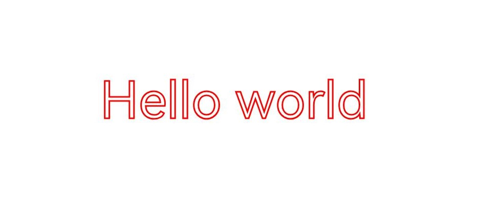

# 字块绘制（ArkTS）


## 场景介绍

字块（TextBlob）是指文本的集合。无论是单个的文字还是大块的文本，都可以通过字块来绘制。

本节聚焦于文字的绘制效果，更多关于文本测量、排版的场景指导，可见[文本开发概述](text-overview.md)。

除了基本的字块绘制之外，还可以给文字添加各种绘制效果。常见的字块绘制场景包括[文字描边](#文字描边)、[文字渐变](#文字渐变)等，更多效果请见[绘制效果](drawing-effect-overview.md)。

## 基本字块绘制

Canvas通过drawTextBlob()来绘制字块。函数接受三个参数：TextBlob字块对象，以及文字基线左端点的x坐标和y坐标。

画布Canvas对象具体可见[画布的获取与绘制结果的显示（ArkTS）](canvas-get-result-draw-arkts.md)。

字块对象可以通过多种方式创建得到，详细的字块创建方式和接口使用请参考[TextBlob](../reference/apis-arkgraphics2d/js-apis-graphics-drawing.md#textblob)。

此处以使用makeFromString()接口创建字块为例，接口接受3个参数，分别为：

- 需要显示的字符串text。

- font字型对象。其中font用于设置和获取字体的各种属性，如字体大小、文本样式、字体对齐方式、字体渲染方式、字体描边方式等，详细的API介绍请参考[Font](../reference/apis-arkgraphics2d/js-apis-graphics-drawing.md#font)。

- 文本编码方式。当前支持的文本编码方式如下：
  - TEXT_ENCODING_UTF8：使用1个字节表示UTF-8或ASCII；
  - TEXT_ENCODING_UTF16：使用2个字节表示大部分unicode；
  - TEXT_ENCODING_UTF32：使用4个字节表示全部unicode；
  - TEXT_ENCODING_GLYPH_ID：使用2个字节表示glyph index。

基本效果的示例代码和效果图如下：

```ts
// 创建字型对象
const font = new drawing.Font();
// 设置字体大小
font.setSize(100);
// 创建字块对象
const textBlob = drawing.TextBlob.makeFromString("Hello world", font, drawing.TextEncoding.TEXT_ENCODING_UTF8);
// 绘制字块
canvas.drawTextBlob(textBlob, 200, 300);
```


## 文字描边

基于基本的字块绘制，还可以通过画笔实现文字描边效果，描边效果的更多介绍请参考[描边效果](basic-drawing-effect-arkts.md#描边效果)。

文字描边的简要示例和示意图如下：

```ts
// 创建画笔
let pen = new drawing.Pen();
// 设置抗锯齿
pen.setAntiAlias(true);
// 设置描边线宽
pen.setStrokeWidth(3.0);
// 设置描边颜色
pen.setColor(0xFF, 0xFF,  0x00, 0x00);
// 创建字型对象
const font = new drawing.Font();
// 设置字体大小
font.setSize(100);
// 添加画笔描边效果
canvas.attachPen(pen);
// 创建字块对象
const textBlob = drawing.TextBlob.makeFromString("Hello world", font, drawing.TextEncoding.TEXT_ENCODING_UTF8);
// 绘制字块
canvas.drawTextBlob(textBlob, 200, 300);
// 去除描边效果
canvas.detachPen();
```



## 文字渐变

基于基本字块绘制，还可以通过着色器实现文字渐变的效果，着色器的更多介绍请参考[着色器效果](complex-drawing-effect-arkts.md#着色器效果)。

以下为文字添加了线性渐变着色器效果的简要示例和示意图：

```ts
let startPt: common2D.Point = { x: 100, y: 100 };
let endPt: common2D.Point = { x: 900, y: 900 };
let colors = [0xFFFFFF00, 0xFFFF0000, 0xFF0000FF];
// 创建线性渐变着色器
let shaderEffect = drawing.ShaderEffect.createLinearGradient(startPt, endPt, colors, drawing.TileMode.CLAMP);
// 创建画刷
let brush = new drawing.Brush();
// 设置着色器
brush.setShaderEffect(shaderEffect);
// 添加画刷填充效果
canvas.attachBrush(brush);
// 创建字型
const font = new drawing.Font();
// 设置字体大小
font.setSize(200);
// 创建字块
const textBlob = drawing.TextBlob.makeFromString("Hello world", font, drawing.TextEncoding.TEXT_ENCODING_UTF8);
// 绘制字块
canvas.drawTextBlob(textBlob, 100, 300);
// 去除填充效果
canvas.detachBrush();
```


<!--RP1-->
## 相关实例

针对Drawing(ArkTS)的开发，有以下相关实例可供参考：

- [ArkTSGraphicsDraw (API14)](https://gitee.com/openharmony/applications_app_samples/tree/master/code/DocsSample/Drawing/ArkTSGraphicsDraw)
<!--RP1End-->