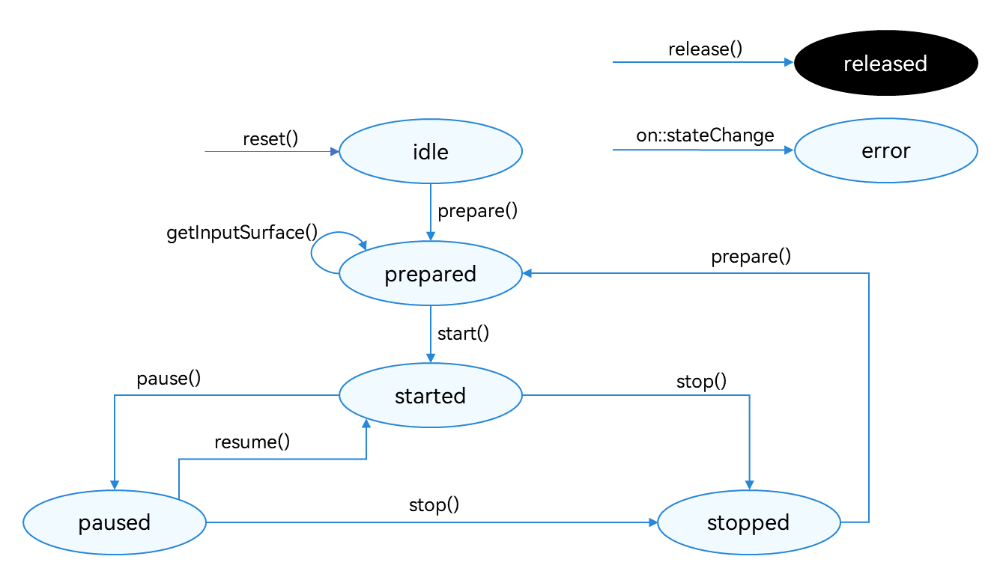

# 使用AVRecorder录制音频(ArkTS)

使用[AVRecorder](media-kit-intro.md#avrecorder)可以实现音频录制功能，本开发指导将以“开始录制-暂停录制-恢复录制-停止录制”的一次流程为示例，向开发者讲解AVRecorder音频录制相关功能。

在进行应用开发的过程中，开发者可以通过AVRecorder的state属性，主动获取当前状态或使用on('stateChange')方法监听状态变化。开发过程中应该严格遵循状态机要求，例如只能在started状态下调用pause()接口，只能在paused状态下调用resume()接口。

**图1** 录制状态变化示意图



状态的详细说明请参考[AVRecorderState](../../reference/apis-media-kit/arkts-apis-media-t.md#avrecorderstate9)。

## 申请权限

在开发此功能前，开发者应根据实际需求申请相关权限：

- 当需要使用麦克风时，需要申请**ohos.permission.MICROPHONE**麦克风权限。申请方式请参考：[向用户申请授权](../../security/AccessToken/request-user-authorization.md)。
- 当需要读取和保存音频文件时，请优先使用[AudioViewPicker音频选择器对象](../../reference/apis-core-file-kit/js-apis-file-picker.md#audioviewpicker)。

> **说明：**
>
> 仅应用需要克隆、备份或同步用户公共目录的音频类文件时，可申请ohos.permission.READ_AUDIO、ohos.permission.WRITE_AUDIO权限来读写音频文件，申请方式请参考<!--RP1-->[申请受控权限](../../security/AccessToken/declare-permissions-in-acl.md)<!--RP1End-->。


## 开发步骤及注意事项

详细的API说明请参考[AVRecorder API参考](../../reference/apis-media-kit/arkts-apis-media-AVRecorder.md)。

1. 创建AVRecorder实例，实例创建完成进入idle状态。

   > **说明：**
   >
   > 需要在avRecorder完成赋值（即“avRecorder = recorder; ”运行完成）后，再进行剩余操作。

   ```ts
   import { media } from '@kit.MediaKit';
   import { BusinessError } from '@kit.BasicServicesKit';

   let avRecorder: media.AVRecorder;
   media.createAVRecorder().then((recorder: media.AVRecorder) => {
     avRecorder = recorder;
   }, (error: BusinessError) => {
     console.error(`createAVRecorder failed`);
   })
   ```

2. 设置业务需要的监听事件，监听状态变化及错误上报。
   | 事件类型 | 说明 |
   | -------- | -------- |
   | stateChange | 必要事件，监听AVRecorder的state属性改变。 |
   | error | 必要事件，监听AVRecorder的错误信息。 |

   ```ts
   import { BusinessError } from '@kit.BasicServicesKit';

   // 状态上报回调函数。
   this.avRecorder.on('stateChange', (state: media.AVRecorderState, reason: media.StateChangeReason) => {
     console.log(`current state is ${state}`);
     // 用户可以在此补充状态发生切换后想要进行的动作。
   })

   // 错误上报回调函数。
   this.avRecorder.on('error', (err: BusinessError) => {
     console.error(`avRecorder failed, code is ${err.code}, message is ${err.message}`);
   })
   ```

3. 配置音频录制参数，调用prepare()接口，此时进入prepared状态。

   > **说明：**
   > 配置参数需要注意：
   >
   > - 配置参数之前需要确保完成对应权限的申请，请参考[申请权限](#申请权限)。
   >
   > - prepare接口的入参avConfig中仅设置音频相关的配置参数，如示例代码所示。
   >   如果只需要录制音频，请不要设置视频相关配置参数；如果需要录制视频，可以参考[视频录制开发指导](video-recording.md)进行开发。直接设置视频相关参数会导致后续步骤报错。
   > - 需要使用支持的[录制规格](media-kit-intro.md#支持的格式)，具体录制参数需严格契合既定的[录制参数配置](../../reference/apis-media-kit/arkts-apis-media-i.md#avrecorderprofile9)。
   > - 录制输出的url地址（即示例里avConfig中的url），形式为fd://xx (fd number)。需要基础文件操作接口（[Core File Kit的ohos.file.fs](../../reference/apis-core-file-kit/js-apis-file-fs.md)）实现应用文件访问能力，获取方式参考[应用文件访问与管理](../../file-management/app-file-access.md)。

   ```ts
   import { media } from '@kit.MediaKit';
   import { BusinessError } from '@kit.BasicServicesKit';
   import { fileIo as fs } from '@kit.CoreFileKit';

   let avProfile: media.AVRecorderProfile = {
     audioBitrate: 112000, // 音频比特率。
     audioChannels: 2, // 音频声道数。
     audioCodec: media.CodecMimeType.AUDIO_AAC, // 音频编码格式，当前支持ACC，MP3，G711MU。
     audioSampleRate: 48000, // 音频采样率。
     fileFormat: media.ContainerFormatType.CFT_MPEG_4A, // 封装格式，当前支持MP4，M4A，MP3，WAV，AMR，AAC。
   };
   
   const context: Context = this.getUIContext().getHostContext()!; // 参考应用文件访问与管理。
   let filePath: string = context.filesDir + '/example.mp3';
   let audioFile: fs.File = fs.openSync(filePath, fs.OpenMode.READ_WRITE | fs.OpenMode.CREATE);
   let fileFd: number = this.audioFile.fd; // 获取文件fd。
    
   let avConfig: media.AVRecorderConfig = {
     audioSourceType: media.AudioSourceType.AUDIO_SOURCE_TYPE_MIC, // 音频输入源，这里设置为麦克风。
     profile: avProfile,
     url: 'fd://' + fileFd.toString(), // 参考应用文件访问与管理中的开发示例获取创建的音频文件fd填入此处。
   };
    
   this.avRecorder.prepare(avConfig).then(() => {
     console.log('Invoke prepare succeeded.');
   }, (err: BusinessError) => {
     console.error(`Invoke prepare failed, code is ${err.code}, message is ${err.message}`);
   })
   ```

4. 开始录制，调用start()接口，此时进入started状态。

   ```ts
   // 开始录制。
   avRecorder.start();
   ```

5. 暂停录制，调用pause()接口，此时进入paused状态。

   ```ts
   // 暂停录制。
   avRecorder.pause();
   ```

6. 恢复录制，调用resume()接口，此时再次进入started状态。

   ```ts
   // 恢复录制。
   avRecorder.resume();
   ```

7. 停止录制，调用stop()接口，此时进入stopped状态。

   ```ts
   // 停止录制。
   avRecorder.stop();
   ```

8. 重置资源，调用reset()重新进入idle状态，允许重新配置录制参数。

   ```ts
   // 重置资源。
   avRecorder.reset();
   ```

9. 销毁实例，调用release()进入released状态，退出录制。

   ```ts
   // 销毁实例。
   avRecorder.release();
   ```

## 完整示例

  参考以下示例，完成“开始录制-暂停录制-恢复录制-停止录制”的完整流程。

```ts
import { media } from '@kit.MediaKit';
import { BusinessError } from '@kit.BasicServicesKit';
import { fileIo as fs } from '@kit.CoreFileKit';

export class AudioRecorderDemo extends CustomComponent {
  private avRecorder: media.AVRecorder | undefined = undefined;
  private avProfile: media.AVRecorderProfile = {
    audioBitrate: 112000, // 音频比特率。
    audioChannels: 2, // 音频声道数。
    audioCodec: media.CodecMimeType.AUDIO_AAC, // 音频编码格式，当前支持ACC，MP3，G711MU。
    audioSampleRate: 48000, // 音频采样率。
    fileFormat: media.ContainerFormatType.CFT_MPEG_4A, // 封装格式，当前支持MP4，M4A，MP3，WAV，AMR，AAC。
  };
  private avConfig: media.AVRecorderConfig = {
    audioSourceType: media.AudioSourceType.AUDIO_SOURCE_TYPE_MIC, // 音频输入源，这里设置为麦克风。
    profile: this.avProfile,
    url: 'fd://35', // 参考应用文件访问与管理开发示例新建并读写一个文件。
  };
  private uriPath: string = '';
  private filePath: string = '';
  private fileFd: number = 0;
  
  // 创建文件以及设置avConfig.url。
  async createAndSetFd(): Promise<void> {
      const context: Context = this.getUIContext().getHostContext()!; // 非空断言，Context类型且非空
      const path: string = context.filesDir + '/example.mp3'; // 文件沙箱路径，文件后缀名应与封装格式对应。
      const audioFile: fs.File = fs.openSync(path, fs.OpenMode.READ_WRITE | fs.OpenMode.CREATE);
      this.avConfig.url = 'fd://' + audioFile.fd; // 更新url。
      this.fileFd = audioFile.fd;
      this.filePath = path;
  }

  // 注册audioRecorder回调函数。
  setAudioRecorderCallback() {
    if (this.avRecorder != undefined) {
      // 状态机变化回调函数。
      this.avRecorder.on('stateChange', (state: media.AVRecorderState, reason: media.StateChangeReason) => {
        console.log(`AudioRecorder current state is ${state}`);
      })
      // 错误上报回调函数。
      this.avRecorder.on('error', (err: BusinessError) => {
        console.error(`AudioRecorder failed, code is ${err.code}, message is ${err.message}`);
      })
    }
  }

  // 开始录制对应的流程。
  async startRecordingProcess() {
    if (this.avRecorder != undefined) {
      await this.avRecorder.release();
      this.avRecorder = undefined;
    }
    // 1.创建录制实例。
    this.avRecorder = await media.createAVRecorder();
    this.setAudioRecorderCallback();
    // 2.获取录制文件fd赋予avConfig里的url；参考FilePicker文档。
    this.createAndSetFd();

    // 3.配置录制参数完成准备工作。
    await this.avRecorder.prepare(this.avConfig);
    // 4.开始录制。
    await this.avRecorder.start();
  }

  // 暂停录制对应的流程。
  async pauseRecordingProcess() {
    if (this.avRecorder != undefined && this.avRecorder.state === 'started') { // 仅在started状态下调用pause为合理状态切换。
      await this.avRecorder.pause();
    }
  }

  // 恢复录制对应的流程。
  async resumeRecordingProcess() {
    if (this.avRecorder != undefined && this.avRecorder.state === 'paused') { // 仅在paused状态下调用resume为合理状态切换。
      await this.avRecorder.resume();
    }
  }

  // 停止录制对应的流程。
  async stopRecordingProcess() {
    if (this.avRecorder != undefined) {
      // 1. 停止录制。
      if (this.avRecorder.state === 'started'
        || this.avRecorder.state === 'paused') { // 仅在started或者paused状态下调用stop为合理状态切换。
        await this.avRecorder.stop();
      }
      // 2.重置。
      await this.avRecorder.reset();
      // 3.释放录制实例。
      await this.avRecorder.release();
      this.avRecorder = undefined;
      // 4.关闭录制文件fd。
      await fs.close(this.fileFd);
    }
  }

  // 一个完整的【开始录制-暂停录制-恢复录制-停止录制】示例。
  async audioRecorderDemo() {
    await this.startRecordingProcess(); // 开始录制。
    // 用户此处可以自行设置录制时长，例如通过设置休眠阻止代码执行。
    await this.pauseRecordingProcess(); //暂停录制。
    await this.resumeRecordingProcess(); // 恢复录制。
    await this.stopRecordingProcess(); // 停止录制。
  }
}
```
