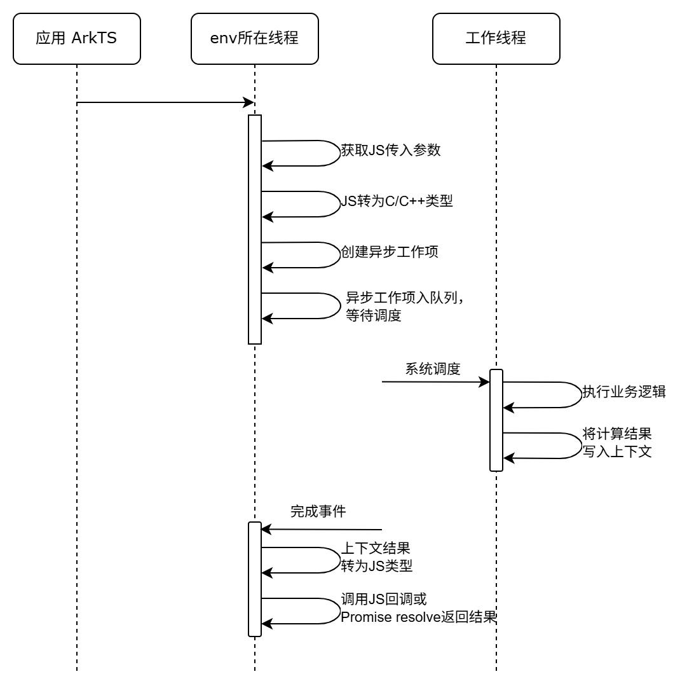
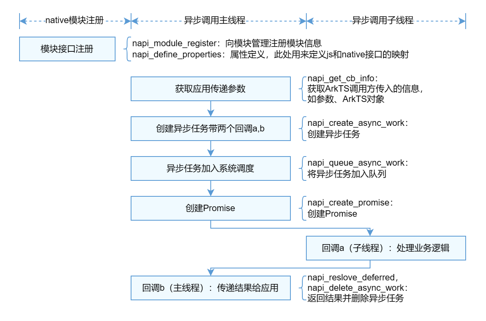
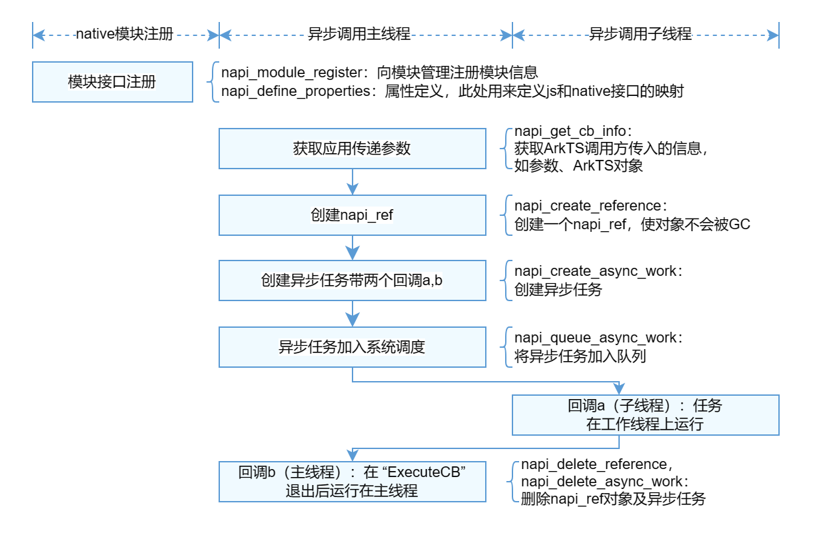

# 使用Node-API接口进行异步任务开发

## 场景介绍

[napi_create_async_work](../reference/native-lib/napi.md#napi_create_async_work)是Node-API接口之一，用于创建一个异步工作对象。可以在需要执行耗时操作的场景中使用，以避免阻塞env所在的ArkTS线程，确保应用程序的性能和响应性能。例如以下场景：

- 文件操作：读取大型文件或执行复杂的文件操作时，可以使用异步工作对象来避免阻塞env所在的ArkTS线程。

- 网络请求：当需要进行网络请求并等待响应时，使用异步工作对象可以确保主线程不被阻塞，从而提高应用程序的响应性能。

- 数据库操作：当需要执行复杂的数据库查询或写入操作时，使用异步工作对象可以确保主线程不被阻塞，从而提高应用程序的并发性能。

- 图像处理：当需要对大型图像进行处理或执行复杂的图像算法时，使用异步工作对象可以确保主线程不被阻塞，从而提高应用程序的实时性能。

napi_queue_async_work接口底层使用了uv_queue_work能力，并对回调中的napi_value的生命周期管理进行了兜底。

异步调用支持callback方式和Promise方式，使用哪种方式由应用开发者决定。下面为两种方式的示例代码：



## 使用Promise方式示例



1. 使用napi_create_async_work创建异步任务，并使用napi_queue_async_work将异步任务加入队列，等待执行。

   ```cpp
   // 调用方提供的data context，该数据会传递给execute和complete函数
   struct CallbackData {
       napi_async_work asyncWork = nullptr;
       napi_deferred deferred = nullptr;
       napi_ref callback = nullptr;
       double args = 0;
       double result = 0;
   };

   static napi_value AsyncWork(napi_env env, napi_callback_info info)
   {
      size_t argc = 1;
      napi_value args[1];
      napi_get_cb_info(env, info, &argc, args, nullptr, nullptr);

      napi_value promise = nullptr;
      napi_deferred deferred = nullptr;
      napi_create_promise(env, &deferred, &promise);

      auto callbackData = new CallbackData();
      callbackData->deferred = deferred;
      napi_get_value_double(env, args[0], &callbackData->args);

      napi_value resourceName = nullptr;
      napi_create_string_utf8(env, "AsyncCallback", NAPI_AUTO_LENGTH, &resourceName);
      // 创建异步任务
      napi_create_async_work(env, nullptr, resourceName, ExecuteCB, CompleteCB, callbackData, &callbackData->asyncWork);
      // 将异步任务加入队列
      napi_queue_async_work(env, callbackData->asyncWork);

      return promise;
   }
   ```

2. 定义异步任务的第一个回调函数，该函数在工作线程中执行，处理具体的业务逻辑。

   ```cpp
   static void ExecuteCB(napi_env env, void *data)
   {
       CallbackData *callbackData = reinterpret_cast<CallbackData *>(data);
       callbackData->result = callbackData->args;
   }
   ```

3. 定义异步任务的第二个回调函数，该函数在主线程执行，将结果传递给ArkTS侧。

   ```cpp
   static void CompleteCB(napi_env env, napi_status status, void *data)
   {
       CallbackData *callbackData = reinterpret_cast<CallbackData *>(data);
       napi_value result = nullptr;
       napi_create_double(env, callbackData->result, &result);
       if (callbackData->result > 0) {
           napi_resolve_deferred(env, callbackData->deferred, result);
       } else {
           napi_reject_deferred(env, callbackData->deferred, result);
       }

       napi_delete_async_work(env, callbackData->asyncWork);
       delete callbackData;
       callbackData = nullptr;
   }
   ```

4. 模块初始化以及ArkTS侧调用接口。

   ```cpp
   // 模块初始化
   static napi_value Init(napi_env env, napi_value exports)
   {
       napi_property_descriptor desc[] = {
           { "asyncWork", nullptr, AsyncWork, nullptr, nullptr, nullptr, napi_default, nullptr }
       };
       napi_define_properties(env, exports, sizeof(desc) / sizeof(desc[0]), desc);
       return exports;
   }
    ```

    ```ts
   // 接口对应的.d.ts描述
   export const asyncWork: (data: number) => Promise<number>;

   // ArkTS侧调用接口
   nativeModule.asyncWork(1024).then((result) => {
       hilog.info(0x0000, 'XXX', 'result is %{public}d', result);
   });
   ```
   运行结果：result is 1024

## 使用callback方式示例



1. 使用napi_create_async_work创建异步任务，并使用napi_queue_async_work将异步任务加入队列，等待执行。

   ```cpp
   static constexpr int INT_ARG_2 = 2; // 入参索引

   // 调用方提供的data context，该数据会传递给execute和complete函数
   struct CallbackData {
       napi_async_work asyncWork = nullptr;
       napi_ref callbackRef = nullptr;
       double args[2] = {0};
       double result = 0;
   };

   napi_value AsyncWork(napi_env env, napi_callback_info info)
   {
       size_t argc = 3;
       napi_value args[3];
       napi_get_cb_info(env, info, &argc, args, nullptr, nullptr);
       auto asyncContext = new CallbackData();
       // 将接收到的参数保存到callbackData
       napi_get_value_double(env, args[0], &asyncContext->args[0]);
       napi_get_value_double(env, args[1], &asyncContext->args[1]);
       // 将传入的callback转换为napi_ref延长其生命周期，防止被GC掉
       napi_create_reference(env, args[INT_ARG_2], 1, &asyncContext->callbackRef);
       napi_value resourceName = nullptr;
       napi_create_string_utf8(env, "asyncWorkCallback", NAPI_AUTO_LENGTH, &resourceName);
       // 创建异步任务
       napi_create_async_work(env, nullptr, resourceName, ExecuteCB, CompleteCB,
                              asyncContext, &asyncContext->asyncWork);
       // 将异步任务加入队列
       napi_queue_async_work(env, asyncContext->asyncWork);
       return nullptr;
   }
   ```

2. 定义异步任务的第一个回调函数，该函数在工作线程中执行，处理具体的业务逻辑。

   ```cpp
   static void ExecuteCB(napi_env env, void *data)
   {
       CallbackData *callbackData = reinterpret_cast<CallbackData *>(data);
       callbackData->result = callbackData->args[0] + callbackData->args[1];
   }
   ```

3. 定义异步任务的第二个回调函数，该函数在主线程执行，将结果传递给ArkTS侧。

   ```cpp
   static void CompleteCB(napi_env env, napi_status status, void *data)
   {
       CallbackData *callbackData = reinterpret_cast<CallbackData *>(data);
       napi_value callbackArg[1] = {nullptr};
       napi_create_double(env, callbackData->result, &callbackArg[0]);
       napi_value callback = nullptr;
       napi_get_reference_value(env, callbackData->callbackRef, &callback);
       // 执行回调函数
       napi_value result;
       napi_value undefined;
       napi_get_undefined(env, &undefined);
       napi_call_function(env, undefined, callback, 1, callbackArg, &result);
       // 删除napi_ref对象以及异步任务
       napi_delete_reference(env, callbackData->callbackRef);
       napi_delete_async_work(env, callbackData->asyncWork);
       delete callbackData;
       callbackData = nullptr;
   }
   ```

4. 模块初始化以及ArkTS侧调用接口。

   ```cpp
   // 模块初始化
   static napi_value Init(napi_env env, napi_value exports)
   {
       napi_property_descriptor desc[] = {
           { "asyncWork", nullptr, AsyncWork, nullptr, nullptr, nullptr, napi_default, nullptr }
       };
       napi_define_properties(env, exports, sizeof(desc) / sizeof(desc[0]), desc);
       return exports;
   }
   ```

   ```ts
   // 接口对应的.d.ts描述
   export const asyncWork: (arg1: number, arg2: number, callback: (result: number) => void) => void;

   // ArkTS侧调用接口
   let num1: number = 123;
   let num2: number = 456;
   nativeModule.asyncWork(num1, num2, (result) => {
       hilog.info(0x0000, 'XXX', 'result is %{public}d', result);
   });
   ```
   运行结果：result is 579

## 注意事项
- 调用napi_cancel_async_work接口，无论底层uv是否失败都会返回napi_ok。若因为底层uv导致取消任务失败，complete callback中的status会传入对应错误值，请在complete callback中对status进行处理。
- NAPI的异步工作项（napi_async_work）建议单次使用。napi_queue_async_work后，该napi_async_work需在complete回调执行时或执行后，通过napi_delete_async_work完成释放。同一个napi_async_work只允许释放一次，尝试重复释放会导致未定义行为。
