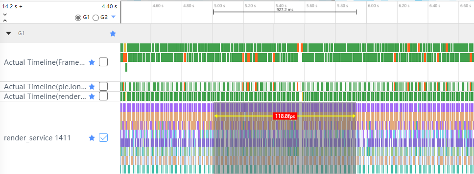
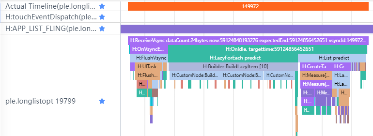
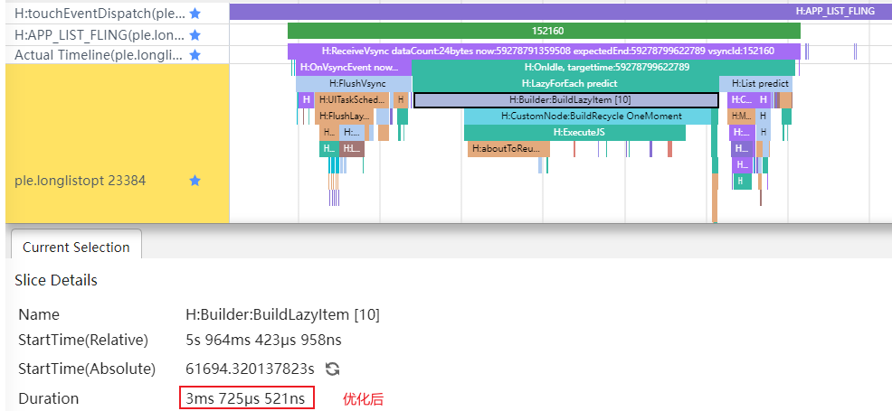
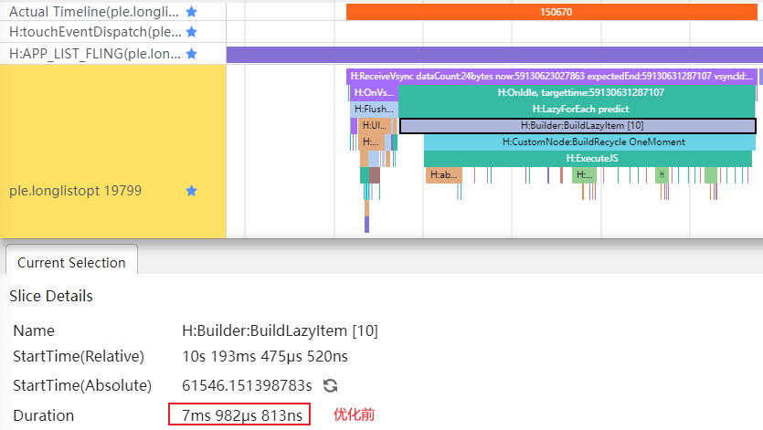

# 应用滑动场景帧率问题分析实践

## 概述

当应用在运行时出现明显的延迟或不流畅的情况，会影响用户体验，开发者需要定位、分析、解决应用超长帧问题。本文先简单介绍应用流畅度评测指标，然后基于Trace数据，介绍超长帧问题分析思路，并结合案例实践，实操定位分析并优化卡顿问题。

本文主要是以Trace数据作为切入点进行分析，相应的工具可以使用SmartPerf Host或DevEco Stdio内置的Frame等。若开发者需要补充SmartPerf Host工具和Trace相关知识，可以分别参考《[性能优化工具SmartPerf-Host](https://docs.openharmony.cn/pages/v4.1/zh-cn/application-dev/performance/performance-optimization-using-smartperf-host.md)》和《[常用trace使用指导](https://docs.openharmony.cn/pages/v4.1/zh-cn/application-dev/performance/common-trace-using-instructions.md)》等应用开发文档。


## 流畅评测指标

应用运行时的流畅度，涉及人因要素，不完全等同于应用系统性能。可以从如下几个指标进行衡量。

**响应时延**

响应时延是用户操作移动终端时，从输入触控指令到系统开始将输出信息反馈到触控屏上的时间。响应时延分为点击响应时延和滑动响应时延。

- 点击响应时延：指用户在点击某个按钮或链接后，系统响应并显示相应内容所花费的时间。
- 滑动响应时延：指用户在滑动页面或应用时，系统响应并更新内容所花费的时间。

**丢帧率**

丢帧率是衡量动效过程中界面刷新的平均丢帧比例。

**完成时延**

完成时延指从页面加载开始到应用所有占位符加载完成所需要的时间。针对启动场景，又可以分为冷启动和热启动完成时延。

- 冷启动：当启动应用时，后台没有该应用的进程；这时系统会重新创建一个新的进程分配给该应用，然后再根据启动的参数，启动对应的进程组件。
- 热启动：当启动应用时，后台已有该应用的进程；这时系统会从已有的进程中来启动对应的进程组件。


## 分析思路

针对应用运行时出现明显的延迟或不流畅，或者流畅评测指标未达预期的情况，可以从如下思路切入，分析卡顿问题。

### 信息准备

- 确定问题现象

  用户环境版本、数据量是怎样？用户做了什么操作？是否可以本地复现？复现概率如何？

- 抓取所需日志信息

  HiTrace、HiPerf、cpuProfiler、常规log等各类可观测数据。

### 问题分析

导致应用超长帧的原因非常多，可能是应用本身原因，可能是系统原因，也有可能是硬件层原因。不同卡顿原因在Trace中有不同表现，识别需要大量经验积累。

分析过程，主要是结合App主进程和RenderService渲染进程Trace数据，先排查系统、硬件是否异常，再分析应用本身原因。

1. 看线程状态和运行核，看是否被其他进程抢占资源，排除系统侧运行异常。
2. 找到Trace中每一帧耗时部分，大致定位是App侧问题还是RS侧问题，并结合Trace标签，初步定位原因。
3. 结合cpuProfiler查看ArkTS函数调用栈信息，或其他日志信息，排查应用代码。

### 解决方案

关于应用流畅度优化，定位应用代码后，开发者可以尝试从如下几个方面入手：

- 如果定位是App侧问题，需要进一步审视在UI线程中的处理逻辑，是否过于复杂或低效。
- 如果定位是RS侧问题，需要进一步审视是否是界面布局过于复杂。

最终，根据卡顿原因，结合业务场景和API找出适合解决方案，并用Trace等数据验证优化结果。


## 案例实践

以下图中长列表滑动丢帧场景为例，通过Trace信息，具体演示定位分析超长帧的过程。该案例以通过上述分析思路，排除系统侧原因，意在说明如何通过Trace，定位分析TS侧问题。


### 抓取详细信息

抓取Trace前，可以打开ArkUI的一些debug开关。这样会增加一些详细的trace信息，比如显示具体引起组件标脏的变量、增加布局相关的信息、展示布局过程中所有涉及的组件层级等等。打开的方式，是连接设备后，通过`hdc shell`进入命令行交互模式，输入下表中所需命令。

| 开关命令                                          | 开关信息                                     |
| ------------------------------------------------- | -------------------------------------------- |
| param set persist.ace.debug.enabled 1             | 一些调试的Trace开关，包括状态变量更新的Trace |
| param set persist.ace.trace.enabled 1             | ArkUI全局的Trace开关                         |
| param set persist.ace.trace.layout.enabled true   | 节点树布局的详细过程的Trace                  |
| param set persist.ace.trace.build.enabled 1       | 属性设置Trace的开关                          |
| param set const.security.developermode.state true | 开发者模式的开关                             |

在设备相关debug开关打开后，通过SmartPerf Host工具抓取场景Trace。对于案例场景，这里采用向上抛滑3次，再向下抛滑3次的方式，并控制操作时长在10s以内。开发者在抓取Trace时，应结合上述分析思路中，确定问题现象的信息，使Trace更简短而有针对性，以方便后续问题定位。

### 大致定位问题

通过SmartPerf Host工具打开应用Trace。选择收藏置顶，FrameTimeLine、App主进程和RanderService进程中的Actual Timeline，以及RenderService进程中的主线程。

框选RenderService主线程的一段时间，SmartPerf会通过其中`RSMainThread::DoComposition`或`Repaint`标签，自动计算该段平均帧率。如下图所示，平均滑动帧率为118.8fps，不满足120fps，需要优化。



同时，通过途中信息可以看到，橙红色异常帧都集中在App侧。所以应该重点定位分析App侧问题。

### 逐帧分析问题

鉴于异常帧都集中在App侧，所以可以只保留App主进程中的Actual Timeline以辅助定位，取消置顶FrameTimeLine和RanderService进程中的Actual Timeline，以及RenderService进程中的主线程。

针对示例场景是长列表抛滑，为了将实际操作的动作与Trace数据打点的时间相结合，以方便问题的分段与对照定位，开发者可以收藏置顶下面两个泳道：

- 手指滑动打点，也就是App进程或sceneboard进程下的`H:touchEventDispatch`泳道
- 应用滑动列表打点，也就是App进程下的`H:APP_LIST_FLING`泳道

之后，收藏置顶App主进程中的主线程，也就是名字为应用部分包名的泳道，逐帧查看，发现橙红色异常帧就挑出来，分析导致异常帧超长的原因。


#### 问题表象

逐帧查看Trace，定位到橙红色的超长帧149972。通过标签`H:Builder:BuildLazyItem [10]`可以直观判断，这一帧的主要耗时，在10号列表项的加载。由于10号列表项的创建过程，位于`H:OnIdle` 标签与`H:LazyForEach predict`下，说明它在Vsync空闲时间，进行开启懒加载后的缓存列表项的预加载。




而这种预加载，对于相对复杂的列表项，可能不只在一帧中完成。所以，可以尝试补全其相关帧的信息，以辅助理解分析问题，即借助检索标签`H:Builder:BuildLazyItem [10]`，定位到相关帧有4帧。

在这4帧当中，149971、149972帧，都是用于加载10号列表项。其中标签`H:CustomNode:BuildItem`说明，这是10号列表项的首次创建，其中所涉及的自定义组件在这里没有走复用的逻辑。


而这4帧当中的150670、150671帧，也都是用于加载10号列表项，但标签`H:CustomNode:BuildRecycle`说明，这是10号列表项发生组件复用的场景，其中所涉及的自定义组件在这里走了复用的逻辑。


#### 原因分析

围绕10列表项，在搜集到相关信息后，可以发现不论首次创建时的149972帧，还是复用是的150670帧都存在异常。接下来，拆分开两个阶段，再细看其中的异常。

首先看，在首次加载10号列表项的阶段。用了两帧的Vsync空闲时间，它才预加载完成。通过标签`H:CustomNode:BuildItem` , 可以获知在其创建阶段涉及到了自定义组件的创建。放大149971和149972两帧，可以看到多个自定义组件名`OneMoment`和`InteractiveButton`，可以推测这其中存在嵌套自定义组件。而其中149972帧主要用于多个`InteractiveButton`自定义组件的创建，可以推测这也是导致其为超长帧的原因。


然后看，在10号列表项复用的阶段。放大150670号帧，通过标签`H:aboutToReuse`可以知道在复用时，这里走了自定义组件`OneMoment`的aboutToReuse回调，而且也需要逐个实现所有嵌套自定义组件`InteractiveButton`中aboutToReuse回调以实现数据更新。可以推测，这种情况也导致了150670号帧的超长。


#### 分析代码

鉴于上面发生超长帧的原因，主要在于循环中较多的自定义组件及其aboutToReuse回调的耗时，结合优化经验，可以推测如果自定义组件内部UI结构固定，仅与使用方进行数据传递，且在各组件生命周期中没有特别操作，可以考虑能否使用@Builder优化替换自定义组件。而实际确定这一点，需要归回代码。

该过程可以借助Profiler中的Frame工具，通过它并打开应用的可观测性数据。可以通过类似的方法，定位到相似的超长帧5号帧，只是它在创建17号列表项。


只是这里需要额外关注ArkTS调用栈的信息，它位于ArkTS Callstack单元下，如下图，可以看到这里有一个方舟对象，可以收藏置顶它。


通过框选异常帧的时间区间，并点选收藏的ArkVM，可以在下方信息区看到ArkTS的函数调用栈信息。


信息中的百分数可以帮助开发者定位区间内，最耗时的函数。如果不够直观也可以打开火焰图进行对比。


除了系统函数外，可以定位到最为耗时的TS侧函数用于initialRender，且位于InteractiveButton.ets。将鼠标悬停，可以看到具体的文件位置信息：URL:entry/src/main/ets/view/InteractiveButton.ets。如果当前工程与信息是关联的，点击后，会跳转到相应的代码位置。

而通分析源码，可以看到该自定义组件InteractiveButton确实符合采用轻量级@Builder优化的条件，所以可以考虑优化为下方interactiveButton自定义构建函数。

```ts
// 优化前的简化代码
@Component
export struct InteractiveButton {
  @Link imageStr: ResourceStr;
  @Link text: ResourceStr;

  aboutToReuse(params: Record<string, Object>): void {
    this.imageStr = params.imageStr as ResourceStr;
    this.text = params.text as ResourceStr;
  }

  build() {
    Row() {
      Image(this.imageStr)
      Text(this.text)
      // ...
    }
  }
}
```

```ts
// 优化后的简化代码
class Temp {
  imageStr: ResourceStr = '';
  text: ResourceStr = '';
}

@Builder
function interactiveButton($$: Temp) {
  Row() {
    Image($$.imageStr)
    Text($$.text)
    // ...
  } 
}
```


#### **优化效果**

使用更轻量的UI元素复用机制@Builder优化自定义组件`InteractiveButton`后，重新抓取Trace，再次通过标签`H:Builder:BuildLazyItem [10]`检索10号列表项。可以看到10号列表项在其首次创建时，合并为一阵进行预加载，且不再异常。


所以，10号列表项初次创建时，对比优化前，大约有4ms的时间优化。


再看复用时的152160帧，也不再异常。对比优化前，大约有也有4ms的时间优化。





## 总结

文章针对应用卡顿问题，总结超长帧问题分析思路，大致如下：

1. 信息准备：确定问题现象、明确问题标准、抓取相关可观测性数据
2. 问题分析：结合相关可观测性数据的线索，先排查硬件、系统原因，再分析诊断应用自身问题
3. 解决方案：依据问题分析定位，分析代码本身，结合业务场景和API，找出适合解决方案，并用相关可观测性数据验证优化结果

文章还在长列表滑动场景中，大致实践该思路，通过实际分析演示，说明如何通过Trace，定位分析解决TS侧问题。
