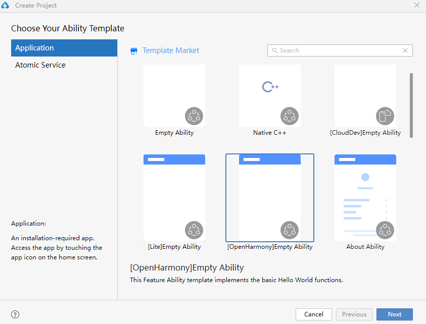
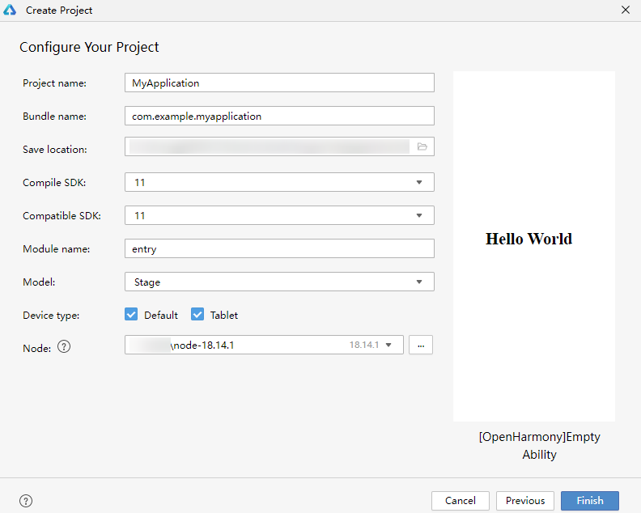
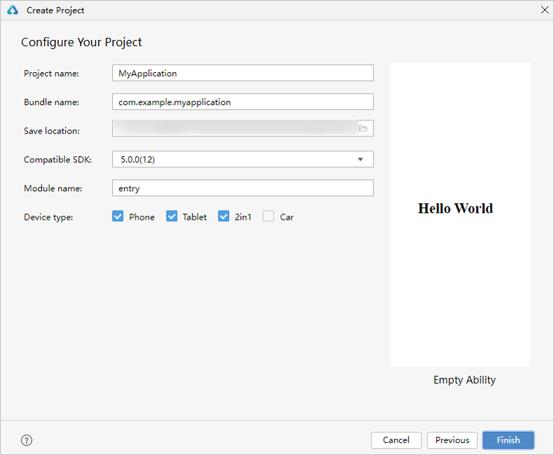
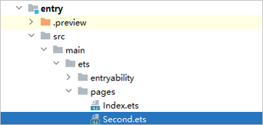

# 构建第一个ArkTS应用（Stage模型）


## 创建ArkTS工程（4.1Beta1版本及之前）

> **说明：**
>
> - 为确保运行效果，此处以使用**DevEco Studio 4.1 Beta1**版本为例<!--Del-->，点击[此处](../../release-notes/OpenHarmony-v4.1-beta1.md#配套关系)获取下载链接<!--DelEnd-->。
>
> - 此版本可直接创建OpenHarmony ArkTS工程。

1. 若首次打开**DevEco Studio**，请点击**Create Project**创建工程。如果已经打开了一个工程，请在菜单栏选择**File** &gt; **New** &gt; **Create Project**来创建一个新工程。

2. 选择**Application**应用开发（本文以应用开发为例，**Atomic Service**对应为原子化服务开发），选择模板“**[OpenHarmony]Empty Ability**”，点击**Next**进行下一步配置。

   若开发者需要进行Native相关工程的开发，可选择Native C++模板。

   

3. 进入配置工程界面，**Compile SDK**选择**11**，其他参数保持默认设置即可。

   其中**Node**用来配置当前工程运行的Node.js版本，可选择使用已有的Node.js或下载新的Node.js版本。

   

4. 点击**Finish**，工具会自动生成示例代码和相关资源，等待工程创建完成。

## 创建ArkTS工程（4.1Beta1版本之后）

> **说明：**
>
> - 4.1Beta1版本及之后，DevEco Studio默认创建的工程为HarmonyOS工程，不再支持直接创建OpenHarmony工程。需要基于创建完成的HarmonyOS工程进行一些字段修改，才能得到OpenHarmony工程。
>
> - 为确保运行效果，此处以使用[最新DevEco Studio版本](https://developer.huawei.com/consumer/cn/download/)为例。

1. 若首次打开**DevEco Studio**，请点击**Create Project**创建工程。如果已经打开了一个工程，请在菜单栏选择**File > New > Create Project**来创建一个新工程。

2. 选择**Application**应用开发（本文以应用开发为例，**Atomic Service**对应为元服务开发），选择模板**Empty Ability**，点击**Next**进行下一步配置。
   
   若开发者需要进行Native相关工程的开发，请选择Native C++模板，更多模板的使用和说明请见[工程模板介绍](https://developer.huawei.com/consumer/cn/doc/harmonyos-guides/ide-template)。

   

3. 进入配置工程界面，**Compatible SDK**表示兼容的最低API Version，此处以选择5.0.0(12)为例，其他参数保持默认设置即可。

   

4. 点击**Finish**，工具会自动生成示例代码和相关资源，等待工程创建完成，此时创建的工程为HarmonyOS工程。

5. 在完成创建HarmonyOS工程后，根据如下操作修改工程级build-profile.json5文件（即与entry同级）中相关字段：
   
   1. 在工程级build-profile.json5文件添加compileSdkVersion字段。

   2. 将compatibleSdkVersion和compileSdkVersion字段赋值为整数类型，如10，11或12。

   3. 将runtimeOS从"HarmonyOS"修改为"OpenHarmony"。

   ```json
   "products": [
     {
       "name": "default",
       "signingConfig": "default", 
       "compileSdkVersion": 12,    // 指定OpenHarmony应用/原子化服务编译时的版本
       "compatibleSdkVersion": 12, // 指定OpenHarmony应用/原子化服务兼容的最低版本
       "runtimeOS": "OpenHarmony",
     }
   ],
   ```

6. 单击**Sync Now**进行同步。

   在Sync Check弹窗中点击Yes，同意将module.json5/config.json文件中的phone切换为OpenHarmony支持的default类型，并删除在OpenHarmony不适用的其他设备类型，同步成功无其他报错则OpenHarmony工程创建完成。

## ArkTS工程目录结构（Stage模型）


- **AppScope &gt; app.json5**：应用的全局配置信息，详见[app.json5配置文件](app-configuration-file.md)。

- **entry**：应用/原子化服务模块，编译构建生成一个HAP包。
  - **src &gt; main &gt; ets**：用于存放ArkTS源码。
  
  - **src &gt; main &gt; ets &gt; entryability**：应用/服务的入口。
  
  - **src &gt; main &gt; ets &gt; pages**：应用/服务包含的页面。
  
  - **src &gt; main &gt; resources**：用于存放应用/服务所用到的资源文件，如图形、多媒体、字符串、布局文件等。关于资源文件，详见[资源文件的分类](resource-categories-and-access.md#资源分类)。
  
  - **src &gt; main &gt; module.json5**：模块配置文件。主要包含HAP包的配置信息、应用/服务在具体设备上的配置信息以及应用/服务的全局配置信息。具体的配置文件说明，详见[module.json5配置文件](module-configuration-file.md)。
  
  - **build-profile.json5**：当前的模块信息 、编译信息配置项，包括buildOption、targets配置等。
  
  - **hvigorfile.ts**：模块级编译构建任务脚本，开发者可以自定义相关任务和代码实现。
  - **obfuscation-rules.txt**：混淆规则文件。混淆开启后，在使用Release模式进行编译时，会对代码进行编译、混淆及压缩处理，保护代码资产。
  
- **oh_modules**：用于存放三方库依赖信息。

- **build-profile.json5**：工程级配置信息，包括签名signingConfigs、产品配置products等。

- **hvigorfile.ts**：应用级编译构建任务脚本。


## 构建第一个页面

1. 使用文本组件。

   工程同步完成后，在Project窗口，点击entry &gt; src &gt; main &gt; ets &gt; pages，打开Index.ets文件，可以看到页面由Text组件组成。**Index.ets**文件的示例如下：
   
   ```ts
   // Index.ets
   @Entry
   @Component
   struct Index {
     @State message: string = 'Hello World';
   
     build() {
       Row() {
         Column() {
           Text(this.message)
             .fontSize(50)
             .fontWeight(FontWeight.Bold)
         }
         .width('100%')
       }
       .height('100%')
     }
   }
   ```

2. 添加按钮。

   在默认页面基础上，我们添加一个Button组件，作为按钮响应用户点击，从而实现跳转到另一个页面。**Index.ets**文件的示例如下：
   
   ```ts
   // Index.ets
   @Entry
   @Component
   struct Index {
     @State message: string = 'Hello World';
   
     build() {
       Row() {
         Column() {
           Text(this.message)
             .fontSize(50)
             .fontWeight(FontWeight.Bold)
           // 添加按钮，以响应用户点击
           Button() {
             Text('Next')
               .fontSize(30)
               .fontWeight(FontWeight.Bold)
           }
           .type(ButtonType.Capsule)
           .margin({
             top: 20
           })
           .backgroundColor('#0D9FFB')
           .width('40%')
           .height('5%')
         }
         .width('100%')
       }
       .height('100%')
     }
   }
   ```

3. 在编辑窗口右上角的侧边工具栏，点击Previewer，打开预览器。第一个页面效果如下图所示：

   


## 构建第二个页面

1. 创建第二个页面。

   - 新建第二个页面文件。在“**Project**”窗口，打开“**entry &gt; src &gt; main &gt; ets**”，右键点击“**pages**”文件夹，选择“**New &gt; ArkTS File**”，命名为“**Second**”，点击**回车键**。可以看到文件目录结构如下：

      

      >  **说明：**
      >
      > 开发者也可以在右键点击“**pages**”文件夹时，选择“**New > Page > Empty Page**”，命名为“**Second**”，点击“**Finish**”完成第二个页面的创建。使用此种方式则无需再进行下文中第二个页面路由的手动配置。

   - 配置第二个页面的路由。在“**Project**”窗口，打开“**entry &gt; src &gt; main &gt; resources &gt; base &gt; profile**”，在main_pages.json文件中的“src”下配置第二个页面的路由“pages/Second”。示例如下：
     
      ```json
      {
        "src": [
          "pages/Index",
          "pages/Second"
        ]
      }
      ```

2. 添加文本及按钮。

   参照第一个页面，在第二个页面添加Text组件、Button组件等，并设置其样式。“**Second.ets**”文件的示例如下：
   
   ```ts
   // Second.ets
   @Entry
   @Component
   struct Second {
     @State message: string = 'Hi there';
   
     build() {
       Row() {
         Column() {
           Text(this.message)
             .fontSize(50)
             .fontWeight(FontWeight.Bold)
           Button() {
             Text('Back')
               .fontSize(25)
               .fontWeight(FontWeight.Bold)
           }
           .type(ButtonType.Capsule)
           .margin({
             top: 20
           })
           .backgroundColor('#0D9FFB')
           .width('40%')
           .height('5%')
         }
         .width('100%')
       }
       .height('100%')
     }
   }
   ```


## 实现页面间的跳转

页面间的导航可以通过[页面路由router](../reference/apis-arkui/js-apis-router.md)来实现。页面路由router根据页面url找到目标页面，从而实现跳转。使用页面路由请导入router模块。

如果需要实现更好的转场动效等，推荐使用[Navigation](../ui/arkts-navigation-navigation.md)。

1. 第一个页面跳转到第二个页面。

   在第一个页面中，跳转按钮绑定onClick事件，点击按钮时跳转到第二页。“**Index.ets**”文件的示例如下：
   
   ```ts
   // Index.ets
   // 导入页面路由模块
   import { BusinessError } from '@kit.BasicServicesKit';
   
   @Entry
   @Component
   struct Index {
     @State message: string = 'Hello World';
   
     build() {
       Row() {
         Column() {
           Text(this.message)
             .fontSize(50)
             .fontWeight(FontWeight.Bold)
           // 添加按钮，以响应用户点击
           Button() {
             Text('Next')
               .fontSize(30)
               .fontWeight(FontWeight.Bold)
           }
           .type(ButtonType.Capsule)
           .margin({
             top: 20
           })
           .backgroundColor('#0D9FFB')
           .width('40%')
           .height('5%')
           // 跳转按钮绑定onClick事件，点击时跳转到第二页
           .onClick(() => {
             console.info(`Succeeded in clicking the 'Next' button.`)
             // 获取UIContext
             let uiContext : UIContext = this.getUIContext();
             let router = uiContext.getRouter();
            // 跳转到第二页
              router.pushUrl({ url: 'pages/Second' }).then(() => {
                console.info('Succeeded in jumping to the second page.')
              }).catch((err: BusinessError) => {
                console.error(`Failed to jump to the second page.Code is ${err.code}, message is ${err.message}`)
              })
           })
         }
         .width('100%')
       }
       .height('100%')
     }
   }
   ```

2. 第二个页面返回到第一个页面。

   在第二个页面中，返回按钮绑定onClick事件，点击按钮时返回到第一页。“**Second.ets**”文件的示例如下：
   
   ```ts
   // Second.ets
   // 导入页面路由模块
   import { BusinessError } from '@kit.BasicServicesKit';
   
   @Entry
   @Component
   struct Second {
     @State message: string = 'Hi there';
   
     build() {
       Row() {
         Column() {
           Text(this.message)
             .fontSize(50)
             .fontWeight(FontWeight.Bold)
           Button() {
             Text('Back')
               .fontSize(25)
               .fontWeight(FontWeight.Bold)
           }
           .type(ButtonType.Capsule)
           .margin({
             top: 20
           })
           .backgroundColor('#0D9FFB')
           .width('40%')
           .height('5%')
           // 返回按钮绑定onClick事件，点击按钮时返回到第一页
           .onClick(() => {
             console.info(`Succeeded in clicking the 'Back' button.`)
             // 获取UIContext
             let uiContext : UIContext = this.getUIContext();
             let router = uiContext.getRouter();
             try {
               // 返回第一页
               router.back()
               console.info('Succeeded in returning to the first page.')
             } catch (err) {
                let code = (err as BusinessError).code;
                let message = (err as BusinessError).message;
               console.error(`Failed to return to the first page.Code is ${code}, message is ${message}`)
             }
           })
         }
         .width('100%')
       }
       .height('100%')
     }
   }
   ```

3. 打开Index.ets文件，点击预览器中的按钮进行刷新。效果如下图所示：

   


## 使用真机运行应用

1. 将搭载OpenHarmony标准系统的开发板与电脑连接。

2. 点击**File** &gt; **Project Structure...** &gt; **Project** &gt; **SigningConfigs**界面勾选“**Automatically generate signature**”，等待自动签名完成即可，点击“**OK**”。如下图所示：

   

3. 在编辑窗口右上角的工具栏，点击按钮运行。效果如下图所示：

   

恭喜您已经使用ArkTS语言开发（Stage模型）完成了第一个OpenHarmony应用，快来探索更多的OpenHarmony功能吧。