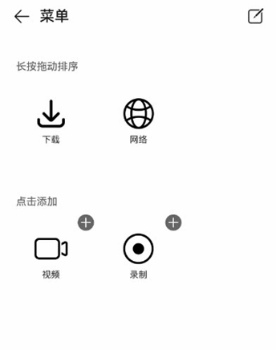

# GridObjectSortComponent


网格对象的编辑排序是用于网格对象的编辑、拖动排序、新增和删除。


>  **说明：**
>
>  该组件从API Version 11开始支持。后续版本如有新增内容，则采用上角标单独标记该内容的起始版本。


## 导入模块

```ts
import { GridObjectSortComponent, GridObjectSortComponentItem, GridObjectSortComponentOptions, GridObjectSortComponentType , SymbolGlyphModifier } from '@kit.ArkUI';
```

##  子组件

无

## 属性

支持[通用属性](ts-component-general-attributes.md)

## GridObjectSortComponent

GridObjectSortComponent({options: GridObjectSortComponentOptions, dataList: Array\<GridObjectSortComponentItem>, onSave: (select: Array\<GridObjectSortComponentItem>, unselect: Array\<GridObjectSortComponentItem>) => void, onCancel: () => void })

**装饰器类型：**\@Component

**原子化服务API：** 从API version 12开始，该接口支持在原子化服务中使用。

**系统能力：** SystemCapability.ArkUI.ArkUI.Full


| 名称     | 类型                             | 必填 | 装饰器类型 | 说明         |
| -------- | -------------------------------- | ---------- | ---- | ---- |
| options  | [GridObjectSortComponentOptions](#gridobjectsortcomponentoptions) | 是     | @Prop      | 组件配置信息。 |
| dataList | Array<[GridObjectSortComponentItem](#gridobjectsortcomponentitem)> | 是    | -     | 传入的数据，最大长度为50，数据长度超过50，只会取前50的数据。 |
| onSave | (select: Array<[GridObjectSortComponentItem](#gridobjectsortcomponentitem)>, unselect: Array<[GridObjectSortComponentItem](#gridobjectsortcomponentitem)>)  => void | 是 | - | 保存编辑排序的回调函数，返回编辑后的数据。 |
| onCancel | () => void | 是 | - | 取消保存数据的回调。 |

##  GridObjectSortComponentOptions

**原子化服务API：** 从API version 12开始，该接口支持在原子化服务中使用。

**系统能力：** SystemCapability.ArkUI.ArkUI.Full

| 名称           | 类型                      | 必填 | 说明                                                          |
| -------------- | ------------------------- | ---- |-------------------------------------------------------------|
| type           | [GridObjectSortComponentType](#gridobjectsortcomponenttype) | 否   | 组件展示形态：文字\|图片+文字。<br />默认：GridObjectSortComponentType.text。 |
| imageSize      | number \| [Resource](ts-types.md#resource) | 否   | 图片的尺寸，单位vp。<br />取值范围：大于等于0。<br />默认值：56vp。                 |
| normalTitle | [ResourceStr](ts-types.md#resourcestr)     | 否   | 未编辑状态下显示的标题。<br />默认值：频道。                                   |
| showAreaTitle | [ResourceStr](ts-types.md#resourcestr)     | 否   | 展示区域标题，第一个子标题。<br />默认值：长按拖动排序。                              |
| addAreaTitle | [ResourceStr](ts-types.md#resourcestr)     | 否   | 添加区域标题，第二个子标题。<br />默认值：点击添加。                                |
| editTitle      | [ResourceStr](ts-types.md#resourcestr)     | 否   | 编辑状态下头部标题显示。<br />默认值：编辑。                                    |

## GridObjectSortComponentType

**原子化服务API：** 从API version 12开始，该接口支持在原子化服务中使用。

**系统能力：** SystemCapability.ArkUI.ArkUI.Full

| 名称     | 值    | 说明           |
| -------- | ----- | -------------- |
| IMAGE_TEXT | 'image_text' | 图片文字类型。 |
| TEXT     | 'text'       | 文字类型。     |

## GridObjectSortComponentItem

**系统能力：** SystemCapability.ArkUI.ArkUI.Full

| 名称     | 类型                                   | 必填 | 说明                                                         |
| -------- | -------------------------------------- | ---- | ------------------------------------------------------------ |
| id       | number&nbsp;\|&nbsp;string             | 是   | 数据id序号，不可重复。<br />默认值：空字符串。<br/>**原子化服务API：** 从API version 12开始，该接口支持在原子化服务中使用。                                       |
| text     | [ResourceStr](ts-types.md#resourcestr) | 是   | 显示文本信息。<br/>**原子化服务API：** 从API version 12开始，该接口支持在原子化服务中使用。                                               |
| selected | boolean                                | 是   | 是否已经被添加，添加：true，未添加：false。<br/>**原子化服务API：** 从API version 12开始，该接口支持在原子化服务中使用。                  |
| url      | [ResourceStr](ts-types.md#resourcestr) | 否   | GridObjectSortComponentType类型为IMAGE_TEXT时，需要传入图片地址。<br/>**原子化服务API：** 从API version 12开始，该接口支持在原子化服务中使用。 |
| symbolStyle<sup>18+</sup> | [SymbolGlyphModifier](ts-universal-attributes-attribute-modifier.md) | 否   | GridObjectSortComponentType类型为IMAGE_TEXT时，需要传入Symbol图标资源。<br/>**原子化服务API：** 从API version 18开始，该接口支持在原子化服务中使用。|
| order    | number                                 | 是   | 顺序序号。<br />取值范围：大于等于0。<br />默认值：0。<br/>**原子化服务API：** 从API version 12开始，该接口支持在原子化服务中使用。                                                   |

##  事件

不支持[通用事件](ts-component-general-events.md)。

## 示例
网格对象的编辑排序组件基础用法，涉及对组件配置信息初始化，数据初始化，保存、取消方法的使用。

```ts
import { GridObjectSortComponent, GridObjectSortComponentItem, GridObjectSortComponentOptions, GridObjectSortComponentType, SymbolGlyphModifier } from '@kit.ArkUI';

@Entry
@Component
struct Index {
  // 组件数据初始化
  @State dataList: GridObjectSortComponentItem[] = [
    {
      id: 0,
      url: $r('sys.media.ohos_save_button_filled'),
      text: '下载',
      selected: true,
      order: 3
    },
    {
      id: 1,
      url: $r('sys.media.ohos_ic_public_web'),
      text: '网路',
      selected: true,
      order: 9
    },
    {
      id: 2,
      url: $r('sys.media.ohos_ic_public_video'),
      text: '视频',
      selected: false,
      order: 1
    },
    {
      id: 3,
      symbolStyle: new SymbolGlyphModifier($r('sys.symbol.record_circle')),
      text: '录制',
      selected: false,
      order: 4
    }
  ]

  // 组件配置信息初始化
  @State option: GridObjectSortComponentOptions = {
    type: GridObjectSortComponentType.IMAGE_TEXT,
    imageSize: 45,
    normalTitle: '菜单',
    editTitle: '编辑',
    showAreaTitle: '长按拖动排序',
    addAreaTitle: '点击添加'
  }

  build() {
    Column() {
      GridObjectSortComponent({
        options: this.option,
        dataList: this.dataList,
        // 保存编辑排序的回调函数，返回编辑后的数据。
        onSave: (
          select: Array<GridObjectSortComponentItem>,
          unselect: Array<GridObjectSortComponentItem>
        ) => {
          // save ToDo
        },
        // 取消保存数据的回调。
        onCancel: () =>{
          // cancel ToDo
        }
      })
    }
  }
}
```

