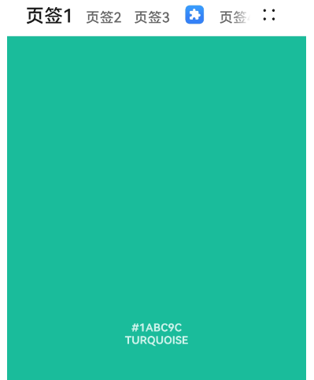

# TabTitleBar


页签型标题栏，用于页面之间的切换。仅一级页面适用。


> **说明：**
>
> 该组件从API Version 10开始支持。后续版本如有新增内容，则采用上角标单独标记该内容的起始版本。


## 导入模块

```
import { TabTitleBar } from '@kit.ArkUI'
```


## 子组件

无

## 属性
不支持[通用属性](ts-component-general-attributes.md)


## TabTitleBar

TabTitleBar({tabItems: Array&lt;TabTitleBarTabItem&gt;, menuItems?: Array&lt;TabTitleBarMenuItem&gt;, swiperContent: () =&gt; void})

**装饰器类型：**\@Component

**原子化服务API：** 从API version 11开始，该接口支持在原子化服务中使用。

**系统能力：** SystemCapability.ArkUI.ArkUI.Full

| 名称 | 类型 | 必填 | 装饰器类型 | 说明 |
| -------- | -------- | -------- | -------- | -------- |
| tabItems | Array&lt;[TabTitleBarTabItem](#tabtitlebartabitem)&gt; | 是 | - | 左侧页签项目列表，定义标题栏左侧的页签项目。 |
| menuItems | Array&lt;[TabTitleBarMenuItem](#tabtitlebarmenuitem)&gt; | 否 | - | 右侧菜单项目列表，定义标题栏右侧的菜单项目。 |
| swiperContent | ()&nbsp;=&gt;&nbsp;void | 是 | \@BuilderParam | 页签列表关联的页面内容构造器。 |

> **说明：**
> 
> 入参对象不可为undefined，即`TabTitleBar(undefined)`。

## TabTitleBarMenuItem

**系统能力：** SystemCapability.ArkUI.ArkUI.Full

| 名称 | 类型 | 必填 | 说明 |
| -------- | -------- | -------- | -------- |
| value | [ResourceStr](ts-types.md#resourcestr) | 是 | 图标资源。<br/>**原子化服务API：** 从API version 11开始，该接口支持在原子化服务中使用。 |
| symbolStyle<sup>18+</sup> | [SymbolGlyphModifier](ts-universal-attributes-attribute-modifier.md) | 否 | Symbol图标资源，优先级大于value。<br/>**原子化服务API：** 从API version 18开始，该接口支持在原子化服务中使用。 |
| label<sup>13+</sup> | [ResourceStr](ts-types.md#resourcestr) | 否 | 图标标签描述。<br/>**原子化服务API：** 从API version 13开始，该接口支持在原子化服务中使用。 |
| isEnabled | boolean | 否 | 是否启用。默认禁用。true：启用，false：禁用。<br/>**原子化服务API：** 从API version 11开始，该接口支持在原子化服务中使用。 |
| action | ()&nbsp;=&gt;&nbsp;void | 否 | 触发时的动作闭包。<br/>**原子化服务API：** 从API version 11开始，该接口支持在原子化服务中使用。 |
| accessibilityLevel<sup>18+<sup>       | string  | 否 | 标题栏右侧自定义按钮无障碍重要性。用于控制当前项是否可被无障碍辅助服务所识别。<br/>支持的值为：<br/>"auto"：当前组件会转换'yes'。<br/>"yes"：当前组件可被无障碍辅助服务所识别。<br/>"no"：当前组件不可被无障碍辅助服务所识别。<br/>"no-hide-descendants"：当前组件及其所有子组件不可被无障碍辅助服务所识别。<br/>默认值："auto"。<br/>**原子化服务API：** 从API version 18开始，该接口支持在原子化服务中使用。 |
| accessibilityText<sup>18+<sup>        | ResourceStr | 否 | 标题栏右侧自定义按钮的无障碍文本属性。当组件不包含文本属性时，屏幕朗读选中此组件时不播报，使用者无法清楚地知道当前选中了什么组件。为了解决此场景，开发人员可为不包含文字信息的组件设置无障碍文本，当屏幕朗读选中此组件时播报无障碍文本的内容，帮助屏幕朗读的使用者清楚地知道自己选中了什么组件。<br/>默认值：有label默认值为当前项label属性内容，没有设置label时，默认值为“ ”。<br/>**原子化服务API：** 从API version 18开始，该接口支持在原子化服务中使用。                                     |
| accessibilityDescription<sup>18+<sup> | ResourceStr | 否 | 标题栏右侧自定义按钮的无障碍描述。此描述用于向用户详细解释当前组件，开发人员应为组件的这一属性提供较为详尽的文本说明，以协助用户理解即将执行的操作及其可能产生的后果。特别是当这些后果无法仅从组件的属性和无障碍文本中直接获知时。如果组件同时具备文本属性和无障碍说明属性，当组件被选中时，系统将首先播报组件的文本属性，随后播报无障碍说明属性的内容。<br/>默认值为“单指双击即可执行”。<br/>**原子化服务API：** 从API version 18开始，该接口支持在原子化服务中使用。           |

## TabTitleBarTabItem

**原子化服务API：** 从API version 11开始，该接口支持在原子化服务中使用。

**系统能力：** SystemCapability.ArkUI.ArkUI.Full

| 名称 | 类型 | 必填 | 说明 |
| -------- | -------- | -------- | -------- |
| title | [ResourceStr](ts-types.md#resourcestr) | 是 | 文字页签。 |
| icon | [ResourceStr](ts-types.md#resourcestr) | 否 | 图片页签资源。 |
| symbolStyle<sup>18+</sup> | [SymbolGlyphModifier](ts-universal-attributes-attribute-modifier.md) | 否 | Symbol图片页签资源，优先级大于icon。<br/>**原子化服务API：** 从API version 18开始，该接口支持在原子化服务中使用。 |


## 事件
不支持[通用事件](ts-component-general-events.md)

## 示例

### 示例1（简单的页签型标题栏）
该示例实现了带有左侧页签和右侧菜单列表的页签型标题栏。
```ts
import { TabTitleBar, promptAction, TabTitleBarTabItem, TabTitleBarMenuItem } from '@kit.ArkUI'

@Entry
@Component
struct Index {
  @Builder
  //定义页签列表关联的页面
  componentBuilder() {
    Text("#1ABC9C\nTURQUOISE")
      .fontWeight(FontWeight.Bold)
      .fontSize(14)
      .width("100%")
      .textAlign(TextAlign.Center)
      .fontColor("#CCFFFFFF")
      .backgroundColor("#1ABC9C")
    Text("#16A085\nGREEN SEA")
      .fontWeight(FontWeight.Bold)
      .fontSize(14)
      .width("100%")
      .textAlign(TextAlign.Center)
      .fontColor("#CCFFFFFF")
      .backgroundColor("#16A085")
    Text("#2ECC71\nEMERALD")
      .fontWeight(FontWeight.Bold)
      .fontSize(14)
      .width("100%")
      .textAlign(TextAlign.Center)
      .fontColor("#CCFFFFFF")
      .backgroundColor("#2ECC71")
    Text("#27AE60\nNEPHRITIS")
      .fontWeight(FontWeight.Bold)
      .fontSize(14)
      .width("100%")
      .textAlign(TextAlign.Center)
      .fontColor("#CCFFFFFF")
      .backgroundColor("#27AE60")
    Text("#3498DB\nPETER RIVER")
      .fontWeight(FontWeight.Bold)
      .fontSize(14)
      .width("100%")
      .textAlign(TextAlign.Center)
      .fontColor("#CCFFFFFF")
      .backgroundColor("#3498DB")
  }

  //定义几个左侧的页签项目
  private readonly tabItems: Array<TabTitleBarTabItem> =
    [
      { title: '页签1' },
      { title: '页签2' },
      { title: '页签3' },
      { title: 'icon', icon: $r('sys.media.ohos_app_icon') },
      { title: '页签4' },
    ]
  //定义几个右侧的菜单项目
  private readonly menuItems: Array<TabTitleBarMenuItem> = [
    {
      value: $r('sys.media.ohos_save_button_filled'),
      isEnabled: true,
      action: () => promptAction.showToast({ message: "on item click! index 0" })
    },
    {
      value: $r('sys.media.ohos_ic_public_copy'),
      isEnabled: true,
      action: () => promptAction.showToast({ message: "on item click! index 1" })
    },
    {
      value: $r('sys.media.ohos_ic_public_edit'),
      isEnabled: true,
      action: () => promptAction.showToast({ message: "on item click! index 2" })
    },
  ]

  //TabTitleBar效果展示
  build() {
    Row() {
      Column() {
        TabTitleBar({
          swiperContent: this.componentBuilder,
          tabItems: this.tabItems,
          menuItems: this.menuItems,
        })
      }.width('100%')
    }.height('100%')
  }
}
```


### 示例2（右侧自定义按钮播报）
该示例通过设置标题栏右侧自定义按钮属性accessibilityText、accessibilityDescription、accessibilityLevel自定义屏幕朗读播报文本。
```ts
import { TabTitleBar, promptAction, TabTitleBarTabItem, TabTitleBarMenuItem } from '@kit.ArkUI'

@Entry
@Component
struct Index {
  @Builder
  //定义页签列表关联的页面
  componentBuilder() {
    Text("#1ABC9C\nTURQUOISE")
      .fontWeight(FontWeight.Bold)
      .fontSize(14)
      .width("100%")
      .textAlign(TextAlign.Center)
      .fontColor("#CCFFFFFF")
      .backgroundColor("#1ABC9C")
    Text("#16A085\nGREEN SEA")
      .fontWeight(FontWeight.Bold)
      .fontSize(14)
      .width("100%")
      .textAlign(TextAlign.Center)
      .fontColor("#CCFFFFFF")
      .backgroundColor("#16A085")
    Text("#2ECC71\nEMERALD")
      .fontWeight(FontWeight.Bold)
      .fontSize(14)
      .width("100%")
      .textAlign(TextAlign.Center)
      .fontColor("#CCFFFFFF")
      .backgroundColor("#2ECC71")
    Text("#27AE60\nNEPHRITIS")
      .fontWeight(FontWeight.Bold)
      .fontSize(14)
      .width("100%")
      .textAlign(TextAlign.Center)
      .fontColor("#CCFFFFFF")
      .backgroundColor("#27AE60")
    Text("#3498DB\nPETER RIVER")
      .fontWeight(FontWeight.Bold)
      .fontSize(14)
      .width("100%")
      .textAlign(TextAlign.Center)
      .fontColor("#CCFFFFFF")
      .backgroundColor("#3498DB")
  }

  //定义几个左侧的页签项目
  private readonly tabItems: Array<TabTitleBarTabItem> =
    [
      { title: '页签1' },
      { title: '页签2' },
      { title: '页签3' },
      { title: 'icon', icon: $r('sys.media.ohos_app_icon') },
      { title: '页签4' },
    ]
  //定义几个右侧的菜单项目
  private readonly menuItems: Array<TabTitleBarMenuItem> = [
    {
      value: $r('sys.media.ohos_save_button_filled'),
      isEnabled: true,
      action: () => promptAction.showToast({ message: "on item click! index 0" }),
      accessibilityText: '保存',
      //此处为no，屏幕朗读不聚焦
      accessibilityLevel: 'no',
      accessibilityDescription: '点击操作保存图标'
    },
    {
      value: $r('sys.media.ohos_ic_public_copy'),
      isEnabled: true,
      action: () => promptAction.showToast({ message: "on item click! index 1" }),
      accessibilityText: '复制',
      accessibilityLevel: 'yes',
      accessibilityDescription: '点击操作复制图标'
    },
    {
      value: $r('sys.media.ohos_ic_public_edit'),
      isEnabled: true,
      action: () => promptAction.showToast({ message: "on item click! index 2" }),
      //屏幕朗读播报文本，优先级比label高
      accessibilityText: '编辑',
      //屏幕朗读是否可以聚焦到
      accessibilityLevel: 'yes',
      //屏幕朗读最后播报的描述文本
      accessibilityDescription: '点击操作编辑图标'
    },
  ]

  //TabTitleBar效果展示
  build() {
    Row() {
      Column() {
        TabTitleBar({
          swiperContent: this.componentBuilder,
          tabItems: this.tabItems,
          menuItems: this.menuItems,
        })
      }.width('100%')
    }.height('100%')
  }
}
```


### 示例3（设置Symbol类型图标）
该示例通过设置TabTitleBarTabItem、TabTitleBarMenuItem的属性symbolStyle，展示了自定义Symbol类型图标。
```ts
import { TabTitleBar, promptAction, TabTitleBarTabItem, TabTitleBarMenuItem, SymbolGlyphModifier } from '@kit.ArkUI'

@Entry
@Component
struct Index {
  @Builder
  //定义页签列表关联的页面
  componentBuilder() {
    Text("#1ABC9C\nTURQUOISE")
      .fontWeight(FontWeight.Bold)
      .fontSize(14)
      .width("100%")
      .textAlign(TextAlign.Center)
      .fontColor("#CCFFFFFF")
      .backgroundColor("#1ABC9C")
    Text("#16A085\nGREEN SEA")
      .fontWeight(FontWeight.Bold)
      .fontSize(14)
      .width("100%")
      .textAlign(TextAlign.Center)
      .fontColor("#CCFFFFFF")
      .backgroundColor("#16A085")
    Text("#2ECC71\nEMERALD")
      .fontWeight(FontWeight.Bold)
      .fontSize(14)
      .width("100%")
      .textAlign(TextAlign.Center)
      .fontColor("#CCFFFFFF")
      .backgroundColor("#2ECC71")
    Text("#27AE60\nNEPHRITIS")
      .fontWeight(FontWeight.Bold)
      .fontSize(14)
      .width("100%")
      .textAlign(TextAlign.Center)
      .fontColor("#CCFFFFFF")
      .backgroundColor("#27AE60")
    Text("#3498DB\nPETER RIVER")
      .fontWeight(FontWeight.Bold)
      .fontSize(14)
      .width("100%")
      .textAlign(TextAlign.Center)
      .fontColor("#CCFFFFFF")
      .backgroundColor("#3498DB")
  }

  //定义几个左侧的页签项目
  private readonly tabItems: Array<TabTitleBarTabItem> =
    [
      { title: '页签1' },
      { title: '页签2' },
      { title: '页签3' },
      {
        title: 'icon',
        icon: $r('sys.media.ohos_app_icon'),
        symbolStyle: new SymbolGlyphModifier($r('sys.symbol.car'))
      },
      { title: '页签4' },
    ]
  //定义几个右侧的菜单项目
  private readonly menuItems: Array<TabTitleBarMenuItem> = [
    {
      value: $r('sys.media.ohos_save_button_filled'),
      symbolStyle: new SymbolGlyphModifier($r('sys.symbol.save')),
      isEnabled: true,
      action: () => promptAction.showToast({ message: "on item click! index 0" }),
      accessibilityText: '保存',
      //此处为no，屏幕朗读不聚焦
      accessibilityLevel: 'no',
      accessibilityDescription: '点击操作保存图标'
    },
    {
      value: $r('sys.media.ohos_ic_public_copy'),
      symbolStyle: new SymbolGlyphModifier($r('sys.symbol.car')),
      isEnabled: true,
      action: () => promptAction.showToast({ message: "on item click! index 1" }),
      accessibilityText: '复制',
      accessibilityLevel: 'yes',
      accessibilityDescription: '点击操作复制图标'
    },
    {
      value: $r('sys.media.ohos_ic_public_edit'),
      symbolStyle: new SymbolGlyphModifier($r('sys.symbol.ai_edit')),
      isEnabled: true,
      action: () => promptAction.showToast({ message: "on item click! index 2" }),
      //屏幕朗读播报文本，优先级比label高
      accessibilityText: '编辑',
      //屏幕朗读是否可以聚焦到
      accessibilityLevel: 'yes',
      //屏幕朗读最后播报的描述文本
      accessibilityDescription: '点击操作编辑图标'
    },
  ]

  //TabTitleBar效果展示
  build() {
    Row() {
      Column() {
        TabTitleBar({
          swiperContent: this.componentBuilder,
          tabItems: this.tabItems,
          menuItems: this.menuItems,
        })
      }.width('100%')
    }.height('100%')
  }
}
```
