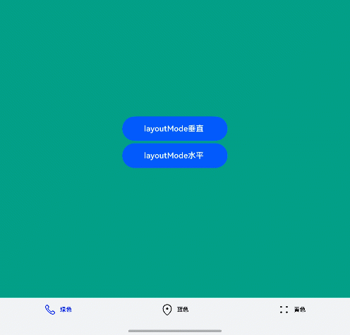

# AtomicServiceTabs

AtomicServiceTabs高级组件，对Tabs组件一些不需提供给用户自定义设计的属性进行简化，限制最多显示5个页签，固定页签样式，位置和大小。

> **说明：**
>
> 该组件从API Version 12开始支持。后续版本如有新增内容，则采用上角标单独标记该内容的起始版本。

## 导入模块

```
import { AtomicServiceTabs, TabBarOptions, TabBarPosition, OnContentWillChangeCallback } from '@kit.ArkUI';
```

## 子组件

无

## 属性

不支持[通用属性](ts-component-general-attributes.md)

## AtomicServiceTabs

```
AtomicServiceTabs ({
   tabContents?: [ TabContentBuilder?,
                    TabContentBuilder?,
                  TabContentBuilder?,
                  TabContentBuilder?,
                  TabContentBuilder?
                ],
   tabBarOptionsArray: [ TabBarOptions,
                        TabBarOptions,
                        TabBarOptions?,
                        TabBarOptions?,
                        TabBarOptions?
                      ],
   tabBarPosition?: TabBarPosition,
   layoutMode?: LayoutMode,
   barBackgroundColor?: ResourceColor,
   index?: number,
   barOverlap?: boolean,
   controller?: TabsController,
   onChange?: Callback<number>,
   onTabBarClick?: Callback<number>,
   onContentWillChange?: OnContentWillChangeCallback,
})
```
**装饰器类型：**\@Component

**原子化服务API：** 从API version 12开始，该接口支持在原子化服务中使用。

**系统能力：** SystemCapability.ArkUI.ArkUI.Full

**参数：**

| 名称 | 类型 | 必填 | 装饰器类型 | 说明 |
| --------------- | ------ | ---- | ----|----------|
| tabContents | [[TabContentBuilder?](#tabcontentbuilder),[TabContentBuilder?](#tabcontentbuilder), [TabContentBuilder?](#tabcontentbuilder),[TabContentBuilder?](#tabcontentbuilder), [TabContentBuilder?](#tabcontentbuilder)] | 否 | @BuilderParam| 内容视图容器数组，默认为空。|
| tabBarOptionsArray | [[TabBarOptions?](#tabbaroptions),[TabBarOptions?](#tabbaroptions), [TabBarOptions?](#tabbaroptions),[TabBarOptions?](#tabbaroptions), [TabBarOptions?](#tabbaroptions)]  | 是 | @Prop | 页签容器数组。 |
| tabBarPosition | [TabBarPosition](#tabbarposition) | 否   |@Prop | 设置页签栏位置，默认值为TabBarPosition.Bottom。|
| layoutMode<sup>18+</sup> | [LayoutMode](ts-container-tabcontent.md#layoutmode10) | 否   |@Prop | 设置底部页签的图片、文字排布的方式，默认值为LayoutMode.VERTICAL。|
| barBackgroundColor | [ResourceColor](ts-types.md#resourcecolor) | 否 | @Prop | 设置TabBar的背景颜色，默认值为透明。|
| index | number | 否 | @Prop | 设置当前显示页签的索引，索引值从0开始。|
| barOverlap | boolean| 否 | @Prop | 设置TabBar是否背后变模糊并叠加在TabContent之上，默认值：true。|
| controller|[TabsController](ts-container-tabs.md#tabscontroller) | 否 | - |Tabs组件的控制器，用于控制Tabs组件进行页签切换。|
| onChange | Callback\<number\> | 否 | - | Tabs页签切换后触发的事件。 |
| onTabBarClick | Callback\<number\> | 否 | - |Tabs页签点击后触发的事件。|
| onContentWillChange | [OnContentWillChangeCallback](#oncontentwillchangecallback) | 否 | - | Tabs页面切换拦截事件能力，新页面即将显示时触发该回调。|

## TabContentBuilder

type TabContentBuilder = () => void

**原子化服务API：** 从API version 12开始，该接口支持在原子化服务中使用。

**系统能力：** SystemCapability.ArkUI.ArkUI.Full

| 类型 | 说明 |
| ---- | ---------- |
| () => void | 内容视图容器 |

## TabBarOptions

### constructor
constructor(icon: ResourceStr | TabBarSymbol, text: ResourceStr, unselectedColor?: ResourceColor, selectedColor?: ResourceColor)

TabBarOptions的构造函数。

**原子化服务API：** 从API version 12开始，该接口支持在原子化服务中使用。

**系统能力：** SystemCapability.ArkUI.ArkUI.Full

**参数：**

| 参数名 | 类型 | 必填 | 说明 |
| --------------- | ------ |------ |------ |
| icon | [ResourceStr](ts-types.md#resourcestr) \| [TabBarSymbol](ts-container-tabcontent.md#tabbarsymbol12) | 是 | 页签内的图片内容。 |
| text | [ResourceStr](ts-types.md#resourcestr) | 是 | 页签内的文字内容。 |
| unselectedColor | [ResourceColor](ts-types.md#resourcecolor) | 否 | 未选择时的页签颜色，默认值：#99182431。 |
| selectedColor | [ResourceColor](ts-types.md#resourcecolor) | 否 | 被选择时的页签颜色，默认值：#FF007DFF。 |

## TabBarPosition 

**原子化服务API：** 从API version 12开始，该接口支持在原子化服务中使用。

**系统能力：** SystemCapability.ArkUI.ArkUI.Full

| 名称 | 值 | 说明 |
| --------------- | ------ |-----|
| LEFT  | 0 | 设置TabBar位于屏幕左侧  |
| BOTTOM  | 1 | 设置TabBar位于屏幕底部 |

## OnContentWillChangeCallback

type OnContentWillChangeCallback = (currentIndex: number, comingIndex: number) => boolean

**原子化服务API：** 从API version 12开始，该接口支持在原子化服务中使用。

**系统能力：** SystemCapability.ArkUI.ArkUI.Full

| 名称 | 类型 | 必填 | 说明 |
| --------------- | ------ |------ |------ |
| currentIndex | number | 是 | 当前页签索引。 |
| comingIndex | number | 是 | 即将切换的页签索引。 |

## 示例

### 示例1(纯文本样式)

```ts
// Index.ets
import { AtomicServiceTabs, TabBarOptions, TabBarPosition, OnContentWillChangeCallback } from '@kit.ArkUI';

@Entry
@Component
struct Index {
  @State message: string = '首页';
  @State onClickNumber: number = 0;
  @State currentIndex: number = 0;
  @State comingIndex: number = 0;
  onContentWillChangeCallBack:  OnContentWillChangeCallback = (currentIndex: number, comingIndex: number): boolean => {
    this.currentIndex = currentIndex;
    this.comingIndex = comingIndex;
    console.log('OnContentWillChangeCallback')
     return true;
  }
  onTabClick: Callback<number> = (index:number)=>{
    this.onClickNumber ++;
    console.log('onTabClick');
  }
  @Builder
  tabContent1() {
    Column().width('100%').height('100%').alignItems(HorizontalAlign.Center).backgroundColor('#00CB87')
  }

  @Builder
  tabContent2() {
    Column().width('100%').height('100%').backgroundColor('#007DFF')
  }

  @Builder
  tabContent3() {
    Column().width('100%').height('100%').backgroundColor('#FFBF00')
  }

  build() {
    Stack() {
    AtomicServiceTabs({
      tabContents: [
        () => {
          this.tabContent1()
        },
        () => {
          this.tabContent2()
        },
        () => {
          this.tabContent3()
        }
      ],
      tabBarOptionsArray: [
        new TabBarOptions('', '绿色', Color.Black, Color.Green),
        new TabBarOptions('', '蓝色', Color.Black, Color.Blue),
        new TabBarOptions('', '黄色', Color.Black, Color.Yellow),
      ],
      tabBarPosition: TabBarPosition.BOTTOM,
      barBackgroundColor: $r('sys.color.ohos_id_color_bottom_tab_bg'),
      onTabBarClick:this.onTabClick,
      onContentWillChange: this.onContentWillChangeCallBack,
    })
    Column() {
      Text("onchange回调次数:" + this.onClickNumber)
      Text("comingIndex = " + this.comingIndex + ", currentIndex = " + this.currentIndex)
    }.margin({top:500})
    }.height('100%')
  }
}
```


### 示例2(纯图标样式)

```ts
// Index.ets
import { AtomicServiceTabs, TabBarOptions, TabBarPosition, OnContentWillChangeCallback } from '@kit.ArkUI';

@Entry
@Component
struct Index {
  @State message: string = '首页';
  @State onClickNumber: number = 0;
  @State currentIndex: number = 0;
  @State comingIndex: number = 0;
  onContentWillChangeCallBack:  OnContentWillChangeCallback = (currentIndex: number, comingIndex: number): boolean => {
    this.currentIndex = currentIndex;
    this.comingIndex = comingIndex;
    console.log('OnContentWillChangeCallback')
     return true;
  }
  onTabClick: Callback<number> = (index:number)=>{
    this.onClickNumber ++;
    console.log('onTabClick');
  }
  @Builder
  tabContent1() {
    Column().width('100%').height('100%').alignItems(HorizontalAlign.Center).backgroundColor('#00CB87')
  }

  @Builder
  tabContent2() {
    Column().width('100%').height('100%').backgroundColor('#007DFF')
  }

  @Builder
  tabContent3() {
    Column().width('100%').height('100%').backgroundColor('#FFBF00')
  }

  build() {
    Stack() {
    AtomicServiceTabs({
      tabContents: [
        () => {
          this.tabContent1()
        },
        () => {
          this.tabContent2()
        },
        () => {
          this.tabContent3()
        }
      ],
      tabBarOptionsArray: [
          new TabBarOptions($r('sys.media.ohos_ic_public_phone'), '', Color.Black, Color.Blue),
          new TabBarOptions($r('sys.media.ohos_ic_public_location'), '', Color.Black, Color.Blue),
          new TabBarOptions($r('sys.media.ohos_ic_public_more'), '', Color.Black, Color.Blue),
      ],
      tabBarPosition: TabBarPosition.BOTTOM,
      barBackgroundColor: $r('sys.color.ohos_id_color_bottom_tab_bg'),
      onTabBarClick:this.onTabClick,
      onContentWillChange: this.onContentWillChangeCallBack,
    })
    Column() {
      Text("onchange回调次数:" + this.onClickNumber)
      Text("comingIndex = " + this.comingIndex + ", currentIndex = " + this.currentIndex)
    }.margin({top:500})
    }.height('100%')
  }
}
```


### 示例3(图标加文本，自定义图文排布)

```ts
// Index.ets
import { AtomicServiceTabs, TabBarOptions, TabBarPosition, OnContentWillChangeCallback } from '@kit.ArkUI';

@Entry
@Component
struct AtomicserviceTabs  {
  @State flag: boolean = false;
  @State message: string = '首页';
  @State onClickNumber: number = 0;
  @State currentIndex: number = 0;
  @State comingIndex: number = 0;
  @State layoutMode: LayoutMode = LayoutMode.VERTICAL;
  onContentWillChangeCallBack: OnContentWillChangeCallback = (currentIndex: number, comingIndex: number): boolean => {
    this.currentIndex = currentIndex;
    this.comingIndex = comingIndex;
    console.log('OnContentWillChangeCallback')
    return true;
  }
  onTabClick: Callback<number> = (index: number) => {
    this.onClickNumber++;
    console.log('onTabClick');
  }
  onChange: Callback<number, void> = (Index: number) => {
    console.log('onChange');
    console.log('onChange2');
  }

  @Builder
  tabContent1() {
    Column().width('100%').height('100%').alignItems(HorizontalAlign.Center).backgroundColor('#00CB87')
  }

  @Builder
  tabContent2() {
    Column().width('100%').height('100%').backgroundColor(Color.Blue)
  }

  @Builder
  tabContent3() {
    Column().width('100%').height('100%').backgroundColor('#FFBF00')
  }

  build() {
    Stack() {
      AtomicServiceTabs({
        tabContents: [
          () => {
            this.tabContent1()
          },
          () => {
            this.tabContent2()
          },
          () => {
            this.tabContent3()
          },
        ],
        tabBarOptionsArray: [
        new TabBarOptions($r('sys.media.ohos_ic_public_phone'), '绿色', Color.Black, Color.Blue),
        new TabBarOptions($r('sys.media.ohos_ic_public_location'), '蓝色', Color.Black, Color.Blue),
        new TabBarOptions($r('sys.media.ohos_ic_public_more'), '黄色', Color.Black, Color.Blue),
        ],
        tabBarPosition: TabBarPosition.BOTTOM,
        barBackgroundColor: $r('sys.color.ohos_id_color_bottom_tab_bg'),
        onTabBarClick: this.onTabClick,
        onContentWillChange: this.onContentWillChangeCallBack,
        onChange: this.onChange,
        layoutMode: this.layoutMode,
      })

      Column() {
        Button("layoutMode垂直 ")
          .width('30%')
          .height(50)
          .margin({ top: 5 })
          .onClick((event?: ClickEvent) => {
            this.layoutMode = LayoutMode.VERTICAL;
          })
        Button("layoutMode水平 ")
          .width('30%')
          .height(50)
          .margin({ top: 5 })
          .onClick((event?: ClickEvent) => {
            this.layoutMode = LayoutMode.HORIZONTAL;
          })
      }.margin({ top: 10 })
    }.height('100%')
  }
}
```
