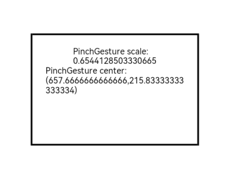

# PinchGesture

用于触发捏合手势，触发捏合手势的最少手指为2指，最大为5指，最小识别距离为5vp。

>  **说明：**
>
>  从API Version 7开始支持。后续版本如有新增内容，则采用上角标单独标记该内容的起始版本。


## 接口

PinchGesture(value?: { fingers?: number, distance?: number })

**原子化服务API：** 从API version 11开始，该接口支持在原子化服务中使用。

**参数：**

| 参数名称 | 参数类型 | 必填 | 参数描述 |
| -------- | -------- | -------- | -------- |
| fingers | number | 否 | 触发捏合的最少手指数,&nbsp;最小为2指，最大为5指。<br/>默认值：2 <br/>触发手势手指可以多于fingers数目，但只有先落下的与fingers相同数目的手指参与手势计算。 |
| distance | number | 否 | 最小识别距离，单位为vp。<br/>默认值：5 <br/>**说明：** <br/> 当识别距离的值小于等于0时，会被转化为默认值。|


## 事件

| 名称 | 功能描述 |
| -------- | -------- |
| onActionStart(event:(event:&nbsp;[GestureEvent](ts-gesture-settings.md#gestureevent对象说明))&nbsp;=&gt;&nbsp;void) | Pinch手势识别成功回调。 <br/>**原子化服务API：** 从API version 11开始，该接口支持在原子化服务中使用。|
| onActionUpdate(event:(event:&nbsp;[GestureEvent](ts-gesture-settings.md#gestureevent对象说明))&nbsp;=&gt;&nbsp;void) | Pinch手势移动过程中回调。 <br/>**原子化服务API：** 从API version 11开始，该接口支持在原子化服务中使用。|
| onActionEnd(event:(event:&nbsp;[GestureEvent](ts-gesture-settings.md#gestureevent对象说明))&nbsp;=&gt;&nbsp;void) | Pinch手势识别成功，手指抬起后触发回调。 <br/>**原子化服务API：** 从API version 11开始，该接口支持在原子化服务中使用。|
| onActionCancel(event:&nbsp;()&nbsp;=&gt;&nbsp;void) | Pinch手势识别成功，接收到触摸取消事件触发回调。<br/>**原子化服务API：** 从API version 11开始，该接口支持在原子化服务中使用。|

## 属性

**原子化服务API：** 从API version 11开始，该接口支持在原子化服务中使用。

| 名称 | 类型    |描述                                        |
| ----  | ------  | ---------------------------------------- |
| tag<sup>11+</sup>   | string  | 设置Pinch手势标志，用于自定义手势判定时区分绑定的手势。|

## 示例

```ts
// xxx.ets
@Entry
@Component
struct PinchGestureExample {
  @State scaleValue: number = 1
  @State pinchValue: number = 1
  @State pinchX: number = 0
  @State pinchY: number = 0

  build() {
    Column() {
      Column() {
        Text('PinchGesture scale:\n' + this.scaleValue)
        Text('PinchGesture center:\n(' + this.pinchX + ',' + this.pinchY + ')')
      }
      .height(200)
      .width(300)
      .padding(20)
      .border({ width: 3 })
      .margin({ top: 100 })
      .scale({ x: this.scaleValue, y: this.scaleValue, z: 1 })
      // 三指捏合触发该手势事件
      .gesture(
      PinchGesture({ fingers: 3 })
        .onActionStart((event: GestureEvent) => {
          console.info('Pinch start')
        })
        .onActionUpdate((event: GestureEvent) => {
          if (event) {
            this.scaleValue = this.pinchValue * event.scale
            this.pinchX = event.pinchCenterX
            this.pinchY = event.pinchCenterY
          }
        })
        .onActionEnd((event: GestureEvent) => {
          this.pinchValue = this.scaleValue
          console.info('Pinch end')
        })
      )
    }.width('100%')
  }
}
```

 
