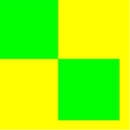

# ImageBitmap

ImageBitmap对象可以存储canvas渲染的像素数据。

>  **说明：**
>
>  从 API Version 8 开始支持。后续版本如有新增内容，则采用上角标单独标记该内容的起始版本。

## 接口

### ImageBitmap<sup>12+</sup>

ImageBitmap(data: PixelMap, unit?: LengthMetricsUnit)

通过PixelMap创建ImageBitmap对象。

**原子化服务API：** 从API version 12开始，该接口支持在原子化服务中使用。

**系统能力：** SystemCapability.ArkUI.ArkUI.Full

**参数：**

| 参数名  | 类型   | 必填  | 说明                                    |
| ---- | ------ | ---- | ---------------------------------------- |
| data  | [PixelMap](../../apis-image-kit/js-apis-image.md#pixelmap7) | 是    | 图片的数据源支持PixelMap对象。 |
| unit  | [LengthMetricsUnit](ts-canvasrenderingcontext2d.md#lengthmetricsunit12) | 否 |  用来配置ImageBitmap对象的单位模式，配置后无法动态更改，配置方法同[CanvasRenderingContext2D](ts-canvasrenderingcontext2d.md#lengthmetricsunit12)。<br>默认值：DEFAULT。 |

### ImageBitmap

ImageBitmap(src: string, unit?: LengthMetricsUnit)

通过ImageSrc创建ImageBitmap对象。

**卡片能力：** 从API version 9开始，该接口支持在ArkTS卡片中使用。

**原子化服务API：** 从API version 11开始，该接口支持在原子化服务中使用。

**系统能力：** SystemCapability.ArkUI.ArkUI.Full

**参数：**

| 参数名  | 类型   | 必填  | 说明                                    |
| ---- | ------ | ---- | ---------------------------------------- |
| src  | string | 是  | 图片的数据源支持本地图片。<br>1、string格式用于加载本地图片，例如ImageBitmap("common/images/example.jpg")，type为"entry"和"feature"类型的Module，其图片加载路径的起点为当前Module的ets文件夹，type为"har"和"shared"类型的Module，其图片加载路径的起点为当前构建的"entry"或"feature"类型Module的ets文件夹。<br/>type为"har"和"shared"类型的Module中推荐使用[ImageSource](../../../media/image/image-decoding.md)图片解码方式将资源图片解码为统一的PixelMap加载使用。<br/>2、支持本地图片类型：bmp、jpg、png、svg和webp类型。<br/>**说明：**<br/>- ArkTS卡片上不支持`http://`等网络相关路径前缀、`datashare://`路径前缀以及`file://data/storage`路径前缀的字符串。 |
| unit<sup>12+</sup>  | [LengthMetricsUnit](../js-apis-arkui-graphics.md#lengthmetricsunit12) | 否 | 用来配置ImageBitmap对象的单位模式，配置后无法动态更改，配置方法同[CanvasRenderingContext2D](ts-canvasrenderingcontext2d.md#lengthmetricsunit12)。<br>默认值：DEFAULT。 |


## 属性

**卡片能力：** 从API version 9开始，该接口支持在ArkTS卡片中使用。

**原子化服务API：** 从API version 11开始，该接口支持在原子化服务中使用。

**系统能力：** SystemCapability.ArkUI.ArkUI.Full

| 名称     | 类型 | 只读 | 可选 | 描述 |
| ------ | ------ | ----- | -------- | --------------------------- |
| width | number | 是 | 否 | ImageBitmap的像素宽度。<br>默认单位为vp。 |
| height | number | 是 | 否 | ImageBitmap的像素高度。<br>默认单位为vp。 |

## close

close(): void

释放ImageBitmap对象相关联的所有图形资源，并将ImageBitmap对象的宽高置为0。close示例代码同创建ImageBitmap代码。

**卡片能力：** 从API version 9开始，该接口支持在ArkTS卡片中使用。

**原子化服务API：** 从API version 11开始，该接口支持在原子化服务中使用。

**系统能力：** SystemCapability.ArkUI.ArkUI.Full

## ImageBitmap支持并发线程绘制

从API version 11开始，当应用创建[Worker线程](../../../arkts-utils/worker-introduction.md)，支持使用postMessage将ImageBitmap实例传到Worker中进行绘制，并使用onmessage接收Worker线程发送的绘制结果进行显示。

## 示例

### 示例1

  ```ts
  // xxx.ets
  @Entry
  @Component
  struct ImageExample {
    private settings: RenderingContextSettings = new RenderingContextSettings(true)
    private context: CanvasRenderingContext2D = new CanvasRenderingContext2D(this.settings)
    private img:ImageBitmap = new ImageBitmap("common/images/example.jpg")

    build() {
      Flex({ direction: FlexDirection.Column, alignItems: ItemAlign.Center, justifyContent: FlexAlign.Center }) {
        Canvas(this.context)
          .width('100%')
          .height('100%')
          .backgroundColor('#ffff00')
          .onReady(() => {
            this.context.drawImage(this.img, 0, 0, 500, 500, 0, 0, 400, 200)
            this.img.close()
          })
      }
      .width('100%')
      .height('100%')
    }
  }
  ```

  

### 示例2

  ```ts
// xxx.ets
@Entry
@Component
struct Demo {
  private settings: RenderingContextSettings = new RenderingContextSettings(true)
  private context: CanvasRenderingContext2D = new CanvasRenderingContext2D(this.settings)

  build() {
    Flex({ direction: FlexDirection.Column, alignItems: ItemAlign.Center, justifyContent: FlexAlign.Center }) {
      Canvas(this.context)
        .width('100%')
        .height('50%')
        .backgroundColor('#ffff00')
        .onReady(() => {
          this.context.fillStyle = "#00ff00"
          this.context.fillRect(0, 0, 100, 100)
          let pixel = this.context.getPixelMap(0, 0, 100, 100)
          let image = new ImageBitmap(pixel)
          this.context.drawImage(image, 100, 100)
        })

    }
    .width('100%')
    .height('100%')
  }
}
  ```

  


### 示例3
```ts
import worker from '@ohos.worker';

@Entry
@Component
struct imageBitmapExamplePage {
  private settings: RenderingContextSettings = new RenderingContextSettings(true);
  private context: CanvasRenderingContext2D = new CanvasRenderingContext2D(this.settings);
  private myWorker = new worker.ThreadWorker('entry/ets/workers/Worker.ts');
  private img:ImageBitmap = new ImageBitmap("common/images/example.jpg")

  build() {
    Flex({ direction: FlexDirection.Column, alignItems: ItemAlign.Center, justifyContent: FlexAlign.Center }) {
      Canvas(this.context)
        .width('100%')
        .height('100%')
        .backgroundColor('#ffff00')
        .onReady(() => {
          this.myWorker.postMessage({ myImage: this.img });
          this.myWorker.onmessage = (e): void => {
            if (e.data.myImage) {
              let image: ImageBitmap = e.data.myImage
              this.context.transferFromImageBitmap(image)
            }
          }
        })
    }
    .width('100%')
    .height('100%')
  }
}
```
Worker线程在onmessage中接收到主线程postMessage发送的ImageBitmap，并进行绘制。

```ts
workerPort.onmessage = function (e: MessageEvents) {
  if (e.data.myImage) {
    let img = e.data.myImage
    let offCanvas = new OffscreenCanvas(600, 600)
    let offContext = offCanvas.getContext("2d")
    offContext.drawImage(img, 0, 0, 500, 500, 0, 0, 400, 200)
    let image = offCanvas.transferToImageBitmap()
    workerPort.postMessage({ myImage: image });
  }
}
```

  