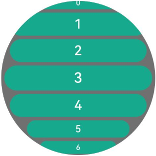

# ArcListItem

用来展示列表具体子组件，必须配合[ArcList](ts-container-arclist.md)来使用。

> **说明：**
>
> - 该组件从API version 18开始支持。后续版本如有新增内容，则采用上角标单独标记该内容的起始版本。
> - 该组件的父组件只能是[ArcList](ts-container-arclist.md)。
> - 当ArcListItem配合[LazyForEach](../../../ui/state-management/arkts-rendering-control-lazyforeach.md)使用时，ArcListItem子组件在ArcListItem创建时创建。配合[if/else](../../../ui/state-management/arkts-rendering-control-ifelse.md)、[ForEach](../../../ui/state-management/arkts-rendering-control-foreach.md)使用时，或父组件为[ArcList](ts-container-arclist.md)时，ArcListItem子组件在ArcListItem布局时创建。

## 导入模块

```ts
import { ArcListItem, ArcListItemAttribute } from '@kit.ArkUI';
```

## 子组件

可以包含单个子组件。

## 接口

### ArcListItem

ArcListItem()

创建弧形列表子组件。

**原子化服务API：** 从API version 18开始，该接口支持在原子化服务中使用。

**系统能力：** SystemCapability.ArkUI.ArkUI.Circle

## 属性

除支持[通用属性](ts-component-general-attributes.md)外，还支持以下属性：

### autoScale

autoScale(enable: Optional\<boolean>)

用于设置ArcListItem是否支持自动缩放显示。

**原子化服务API：** 从API version 18开始，该接口支持在原子化服务中使用。

**系统能力：** SystemCapability.ArkUI.ArkUI.Circle

**参数：** 

| 参数名 | 类型               | 必填 | 说明                                        |
| ------ | ------------------ | ---- | ------------------------------------------- |
| enable | Optional\<boolean> | 是   | ArcListItem是否支持自动缩放显示，true表示支持自动缩放显示，false表示不支持自动缩放显示。<br/>默认值：true，支持自动缩放显示。 |

### swipeAction

swipeAction(options: Optional\<SwipeActionOptions>)

用于设置ArcListItem的划出组件。

**原子化服务API：** 从API version 18开始，该接口支持在原子化服务中使用。

**系统能力：** SystemCapability.ArkUI.ArkUI.Circle

**参数：** 

| 参数名  | 类型                                                         | 必填 | 说明                    |
| ------- | ------------------------------------------------------------ | ---- | ----------------------- |
| options | [Optional\<SwipeActionOptions>](ts-container-listitem.md#swipeactionoptions9对象说明) | 否   | ArcListItem的划出组件。 |

## 示例

该示例展示了子项关闭自动缩放和开启自动缩放后的对比效果。

```ts
// xxx.ets
import { LengthMetrics, CircleShape } from "@kit.ArkUI";
import { ArcList, ArcListItem, ArcListAttribute, ArcListItemAttribute } from '@kit.ArkUI';

@Entry
@Component
struct ArcListItemExample {
  private arr: number[] = [0, 1, 2, 3, 4, 5, 6, 7, 8, 9]
  private watchSize: string = '466px' // 手表默认宽高：466*466
  private itemSize: string = '414px' // item宽度

  @Builder
  buildList() {
    Stack() {
      Column() {
      }
      .width(this.watchSize)
      .height(this.watchSize)
      .clipShape(new CircleShape({ width: '100%', height: '100%' }))
      .backgroundColor(0x707070)

      ArcList({ initialIndex: 3}) {
        ForEach(this.arr, (item: number) => {
          ArcListItem() {
            Button('' + item, { type: ButtonType.Capsule })
              .width(this.itemSize)
              .height('70px')
              .fontSize('40px')
              .backgroundColor(0x17A98D)
          }
          .autoScale(item % 3 == 0 || item % 5 == 0)
        }, (item: string) => item)
      }
      .space(LengthMetrics.px(10))
      .borderRadius(this.watchSize)
    }
    .width(this.watchSize)
    .height(this.watchSize)
  }

  build() {
    Column() {
      this.buildList()
    }
    .width('100%')
    .height('100%')
    .alignItems(HorizontalAlign.Center)
    .justifyContent(FlexAlign.Center)
  }
}
```

