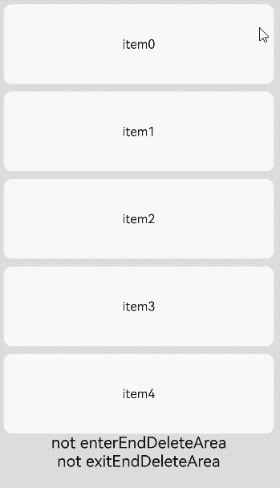
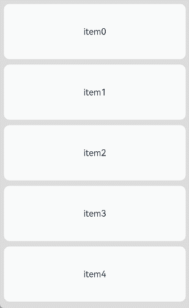

# ListItem

用来展示列表具体item，必须配合List来使用。

> **说明：**
>
> - 该组件从API version 7开始支持。后续版本如有新增内容，则采用上角标单独标记该内容的起始版本。
> - 该组件的父组件只能是[List](ts-container-list.md)或者[ListItemGroup](ts-container-listitemgroup.md)。
> - 当ListItem配合LazyForEach使用时，ListItem子组件在ListItem创建时创建。配合if/else、ForEach使用时，或父组件为List/ListItemGroup时，ListItem子组件在ListItem布局时创建。

## 子组件

可以包含单个子组件。

## 接口

### ListItem<sup>10+</sup>

ListItem(value?: ListItemOptions)

创建ListItem组件。

**卡片能力：** 从API version 10开始，该接口支持在ArkTS卡片中使用。

**原子化服务API：** 从API version 11开始，该接口支持在原子化服务中使用。

**系统能力：** SystemCapability.ArkUI.ArkUI.Full

**参数：**

| 参数名 | 类型                                      | 必填 | 说明                                                     |
| ------ | --------------------------------------------- | ---- | ------------------------------------------------------------ |
| value  | [ListItemOptions](#listitemoptions10对象说明) | 否   | 为ListItem提供可选参数，该对象内含有ListItemStyle枚举类型的style参数。 |

### ListItem<sup>(deprecated)</sup>

ListItem(value?: string)

创建ListItem组件。

从API version 10开始，该接口不再维护，推荐使用[ListItem<sup>10+</sup>](#listitem10)。

**卡片能力：** 从API version 9开始，该接口支持在ArkTS卡片中使用。

**系统能力：** SystemCapability.ArkUI.ArkUI.Full

**参数：**

| 参数名 | 类型                      | 必填 | 说明 |
| ------ | ----------------------------- | ---- | -------- |
| value  | string | 否   | 无       |

## 属性

除支持[通用属性](ts-component-general-attributes.md)外，还支持以下属性：

### sticky<sup>(deprecated)</sup>

sticky(value: Sticky)

设置ListItem吸顶效果。

从API version 9开始废弃不再使用，推荐使用[List组件sticky属性](ts-container-list.md#sticky9)。

**系统能力：** SystemCapability.ArkUI.ArkUI.Full

**参数：** 

| 参数名 | 类型                                | 必填 | 说明                                       |
| ------ | ----------------------------------- | ---- | ------------------------------------------ |
| value  | [Sticky](#stickydeprecated枚举说明) | 是   | ListItem吸顶效果。<br/>默认值：Sticky.None |

### editable<sup>(deprecated)</sup>

editable(value: boolean | EditMode)

设置当前ListItem元素是否可编辑，进入编辑模式后可删除或移动列表项。

从API version 9开始废弃不再使用，无替代接口。

**系统能力：** SystemCapability.ArkUI.ArkUI.Full

**参数：** 

| 参数名 | 类型                                                         | 必填 | 说明                                       |
| ------ | ------------------------------------------------------------ | ---- | ------------------------------------------ |
| value  | boolean&nbsp;\|&nbsp;[EditMode](#editmodedeprecated枚举说明) | 是   | ListItem元素是否可编辑。<br/>默认值：false |

### selectable<sup>8+</sup>

selectable(value: boolean)

设置当前ListItem元素是否可以被鼠标框选。外层List容器的鼠标框选开启时，ListItem的框选才生效。

**卡片能力：** 从API version 9开始，该接口支持在ArkTS卡片中使用。

**原子化服务API：** 从API version 11开始，该接口支持在原子化服务中使用。

**系统能力：** SystemCapability.ArkUI.ArkUI.Full

**参数：** 

| 参数名 | 类型    | 必填 | 说明                                              |
| ------ | ------- | ---- | ------------------------------------------------- |
| value  | boolean | 是   | ListItem元素是否可以被鼠标框选。设置为true时可以被鼠标框选，设置为false时无法被鼠标框选。<br/>默认值：true |

### selected<sup>10+</sup>

selected(value: boolean)

设置当前ListItem选中状态。该属性支持[$$](../../../ui/state-management/arkts-two-way-sync.md)双向绑定变量。该属性需要在设置[选中态样式](./ts-universal-attributes-polymorphic-style.md)前使用才能生效选中态样式。

**卡片能力：** 从API version 10开始，该接口支持在ArkTS卡片中使用。

**原子化服务API：** 从API version 11开始，该接口支持在原子化服务中使用。

**系统能力：** SystemCapability.ArkUI.ArkUI.Full

**参数：** 

| 参数名 | 类型    | 必填 | 说明                                     |
| ------ | ------- | ---- | ---------------------------------------- |
| value  | boolean | 是   | 当前ListItem选中状态。设置为true时为选中状态，设置为false时为默认状态。<br/>默认值：false |

### swipeAction<sup>9+</sup>

swipeAction(value: SwipeActionOptions)

用于设置ListItem的划出组件。

**原子化服务API：** 从API version 11开始，该接口支持在原子化服务中使用。

**系统能力：** SystemCapability.ArkUI.ArkUI.Full

**参数：** 

| 参数名 | 类型                                              | 必填 | 说明                 |
| ------ | ------------------------------------------------- | ---- | -------------------- |
| value  | [SwipeActionOptions](#swipeactionoptions9对象说明) | 是   | ListItem的划出组件。 |

## Sticky<sup>(deprecated)</sup>枚举说明

ListItem吸顶效果枚举。

从API version 9开始废弃不再使用，推荐使用[List组件stickyStyle枚举](ts-container-list.md#stickystyle9枚举说明)。

**系统能力：** SystemCapability.ArkUI.ArkUI.Full

| 名称 | 值 | 说明 |
| -------- | -------- | -------- |
| None |  0  | 无吸顶效果。 |
| Normal |  1  | 当前item吸顶。 |
| Opacity |  2  | 当前item吸顶显示透明度变化效果。 |

## EditMode<sup>(deprecated)</sup>枚举说明

ListItem元素编辑模式枚举。

从API version 9开始废弃不再使用，无替代接口。

**系统能力：** SystemCapability.ArkUI.ArkUI.Full

| 名称     | 值 | 说明      |
| ------ | ------ | --------- |
| None   |  0  | 编辑操作不限制。    |
| Deletable |  1  | 可删除。 |
| Movable |  2  | 可移动。 |

## SwipeEdgeEffect<sup>9+</sup>枚举说明

滑动效果枚举。

**原子化服务API：** 从API version 11开始，该接口支持在原子化服务中使用。

**系统能力：** SystemCapability.ArkUI.ArkUI.Full

| 名称     | 值 | 说明      |
| ------ | ------ | --------- |
|   Spring   |    0    | ListItem划动距离超过划出组件大小后可以继续划动。<br>如果设置了删除区域，ListItem划动距离超过删除阈值后可以继续划动，<br/>松手后按照弹簧阻尼曲线回弹。 |
|   None   |    1    | ListItem划动距离不能超过划出组件大小。<br>如果设置了删除区域，ListItem划动距离不能超过删除阈值，<br/>并且在设置删除回调的情况下，达到删除阈值后松手触发删除回调。 |

## SwipeActionOptions<sup>9+</sup>对象说明

start和end对应的@builder函数中顶层必须是单个组件，不能是if/else、ForEach、LazyForEach语句。

滑动手势只在listItem区域上，如果子组件划出ListItem区域外，在ListItem以外部分不会响应划动手势。所以在多列模式下，建议不要将划出组件设置太宽。

**系统能力：** SystemCapability.ArkUI.ArkUI.Full

| 名称                         | 类型                                                         | 必填 | 说明                                                         |
| ---------------------------- | ------------------------------------------------------------ | ---- | ------------------------------------------------------------ |
| start                        | [CustomBuilder](ts-types.md#custombuilder8)&nbsp;\|&nbsp;[SwipeActionItem](#swipeactionitem10对象说明) | 否   | ListItem向右划动时item左边的组件（List垂直布局时）或ListItem向下划动时item上方的组件（List水平布局时）。 <br/>**原子化服务API：** 从API version 11开始，该接口支持在原子化服务中使用。 |
| end                          | [CustomBuilder](ts-types.md#custombuilder8)&nbsp;\|&nbsp;[SwipeActionItem](#swipeactionitem10对象说明) | 否   | ListItem向左划动时item右边的组件（List垂直布局时）或ListItem向上划动时item下方的组件（List水平布局时）。 <br/>**原子化服务API：** 从API version 11开始，该接口支持在原子化服务中使用。 |
| edgeEffect                   | [SwipeEdgeEffect](#swipeedgeeffect9枚举说明)                 | 否   | 滑动效果。 <br/>**原子化服务API：** 从API version 11开始，该接口支持在原子化服务中使用。                                                |
| onOffsetChange<sup>11+</sup> | (offset: number) => void                                     | 否   | 滑动操作偏移量更改时调用。 <br/>**说明：** <br/> 当列表项向左或向右滑动（当列表方向为“垂直”时），向上或向下滑动（当列方向为“水平”时）位置发生变化触发，以vp为单位。<br/>**原子化服务API：** 从API version 12开始，该接口支持在原子化服务中使用。|

## SwipeActionItem<sup>10+</sup>对象说明

List垂直布局，ListItem向右滑动，item左边的长距离滑动删除选项或向左滑动时，item右边的长距离滑动删除选项。
</br>List水平布局，ListItem向上滑动，item下边的长距离滑动删除选项或向下滑动时，item上边的长距离滑动删除选项。

**系统能力：** SystemCapability.ArkUI.ArkUI.Full

| 名称                 | 类型                                                     | 必填 | 说明                                                         |
| -------------------- | ------------------------------------------------------------ | ---- | ------------------------------------------------------------ |
| actionAreaDistance | [Length](ts-types.md#length) | 否 | 设置组件长距离滑动删除距离阈值。<br/>默认值：56vp <br/>**说明：** <br/>不支持设置百分比。<br/>删除距离阈值大于item宽度减去划出组件宽度，或删除距离阈值小于等于0就不会设置删除区域。 <br/>**原子化服务API：** 从API version 11开始，该接口支持在原子化服务中使用。 |
| onAction | () => void | 否 | 组件进入长距删除区后删除ListItem时调用，进入长距删除区后抬手时触发。<br/>**说明：** <br/> 滑动后松手的位置超过或等于设置的距离阈值，并且设置的距离阈值有效时才会触发。<br/>**原子化服务API：** 从API version 11开始，该接口支持在原子化服务中使用。 |
| onEnterActionArea | () => void | 否 | 在滑动条目进入删除区域时调用，只触发一次，当再次进入时仍触发。 <br/>**原子化服务API：** 从API version 11开始，该接口支持在原子化服务中使用。 |
| onExitActionArea | () => void | 否 |当滑动条目退出删除区域时调用，只触发一次，当再次退出时仍触发。 <br/>**原子化服务API：** 从API version 11开始，该接口支持在原子化服务中使用。 |
| builder |  [CustomBuilder](ts-types.md#custombuilder8) | 否 |当列表项向左或向右滑动（当列表方向为“垂直”时），向上或向下滑动（当列方向为“水平”时）时显示的操作项。 <br/>**原子化服务API：** 从API version 11开始，该接口支持在原子化服务中使用。 |
| builderComponent<sup>18+</sup> |  [ComponentContent](../js-apis-arkui-ComponentContent.md) | 否 |当列表项向左或向右滑动（当列表方向为“垂直”时），向上或向下滑动（当列方向为“水平”时）时显示的操作项。 <br/>**说明：** <br/>该参数的优先级高于参数builder。即同时设置builder和builderComponent时，以builderComponent设置的值为准。<br/> 同一个builderComponent不推荐同时给不同的start/end使用，否则会导致显示问题。 <br/>**原子化服务API：** 从API version 18开始，该接口支持在原子化服务中使用。|
| onStateChange<sup>11+</sup> | (state:[SwipeActionState](#swipeactionstate11枚举说明)) => void | 否 |当列表项滑动状态变化时候触发。 <br/>**原子化服务API：** 从API version 12开始，该接口支持在原子化服务中使用。|
## ListItemOptions<sup>10+</sup>对象说明

ListItem组件参数。

**原子化服务API：** 从API version 11开始，该接口支持在原子化服务中使用。

**系统能力：** SystemCapability.ArkUI.ArkUI.Full

| 名称  | 类型                                  | 必填 | 说明                                                         |
| ----- | ----------------------------------------- | ---- | ------------------------------------------------------------ |
| style | [ListItemStyle](#listitemstyle10枚举说明) | 否   | 设置List组件卡片样式。<br/>默认值：ListItemStyle.NONE<br/>设置为ListItemStyle.NONE时无样式。<br/>设置为ListItemStyle.CARD时，建议配合[ListItemGroup](ts-container-listitemgroup.md)的ListItemGroupStyle.CARD同时使用，显示默认卡片样式。  <br/>卡片样式下，ListItem默认规格：高度48vp，宽度100%，左右内边距8vp。如果需要实现ListItem高度自适应，可以把height设置为undefined。<br/>卡片样式下，为卡片内的列表选项提供了默认的focus、hover、press、selected和disable样式。<br/>**说明：**<br/>当前卡片模式下，使用默认Axis.Vertical排列方向，如果listDirection属性设置为Axis.Horizontal，会导致显示混乱；List属性alignListItem默认为ListItemAlign.Center，居中对齐显示。 |

## ListItemStyle<sup>10+</sup>枚举说明

List组件卡片样式枚举。

**原子化服务API：** 从API version 11开始，该接口支持在原子化服务中使用。

**系统能力：** SystemCapability.ArkUI.ArkUI.Full

| 名称 | 值  | 说明             |
| ---- | ---- | ------------------ |
| NONE | 0 | 无样式。           |
| CARD | 1 | 显示默认卡片样式。 |

## SwipeActionState<sup>11+</sup>枚举说明

列表项滑动状态枚举。

**原子化服务API：** 从API version 12开始，该接口支持在原子化服务中使用。

**系统能力：** SystemCapability.ArkUI.ArkUI.Full

| 名称      | 值     | 说明                                                       |
| --------- | --------- | ------------------------------------------------------------ |
| COLLAPSED | 0 | 收起状态，当ListItem向左或向右滑动（当列表方向为“垂直”时），<br/>向上或向下滑动（当列方向为“水平”时）时操作项处于隐藏状态。 |
| EXPANDED  | 1 | 展开状态，当ListItem向左或向右滑动（当列表方向为“垂直”时），<br/>向上或向下滑动（当列方向为“水平”时）时操作项处于显示状态。<br/>**说明：**<br/>需要ListItem设置向左或向右滑动（当列表方向为“垂直”时），<br/>向上或向下滑动（当列方向为“水平”时）时显示的操作项。 |
| ACTIONING | 2 | 长距离状态，当ListItem进入长距删除区后删除ListItem的状态。<br/>**说明：**<br/>滑动后松手的位置超过或等于设置的距离阈值，并且设置的距离阈值有效时才能进入该状态。 |

## 事件

### onSelect<sup>8+</sup>

onSelect(event:&nbsp;(isSelected:&nbsp;boolean)&nbsp;=&gt;&nbsp;void)

ListItem元素被鼠标框选的状态改变时触发回调。

**卡片能力：** 从API version 9开始，该接口支持在ArkTS卡片中使用。

**原子化服务API：** 从API version 11开始，该接口支持在原子化服务中使用。

**系统能力：** SystemCapability.ArkUI.ArkUI.Full

**参数：** 

| 参数名     | 类型    | 必填 | 说明                                                         |
| ---------- | ------- | ---- | ------------------------------------------------------------ |
| isSelected | boolean | 是   | 进入鼠标框选范围即被选中返回true，&nbsp;移出鼠标框选范围即未被选中返回false。 |

## 示例

### 示例1（创建ListItem）
该实例实现了创建ListItem的基本用法。

```ts
// xxx.ets
export class ListDataSource implements IDataSource {
  private list: number[] = [];

  constructor(list: number[]) {
    this.list = list;
  }

  totalCount(): number {
    return this.list.length;
  }

  getData(index: number): number {
    return this.list[index];
  }

  registerDataChangeListener(listener: DataChangeListener): void {
  }

  unregisterDataChangeListener(listener: DataChangeListener): void {
  }
}

@Entry
@Component
struct ListItemExample {
  private arr: ListDataSource = new ListDataSource([0, 1, 2, 3, 4, 5, 6, 7, 8, 9]);

  build() {
    Column() {
      List({ space: 20, initialIndex: 0 }) {
        LazyForEach(this.arr, (item: number) => {
          ListItem() {
            Text('' + item)
              .width('100%')
              .height(100)
              .fontSize(16)
              .textAlign(TextAlign.Center)
              .borderRadius(10)
              .backgroundColor(0xFFFFFF)
          }
        }, (item: string) => item)
      }.width('90%')
      .scrollBar(BarState.Off)
    }.width('100%').height('100%').backgroundColor(0xDCDCDC).padding({ top: 5 })
  }
}
```


### 示例2（设置划出组件）
该示例展示了ListItem设置了swipeAction的横滑效果。

```ts
// xxx.ets
@Entry
@Component
struct ListItemExample2 {
  @State arr: number[] = [0, 1, 2, 3, 4];
  @State enterEndDeleteAreaString: string = 'not enterEndDeleteArea';
  @State exitEndDeleteAreaString: string = 'not exitEndDeleteArea';
  private scroller: ListScroller = new ListScroller();

  @Builder itemEnd() {
    Row() {
      Button('Delete').margin('4vp')
      Button('Set').margin('4vp').onClick(() => {
        this.scroller.closeAllSwipeActions();
      })
    }.padding('4vp').justifyContent(FlexAlign.SpaceEvenly)
  }

  build() {
    Column() {
      List({ space: 10, scroller: this.scroller }) {
        ForEach(this.arr, (item: number) => {
          ListItem() {
            Text('item' + item)
              .width('100%')
              .height(100)
              .fontSize(16)
              .textAlign(TextAlign.Center)
              .borderRadius(10)
              .backgroundColor(0xFFFFFF)
          }
          .transition({ type: TransitionType.Delete, opacity: 0 })
          .swipeAction({
            end: {
              builder: () => { this.itemEnd() },
              onAction: () => {
                this.getUIContext()?.animateTo({ duration: 1000 }, () => {
                  let index = this.arr.indexOf(item);
                  this.arr.splice(index, 1);
                });
              },
              actionAreaDistance: 56,
              onEnterActionArea: () => {
                this.enterEndDeleteAreaString = 'enterEndDeleteArea';
                this.exitEndDeleteAreaString = 'not exitEndDeleteArea';
              },
              onExitActionArea: () => {
                this.enterEndDeleteAreaString = 'not enterEndDeleteArea';
                this.exitEndDeleteAreaString = 'exitEndDeleteArea';
              }
            }
          })
        }, (item: string) => item)
      }
      Text(this.enterEndDeleteAreaString).fontSize(20)
      Text(this.exitEndDeleteAreaString).fontSize(20)
    }
    .padding(10)
    .backgroundColor(0xDCDCDC)
    .width('100%')
    .height('100%')
  }
}
```


### 示例3（设置卡片样式）
该示例展示了ListItem的卡片样式效果。

```ts
// xxx.ets
@Entry
@Component
struct ListItemExample3 {
  build() {
    Column() {
      List({ space: '4vp', initialIndex: 0 }) {
        ListItemGroup({ style: ListItemGroupStyle.CARD }) {
          ForEach([ListItemStyle.CARD, ListItemStyle.CARD, ListItemStyle.NONE], (itemStyle: number, index?: number) => {
            ListItem({ style: itemStyle }) {
              Text('' + index)
                .width('100%')
                .textAlign(TextAlign.Center)
            }
          })
        }
        ForEach([ListItemStyle.CARD, ListItemStyle.CARD, ListItemStyle.NONE], (itemStyle: number, index?: number) => {
          ListItem({ style: itemStyle }) {
            Text('' + index)
              .width('100%')
              .textAlign(TextAlign.Center)
          }
        })
      }
      .width('100%')
      .multiSelectable(true)
      .backgroundColor(0xDCDCDC)
    }
    .width('100%')
    .padding({ top: 5 })
  }
}
```


### 示例4（通过ComponentContent设置划出组件）

该示例通过ComponentContent设置ListItem中的划出组件操作时显示的操作项。

```ts
// xxx.ets
import { ComponentContent } from '@kit.ArkUI';

class BuilderParams {
  text: string | Resource;
  scroller: ListScroller;
  constructor(text: string | Resource, scroller: ListScroller) {
    this.text = text;
    this.scroller = scroller;
  }
}

@Builder
function itemBuilder(params: BuilderParams) {
  Row() {
    Button(params.text).margin('4vp')
    Button('Set').margin('4vp').onClick(() => {
      params.scroller.closeAllSwipeActions()
    })
  }.padding('4vp').justifyContent(FlexAlign.SpaceEvenly)
}
@Component
struct MyListItem {
  scroller: ListScroller = new ListScroller();
  @State arr: number[] = [0, 1, 2, 3, 4];
  @State project ?: number = 0;
  startBuilder ?: ComponentContent<BuilderParams> = undefined;
  endBuilder ?: ComponentContent<BuilderParams> = undefined;

  builderParam = new BuilderParams('delete', this.scroller);

  aboutToAppear(): void {
    this.startBuilder = new ComponentContent(this.getUIContext(), wrapBuilder(itemBuilder), this.builderParam);
    this.endBuilder = new ComponentContent(this.getUIContext(), wrapBuilder(itemBuilder), this.builderParam);
  }
  GetStartBuilder() {
    this.startBuilder?.update(new BuilderParams('StartDelete', this.scroller));
    return this.startBuilder;
  }
  GetEndBuilder() {
    this.endBuilder?.update(new BuilderParams('EndDelete', this.scroller));
    return this.endBuilder;
  }
  build() {
    ListItem() {
      Text('item' + this.project)
        .width('100%')
        .height(100)
        .fontSize(16)
        .textAlign(TextAlign.Center)
        .borderRadius(10)
        .backgroundColor(0xFFFFFF)
    }
    .transition({ type: TransitionType.Delete, opacity: 0 })
    .swipeAction({
      end: {
        builderComponent: this.GetEndBuilder(),
        onAction: () => {
          this.getUIContext()?.animateTo({ duration: 1000 }, () => {
            let index = this.arr.indexOf(this.project);
            this.arr.splice(index, 1);
          });
        },
        actionAreaDistance: 56
      },
      start: {
        builderComponent: this.GetStartBuilder(),
        onAction: () => {
          this.getUIContext()?.animateTo({ duration: 1000 }, () => {
            let index = this.arr.indexOf(this.project);
            this.arr.splice(index, 1);
          });
        },
        actionAreaDistance: 56
      }
    })
    .padding(5)
  }
}

@Entry
@Component
struct ListItemExample {
  @State arr: number[] = [0, 1, 2, 3, 4];
  private scroller: ListScroller = new ListScroller();

  build() {
    Column() {
      List({ space: 10, scroller: this.scroller }) {
        ListItemGroup() {
          ForEach(this.arr, (project: number) => {
            MyListItem({ scroller: this.scroller, project: project, arr:this.arr })
          }, (item: string) => item)
        }
      }
    }
    .padding(10)
    .backgroundColor(0xDCDCDC)
    .width('100%')
    .height('100%')
  }
}
```
