# OffscreenCanvasRenderingContext2D

使用OffscreenCanvasRenderingContext2D在Canvas上进行离屏绘制，绘制对象可以是矩形、文本、图片等。离屏绘制是指将需要绘制的内容先绘制在缓存区，然后将其转换成图片，一次性绘制到canvas上。离屏绘制使用CPU进行绘制，绘制速度较慢，对绘制速度有要求的场景应避免使用离屏绘制。

>  **说明：**
>
>  从 API Version 8 开始支持。后续版本如有新增内容，则采用上角标单独标记该内容的起始版本。


## 接口

OffscreenCanvasRenderingContext2D(width: number, height: number, settings?: RenderingContextSettings, unit?: LengthMetricsUnit)

**卡片能力：** 从API version 9开始，该接口支持在ArkTS卡片中使用。

**原子化服务API：** 从API version 11开始，该接口支持在原子化服务中使用。

**系统能力：** SystemCapability.ArkUI.ArkUI.Full

**参数：**

| 参数名      | 类型      | 必填   | 说明 |
| -------- | ---------------------------------------- | ---- | ------------------------------ |
| width    | number                                   | 是    | 离屏画布的宽度，默认单位：vp。                        |
| height   | number                                   | 是    | 离屏画布的高度，默认单位：vp。                        |
| settings | [RenderingContextSettings](ts-canvasrenderingcontext2d.md#renderingcontextsettings) | 否    | 用来配置OffscreenCanvasRenderingContext2D对象的参数，见RenderingContextSettings接口描述。<br>默认值：null。 |
| unit<sup>12+</sup> | [LengthMetricsUnit](../js-apis-arkui-graphics.md#lengthmetricsunit12) | 否 | 用来配置OffscreenCanvasRenderingContext2D对象的单位模式，配置后无法动态更改，配置方法同[CanvasRenderingContext2D](ts-canvasrenderingcontext2d.md#lengthmetricsunit12)。<br>默认值：DEFAULT。|

## 属性

**卡片能力：** 从API version 9开始，该接口支持在ArkTS卡片中使用。

**原子化服务API：** 从API version 11开始，该接口支持在原子化服务中使用。

**系统能力：** SystemCapability.ArkUI.ArkUI.Full

| 名称 | 类型 | 只读 | 可选 | 说明 |
| ---- | ---- | ---- | ---- | ---- |
| [fillStyle](#fillstyle) | string&nbsp;\|number<sup>10+</sup>&nbsp;\|[CanvasGradient](ts-components-canvas-canvasgradient.md)&nbsp;\|&nbsp;[CanvasPattern](ts-components-canvas-canvaspattern.md#canvaspattern) | 否 | 否 | 指定绘制的填充色。<br/>-&nbsp;类型为string时，表示设置填充区域的颜色。<br/>默认值：'#000000'<br/>- 类型为number时，表示设置填充区域的颜色，不支持设置全透明色。<br/>默认值：0x000000<br/>-&nbsp;类型为CanvasGradient时，表示渐变对象，使用[createLinearGradient](#createlineargradient)方法创建。<br/>-&nbsp;类型为CanvasPattern时，使用[createPattern](#createpattern)方法创建。 |
| [lineWidth](#linewidth)                  | number                                   | 否 | 否 | 设置绘制线条的宽度。<br/>默认值：1(px)<br/>默认单位：vp<br/>linewidth取值不支持0和负数，0和负数按异常值处理，异常值按默认值处理。 |
| [strokeStyle](#strokestyle)              | string&nbsp;\|number<sup>10+</sup>&nbsp;\|[CanvasGradient](ts-components-canvas-canvasgradient.md)&nbsp;\|&nbsp;[CanvasPattern](ts-components-canvas-canvaspattern.md#canvaspattern) | 否 | 否 | 设置线条的颜色。<br/>-&nbsp;类型为string时，表示设置线条使用的颜色。<br/>默认值：'#000000'<br/>- 类型为number时，表示设置线条使用的颜色，不支持设置全透明色。<br/>默认值：0x000000<br/>-&nbsp;类型为CanvasGradient时，表示渐变对象，使用[createLinearGradient](#createlineargradient)方法创建。<br/>-&nbsp;类型为CanvasPattern时，使用[createPattern](#createpattern)方法创建。 |
| [lineCap](#linecap) | [CanvasLineCap](ts-canvasrenderingcontext2d.md#canvaslinecap) | 否 | 否 | 指定线端点的样式，可选值为：<br/>-&nbsp;'butt'：线端点以方形结束。<br/>-&nbsp;'round'：线端点以圆形结束。<br/>-&nbsp;'square'：线端点以方形结束，该样式下会增加一个长度和线段厚度相同，宽度是线段厚度一半的矩形。<br/>默认值：'butt'。 |
| [lineJoin](#linejoin) | [CanvasLineJoin](ts-canvasrenderingcontext2d.md#canvaslinejoin) | 否 | 否 | 指定线段间相交的交点样式，可选值为：<br/>-&nbsp;'round'：在线段相连处绘制一个扇形，扇形的圆角半径是线段的宽度。<br/>-&nbsp;'bevel'：在线段相连处使用三角形为底填充，&nbsp;每个部分矩形拐角独立。<br/>-&nbsp;'miter'：在相连部分的外边缘处进行延伸，使其相交于一点，形成一个菱形区域，该属性可以通过设置miterLimit属性展现效果。<br/>默认值：'miter'。 |
| [miterLimit](#miterlimit) | number | 否 | 否 | 设置斜接面限制值，该值指定了线条相交处内角和外角的距离。  <br/>默认值：10px。<br/>单位：px。 <br/>miterLimit取值不支持0和负数，0和负数按异常值处理，异常值按默认值处理。 |
| [font](#font) | string | 否 | 否 | 设置文本绘制中的字体样式。<br/>语法：ctx.font='font-size&nbsp;font-family'<br/>-&nbsp;font-size(可选)，指定字号和行高，单位支持px和vp。<br/>-&nbsp;font-family(可选)，指定字体系列。<br/>语法：ctx.font='font-style&nbsp;font-weight&nbsp;font-size&nbsp;font-family'<br/>-&nbsp;font-style(可选)，用于指定字体样式，支持如下几种样式：'normal','italic'。<br/>-&nbsp;font-weight(可选)，用于指定字体的粗细，支持如下几种类型：'normal',&nbsp;'bold',&nbsp;'bolder',&nbsp;'lighter',&nbsp;100,&nbsp;200,&nbsp;300,&nbsp;400,&nbsp;500,&nbsp;600,&nbsp;700,&nbsp;800,&nbsp;900。<br/>-&nbsp;font-size(可选)，指定字号和行高，单位支持px、vp。使用时需要添加单位。<br/>-&nbsp;font-family(可选)，指定字体系列，支持如下几种类型：'sans-serif',&nbsp;'serif',&nbsp;'monospace'。<br/>默认值：'normal normal 14px sans-serif'。 |
| [textAlign](#textalign) | [CanvasTextAlign](ts-canvasrenderingcontext2d.md#canvastextalign) | 否 | 否 | 设置文本绘制中的文本对齐方式，可选值为：<br/>-&nbsp;'left'：文本左对齐。<br/>-&nbsp;'right'：文本右对齐。<br/>-&nbsp;'center'：文本居中对齐。<br/>-&nbsp;'start'：文本对齐界线开始的地方。<br/>-&nbsp;'end'：文本对齐界线结束的地方。<br/>> **说明：**<br/>>&nbsp;ltr布局模式下'start'和'left'一致，rtl布局模式下'start'和'right'一致·。<br/>默认值：'start'。 |
| [textBaseline](#textbaseline)            | [CanvasTextBaseline](ts-canvasrenderingcontext2d.md#canvastextbaseline) | 否 | 否 | 设置文本绘制中的水平对齐方式，可选值为：<br/>-&nbsp;'alphabetic'：文本基线是标准的字母基线。<br/>-&nbsp;'top'：文本基线在文本块的顶部。<br/>-&nbsp;'hanging'：文本基线是悬挂基线。<br/>-&nbsp;'middle'：文本基线在文本块的中间。<br/>-&nbsp;'ideographic'：文字基线是表意字基线；如果字符本身超出了alphabetic基线，那么ideograhpic基线位置在字符本身的底部。<br/>-&nbsp;'bottom'：文本基线在文本块的底部。&nbsp;与ideographic基线的区别在于ideographic基线不需要考虑下行字母。<br/>默认值：'alphabetic'。 |
| [globalAlpha](#globalalpha) | number | 否 | 否 | 设置透明度，0.0为完全透明，1.0为完全不透明。<br/>默认值：1.0。 |
| [lineDashOffset](#linedashoffset) | number | 否 | 否 | 设置画布的虚线偏移量，精度为float。    <br/>默认值：0.0。<br/>单位：vp。 |
| [globalCompositeOperation](#globalcompositeoperation) | string | 否 | 否 | 设置合成操作的方式。类型字段可选值有'source-over'，'source-atop'，'source-in'，'source-out'，'destination-over'，'destination-atop'，'destination-in'，'destination-out'，'lighter'，'copy'，'xor'。<br/>-&nbsp;默认值：'source-over'。 |
| [shadowBlur](#shadowblur)                | number | 否 | 否 | 设置绘制阴影时的模糊级别，值越大越模糊，精度为float。   <br/>默认值：0.0。<br/>单位：px。<br/>shadowBlur取值不支持负数，负数按异常值处理，异常值按默认值处理。 |
| [shadowColor](#shadowcolor)              | string | 否 | 否 | 设置绘制阴影时的阴影颜色。<br/>默认值：透明黑色。 |
| [shadowOffsetX](#shadowoffsetx)          | number | 否 | 否 | 设置绘制阴影时和原有对象的水平偏移值。<br/>默认值：0.0。<br/>默认单位：vp。 |
| [shadowOffsetY](#shadowoffsety)          | number | 否 | 否 | 设置绘制阴影时和原有对象的垂直偏移值。<br/>默认值：0.0。<br/>默认单位：vp。 |
| [imageSmoothingEnabled](#imagesmoothingenabled) | boolean | 否 | 否 | 用于设置绘制图片时是否进行图像平滑度调整，true为启用，false为不启用。 <br/>默认值：true。 |
| [imageSmoothingQuality](#imagesmoothingquality) | [ImageSmoothingQuality](ts-canvasrenderingcontext2d.md#imagesmoothingquality-1) | 否 | 否 | imageSmoothingEnabled为true时，用于设置图像平滑度。可选值为：<br/>- 'low'：低画质<br/>- 'medium'：中画质<br/>- 'high'：高画质。<br/>默认值："low"。 |
| [direction](#direction)                  | [CanvasDirection](ts-canvasrenderingcontext2d.md#canvasdirection) | 否 | 否 | 用于设置绘制文字时使用的文字方向。可选值为：<br/>- 'inherit'：使用系统默认布局方向<br/>- 'ltr'：从左往右<br/>- 'rtl'：从右往左。<br/>默认值："inherit"。 |
| [filter](#filter)                        | string | 否 | 否 | 用于设置图像的滤镜，可以组合任意数量的滤镜。<br/>支持的滤镜效果如下：<br/>- 'none': 无滤镜效果<br/>- 'blur'：给图像设置高斯模糊<br/>- 'brightness'：给图片应用一种线性乘法，使其看起来更亮或更暗<br/>- 'contrast'：调整图像的对比度<br/>- 'grayscale'：将图像转换为灰度图像<br/>- 'hue-rotate'：给图像应用色相旋转<br/>- 'invert'：反转输入图像<br/>- 'opacity'：转化图像的透明程度<br/>- 'saturate'：转换图像饱和度<br/>- 'sepia'：将图像转换为深褐色<br/>默认值：'none'。 |

> **说明：**
> fillStyle、shadowColor与 strokeStyle 中string类型格式为 'rgb(255, 255, 255)'，'rgba(255, 255, 255, 1.0)'，'\#FFFFFF'。


### fillStyle

```ts
// xxx.ets
@Entry
@Component
struct FillStyleExample {
  private settings: RenderingContextSettings = new RenderingContextSettings(true)
  private context: CanvasRenderingContext2D = new CanvasRenderingContext2D(this.settings)
  private offCanvas: OffscreenCanvas = new OffscreenCanvas(600, 600)

  build() {
    Flex({ direction: FlexDirection.Column, alignItems: ItemAlign.Center, justifyContent: FlexAlign.Center }) {
      Canvas(this.context)
        .width('100%')
        .height('100%')
        .backgroundColor('#ffff00')
        .onReady(() =>{
          let offContext = this.offCanvas.getContext("2d", this.settings)
          offContext.fillStyle = '#0000ff'
          offContext.fillRect(20, 20, 150, 100)
          let image = this.offCanvas.transferToImageBitmap()
          this.context.transferFromImageBitmap(image)
        })
    }
    .width('100%')
    .height('100%')
  }
}
```


```ts
// xxx.ets
@Entry
@Component
struct FillStyleExample {
  private settings: RenderingContextSettings = new RenderingContextSettings(true)
  private context: CanvasRenderingContext2D = new CanvasRenderingContext2D(this.settings)
  private offCanvas: OffscreenCanvas = new OffscreenCanvas(600, 600)

  build() {
    Flex({ direction: FlexDirection.Column, alignItems: ItemAlign.Center, justifyContent: FlexAlign.Center }) {
      Canvas(this.context)
        .width('100%')
        .height('100%')
        .backgroundColor('#ffff00')
        .onReady(() =>{
          let offContext = this.offCanvas.getContext("2d", this.settings)
          offContext.fillStyle = 0x0000FF
          offContext.fillRect(20, 20, 150, 100)
          let image = this.offCanvas.transferToImageBitmap()
          this.context.transferFromImageBitmap(image)
        })
    }
    .width('100%')
    .height('100%')
  }
}
```


### lineWidth

```ts
// xxx.ets
@Entry
@Component
struct LineWidthExample {
  private settings: RenderingContextSettings = new RenderingContextSettings(true)
  private context: CanvasRenderingContext2D = new CanvasRenderingContext2D(this.settings)
  private offCanvas: OffscreenCanvas = new OffscreenCanvas(600, 600)

  build() {
    Flex({ direction: FlexDirection.Column, alignItems: ItemAlign.Center, justifyContent: FlexAlign.Center }) {
      Canvas(this.context)
        .width('100%')
        .height('100%')
        .backgroundColor('#ffff00')
        .onReady(() =>{
          let offContext = this.offCanvas.getContext("2d", this.settings)
          offContext.lineWidth = 5
          offContext.strokeRect(25, 25, 85, 105)
          let image = this.offCanvas.transferToImageBitmap()
          this.context.transferFromImageBitmap(image)
      })
    }
    .width('100%')
    .height('100%')
  }
}
```


### strokeStyle

```ts
// xxx.ets
@Entry
@Component
struct StrokeStyleExample {
  private settings: RenderingContextSettings = new RenderingContextSettings(true)
  private context: CanvasRenderingContext2D = new CanvasRenderingContext2D(this.settings)
  private offCanvas: OffscreenCanvas = new OffscreenCanvas(600, 600)

  build() {
    Flex({ direction: FlexDirection.Column, alignItems: ItemAlign.Center, justifyContent: FlexAlign.Center }) {
      Canvas(this.context)
        .width('100%')
        .height('100%')
        .backgroundColor('#ffff00')
        .onReady(() =>{
          let offContext = this.offCanvas.getContext("2d", this.settings)
          offContext.lineWidth = 10
          offContext.strokeStyle = '#0000ff'
          offContext.strokeRect(25, 25, 155, 105)
          let image = this.offCanvas.transferToImageBitmap()
          this.context.transferFromImageBitmap(image)
        })
    }
    .width('100%')
    .height('100%')
  }
}
```


```ts
// xxx.ets
@Entry
@Component
struct StrokeStyleExample {
  private settings: RenderingContextSettings = new RenderingContextSettings(true)
  private context: CanvasRenderingContext2D = new CanvasRenderingContext2D(this.settings)
  private offCanvas: OffscreenCanvas = new OffscreenCanvas(600, 600)

  build() {
    Flex({ direction: FlexDirection.Column, alignItems: ItemAlign.Center, justifyContent: FlexAlign.Center }) {
      Canvas(this.context)
        .width('100%')
        .height('100%')
        .backgroundColor('#ffff00')
        .onReady(() =>{
          let offContext = this.offCanvas.getContext("2d", this.settings)
          offContext.lineWidth = 10
          offContext.strokeStyle = 0x0000ff
          offContext.strokeRect(25, 25, 155, 105)
          let image = this.offCanvas.transferToImageBitmap()
          this.context.transferFromImageBitmap(image)
        })
    }
    .width('100%')
    .height('100%')
  }
}
```


### lineCap

```ts
// xxx.ets
@Entry
@Component
struct LineCapExample {
  private settings: RenderingContextSettings = new RenderingContextSettings(true)
  private context: CanvasRenderingContext2D = new CanvasRenderingContext2D(this.settings)
  private offCanvas: OffscreenCanvas = new OffscreenCanvas(600, 600)

  build() {
    Flex({ direction: FlexDirection.Column, alignItems: ItemAlign.Center, justifyContent: FlexAlign.Center }) {
      Canvas(this.context)
        .width('100%')
        .height('100%')
        .backgroundColor('#ffff00')
        .onReady(() =>{
          let offContext = this.offCanvas.getContext("2d", this.settings)
          offContext.lineWidth = 8
          offContext.beginPath()
          offContext.lineCap = 'round'
          offContext.moveTo(30, 50)
          offContext.lineTo(220, 50)
          offContext.stroke()
          let image = this.offCanvas.transferToImageBitmap()
          this.context.transferFromImageBitmap(image)
        })
    }
    .width('100%')
    .height('100%')
  }
}
```


### lineJoin

```ts
// xxx.ets
@Entry
@Component
struct LineJoinExample {
  private settings: RenderingContextSettings = new RenderingContextSettings(true)
  private context: CanvasRenderingContext2D = new CanvasRenderingContext2D(this.settings)
  private offCanvas: OffscreenCanvas = new OffscreenCanvas(600, 600)

  build() {
    Flex({ direction: FlexDirection.Column, alignItems: ItemAlign.Center, justifyContent: FlexAlign.Center }) {
      Canvas(this.context)
        .width('100%')
        .height('100%')
        .backgroundColor('#ffff00')
        .onReady(() =>{
          let offContext = this.offCanvas.getContext("2d", this.settings)
          offContext.beginPath()
          offContext.lineWidth = 8
          offContext.lineJoin = 'miter'
          offContext.moveTo(30, 30)
          offContext.lineTo(120, 60)
          offContext.lineTo(30, 110)
          offContext.stroke()
          let image = this.offCanvas.transferToImageBitmap()
          this.context.transferFromImageBitmap(image)
      })
    }
    .width('100%')
    .height('100%')
  }
}
```


### miterLimit

```ts
// xxx.ets
@Entry
@Component
struct MiterLimit {
  private settings: RenderingContextSettings = new RenderingContextSettings(true)
  private context: CanvasRenderingContext2D = new CanvasRenderingContext2D(this.settings)
  private offCanvas: OffscreenCanvas = new OffscreenCanvas(600, 600)
  
  build() {
    Flex({ direction: FlexDirection.Column, alignItems: ItemAlign.Center, justifyContent: FlexAlign.Center }) {
      Canvas(this.context)
        .width('100%')
        .height('100%')
        .backgroundColor('#ffff00')
        .onReady(() =>{
          let offContext = this.offCanvas.getContext("2d", this.settings)
          offContext.lineWidth = 8
          offContext.lineJoin = 'miter'
          offContext.miterLimit = 3
          offContext.moveTo(30, 30)
          offContext.lineTo(60, 35)
          offContext.lineTo(30, 37)
          offContext.stroke()
          let image = this.offCanvas.transferToImageBitmap()
          this.context.transferFromImageBitmap(image)
      })
    }
    .width('100%')
    .height('100%')
  }
}
```


### font

```ts
// xxx.ets
@Entry
@Component
struct Fonts {
  private settings: RenderingContextSettings = new RenderingContextSettings(true)
  private context: CanvasRenderingContext2D = new CanvasRenderingContext2D(this.settings)
  private offCanvas: OffscreenCanvas = new OffscreenCanvas(600, 600)

  build() {
    Flex({ direction: FlexDirection.Column, alignItems: ItemAlign.Center, justifyContent: FlexAlign.Center }) {
      Canvas(this.context)
        .width('100%')
        .height('100%')
        .backgroundColor('#ffff00')
        .onReady(() =>{
          let offContext = this.offCanvas.getContext("2d", this.settings)
          offContext.font = '30px sans-serif'
          offContext.fillText("Hello px", 20, 60)
          offContext.font = '30vp sans-serif'
          offContext.fillText("Hello vp", 20, 100)
          let image = this.offCanvas.transferToImageBitmap()
          this.context.transferFromImageBitmap(image)
        })
    }
    .width('100%')
    .height('100%')
  }
}
```


### textAlign

```ts
// xxx.ets
@Entry
@Component
struct CanvasExample {
  private settings: RenderingContextSettings = new RenderingContextSettings(true)
  private context: CanvasRenderingContext2D = new CanvasRenderingContext2D(this.settings)
  private offCanvas: OffscreenCanvas = new OffscreenCanvas(600, 600)
  
  build() {
    Flex({ direction: FlexDirection.Column, alignItems: ItemAlign.Center, justifyContent: FlexAlign.Center }) {
      Canvas(this.context)
        .width('100%')
        .height('100%')
        .backgroundColor('#ffff00')
        .onReady(() =>{
        let offContext = this.offCanvas.getContext("2d", this.settings)
        offContext.strokeStyle = '#0000ff'
        offContext.moveTo(140, 10)
        offContext.lineTo(140, 160)
        offContext.stroke()

        offContext.font = '18px sans-serif'

        offContext.textAlign = 'start'
        offContext.fillText('textAlign=start', 140, 60)
        offContext.textAlign = 'end'
        offContext.fillText('textAlign=end', 140, 80)
        offContext.textAlign = 'left'
        offContext.fillText('textAlign=left', 140, 100)
        offContext.textAlign = 'center'
        offContext.fillText('textAlign=center',140, 120)
        offContext.textAlign = 'right'
        offContext.fillText('textAlign=right',140, 140)
        let image = this.offCanvas.transferToImageBitmap()
        this.context.transferFromImageBitmap(image)
      })
    }
    .width('100%')
    .height('100%')
  }
}
```


### textBaseline

```ts
// xxx.ets
@Entry
@Component
struct TextBaseline {
  private settings: RenderingContextSettings = new RenderingContextSettings(true)
  private context: CanvasRenderingContext2D = new CanvasRenderingContext2D(this.settings)
  private offCanvas: OffscreenCanvas = new OffscreenCanvas(600, 600)
  
  build() {
    Flex({ direction: FlexDirection.Column, alignItems: ItemAlign.Center, justifyContent: FlexAlign.Center }) {
      Canvas(this.context)
        .width('100%')
        .height('100%')
        .backgroundColor('#ffff00')
        .onReady(() =>{
          let offContext = this.offCanvas.getContext("2d", this.settings)
          offContext.strokeStyle = '#0000ff'
          offContext.moveTo(0, 120)
          offContext.lineTo(400, 120)
          offContext.stroke()

          offContext.font = '20px sans-serif'

          offContext.textBaseline = 'top'
          offContext.fillText('Top', 10, 120)
          offContext.textBaseline = 'bottom'
          offContext.fillText('Bottom', 55, 120)
          offContext.textBaseline = 'middle'
          offContext.fillText('Middle', 125, 120)
          offContext.textBaseline = 'alphabetic'
          offContext.fillText('Alphabetic', 195, 120)
          offContext.textBaseline = 'hanging'
          offContext.fillText('Hanging', 295, 120)
          let image = this.offCanvas.transferToImageBitmap()
          this.context.transferFromImageBitmap(image)
      })
    }
    .width('100%')
    .height('100%')
  }
}
```


### globalAlpha

```ts
// xxx.ets
@Entry
@Component
struct GlobalAlpha {
  private settings: RenderingContextSettings = new RenderingContextSettings(true)
  private context: CanvasRenderingContext2D = new CanvasRenderingContext2D(this.settings)
  private offCanvas: OffscreenCanvas = new OffscreenCanvas(600, 600)
  
  build() {
    Flex({ direction: FlexDirection.Column, alignItems: ItemAlign.Center, justifyContent: FlexAlign.Center }) {
      Canvas(this.context)
        .width('100%')
        .height('100%')
        .backgroundColor('#ffff00')
        .onReady(() =>{
          let offContext = this.offCanvas.getContext("2d", this.settings)
          offContext.fillStyle = 'rgb(0,0,255)'
          offContext.fillRect(0, 0, 50, 50)
          offContext.globalAlpha = 0.4
          offContext.fillStyle = 'rgb(0,0,255)'
          offContext.fillRect(50, 50, 50, 50)
          let image = this.offCanvas.transferToImageBitmap()
          this.context.transferFromImageBitmap(image)
      })
    }
    .width('100%')
    .height('100%')
  }
}
```


### lineDashOffset

```ts
// xxx.ets
@Entry
@Component
struct LineDashOffset {
  private settings: RenderingContextSettings = new RenderingContextSettings(true)
  private context: CanvasRenderingContext2D = new CanvasRenderingContext2D(this.settings)
  private offCanvas: OffscreenCanvas = new OffscreenCanvas(600, 600)
  
  build() {
    Flex({ direction: FlexDirection.Column, alignItems: ItemAlign.Center, justifyContent: FlexAlign.Center }) {
      Canvas(this.context)
        .width('100%')
        .height('100%')
        .backgroundColor('#ffff00')
        .onReady(() =>{
          let offContext = this.offCanvas.getContext("2d", this.settings)
          offContext.arc(100, 75, 50, 0, 6.28)
          offContext.setLineDash([10,20])
          offContext.lineDashOffset = 10.0
          offContext.stroke()
          let image = this.offCanvas.transferToImageBitmap()
          this.context.transferFromImageBitmap(image)
      })
    }
    .width('100%')
    .height('100%')
  }
}

```


### globalCompositeOperation

| 名称               | 描述                       |
| ---------------- | ------------------------ |
| source-over      | 在现有绘制内容上显示新绘制内容，属于默认值。   |
| source-atop      | 在现有绘制内容顶部显示新绘制内容。        |
| source-in        | 在现有绘制内容中显示新绘制内容。         |
| source-out       | 在现有绘制内容之外显示新绘制内容。        |
| destination-over | 在新绘制内容上方显示现有绘制内容。        |
| destination-atop | 在新绘制内容顶部显示现有绘制内容。        |
| destination-in   | 在新绘制内容中显示现有绘制内容。         |
| destination-out  | 在新绘制内容外显示现有绘制内容。         |
| lighter          | 显示新绘制内容和现有绘制内容。          |
| copy             | 显示新绘制内容而忽略现有绘制内容。        |
| xor              | 使用异或操作对新绘制内容与现有绘制内容进行融合。 |

```ts
// xxx.ets
@Entry
@Component
struct GlobalCompositeOperation {
  private settings: RenderingContextSettings = new RenderingContextSettings(true)
  private context: CanvasRenderingContext2D = new CanvasRenderingContext2D(this.settings)
  private offCanvas: OffscreenCanvas = new OffscreenCanvas(600, 600)
  
  build() {
    Flex({ direction: FlexDirection.Column, alignItems: ItemAlign.Center, justifyContent: FlexAlign.Center }) {
      Canvas(this.context)
        .width('100%')
        .height('100%')
        .backgroundColor('#ffff00')
        .onReady(() =>{
          let offContext = this.offCanvas.getContext("2d", this.settings)
          offContext.fillStyle = 'rgb(255,0,0)'
          offContext.fillRect(20, 20, 50, 50)
          offContext.globalCompositeOperation = 'source-over'
          offContext.fillStyle = 'rgb(0,0,255)'
          offContext.fillRect(50, 50, 50, 50)
          offContext.fillStyle = 'rgb(255,0,0)'
          offContext.fillRect(120, 20, 50, 50)
          offContext.globalCompositeOperation = 'destination-over'
          offContext.fillStyle = 'rgb(0,0,255)'
          offContext.fillRect(150, 50, 50, 50)
          let image = this.offCanvas.transferToImageBitmap()
          this.context.transferFromImageBitmap(image)
      })
    }
    .width('100%')
    .height('100%')
  }
}
```


### shadowBlur

```ts
// xxx.ets
@Entry
@Component
struct ShadowBlur {
  private settings: RenderingContextSettings = new RenderingContextSettings(true)
  private context: CanvasRenderingContext2D = new CanvasRenderingContext2D(this.settings)
  private offCanvas: OffscreenCanvas = new OffscreenCanvas(600, 600)
  
  build() {
    Flex({ direction: FlexDirection.Column, alignItems: ItemAlign.Center, justifyContent: FlexAlign.Center }) {
      Canvas(this.context)
        .width('100%')
        .height('100%')
        .backgroundColor('#ffff00')
        .onReady(() =>{
          let offContext = this.offCanvas.getContext("2d", this.settings)
          offContext.shadowBlur = 30
          offContext.shadowColor = 'rgb(0,0,0)'
          offContext.fillStyle = 'rgb(255,0,0)'
          offContext.fillRect(20, 20, 100, 80)
          let image = this.offCanvas.transferToImageBitmap()
          this.context.transferFromImageBitmap(image)
      })
    }
    .width('100%')
    .height('100%')
  }
}
```


### shadowColor

```ts
// xxx.ets
@Entry
@Component
struct ShadowColor {
  private settings: RenderingContextSettings = new RenderingContextSettings(true)
  private context: CanvasRenderingContext2D = new CanvasRenderingContext2D(this.settings)
  private offCanvas: OffscreenCanvas = new OffscreenCanvas(600, 600)
  
  build() {
    Flex({ direction: FlexDirection.Column, alignItems: ItemAlign.Center, justifyContent: FlexAlign.Center }) {
      Canvas(this.context)
        .width('100%')
        .height('100%')
        .backgroundColor('#ffff00')
        .onReady(() =>{
          let offContext = this.offCanvas.getContext("2d", this.settings)
          offContext.shadowBlur = 30
          offContext.shadowColor = 'rgb(0,0,255)'
          offContext.fillStyle = 'rgb(255,0,0)'
          offContext.fillRect(30, 30, 100, 100)
          let image = this.offCanvas.transferToImageBitmap()
          this.context.transferFromImageBitmap(image)
      })
    }
    .width('100%')
    .height('100%')
  }
}
```


### shadowOffsetX

```ts
// xxx.ets
@Entry
@Component
struct ShadowOffsetX {
  private settings: RenderingContextSettings = new RenderingContextSettings(true)
  private context: CanvasRenderingContext2D = new CanvasRenderingContext2D(this.settings)
  private offCanvas: OffscreenCanvas = new OffscreenCanvas(600, 600)
  
  build() {
    Flex({ direction: FlexDirection.Column, alignItems: ItemAlign.Center, justifyContent: FlexAlign.Center }) {
      Canvas(this.context)
        .width('100%')
        .height('100%')
        .backgroundColor('#ffff00')
        .onReady(() =>{
          let offContext = this.offCanvas.getContext("2d", this.settings)
          offContext.shadowBlur = 10
          offContext.shadowOffsetX = 20
          offContext.shadowColor = 'rgb(0,0,0)'
          offContext.fillStyle = 'rgb(255,0,0)'
          offContext.fillRect(20, 20, 100, 80)
          let image = this.offCanvas.transferToImageBitmap()
          this.context.transferFromImageBitmap(image)
      })
    }
    .width('100%')
    .height('100%')
  }
}
```


### shadowOffsetY

```ts
// xxx.ets
@Entry
@Component
struct ShadowOffsetY {
  private settings: RenderingContextSettings = new RenderingContextSettings(true)
  private context: CanvasRenderingContext2D = new CanvasRenderingContext2D(this.settings)
  private offCanvas: OffscreenCanvas = new OffscreenCanvas(600, 600)

  build() {
    Flex({ direction: FlexDirection.Column, alignItems: ItemAlign.Center, justifyContent: FlexAlign.Center }) {
      Canvas(this.context)
        .width('100%')
        .height('100%')
        .backgroundColor('#ffff00')
        .onReady(() =>{
          let offContext = this.offCanvas.getContext("2d", this.settings)
          offContext.shadowBlur = 10
          offContext.shadowOffsetY = 20
          offContext.shadowColor = 'rgb(0,0,0)'
          offContext.fillStyle = 'rgb(255,0,0)'
          offContext.fillRect(30, 30, 100, 100)
          let image = this.offCanvas.transferToImageBitmap()
          this.context.transferFromImageBitmap(image)
      })
    }
    .width('100%')
    .height('100%')
  }
}
```


### imageSmoothingEnabled

```ts
// xxx.ets
@Entry
@Component
struct ImageSmoothingEnabled {
  private settings: RenderingContextSettings = new RenderingContextSettings(true)
  private context: CanvasRenderingContext2D = new CanvasRenderingContext2D(this.settings)
  private img:ImageBitmap = new ImageBitmap("common/images/icon.jpg")
  private offCanvas: OffscreenCanvas = new OffscreenCanvas(600, 600)
  
  build() {
    Flex({ direction: FlexDirection.Column, alignItems: ItemAlign.Center, justifyContent: FlexAlign.Center }) {
      Canvas(this.context)
        .width('100%')
        .height('100%')
        .backgroundColor('#ffff00')
        .onReady(() =>{
          let offContext = this.offCanvas.getContext("2d", this.settings)
          offContext.imageSmoothingEnabled = false
          offContext.drawImage(this.img,0,0,400,200)
          let image = this.offCanvas.transferToImageBitmap()
          this.context.transferFromImageBitmap(image)
      })
    }
    .width('100%')
    .height('100%')
  }
}
```


### imageSmoothingQuality

```ts
  // xxx.ets
  @Entry
  @Component
  struct ImageSmoothingQualityDemoOff {
    private settings: RenderingContextSettings = new RenderingContextSettings(true);
    private context: CanvasRenderingContext2D = new CanvasRenderingContext2D(this.
settings);
    private offCanvas: OffscreenCanvas = new OffscreenCanvas(600, 600)
    private img:ImageBitmap = new ImageBitmap("common/images/example.jpg");

    build() {
      Flex({ direction: FlexDirection.Column, alignItems: ItemAlign.Center, 
justifyContent: FlexAlign.Center }) {
        Canvas(this.context)
          .width('100%')
          .height('100%')
          .backgroundColor('#ffff00')
          .onReady(() =>{
            let offContext = this.offCanvas.getContext("2d", this.settings)
            let offctx = offContext
            offctx.imageSmoothingEnabled = true
            offctx.imageSmoothingQuality = 'high'
            offctx.drawImage(this.img, 0, 0, 400, 200)

            let image = this.offCanvas.transferToImageBitmap()
            this.context.transferFromImageBitmap(image)
          })
      }
      .width('100%')
      .height('100%')
    }
  }
```


### direction

```ts
  // xxx.ets
  @Entry
  @Component
  struct DirectionDemoOff {
    private settings: RenderingContextSettings = new RenderingContextSettings(true);
    private context: CanvasRenderingContext2D = new CanvasRenderingContext2D(this.
settings);
    private offCanvas: OffscreenCanvas = new OffscreenCanvas(600, 600)

    build() {
      Flex({ direction: FlexDirection.Column, alignItems: ItemAlign.Center, 
justifyContent: FlexAlign.Center }) {
        Canvas(this.context)
          .width('100%')
          .height('100%')
          .backgroundColor('#ffff00')
          .onReady(() =>{
            let offContext = this.offCanvas.getContext("2d", this.settings)
            let offctx = offContext
            offctx.font = '48px serif';
            offctx.textAlign = 'start'
            offctx.fillText("Hi ltr!", 200, 50);

            offctx.direction = "rtl";
            offctx.fillText("Hi rtl!", 200, 100);

            let image = offctx.transferToImageBitmap()
            this.context.transferFromImageBitmap(image)
          })
      }
      .width('100%')
      .height('100%')
    }
  }
```

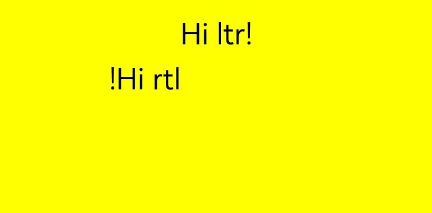

### filter

```ts
  // xxx.ets
  @Entry
  @Component
  struct FilterDemoOff {
    private settings: RenderingContextSettings = new RenderingContextSettings(true);
    private context: CanvasRenderingContext2D = new CanvasRenderingContext2D(this.settings);
    private offCanvas: OffscreenCanvas = new OffscreenCanvas(600, 600)
    private img:ImageBitmap = new ImageBitmap("common/images/example.jpg");

    build() {
      Flex({ direction: FlexDirection.Column, alignItems: ItemAlign.Center, justifyContent: FlexAlign.
Center }) {
        Canvas(this.context)
          .width('100%')
          .height('100%')
          .backgroundColor('#ffff00')
          .onReady(() =>{
            let offContext = this.offCanvas.getContext("2d", this.settings)
            let offctx = offContext
            let img = this.img

            offctx.drawImage(img, 0, 0, 100, 100);

            offctx.filter = 'grayscale(50%)';
            offctx.drawImage(img, 100, 0, 100, 100);

            offctx.filter = 'sepia(60%)';
            offctx.drawImage(img, 200, 0, 100, 100);

            offctx.filter = 'saturate(30%)';
            offctx.drawImage(img, 0, 100, 100, 100);

            offctx.filter = 'hue-rotate(90degree)';
            offctx.drawImage(img, 100, 100, 100, 100);

            offctx.filter = 'invert(100%)';
            offctx.drawImage(img, 200, 100, 100, 100);

            offctx.filter = 'opacity(25%)';
            offctx.drawImage(img, 0, 200, 100, 100);

            offctx.filter = 'brightness(0.4)';
            offctx.drawImage(img, 100, 200, 100, 100);

            offctx.filter = 'contrast(200%)';
            offctx.drawImage(img, 200, 200, 100, 100);

            offctx.filter = 'blur(5px)';
            offctx.drawImage(img, 0, 300, 100, 100);

            let image = this.offCanvas.transferToImageBitmap()
            this.context.transferFromImageBitmap(image)
          })
      }
      .width('100%')
      .height('100%')
    }
  }
```


## 方法


### fillRect

fillRect(x: number, y: number, w: number, h: number): void

填充一个矩形。

**卡片能力：** 从API version 9开始，该接口支持在ArkTS卡片中使用。

**原子化服务API：** 从API version 11开始，该接口支持在原子化服务中使用。

**系统能力：** SystemCapability.ArkUI.ArkUI.Full

 **参数：**

| 参数名    | 类型     | 必填   | 说明            |
| ------ | ------ | ---- | ------------- |
| x      | number | 是   | 指定矩形左上角点的x坐标。<br>默认单位：vp。 |
| y      | number | 是   | 指定矩形左上角点的y坐标。<br>默认单位：vp。 |
| w      | number | 是   | 指定矩形的宽度。<br>默认单位：vp。 |
| h      | number | 是   | 指定矩形的高度。<br>默认单位：vp。 |

 **示例：**

  ```ts
  // xxx.ets
  @Entry
  @Component
  struct FillRect {
    private settings: RenderingContextSettings = new RenderingContextSettings(true)
    private context: CanvasRenderingContext2D = new CanvasRenderingContext2D(this.settings)
    private offCanvas: OffscreenCanvas = new OffscreenCanvas(600, 600)
    
    build() {
      Flex({ direction: FlexDirection.Column, alignItems: ItemAlign.Center, justifyContent: FlexAlign.Center }) {
        Canvas(this.context)
          .width('100%')
          .height('100%')
          .backgroundColor('#ffff00')
          .onReady(() =>{
            let offContext = this.offCanvas.getContext("2d", this.settings)
            offContext.fillRect(30,30,100,100)
            let image = this.offCanvas.transferToImageBitmap()
            this.context.transferFromImageBitmap(image)
         })
        }
      .width('100%')
      .height('100%')
    }
  }
  ```

  


### strokeRect

strokeRect(x: number, y: number, w: number, h: number): void

绘制具有边框的矩形，矩形内部不填充。

**卡片能力：** 从API version 9开始，该接口支持在ArkTS卡片中使用。

**原子化服务API：** 从API version 11开始，该接口支持在原子化服务中使用。

**系统能力：** SystemCapability.ArkUI.ArkUI.Full

 **参数：**

| 参数名     | 类型     | 必填   | 说明           |
| ------ | ------ | ---- | ------------ |
| x      | number | 是   | 指定矩形的左上角x坐标。<br>默认单位：vp。 |
| y      | number | 是   | 指定矩形的左上角y坐标。<br>默认单位：vp。 |
| width  | number | 是   | 指定矩形的宽度。<br>默认单位：vp。 |
| height | number | 是   | 指定矩形的高度。<br>默认单位：vp。 |

 **示例：**

  ```ts
  // xxx.ets
  @Entry
  @Component
  struct StrokeRect {
    private settings: RenderingContextSettings = new RenderingContextSettings(true)
    private context: CanvasRenderingContext2D = new CanvasRenderingContext2D(this.settings)
    private offCanvas: OffscreenCanvas = new OffscreenCanvas(600, 600)

    build() {
      Flex({ direction: FlexDirection.Column, alignItems: ItemAlign.Center, justifyContent: FlexAlign.Center }) {
        Canvas(this.context)
          .width('100%')
          .height('100%')
          .backgroundColor('#ffff00')
          .onReady(() =>{
            let offContext = this.offCanvas.getContext("2d", this.settings)
            offContext.strokeRect(30, 30, 200, 150)
            let image = this.offCanvas.transferToImageBitmap()
            this.context.transferFromImageBitmap(image)
        })
      }
      .width('100%')
      .height('100%')
    }
  }
  ```

  


### clearRect

clearRect(x: number, y: number, w: number, h: number): void

删除指定区域内的绘制内容。

**卡片能力：** 从API version 9开始，该接口支持在ArkTS卡片中使用。

**原子化服务API：** 从API version 11开始，该接口支持在原子化服务中使用。

**系统能力：** SystemCapability.ArkUI.ArkUI.Full

 **参数：**

| 参数名   | 类型     | 必填   | 说明            |
| ------ | ------ | ---- | ------------- |
| x      | number | 是   | 指定矩形上的左上角x坐标。<br>默认单位：vp。 |
| y      | number | 是   | 指定矩形上的左上角y坐标。<br>默认单位：vp。 |
| width  | number | 是   | 指定矩形的宽度。<br>默认单位：vp。 |
| height | number | 是   | 指定矩形的高度。<br>默认单位：vp。 |

 **示例：**

  ```ts
  // xxx.ets
  @Entry
  @Component
  struct ClearRect {
    private settings: RenderingContextSettings = new RenderingContextSettings(true)
    private context: CanvasRenderingContext2D = new CanvasRenderingContext2D(this.settings)
    private offCanvas: OffscreenCanvas = new OffscreenCanvas(600, 600)

    build() {
      Flex({ direction: FlexDirection.Column, alignItems: ItemAlign.Center, justifyContent: FlexAlign.Center }) {
        Canvas(this.context)
          .width('100%')
          .height('100%')
          .backgroundColor('#ffff00')
          .onReady(() =>{
            let offContext = this.offCanvas.getContext("2d", this.settings)
            offContext.fillStyle = 'rgb(0,0,255)'
            offContext.fillRect(20,20,200,200)
            offContext.clearRect(30,30,150,100)
            let image = this.offCanvas.transferToImageBitmap()
            this.context.transferFromImageBitmap(image)
        })
      }
      .width('100%')
      .height('100%')
    }
  }
  ```

  


### fillText

fillText(text: string, x: number, y: number, maxWidth?: number): void

绘制填充类文本。

**卡片能力：** 从API version 9开始，该接口支持在ArkTS卡片中使用。

**原子化服务API：** 从API version 11开始，该接口支持在原子化服务中使用。

**系统能力：** SystemCapability.ArkUI.ArkUI.Full

**参数：**

| 参数名       | 类型     | 必填   | 说明              |
| -------- | ------ | ----  | --------------- |
| text     | string | 是    | 需要绘制的文本内容。 |
| x        | number | 是    | 需要绘制的文本的左下角x坐标。<br>默认单位：vp。 |
| y        | number | 是    | 需要绘制的文本的左下角y坐标。<br>默认单位：vp。 |
| maxWidth | number | 否    | 指定文本允许的最大宽度。<br>默认单位：vp。<br>默认值：不限制宽度。 |

 **示例：**

  ```ts
  // xxx.ets
  @Entry
  @Component
  struct FillText {
    private settings: RenderingContextSettings = new RenderingContextSettings(true)
    private context: CanvasRenderingContext2D = new CanvasRenderingContext2D(this.settings)
    private offCanvas: OffscreenCanvas = new OffscreenCanvas(600, 600)

    build() {
      Flex({ direction: FlexDirection.Column, alignItems: ItemAlign.Center, justifyContent: FlexAlign.Center }) {
        Canvas(this.context)
          .width('100%')
          .height('100%')
          .backgroundColor('#ffff00')
          .onReady(() =>{
            let offContext = this.offCanvas.getContext("2d", this.settings)
            offContext.font = '30px sans-serif'
            offContext.fillText("Hello World!", 20, 100)
            let image = this.offCanvas.transferToImageBitmap()
            this.context.transferFromImageBitmap(image)
        })
      }
      .width('100%')
      .height('100%')
    }
  }
  ```

  


### strokeText

strokeText(text: string, x: number, y: number, maxWidth?: number): void

绘制描边类文本。

**卡片能力：** 从API version 9开始，该接口支持在ArkTS卡片中使用。

**原子化服务API：** 从API version 11开始，该接口支持在原子化服务中使用。

**系统能力：** SystemCapability.ArkUI.ArkUI.Full

**参数：**

| 参数名       | 类型     | 必填   | 说明       |
| -------- | ------ | ---- | --------------- |
| text     | string | 是  | 需要绘制的文本内容。 |
| x        | number | 是  | 需要绘制的文本的左下角x坐标。<br>默认单位：vp。 |
| y        | number | 是  | 需要绘制的文本的左下角y坐标。<br>默认单位：vp。 |
| maxWidth | number | 否  | 需要绘制的文本的最大宽度。<br>默认单位：vp。<br>默认值：不限制宽度。 |

 **示例：**

  ```ts
  // xxx.ets
  @Entry
  @Component
  struct StrokeText {
    private settings: RenderingContextSettings = new RenderingContextSettings(true)
    private context: CanvasRenderingContext2D = new CanvasRenderingContext2D(this.settings)
    private offCanvas: OffscreenCanvas = new OffscreenCanvas(600, 600)

    build() {
      Flex({ direction: FlexDirection.Column, alignItems: ItemAlign.Center, justifyContent: FlexAlign.Center }) {
        Canvas(this.context)
          .width('100%')
          .height('100%')
          .backgroundColor('#ffff00')
          .onReady(() =>{
            let offContext = this.offCanvas.getContext("2d", this.settings)
            offContext.font = '55px sans-serif'
            offContext.strokeText("Hello World!", 20, 60)
            let image = this.offCanvas.transferToImageBitmap()
            this.context.transferFromImageBitmap(image)
        })
      }
      .width('100%')
      .height('100%')
    }
  }
  ```

  


### measureText

measureText(text: string): TextMetrics

该方法返回一个文本测算的对象，通过该对象可以获取指定文本的宽度值。

**卡片能力：** 从API version 9开始，该接口支持在ArkTS卡片中使用。

**原子化服务API：** 从API version 11开始，该接口支持在原子化服务中使用。

**系统能力：** SystemCapability.ArkUI.ArkUI.Full

 **参数：**

| 参数名  | 类型     | 必填  | 说明         |
| ---- | ------ | ---- | ---------- |
| text | string | 是  | 需要进行测量的文本。 |

 **返回值：**

| 类型          | 说明                                       |
| ----------- | ---------------------------------------- |
| [TextMetrics](ts-canvasrenderingcontext2d.md#textmetrics) | 文本的尺寸信息。 |

 **示例：**

  ```ts
  // xxx.ets
  @Entry
  @Component
  struct MeasureText {
    private settings: RenderingContextSettings = new RenderingContextSettings(true)
    private context: CanvasRenderingContext2D = new CanvasRenderingContext2D(this.settings)
    private offCanvas: OffscreenCanvas = new OffscreenCanvas(600, 600)

    build() {
      Flex({ direction: FlexDirection.Column, alignItems: ItemAlign.Center, justifyContent: FlexAlign.Center }) {
        Canvas(this.context)
          .width('100%')
          .height('100%')
          .backgroundColor('#ffff00')
          .onReady(() =>{
            let offContext = this.offCanvas.getContext("2d", this.settings)
            offContext.font = '50px sans-serif'
            offContext.fillText("Hello World!", 20, 100)
            offContext.fillText("width:" + this.context.measureText("Hello World!").width, 20, 200)
            let image = this.offCanvas.transferToImageBitmap()
            this.context.transferFromImageBitmap(image)
        })
      }
      .width('100%')
      .height('100%')
    }
  }
  ```

  


### stroke

stroke(): void

根据当前的路径，进行边框绘制操作。

**卡片能力：** 从API version 9开始，该接口支持在ArkTS卡片中使用。

**原子化服务API：** 从API version 11开始，该接口支持在原子化服务中使用。

**系统能力：** SystemCapability.ArkUI.ArkUI.Full

**示例：**

  ```ts
  // xxx.ets
  @Entry
  @Component
  struct Stroke {
    private settings: RenderingContextSettings = new RenderingContextSettings(true)
    private context: CanvasRenderingContext2D = new CanvasRenderingContext2D(this.settings)
    private offCanvas: OffscreenCanvas = new OffscreenCanvas(600, 600)

    build() {
      Flex({ direction: FlexDirection.Column, alignItems: ItemAlign.Center, justifyContent: FlexAlign.Center }) {
        Canvas(this.context)
          .width('100%')
          .height('100%')
          .backgroundColor('#ffff00')
          .onReady(() => {
            let offContext = this.offCanvas.getContext("2d", this.settings)
            offContext.moveTo(125, 25)
            offContext.lineTo(125, 105)
            offContext.lineTo(175, 105)
            offContext.lineTo(175, 25)
            offContext.strokeStyle = 'rgb(255,0,0)'
            offContext.stroke()
            let image = this.offCanvas.transferToImageBitmap()
            this.context.transferFromImageBitmap(image)
          })
      }
      .width('100%')
      .height('100%')
    }
  }
  ```

  

stroke(path: Path2D): void

根据指定的路径，进行边框绘制操作。

**卡片能力：** 从API version 9开始，该接口支持在ArkTS卡片中使用。

**原子化服务API：** 从API version 11开始，该接口支持在原子化服务中使用。

**系统能力：** SystemCapability.ArkUI.ArkUI.Full

 **参数：**

| 参数名   | 类型                                       | 必填   | 说明 |
| ---- | ---------------------------------------- | ---- | ------------ |
| path | [Path2D](ts-components-canvas-path2d.md) | 是    |  需要绘制的Path2D。 |

 **示例：**

  ```ts
  // xxx.ets
  @Entry
  @Component
  struct Stroke {
    private settings: RenderingContextSettings = new RenderingContextSettings(true)
    private context: CanvasRenderingContext2D = new CanvasRenderingContext2D(this.settings)
    private offCanvas: OffscreenCanvas = new OffscreenCanvas(600, 600)
    private path2Da: Path2D = new Path2D()

    build() {
      Flex({ direction: FlexDirection.Column, alignItems: ItemAlign.Center, justifyContent: FlexAlign.Center }) {
        Canvas(this.context)
          .width('100%')
          .height('100%')
          .backgroundColor('#ffff00')
          .onReady(() => {
            let offContext = this.offCanvas.getContext("2d", this.settings)
            this.path2Da.moveTo(25, 25)
            this.path2Da.lineTo(25, 105)
            this.path2Da.lineTo(75, 105)
            this.path2Da.lineTo(75, 25)
            offContext.strokeStyle = 'rgb(0,0,255)'
            offContext.stroke(this.path2Da)
            let image = this.offCanvas.transferToImageBitmap()
            this.context.transferFromImageBitmap(image)
          })
      }
      .width('100%')
      .height('100%')
    }
  }
  ```

  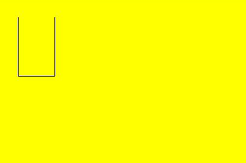


### beginPath

beginPath(): void

创建一个新的绘制路径。

**卡片能力：** 从API version 9开始，该接口支持在ArkTS卡片中使用。

**原子化服务API：** 从API version 11开始，该接口支持在原子化服务中使用。

**系统能力：** SystemCapability.ArkUI.ArkUI.Full

 **示例：**

  ```ts
  // xxx.ets
  @Entry
  @Component
  struct BeginPath {
    private settings: RenderingContextSettings = new RenderingContextSettings(true)
    private context: CanvasRenderingContext2D = new CanvasRenderingContext2D(this.settings)
    private offCanvas: OffscreenCanvas = new OffscreenCanvas(600, 600)

    build() {
      Flex({ direction: FlexDirection.Column, alignItems: ItemAlign.Center, justifyContent: FlexAlign.Center }) {
        Canvas(this.context)
          .width('100%')
          .height('100%')
          .backgroundColor('#ffff00')
          .onReady(() =>{
            let offContext = this.offCanvas.getContext("2d", this.settings)
            offContext.beginPath()
            offContext.lineWidth = 6
            offContext.strokeStyle = '#0000ff'
            offContext.moveTo(15, 80)
            offContext.lineTo(280, 160)
            offContext.stroke()
            let image = this.offCanvas.transferToImageBitmap()
            this.context.transferFromImageBitmap(image)
          })
      }
      .width('100%')
      .height('100%')
    }
  }
  ```

  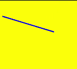


### moveTo

moveTo(x: number, y: number): void

路径从当前点移动到指定点。

**卡片能力：** 从API version 9开始，该接口支持在ArkTS卡片中使用。

**原子化服务API：** 从API version 11开始，该接口支持在原子化服务中使用。

**系统能力：** SystemCapability.ArkUI.ArkUI.Full

 **参数：**

| 参数名   | 类型     | 必填   | 说明        |
| ---- | ------ | ---- | --------- |
| x    | number | 是    | 指定位置的x坐标。<br>默认单位：vp。 |
| y    | number | 是    | 指定位置的y坐标。<br>默认单位：vp。 |

 **示例：**

  ```ts
  // xxx.ets
  @Entry
  @Component
  struct MoveTo {
    private settings: RenderingContextSettings = new RenderingContextSettings(true)
    private context: CanvasRenderingContext2D = new CanvasRenderingContext2D(this.settings)
    private offCanvas: OffscreenCanvas = new OffscreenCanvas(600, 600)

    build() {
      Flex({ direction: FlexDirection.Column, alignItems: ItemAlign.Center, justifyContent: FlexAlign.Center }) {
        Canvas(this.context)
          .width('100%')
          .height('100%')
          .backgroundColor('#ffff00')
          .onReady(() =>{
            let offContext = this.offCanvas.getContext("2d", this.settings)
            offContext.beginPath()
            offContext.moveTo(10, 10)
            offContext.lineTo(280, 160)
            offContext.stroke()
            let image = this.offCanvas.transferToImageBitmap()
            this.context.transferFromImageBitmap(image)
          })
      }
      .width('100%')
      .height('100%')
    }
  }
  ```

  


### lineTo

lineTo(x: number, y: number): void

从当前点到指定点进行路径连接。

**卡片能力：** 从API version 9开始，该接口支持在ArkTS卡片中使用。

**原子化服务API：** 从API version 11开始，该接口支持在原子化服务中使用。

**系统能力：** SystemCapability.ArkUI.ArkUI.Full

 **参数：**

| 参数名   | 类型     | 必填   | 描述        |
| ---- | ------ | ----  | --------- |
| x    | number | 是    | 指定位置的x坐标。<br>默认单位：vp。 |
| y    | number | 是    | 指定位置的y坐标。<br>默认单位：vp。 |

 **示例：**

  ```ts
  // xxx.ets
  @Entry
  @Component
  struct LineTo {
    private settings: RenderingContextSettings = new RenderingContextSettings(true)
    private context: CanvasRenderingContext2D = new CanvasRenderingContext2D(this.settings)
    private offCanvas: OffscreenCanvas = new OffscreenCanvas(600, 600)

    build() {
      Flex({ direction: FlexDirection.Column, alignItems: ItemAlign.Center, justifyContent: FlexAlign.Center }) {
        Canvas(this.context)
          .width('100%')
          .height('100%')
          .backgroundColor('#ffff00')
          .onReady(() =>{
            let offContext = this.offCanvas.getContext("2d", this.settings)
            offContext.beginPath()
            offContext.moveTo(10, 10)
            offContext.lineTo(280, 160)
            offContext.stroke()
            let image = this.offCanvas.transferToImageBitmap()
            this.context.transferFromImageBitmap(image)
          })
      }
      .width('100%')
      .height('100%')
    }
  }
  ```

  


### closePath

closePath(): void

结束当前路径形成一个封闭路径。

**卡片能力：** 从API version 9开始，该接口支持在ArkTS卡片中使用。

**原子化服务API：** 从API version 11开始，该接口支持在原子化服务中使用。

**系统能力：** SystemCapability.ArkUI.ArkUI.Full

 **示例：**

  ```ts
  // xxx.ets
  @Entry
  @Component
  struct ClosePath {
    private settings: RenderingContextSettings = new RenderingContextSettings(true)
    private context: CanvasRenderingContext2D = new CanvasRenderingContext2D(this.settings)
    private offCanvas: OffscreenCanvas = new OffscreenCanvas(600, 600)

    build() {
      Flex({ direction: FlexDirection.Column, alignItems: ItemAlign.Center, justifyContent: FlexAlign.Center }) {
        Canvas(this.context)
          .width('100%')
          .height('100%')
          .backgroundColor('#ffff00')
          .onReady(() =>{
              let offContext = this.offCanvas.getContext("2d", this.settings)
              offContext.beginPath()
              offContext.moveTo(30, 30)
              offContext.lineTo(110, 30)
              offContext.lineTo(70, 90)
              offContext.closePath()
              offContext.stroke()
              let image = this.offCanvas.transferToImageBitmap()
              this.context.transferFromImageBitmap(image)
          })
      }
      .width('100%')
      .height('100%')
    }
  }
  ```

  


### createPattern

createPattern(image: ImageBitmap, repetition: string | null): CanvasPattern | null

通过指定图像和重复方式创建图片填充的模板。

**卡片能力：** 从API version 9开始，该接口支持在ArkTS卡片中使用。

**原子化服务API：** 从API version 11开始，该接口支持在原子化服务中使用。

**系统能力：** SystemCapability.ArkUI.ArkUI.Full

**参数：**

| 参数名 | 类型 | 必填   | 说明 |
| ---------- | ---------------------------------------- | ---- | ---------------------------------------- |
| image      | [ImageBitmap](ts-components-canvas-imagebitmap.md) | 是    | 图源对象，具体参考ImageBitmap对象。 |
| repetition | string \| null | 是    | 设置图像重复的方式，取值为：'repeat'、'repeat-x'、&nbsp;'repeat-y'、'no-repeat'、'clamp'、'mirror'。 |

**返回值：**

| 类型                                       | 说明                      |
| ---------------------------------------- | ----------------------- |
| [CanvasPattern](ts-components-canvas-canvaspattern.md#canvaspattern) \| null | 通过指定图像和重复方式创建图片填充的模板对象。 |

 **示例：**

  ```ts
  // xxx.ets
  @Entry
  @Component
  struct CreatePattern {
    private settings: RenderingContextSettings = new RenderingContextSettings(true)
    private context: CanvasRenderingContext2D = new CanvasRenderingContext2D(this.settings)
    private img:ImageBitmap = new ImageBitmap("common/images/icon.jpg")
    private offCanvas: OffscreenCanvas = new OffscreenCanvas(600, 600)

    build() {
      Flex({ direction: FlexDirection.Column, alignItems: ItemAlign.Center, justifyContent: FlexAlign.Center }) {
        Canvas(this.context)
          .width('100%')
          .height('100%')
          .backgroundColor('#ffff00')
          .onReady(() =>{
            let offContext = this.offCanvas.getContext("2d", this.settings)
            let pattern = offContext.createPattern(this.img, 'repeat')
            offContext.fillStyle = pattern as CanvasPattern
            offContext.fillRect(0, 0, 200, 200)
            let image = this.offCanvas.transferToImageBitmap()
            this.context.transferFromImageBitmap(image)
          })
      }
      .width('100%')
      .height('100%')
    }
  }
  ```

  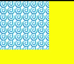


### bezierCurveTo

bezierCurveTo(cp1x: number, cp1y: number, cp2x: number, cp2y: number, x: number, y: number): void

创建三次贝赛尔曲线的路径。

**卡片能力：** 从API version 9开始，该接口支持在ArkTS卡片中使用。

**原子化服务API：** 从API version 11开始，该接口支持在原子化服务中使用。

**系统能力：** SystemCapability.ArkUI.ArkUI.Full

 **参数：**

| 参数名   | 类型     | 必填  | 说明             |
| ---- | ------ | ---- | -------------- |
| cp1x | number | 是  | 第一个贝塞尔参数的x坐标值。<br>默认单位：vp。 |
| cp1y | number | 是  | 第一个贝塞尔参数的y坐标值。<br>默认单位：vp。 |
| cp2x | number | 是  | 第二个贝塞尔参数的x坐标值。<br>默认单位：vp。 |
| cp2y | number | 是  | 第二个贝塞尔参数的y坐标值。<br>默认单位：vp。 |
| x    | number | 是  | 路径结束时的x坐标值。<br>默认单位：vp。 |
| y    | number | 是  | 路径结束时的y坐标值。<br>默认单位：vp。 |

 **示例：**

  ```ts
  // xxx.ets
  @Entry
  @Component
  struct BezierCurveTo {
    private settings: RenderingContextSettings = new RenderingContextSettings(true)
    private context: CanvasRenderingContext2D = new CanvasRenderingContext2D(this.settings)
    private offCanvas: OffscreenCanvas = new OffscreenCanvas(600, 600)

    build() {
      Flex({ direction: FlexDirection.Column, alignItems: ItemAlign.Center, justifyContent: FlexAlign.Center }) {
        Canvas(this.context)
          .width('100%')
          .height('100%')
          .backgroundColor('#ffff00')
          .onReady(() =>{
            let offContext = this.offCanvas.getContext("2d", this.settings)
            offContext.beginPath()
            offContext.moveTo(10, 10)
            offContext.bezierCurveTo(20, 100, 200, 100, 200, 20)
            offContext.stroke()
            let image = this.offCanvas.transferToImageBitmap()
            this.context.transferFromImageBitmap(image)
          })
      }
      .width('100%')
      .height('100%')
    }
  }
  ```

  


### quadraticCurveTo

quadraticCurveTo(cpx: number, cpy: number, x: number, y: number): void

创建二次贝赛尔曲线的路径。

**卡片能力：** 从API version 9开始，该接口支持在ArkTS卡片中使用。

**原子化服务API：** 从API version 11开始，该接口支持在原子化服务中使用。

**系统能力：** SystemCapability.ArkUI.ArkUI.Full

 **参数：**
 
| 参数名   | 类型     | 必填  | 说明             |
| ---- | ------ | ---- | -------------- |
| cpx  | number | 是   | 贝塞尔参数的x坐标值。<br>默认单位：vp。 |
| cpy  | number | 是   | 贝塞尔参数的y坐标值。<br>默认单位：vp。 |
| x    | number | 是   | 路径结束时的x坐标值。<br>默认单位：vp。 |
| y    | number | 是   | 路径结束时的y坐标值。<br>默认单位：vp。 |

 **示例：**

  ```ts
  // xxx.ets
  @Entry
  @Component
  struct QuadraticCurveTo {
    private settings: RenderingContextSettings = new RenderingContextSettings(true)
    private context: CanvasRenderingContext2D = new CanvasRenderingContext2D(this.settings)
    private offCanvas: OffscreenCanvas = new OffscreenCanvas(600, 600)

    build() {
      Flex({ direction: FlexDirection.Column, alignItems: ItemAlign.Center, justifyContent: FlexAlign.Center }) {
        Canvas(this.context)
          .width('100%')
          .height('100%')
          .backgroundColor('#ffff00')
          .onReady(() =>{
            let offContext = this.offCanvas.getContext("2d", this.settings)
            offContext.beginPath()
            offContext.moveTo(20, 20)
            offContext.quadraticCurveTo(100, 100, 200, 20)
            offContext.stroke()
            let image = this.offCanvas.transferToImageBitmap()
            this.context.transferFromImageBitmap(image)
        })
      }
      .width('100%')
      .height('100%')
    }
  }
  ```

  


### arc

arc(x: number, y: number, radius: number, startAngle: number, endAngle: number, counterclockwise?: boolean): void

绘制弧线路径。

**卡片能力：** 从API version 9开始，该接口支持在ArkTS卡片中使用。

**原子化服务API：** 从API version 11开始，该接口支持在原子化服务中使用。

**系统能力：** SystemCapability.ArkUI.ArkUI.Full

 **参数：**

| 参数名 | 类型      | 必填   | 说明         |
| ---------------- | ------- | ---- | ---------- |
| x                | number  | 是   | 弧线圆心的x坐标值。<br>默认单位：vp。 |
| y                | number  | 是   | 弧线圆心的y坐标值。<br>默认单位：vp。 |
| radius           | number  | 是   | 弧线的圆半径。<br>默认单位：vp。 |
| startAngle       | number  | 是   | 弧线的起始弧度。<br>默认单位：弧度。 |
| endAngle         | number  | 是   | 弧线的终止弧度。<br>默认单位：弧度。 |
| counterclockwise | boolean | 否   | 是否逆时针绘制圆弧。<br>默认值：false。 |

 **示例：**

  ```ts
  // xxx.ets
  @Entry
  @Component
  struct Arc {
    private settings: RenderingContextSettings = new RenderingContextSettings(true)
    private context: CanvasRenderingContext2D = new CanvasRenderingContext2D(this.settings)
    private offCanvas: OffscreenCanvas = new OffscreenCanvas(600, 600)

    build() {
      Flex({ direction: FlexDirection.Column, alignItems: ItemAlign.Center, justifyContent: FlexAlign.Center }) {
        Canvas(this.context)
          .width('100%')
          .height('100%')
          .backgroundColor('#ffff00')
          .onReady(() =>{
            let offContext = this.offCanvas.getContext("2d", this.settings)
            offContext.beginPath()
            offContext.arc(100, 75, 50, 0, 6.28)
            offContext.stroke()
            let image = this.offCanvas.transferToImageBitmap()
            this.context.transferFromImageBitmap(image)
          })
      }
      .width('100%')
      .height('100%')
    }
  }
  ```

  


### arcTo

arcTo(x1: number, y1: number, x2: number, y2: number, radius: number): void

依据给定的控制点和圆弧半径创建圆弧路径。

**卡片能力：** 从API version 9开始，该接口支持在ArkTS卡片中使用。

**原子化服务API：** 从API version 11开始，该接口支持在原子化服务中使用。

**系统能力：** SystemCapability.ArkUI.ArkUI.Full

 **参数：**

| 参数名    | 类型     | 必填  | 说明         |
| ------ | ------ | ---- | --------------- |
| x1     | number | 是  | 第一个控制点的x坐标值。<br>默认单位：vp。 |
| y1     | number | 是  | 第一个控制点的y坐标值。<br>默认单位：vp。 |
| x2     | number | 是  | 第二个控制点的x坐标值。<br>默认单位：vp。 |
| y2     | number | 是  | 第二个控制点的y坐标值。<br>默认单位：vp。 |
| radius | number | 是  | 圆弧的圆半径值。<br>默认单位：vp。 |

 **示例：**

  ```ts
  // xxx.ets
  @Entry
  @Component
  struct ArcTo {
    private settings: RenderingContextSettings = new RenderingContextSettings(true)
    private context: CanvasRenderingContext2D = new CanvasRenderingContext2D(this.settings)
    private offCanvas: OffscreenCanvas = new OffscreenCanvas(600, 600)

    build() {
      Flex({ direction: FlexDirection.Column, alignItems: ItemAlign.Center, justifyContent: FlexAlign.Center }) {
        Canvas(this.context)
          .width('100%')
          .height('100%')
          .backgroundColor('#ffff00')
          .onReady(() =>{
            let offContext = this.offCanvas.getContext("2d", this.settings)

            // 切线
            offContext.beginPath()
            offContext.strokeStyle = '#808080'
            offContext.lineWidth = 1.5;
            offContext.moveTo(360, 20);
            offContext.lineTo(360, 170);
            offContext.lineTo(110, 170);
            offContext.stroke();

            // 圆弧
            offContext.beginPath()
            offContext.strokeStyle = '#000000'
            offContext.lineWidth = 3;
            offContext.moveTo(360, 20)
            offContext.arcTo(360, 170, 110, 170, 150)
            offContext.stroke()

            // 起始点
            offContext.beginPath();
            offContext.fillStyle = '#00ff00';
            offContext.arc(360, 20, 4, 0, 2 * Math.PI);
            offContext.fill();

            // 控制点
            offContext.beginPath();
            offContext.fillStyle = '#ff0000';
            offContext.arc(360, 170, 4, 0, 2 * Math.PI);
            offContext.arc(110, 170, 4, 0, 2 * Math.PI);
            offContext.fill();

            let image = this.offCanvas.transferToImageBitmap()
            this.context.transferFromImageBitmap(image)
          })
      }
      .width('100%')
      .height('100%')
    }
  }
  ```

  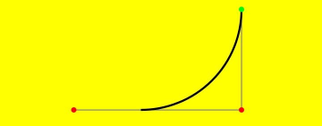

  > 此示例中，arcTo()创建的圆弧为黑色，圆弧的两条切线为灰色。控制点为红色，起始点为绿色。
  >
  > 可以想象两条切线：一条切线从起始点到第一个控制点，另一条切线从第一个控制点到第二个控制点。arcTo()在这两条切线间创建一个圆弧，并使圆弧与这两条切线都相切。


### ellipse

ellipse(x: number, y: number, radiusX: number, radiusY: number, rotation: number, startAngle: number, endAngle: number, counterclockwise?: boolean): void

在规定的矩形区域绘制一个椭圆。

**卡片能力：** 从API version 9开始，该接口支持在ArkTS卡片中使用。

**原子化服务API：** 从API version 11开始，该接口支持在原子化服务中使用。

**系统能力：** SystemCapability.ArkUI.ArkUI.Full

 **参数：**

| 参数名              | 类型      | 必填   | 说明 |
| ---------------- | ------- | ---- | ---------------------------------------- |
| x                | number  | 是     | 椭圆圆心的x轴坐标。<br>默认单位：vp。 |
| y                | number  | 是     | 椭圆圆心的y轴坐标。<br>默认单位：vp。 |
| radiusX          | number  | 是     | 椭圆x轴的半径长度。<br>默认单位：vp。 |
| radiusY          | number  | 是     | 椭圆y轴的半径长度。<br>默认单位：vp。 |
| rotation         | number  | 是     | 椭圆的旋转角度。<br>单位为弧度。 |
| startAngle       | number  | 是     | 椭圆绘制的起始点角度。<br>单位为弧度。 |
| endAngle         | number  | 是     | 椭圆绘制的结束点角度。<br>单位为弧度。 |
| counterclockwise | boolean | 否     | 是否以逆时针方向绘制椭圆。<br>true:逆时针方向绘制椭圆。<br>false:顺时针方向绘制椭圆。<br>默认值：false。 |

 **示例：**

  ```ts
  // xxx.ets
  @Entry
  @Component
  struct CanvasExample {
    private settings: RenderingContextSettings = new RenderingContextSettings(true)
    private context: CanvasRenderingContext2D = new CanvasRenderingContext2D(this.settings)
    private offCanvas: OffscreenCanvas = new OffscreenCanvas(600, 600)
    build() {
      Flex({ direction: FlexDirection.Column, alignItems: ItemAlign.Center, justifyContent: FlexAlign.Center }) {
        Canvas(this.context)
          .width('100%')
          .height('100%')
          .backgroundColor('#ffff00')
          .onReady(() =>{
            let offContext = this.offCanvas.getContext("2d", this.settings)
            offContext.beginPath()
            offContext.ellipse(200, 200, 50, 100, Math.PI * 0.25, Math.PI * 0.5, Math.PI * 2, false)
            offContext.stroke()
            offContext.beginPath()
            offContext.ellipse(200, 300, 50, 100, Math.PI * 0.25, Math.PI * 0.5, Math.PI * 2, true)
            offContext.stroke()
            let image = this.offCanvas.transferToImageBitmap()
            this.context.transferFromImageBitmap(image)
          })
      }
      .width('100%')
      .height('100%')
    }
  }
  ```

  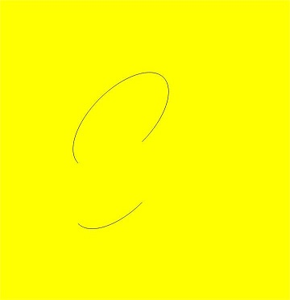


### rect

rect(x: number, y: number, w: number, h: number): void

创建矩形路径。

**卡片能力：** 从API version 9开始，该接口支持在ArkTS卡片中使用。

**原子化服务API：** 从API version 11开始，该接口支持在原子化服务中使用。

**系统能力：** SystemCapability.ArkUI.ArkUI.Full

 **参数：**

| 参数名  | 类型     | 必填 | 说明 |
| ---- | ------ | ---- | ------------- |
| x    | number | 是  | 指定矩形的左上角x坐标值。<br>默认单位：vp。 |
| y    | number | 是  | 指定矩形的左上角y坐标值。<br>默认单位：vp。 |
| w    | number | 是  | 指定矩形的宽度。<br>默认单位：vp。 |
| h    | number | 是  | 指定矩形的高度。<br>默认单位：vp。 |

 **示例：**

  ```ts
  // xxx.ets
  @Entry
  @Component
  struct CanvasExample {
    private settings: RenderingContextSettings = new RenderingContextSettings(true)
    private context: CanvasRenderingContext2D = new CanvasRenderingContext2D(this.settings)
    private offCanvas: OffscreenCanvas = new OffscreenCanvas(600, 600)

    build() {
      Flex({ direction: FlexDirection.Column, alignItems: ItemAlign.Center, justifyContent: FlexAlign.Center }) {
        Canvas(this.context)
          .width('100%')
          .height('100%')
          .backgroundColor('#ffff00')
          .onReady(() =>{
            let offContext = this.offCanvas.getContext("2d", this.settings)
            offContext.rect(20, 20, 100, 100) // Create a 100*100 rectangle at (20, 20)
            offContext.stroke()
            let image = this.offCanvas.transferToImageBitmap()
            this.context.transferFromImageBitmap(image)
          })
      }
      .width('100%')
      .height('100%')
    }
  }
  ```

  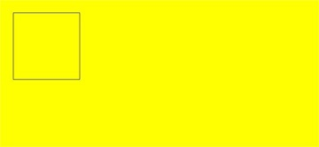


### fill

fill(fillRule?: CanvasFillRule): void

对封闭路径进行填充。

**卡片能力：** 从API version 9开始，该接口支持在ArkTS卡片中使用。

**原子化服务API：** 从API version 11开始，该接口支持在原子化服务中使用。

**系统能力：** SystemCapability.ArkUI.ArkUI.Full

**参数:** 

| 参数名 | 类型 | 必填   | 说明 |
| -------- | -------------- | ---- | ---------------------------------------- |
| fillRule | [CanvasFillRule](ts-canvasrenderingcontext2d.md#canvasfillrule) | 否 | 指定要填充对象的规则。<br/>可选参数为："nonzero", "evenodd"。<br>默认值："nonzero"。 |

  ```ts
  // xxx.ets
  @Entry
  @Component
  struct Fill {
    private settings: RenderingContextSettings = new RenderingContextSettings(true)
    private context: CanvasRenderingContext2D = new CanvasRenderingContext2D(this.settings)
    private offCanvas: OffscreenCanvas = new OffscreenCanvas(600, 600)

    build() {
      Flex({ direction: FlexDirection.Column, alignItems: ItemAlign.Center, justifyContent: FlexAlign.Center }) {
        Canvas(this.context)
          .width('100%')
          .height('100%')
          .backgroundColor('#ffff00')
          .onReady(() =>{
            let offContext = this.offCanvas.getContext("2d", this.settings)
            offContext.fillStyle = '#000000'
            offContext.rect(20, 20, 100, 100) // Create a 100*100 rectangle at (20, 20)
            offContext.fill()
            let image = this.offCanvas.transferToImageBitmap()
            this.context.transferFromImageBitmap(image)
          })
      }
      .width('100%')
      .height('100%')
    }
  }
  ```

  


fill(path: Path2D, fillRule?: CanvasFillRule): void

对封闭路径进行填充。

**卡片能力：** 从API version 9开始，该接口支持在ArkTS卡片中使用。

**原子化服务API：** 从API version 11开始，该接口支持在原子化服务中使用。

**系统能力：** SystemCapability.ArkUI.ArkUI.Full

**参数:** 

| 参数名       | 类型 | 必填 | 说明 |
| -------- | -------------- | ---- | ----------------- |
| path     | [Path2D](ts-components-canvas-path2d.md)         | 是   | Path2D填充路径。                              |
| fillRule | [CanvasFillRule](ts-canvasrenderingcontext2d.md#canvasfillrule) | 否 | 指定要填充对象的规则。<br/>可选参数为："nonzero", "evenodd"。<br>默认值："nonzero"。 |

**示例:**   

```ts
// xxx.ets
@Entry
@Component
struct Fill {
  private settings: RenderingContextSettings = new RenderingContextSettings(true)
  private context: CanvasRenderingContext2D = new CanvasRenderingContext2D(this.settings)
  private offCanvas: OffscreenCanvas = new OffscreenCanvas(600, 600)

  build() {
    Flex({ direction: FlexDirection.Column, alignItems: ItemAlign.Center, justifyContent: FlexAlign.Center }) {
      Canvas(this.context)
        .width('100%')
        .height('100%')
        .backgroundColor('#ffff00')
        .onReady(() =>{
          let offContext = this.offCanvas.getContext("2d", this.settings)
          let region = new Path2D()
          region.moveTo(30, 90)
          region.lineTo(110, 20)
          region.lineTo(240, 130)
          region.lineTo(60, 130)
          region.lineTo(190, 20)
          region.lineTo(270, 90)
          region.closePath()
          // Fill path
          offContext.fillStyle = '#00ff00'
          offContext.fill(region, "evenodd")
          let image = this.offCanvas.transferToImageBitmap()
          this.context.transferFromImageBitmap(image)
        })
    }
    .width('100%')
    .height('100%')
  }
}
```

 


### clip

clip(fillRule?: CanvasFillRule): void

设置当前路径为剪切路径。

**卡片能力：** 从API version 9开始，该接口支持在ArkTS卡片中使用。

**原子化服务API：** 从API version 11开始，该接口支持在原子化服务中使用。

**系统能力：** SystemCapability.ArkUI.ArkUI.Full

**参数:** 

| 参数名 | 类型 | 必填   | 说明 |
| -------- | -------------- | ---- | ---------------------------------------- |
| fillRule | [CanvasFillRule](ts-canvasrenderingcontext2d.md#canvasfillrule) | 否 | 指定要剪切对象的规则。<br/>可选参数为："nonzero", "evenodd"。<br>默认值："nonzero"。 |

 **示例：**

  ```ts
  // xxx.ets
  @Entry
  @Component
  struct Clip {
    private settings: RenderingContextSettings = new RenderingContextSettings(true)
    private context: CanvasRenderingContext2D = new CanvasRenderingContext2D(this.settings)
    private offCanvas: OffscreenCanvas = new OffscreenCanvas(600, 600)

    build() {
      Flex({ direction: FlexDirection.Column, alignItems: ItemAlign.Center, justifyContent: FlexAlign.Center }) {
        Canvas(this.context)
          .width('100%')
          .height('100%')
          .backgroundColor('#ffff00')
          .onReady(() =>{
            let offContext = this.offCanvas.getContext("2d", this.settings)
            offContext.rect(0, 0, 100, 200)
            offContext.stroke()
            offContext.clip()
            offContext.fillStyle = "rgb(255,0,0)"
            offContext.fillRect(0, 0, 200, 200)
            let image = this.offCanvas.transferToImageBitmap()
            this.context.transferFromImageBitmap(image)
          })
      }
      .width('100%')
      .height('100%')
    }
  }
  ```

  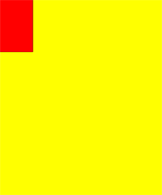


clip(path: Path2D, fillRule?: CanvasFillRule): void

设置封闭路径为剪切路径。

**卡片能力：** 从API version 9开始，该接口支持在ArkTS卡片中使用。

**原子化服务API：** 从API version 11开始，该接口支持在原子化服务中使用。

**系统能力：** SystemCapability.ArkUI.ArkUI.Full

**参数:** 

| 参数名       | 类型 | 必填   | 描述                                       |
| -------- | -------------- | ---- | ---------------------------------------- |
| path | [Path2D](ts-components-canvas-path2d.md) | 是 | Path2D剪切路径。 |
| fillRule | [CanvasFillRule](ts-canvasrenderingcontext2d.md#canvasfillrule) | 否 | 指定要剪切对象的规则。<br/>可选参数为："nonzero", "evenodd"。<br>默认值："nonzero"。 |

 **示例：**

  ```ts
  // xxx.ets
  @Entry
  @Component
  struct Clip {
    private settings: RenderingContextSettings = new RenderingContextSettings(true)
    private context: CanvasRenderingContext2D = new CanvasRenderingContext2D(this.settings)
    private offCanvas: OffscreenCanvas = new OffscreenCanvas(600, 600)

    build() {
      Flex({ direction: FlexDirection.Column, alignItems: ItemAlign.Center, justifyContent: FlexAlign.Center }) {
        Canvas(this.context)
          .width('100%')
          .height('100%')
          .backgroundColor('#ffff00')
          .onReady(() =>{
            let offContext = this.offCanvas.getContext("2d", this.settings)
            let region = new Path2D()
            region.moveTo(30, 90)
            region.lineTo(110, 20)
            region.lineTo(240, 130)
            region.lineTo(60, 130)
            region.lineTo(190, 20)
            region.lineTo(270, 90)
            region.closePath()
            offContext.clip(region,"evenodd")
            offContext.fillStyle = "rgb(0,255,0)"
            offContext.fillRect(0, 0, 600, 600)
            let image = this.offCanvas.transferToImageBitmap()
            this.context.transferFromImageBitmap(image)
          })
      }
      .width('100%')
      .height('100%')
    }
  }
  ```

  


### reset<sup>12+</sup>

reset(): void

将OffscreenCanvasRenderingContext2D重置为其默认状态，清除后台缓冲区、绘制状态栈、绘制路径和样式。

**系统能力：** SystemCapability.ArkUI.ArkUI.Full

**示例：**

  ```ts
  // xxx.ets
  @Entry
  @Component
  struct Reset {
    private settings: RenderingContextSettings = new RenderingContextSettings(true)
    private context: CanvasRenderingContext2D = new CanvasRenderingContext2D(this.settings)
    private offCanvas: OffscreenCanvas = new OffscreenCanvas(600, 600)

    build() {
      Flex({ direction: FlexDirection.Column, alignItems: ItemAlign.Center, justifyContent: FlexAlign.Center }) {
        Canvas(this.context)
          .width('100%')
          .height('100%')
          .backgroundColor('#ffff00')
          .onReady(() =>{
            let offContext = this.offCanvas.getContext("2d", this.settings)
            offContext.fillStyle = '#0000ff'
            offContext.fillRect(20, 20, 150, 100)
            offContext.reset()
            offContext.fillRect(20, 150, 150, 100)
            let image = this.offCanvas.transferToImageBitmap()
            this.context.transferFromImageBitmap(image)
          })
      }
      .width('100%')
      .height('100%')
    }
  }
  ```

  

### saveLayer<sup>12+</sup>

saveLayer(): void

创建一个图层。

**原子化服务API：** 从API version 12开始，该接口支持在原子化服务中使用。

**系统能力：** SystemCapability.ArkUI.ArkUI.Full

**示例：**

  ```ts
  // xxx.ets
  @Entry
  @Component
  struct saveLayer {
    private settings: RenderingContextSettings = new RenderingContextSettings(true)
    private context: CanvasRenderingContext2D = new CanvasRenderingContext2D(this.settings)
    private offCanvas: OffscreenCanvas = new OffscreenCanvas(600, 600)

    build() {
      Flex({ direction: FlexDirection.Column, alignItems: ItemAlign.Center, justifyContent: FlexAlign.Center }) {
        Canvas(this.context)
          .width('100%')
          .height('100%')
          .backgroundColor('#ffff00')
          .onReady(() => {
            let offContext = this.offCanvas.getContext("2d", this.settings)
            offContext.fillStyle = "#0000ff"
            offContext.fillRect(50,100,300,100)
            offContext.fillStyle = "#00ffff"
            offContext.fillRect(50,150,300,100)
            offContext.globalCompositeOperation = 'destination-over'
            offContext.saveLayer()
            offContext.globalCompositeOperation = 'source-over'
            offContext.fillStyle = "#ff0000"
            offContext.fillRect(100,50,100,300)
            offContext.fillStyle = "#00ff00"
            offContext.fillRect(150,50,100,300)
            offContext.restoreLayer()
            let image = this.offCanvas.transferToImageBitmap()
            this.context.transferFromImageBitmap(image)
          })
      }
      .width('100%')
      .height('100%')
    }
  }
  ```
  

### restoreLayer<sup>12+</sup>

restoreLayer(): void

恢复图像变换和裁剪状态至saveLayer前的状态，并将图层绘制在canvas上。restoreLayer示例同saveLayer。

**原子化服务API：** 从API version 12开始，该接口支持在原子化服务中使用。

**系统能力：** SystemCapability.ArkUI.ArkUI.Full

### resetTransform
 
resetTransform(): void

使用单位矩阵重新设置当前矩阵。

**卡片能力：** 从API version 9开始，该接口支持在ArkTS卡片中使用。

**原子化服务API：** 从API version 11开始，该接口支持在原子化服务中使用。

**系统能力：** SystemCapability.ArkUI.ArkUI.Full

**示例：**

  ```ts
  // xxx.ets
  @Entry
  @Component
  struct ResetTransform {
    private settings: RenderingContextSettings = new RenderingContextSettings(true)
    private context: CanvasRenderingContext2D = new CanvasRenderingContext2D(this.settings)
    private offCanvas: OffscreenCanvas = new OffscreenCanvas(600, 600)

    build() {
      Flex({ direction: FlexDirection.Column, alignItems: ItemAlign.Center, justifyContent: FlexAlign.Center }) {
        Canvas(this.context)
          .width('100%')
          .height('100%')
          .backgroundColor('#ffff00')
          .onReady(() => {
            let offContext = this.offCanvas.getContext("2d", this.settings)
            offContext.setTransform(1,0.5, -0.5, 1, 10, 10)
            offContext.fillStyle = 'rgb(0,0,255)'
            offContext.fillRect(0, 0, 100, 100)
            offContext.resetTransform()
            offContext.fillStyle = 'rgb(255,0,0)'
            offContext.fillRect(0, 0, 100, 100)
            let image = this.offCanvas.transferToImageBitmap()
            this.context.transferFromImageBitmap(image)
          })
      }
      .width('100%')
      .height('100%')
    }
  }
  ```
  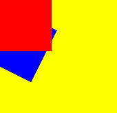

### rotate

rotate(angle: number): void

针对当前坐标轴进行顺时针旋转。

**卡片能力：** 从API version 9开始，该接口支持在ArkTS卡片中使用。

**原子化服务API：** 从API version 11开始，该接口支持在原子化服务中使用。

**系统能力：** SystemCapability.ArkUI.ArkUI.Full

 **参数：**

| 参数名    | 类型     | 必填   | 说明 |
| ----- | ------ | ---- | ---------------------------------------- |
| angle | number | 是    | 设置顺时针旋转的弧度值，可以通过 degree * Math.PI / 180 将角度转换为弧度值。<br>单位：弧度。 |

 **示例：**

  ```ts
  // xxx.ets
  @Entry
  @Component
  struct Rotate {
    private settings: RenderingContextSettings = new RenderingContextSettings(true)
    private context: CanvasRenderingContext2D = new CanvasRenderingContext2D(this.settings)
    private offCanvas: OffscreenCanvas = new OffscreenCanvas(600, 600)

    build() {
      Flex({ direction: FlexDirection.Column, alignItems: ItemAlign.Center, justifyContent: FlexAlign.Center }) {
        Canvas(this.context)
          .width('100%')
          .height('100%')
          .backgroundColor('#ffff00')
          .onReady(() =>{
            let offContext = this.offCanvas.getContext("2d", this.settings)
            offContext.rotate(45 * Math.PI / 180)
            offContext.fillRect(70, 20, 50, 50)
            let image = this.offCanvas.transferToImageBitmap()
            this.context.transferFromImageBitmap(image)
          })
      }
      .width('100%')
      .height('100%')
    }
  }
  ```

  


### scale

scale(x: number, y: number): void

设置canvas画布的缩放变换属性，后续的绘制操作将按照缩放比例进行缩放。

**卡片能力：** 从API version 9开始，该接口支持在ArkTS卡片中使用。

**原子化服务API：** 从API version 11开始，该接口支持在原子化服务中使用。

**系统能力：** SystemCapability.ArkUI.ArkUI.Full

 **参数：**

| 参数名   | 类型     | 必填   |  说明      |
| ---- | ------ | ---- | ----------- |
| x    | number | 是  | 设置水平方向的缩放值。 |
| y    | number | 是  | 设置垂直方向的缩放值。 |

 **示例：**

  ```ts
  // xxx.ets
  @Entry
  @Component
  struct Scale {
    private settings: RenderingContextSettings = new RenderingContextSettings(true)
    private context: CanvasRenderingContext2D = new CanvasRenderingContext2D(this.settings)
    private offCanvas: OffscreenCanvas = new OffscreenCanvas(600, 600)

    build() {
      Flex({ direction: FlexDirection.Column, alignItems: ItemAlign.Center, justifyContent: FlexAlign.Center }) {
        Canvas(this.context)
          .width('100%')
          .height('100%')
          .backgroundColor('#ffff00')
          .onReady(() =>{
            let offContext = this.offCanvas.getContext("2d", this.settings)
            offContext.lineWidth = 3
            offContext.strokeRect(30, 30, 50, 50)
            offContext.scale(2, 2) // Scale to 200%
            offContext.strokeRect(30, 30, 50, 50)
            let image = this.offCanvas.transferToImageBitmap()
            this.context.transferFromImageBitmap(image)
          })
      }
      .width('100%')
      .height('100%')
    }
  }
  ```

  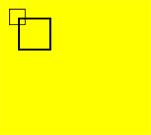


### transform

transform(a: number, b: number, c: number, d: number, e: number, f: number): void

transform方法对应一个变换矩阵，想对一个图形进行变化的时候，只要设置此变换矩阵相应的参数，对图形的各个定点的坐标分别乘以这个矩阵，就能得到新的定点的坐标。矩阵变换效果可叠加。

**卡片能力：** 从API version 9开始，该接口支持在ArkTS卡片中使用。

**原子化服务API：** 从API version 11开始，该接口支持在原子化服务中使用。

**系统能力：** SystemCapability.ArkUI.ArkUI.Full

> **说明：**
> 变换后的坐标计算方式（x和y为变换前坐标，x'和y'为变换后坐标)：
>
> - x' = scaleX \* x + skewY \* y + translateX
>
> - y' = skewX \* x + scaleY \* y + translateY

**参数：**

| 参数名   | 类型     | 必填 | 说明 |
| ---- | ------ | ---- | -------------------- |
| a    | number | 是    | scaleX: 指定水平缩放值。 |
| b    | number | 是    | skewY: 指定垂直倾斜值。  |
| c    | number | 是    | skewX: 指定水平倾斜值。  |
| d    | number | 是    | scaleY: 指定垂直缩放值。 |
| e    | number | 是    | translateX: 指定水平移动值。<br>默认单位：vp。 |
| f    | number | 是    | translateY: 指定垂直移动值。<br>默认单位：vp。 |

 **示例：**

  ```ts
  // xxx.ets
  @Entry
  @Component
  struct Transform {
    private settings: RenderingContextSettings = new RenderingContextSettings(true)
    private context: CanvasRenderingContext2D = new CanvasRenderingContext2D(this.settings)
    private offCanvas: OffscreenCanvas = new OffscreenCanvas(600, 600)

    build() {
      Flex({ direction: FlexDirection.Column, alignItems: ItemAlign.Center, justifyContent: FlexAlign.Center }) {
        Canvas(this.context)
          .width('100%')
          .height('100%')
          .backgroundColor('#ffff00')
          .onReady(() =>{
            let offContext = this.offCanvas.getContext("2d", this.settings)
            offContext.fillStyle = 'rgb(0,0,0)'
            offContext.fillRect(0, 0, 100, 100)
            offContext.transform(1, 0.5, -0.5, 1, 10, 10)
            offContext.fillStyle = 'rgb(255,0,0)'
            offContext.fillRect(0, 0, 100, 100)
            offContext.transform(1, 0.5, -0.5, 1, 10, 10)
            offContext.fillStyle = 'rgb(0,0,255)'
            offContext.fillRect(0, 0, 100, 100)
            let image = this.offCanvas.transferToImageBitmap()
            this.context.transferFromImageBitmap(image)
          })
      }
      .width('100%')
      .height('100%')
    }
  }
  ```

  


### setTransform

setTransform(a: number, b: number, c: number, d: number, e: number, f: number): void

setTransform方法使用的参数和transform()方法相同，但setTransform()方法会重置现有的变换矩阵并创建新的变换矩阵。

**卡片能力：** 从API version 9开始，该接口支持在ArkTS卡片中使用。

**原子化服务API：** 从API version 11开始，该接口支持在原子化服务中使用。

**系统能力：** SystemCapability.ArkUI.ArkUI.Full

**参数：**

| 参数名   | 类型     | 必填  | 描述                   |
| ---- | ------ | ---- | -------------------- |
| a    | number | 是    | scaleX: 指定水平缩放值。 |
| b    | number | 是    | skewY: 指定垂直倾斜值。  |
| c    | number | 是    | skewX: 指定水平倾斜值。  |
| d    | number | 是    | scaleY: 指定垂直缩放值。 |
| e    | number | 是    | translateX: 指定水平移动值。<br>默认单位：vp。 |
| f    | number | 是    | translateY: 指定垂直移动值。<br>默认单位：vp。 |

 **示例：**

  ```ts
  // xxx.ets
  @Entry
  @Component
  struct SetTransform {
    private settings: RenderingContextSettings = new RenderingContextSettings(true)
    private context: CanvasRenderingContext2D = new CanvasRenderingContext2D(this.settings)
    private offCanvas: OffscreenCanvas = new OffscreenCanvas(600, 600)

    build() {
      Flex({ direction: FlexDirection.Column, alignItems: ItemAlign.Center, justifyContent: FlexAlign.Center }) {
        Canvas(this.context)
          .width('100%')
          .height('100%')
          .backgroundColor('#ffff00')
          .onReady(() =>{
            let offContext = this.offCanvas.getContext("2d", this.settings)
            offContext.fillStyle = 'rgb(255,0,0)'
            offContext.fillRect(0, 0, 100, 100)
            offContext.setTransform(1,0.5, -0.5, 1, 10, 10)
            offContext.fillStyle = 'rgb(0,0,255)'
            offContext.fillRect(0, 0, 100, 100)
            let image = this.offCanvas.transferToImageBitmap()
            this.context.transferFromImageBitmap(image)
          })
      }
      .width('100%')
      .height('100%')
    }
  }
  ```

  


### setTransform

setTransform(transform?: Matrix2D): void

以Matrix2D对象为模板重置现有的变换矩阵并创建新的变换矩阵。

**卡片能力：** 从API version 9开始，该接口支持在ArkTS卡片中使用。

**原子化服务API：** 从API version 11开始，该接口支持在原子化服务中使用。

**系统能力：** SystemCapability.ArkUI.ArkUI.Full

**参数：**

| 参数名       | 类型 | 必填   | 描述    |
| --------- | ---------------------------------------- | ---- | ----- |
| transform | [Matrix2D](ts-components-canvas-matrix2d.md#Matrix2D) | 否 | 变换矩阵。<br>默认值：null。 |

**示例：**
 ```ts
 // xxx.ets
  @Entry
  @Component
  struct TransFormDemo {
    private settings: RenderingContextSettings = new RenderingContextSettings(true);
    private context1: CanvasRenderingContext2D = new CanvasRenderingContext2D(this.settings);
    private offcontext1: OffscreenCanvasRenderingContext2D = new OffscreenCanvasRenderingContext2D(600, 200, this.settings);
    private context2: CanvasRenderingContext2D = new CanvasRenderingContext2D(this.settings);
    private offcontext2: OffscreenCanvasRenderingContext2D = new OffscreenCanvasRenderingContext2D(600, 200, this.settings);

    build() {
      Flex({ direction: FlexDirection.Column, alignItems: ItemAlign.Center, justifyContent: FlexAlign.Center }) {
        Text('context1');
        Canvas(this.context1)
          .width('230vp')
          .height('160vp')
          .backgroundColor('#ffff00')
          .onReady(() =>{
            this.offcontext1.fillRect(100, 20, 50, 50);
            this.offcontext1.setTransform(1, 0.5, -0.5, 1, 10, 10);
            this.offcontext1.fillRect(100, 20, 50, 50);
            let image = this.offcontext1.transferToImageBitmap();
            this.context1.transferFromImageBitmap(image);
          })
        Text('context2');
        Canvas(this.context2)
          .width('230vp')
          .height('160vp')
          .backgroundColor('#0ffff0')
          .onReady(() =>{
            this.offcontext2.fillRect(100, 20, 50, 50);
            let storedTransform = this.offcontext1.getTransform();
            this.offcontext2.setTransform(storedTransform);
            this.offcontext2.fillRect(100, 20, 50, 50);
            let image = this.offcontext2.transferToImageBitmap();
            this.context2.transferFromImageBitmap(image);
          })
      }
      .width('100%')
      .height('100%')
    }
  }
 ```
 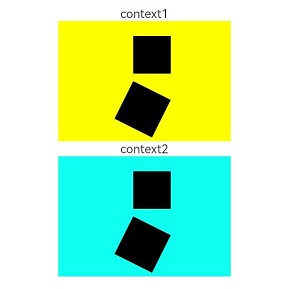

### getTransform

getTransform(): Matrix2D

获取当前被应用到上下文的转换矩阵。

**卡片能力：** 从API version 9开始，该接口支持在ArkTS卡片中使用。

**原子化服务API：** 从API version 11开始，该接口支持在原子化服务中使用。

**系统能力：** SystemCapability.ArkUI.ArkUI.Full

**返回值：**

| 类型                                       | 说明    |
| ---------------------------------------- | ----- |
| [Matrix2D](ts-components-canvas-matrix2d.md#Matrix2D) | 矩阵对象。 |

**示例：**

  ```ts
  // xxx.ets
  @Entry
  @Component
  struct TransFormDemo {
    private settings: RenderingContextSettings = new RenderingContextSettings(true);
    private context1: CanvasRenderingContext2D = new CanvasRenderingContext2D(this.settings);
    private offcontext1: OffscreenCanvasRenderingContext2D = new OffscreenCanvasRenderingContext2D(600, 100, this.settings);
    private context2: CanvasRenderingContext2D = new CanvasRenderingContext2D(this.settings);
    private offcontext2: OffscreenCanvasRenderingContext2D = new OffscreenCanvasRenderingContext2D(600, 100, this.settings);

    build() {
      Flex({ direction: FlexDirection.Column, alignItems: ItemAlign.Center, justifyContent: FlexAlign.Center }) {
        Text('context1');
        Canvas(this.context1)
          .width('230vp')
          .height('120vp')
          .backgroundColor('#ffff00')
          .onReady(() =>{
            this.offcontext1.fillRect(50, 50, 50, 50);
            this.offcontext1.setTransform(1.2, Math.PI/8, Math.PI/6, 0.5, 30, -25);
            this.offcontext1.fillRect(50, 50, 50, 50);
            let image = this.offcontext1.transferToImageBitmap();
            this.context1.transferFromImageBitmap(image);
          })
        Text('context2');
        Canvas(this.context2)
          .width('230vp')
          .height('120vp')
          .backgroundColor('#0ffff0')
          .onReady(() =>{
            this.offcontext2.fillRect(50, 50, 50, 50);
            let storedTransform = this.offcontext1.getTransform();
            console.log("Matrix [scaleX = " + storedTransform.scaleX + ", scaleY = " + storedTransform.scaleY +
            ", rotateX = " + storedTransform.rotateX + ", rotateY = " + storedTransform.rotateY +
            ", translateX = " + storedTransform.translateX + ", translateY = " + storedTransform.translateY + "]")
            this.offcontext2.setTransform(storedTransform);
            this.offcontext2.fillRect(50,50,50,50);
            let image = this.offcontext2.transferToImageBitmap();
            this.context2.transferFromImageBitmap(image);
          })
      }
      .width('100%')
      .height('100%')
    }
  }
  ```

  

### translate

translate(x: number, y: number): void

移动当前坐标系的原点。

**卡片能力：** 从API version 9开始，该接口支持在ArkTS卡片中使用。

**原子化服务API：** 从API version 11开始，该接口支持在原子化服务中使用。

**系统能力：** SystemCapability.ArkUI.ArkUI.Full

 **参数：**

| 参数名   | 类型     | 必填   | 说明 |
| ---- | ------ | ---- | -------- |
| x    | number | 是  | 设置水平平移量。<br>默认单位：vp。 |
| y    | number | 是  | 设置竖直平移量。<br>默认单位：vp。 |

 **示例：**

  ```ts
  // xxx.ets
  @Entry
  @Component
  struct Translate {
    private settings: RenderingContextSettings = new RenderingContextSettings(true)
    private context: CanvasRenderingContext2D = new CanvasRenderingContext2D(this.settings)
    private offCanvas: OffscreenCanvas = new OffscreenCanvas(600, 600)

    build() {
      Flex({ direction: FlexDirection.Column, alignItems: ItemAlign.Center, justifyContent: FlexAlign.Center }) {
        Canvas(this.context)
          .width('100%')
          .height('100%')
          .backgroundColor('#ffff00')
          .onReady(() =>{
            let offContext = this.offCanvas.getContext("2d", this.settings)
            offContext.fillRect(10, 10, 50, 50)
            offContext.translate(70, 70)
            offContext.fillRect(10, 10, 50, 50)
            let image = this.offCanvas.transferToImageBitmap()
            this.context.transferFromImageBitmap(image)
          })
      }
      .width('100%')
      .height('100%')
    }
  }
  ```

  


### drawImage

drawImage(image: ImageBitmap | PixelMap, dx: number, dy: number): void

进行图像绘制。

**卡片能力：** 从API version 9开始，该接口支持在ArkTS卡片中使用，卡片中不支持PixelMap对象。

**原子化服务API：** 从API version 11开始，该接口支持在原子化服务中使用。

**系统能力：** SystemCapability.ArkUI.ArkUI.Full

 **参数：**

| 参数    | 类型 | 必填   | 说明 |
| ----- | ---------------------------------------- | ---- | ----------------------------- |
| image | [ImageBitmap](ts-components-canvas-imagebitmap.md) 或[PixelMap](../../apis-image-kit/js-apis-image.md#pixelmap7) | 是 | 图片资源，请参考ImageBitmap或PixelMap。 |
| dx    | number | 是  | 绘制区域左上角在x轴的位置。<br>默认单位：vp。 |
| dy    | number | 是  | 绘制区域左上角在y&nbsp;轴的位置。<br>默认单位：vp。 |

drawImage(image: ImageBitmap | PixelMap, dx: number, dy: number, dw: number, dh: number): void

进行图像绘制。

**卡片能力：** 从API version 9开始，该接口支持在ArkTS卡片中使用，卡片中不支持PixelMap对象。

**原子化服务API：** 从API version 11开始，该接口支持在原子化服务中使用。

**系统能力：** SystemCapability.ArkUI.ArkUI.Full

 **参数：**

| 参数    | 类型 | 必填   | 说明 |
| ----- | ---------------------------------------- | ---- | ----------------------------- |
| image | [ImageBitmap](ts-components-canvas-imagebitmap.md) 或[PixelMap](../../apis-image-kit/js-apis-image.md#pixelmap7) | 是 | 图片资源，请参考ImageBitmap或PixelMap。 |
| dx    | number | 是  | 绘制区域左上角在x轴的位置。<br>默认单位：vp。 |
| dy    | number | 是  | 绘制区域左上角在y&nbsp;轴的位置。<br>默认单位：vp。 |
| dw    | number | 是  | 绘制区域的宽度。<br>默认单位：vp。 |
| dh    | number | 是  | 绘制区域的高度。<br>默认单位：vp。 |

drawImage(image: ImageBitmap | PixelMap, sx: number, sy: number, sw: number, sh: number, dx: number, dy: number, dw: number, dh: number): void

进行图像绘制。

**卡片能力：** 从API version 9开始，该接口支持在ArkTS卡片中使用，卡片中不支持PixelMap对象。

**原子化服务API：** 从API version 11开始，该接口支持在原子化服务中使用。

**系统能力：** SystemCapability.ArkUI.ArkUI.Full

 **参数：**

| 参数    | 类型 | 必填   | 说明 |
| ----- | ---------------------------------------- | ---- | ----------------------------- |
| image | [ImageBitmap](ts-components-canvas-imagebitmap.md) 或[PixelMap](../../apis-image-kit/js-apis-image.md#pixelmap7) | 是 | 图片资源，请参考ImageBitmap或PixelMap。 |
| sx    | number | 是  | 裁切源图像时距离源图像左上角的x坐标值。<br>image类型为ImageBitmap时，默认单位：vp。<br>image类型为PixelMap时，单位：px。 |
| sy    | number | 是  | 裁切源图像时距离源图像左上角的y坐标值。<br>image类型为ImageBitmap时，默认单位：vp。<br>image类型为PixelMap时，单位：px。 |
| sw    | number | 是  | 裁切源图像时需要裁切的宽度。<br>image类型为ImageBitmap时，默认单位：vp。<br>image类型为PixelMap时，单位：px。 |
| sh    | number | 是  | 裁切源图像时需要裁切的高度。<br>image类型为ImageBitmap时，默认单位：vp。<br>image类型为PixelMap时，单位：px。 |
| dx    | number | 是  | 绘制区域左上角在x轴的位置。<br>默认单位：vp。 |
| dy    | number | 是  | 绘制区域左上角在y轴的位置。<br>默认单位：vp。 |
| dw    | number | 是  | 绘制区域的宽度。<br>默认单位：vp。 |
| dh    | number | 是  | 绘制区域的高度。<br>默认单位：vp。 |

 **示例：**

  ```ts
  // xxx.ets
  @Entry
  @Component
  struct DrawImage {
    private settings: RenderingContextSettings = new RenderingContextSettings(true)
    private context: CanvasRenderingContext2D = new CanvasRenderingContext2D(this.settings)
    private img:ImageBitmap = new ImageBitmap("common/images/example.jpg")
    private offCanvas: OffscreenCanvas = new OffscreenCanvas(600, 600)
    build() {
      Flex({ direction: FlexDirection.Column, alignItems: ItemAlign.Center, justifyContent: FlexAlign.Center }) {
        Canvas(this.context)
          .width('100%')
          .height('100%')
          .backgroundColor('#ffff00')
          .onReady(() => {
            let offContext = this.offCanvas.getContext("2d", this.settings)
            offContext.drawImage(this.img, 0, 0)
            offContext.drawImage(this.img, 0, 150, 300, 100)
            offContext.drawImage(this.img, 0, 0, 500, 500, 0, 300, 400, 200)
            let image = this.offCanvas.transferToImageBitmap()
            this.context.transferFromImageBitmap(image)
          })
      }
      .width('100%')
      .height('100%')
    }
  }
  ```

  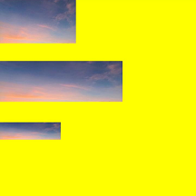


### createImageData

createImageData(sw: number, sh: number): ImageData

根据当前ImageData对象重新创建一个宽、高相同的ImageData对象，请参考[ImageData](ts-components-canvas-imagedata.md)，该接口存在内存拷贝行为，高耗时，应避免频繁使用。createImageData示例同putImageData。

**卡片能力：** 从API version 9开始，该接口支持在ArkTS卡片中使用。

**原子化服务API：** 从API version 11开始，该接口支持在原子化服务中使用。

**系统能力：** SystemCapability.ArkUI.ArkUI.Full

 **参数：**

| 参数名   | 类型     | 必填     | 说明   |
| ---- | ------ | ---- | ------------- |
| sw   | number | 是   | ImageData的宽度。<br>默认单位：vp。 |
| sh   | number | 是   | ImageData的高度。<br>默认单位：vp。 |


createImageData(imageData: ImageData): ImageData

根据已创建的ImageData对象创建新的ImageData对象（不会复制图像数据），请参考[ImageData](ts-components-canvas-imagedata.md)，该接口存在内存拷贝行为，高耗时，应避免频繁使用。createImageData示例同putImageData。

**卡片能力：** 从API version 9开始，该接口支持在ArkTS卡片中使用。

 **参数：**

| 参数名       | 类型 | 必填   | 说明 |
| --------- | ---------------------------------------- | ---- | ---------------- |
| imagedata | [ImageData](ts-components-canvas-imagedata.md) | 是  | 被复制的ImageData对象。 |

 **返回值：**

| 类型                                       | 说明            |
| ---------------------------------------- | ------------- |
| [ImageData](ts-components-canvas-imagedata.md) | 新的ImageData对象 |

### getPixelMap

getPixelMap(sx: number, sy: number, sw: number, sh: number): PixelMap

以当前canvas指定区域内的像素创建[PixelMap](../../apis-image-kit/js-apis-image.md#pixelmap7)对象，该接口存在内存拷贝行为，高耗时，应避免频繁使用。

**原子化服务API：** 从API version 11开始，该接口支持在原子化服务中使用。

**系统能力：** SystemCapability.ArkUI.ArkUI.Full

 **参数：**

| 参数   | 类型     | 必填  | 说明            |
| ---- | ------ | ---- | --------------- |
| sx   | number | 是  | 需要输出的区域的左上角x坐标。<br>默认单位：vp。 |
| sy   | number | 是  | 需要输出的区域的左上角y坐标。<br>默认单位：vp。 |
| sw   | number | 是  | 需要输出的区域的宽度。<br>默认单位：vp。 |
| sh   | number | 是  | 需要输出的区域的高度。<br>默认单位：vp。 |

**返回值：**

| 类型                                       | 说明           |
| ---------------------------------------- | ------------ |
| [PixelMap](../../apis-image-kit/js-apis-image.md#pixelmap7) | 新的PixelMap对象 |

**示例：**

  ```ts
  // xxx.ets
  @Entry
  @Component
  struct GetPixelMap {
    private settings: RenderingContextSettings = new RenderingContextSettings(true)
    private context: CanvasRenderingContext2D = new CanvasRenderingContext2D(this.settings)
    private img: ImageBitmap = new ImageBitmap("common/images/example.jpg")
    private offCanvas: OffscreenCanvas = new OffscreenCanvas(600, 600)

    build() {
      Flex({ direction: FlexDirection.Column, alignItems: ItemAlign.Center, justifyContent: FlexAlign.Center }) {
        Canvas(this.context)
          .width('100%')
          .height('100%')
          .backgroundColor('#ffff00')
          .onReady(() => {
            let offContext = this.offCanvas.getContext("2d", this.settings)
            offContext.drawImage(this.img, 100, 100, 130, 130)
            let pixelmap = offContext.getPixelMap(150, 150, 130, 130)
            offContext.setPixelMap(pixelmap)
            let image = this.offCanvas.transferToImageBitmap()
            this.context.transferFromImageBitmap(image)
          })
      }
      .width('100%')
      .height('100%')
    }
  }
  ```

  

### setPixelMap

setPixelMap(value?: PixelMap): void

将当前传入[PixelMap](../../apis-image-kit/js-apis-image.md#pixelmap7)对象绘制在画布上。setPixelMap示例同getPixelMap。

**原子化服务API：** 从API version 11开始，该接口支持在原子化服务中使用。

**系统能力：** SystemCapability.ArkUI.ArkUI.Full

 **参数：**

| 参数名   | 类型     | 必填   | 说明 |
| ---- | ------ | ---- | --------------- |
|  value  | [PixelMap](../../apis-image-kit/js-apis-image.md#pixelmap7) | 否 | 包含像素值的PixelMap对象<br>默认值：null。 |


### getImageData

getImageData(sx: number, sy: number, sw: number, sh: number): ImageData

以当前canvas指定区域内的像素创建[ImageData](ts-components-canvas-imagedata.md)对象，该接口存在内存拷贝行为，高耗时，应避免频繁使用。

**卡片能力：** 从API version 9开始，该接口支持在ArkTS卡片中使用。

**原子化服务API：** 从API version 11开始，该接口支持在原子化服务中使用。

**系统能力：** SystemCapability.ArkUI.ArkUI.Full

 **参数：**

| 参数名   | 类型     | 必填 | 说明      |
| ---- | ------ | ---- | --------------- |
| sx   | number | 是 | 需要输出的区域的左上角x坐标。<br>默认单位：vp。 |
| sy   | number | 是 | 需要输出的区域的左上角y坐标。<br>默认单位：vp。 |
| sw   | number | 是 | 需要输出的区域的宽度。<br>默认单位：vp。 |
| sh   | number | 是 | 需要输出的区域的高度。<br>默认单位：vp。 |

   **返回值：**

| 类型                                       | 说明            |
| ---------------------------------------- | ------------- |
| [ImageData](ts-components-canvas-imagedata.md) | 新的ImageData对象 |


**示例：**

  ```ts
  // xxx.ets
  @Entry
  @Component
  struct GetImageData {
    private settings: RenderingContextSettings = new RenderingContextSettings(true)
    private context: CanvasRenderingContext2D = new CanvasRenderingContext2D(this.settings)
    private offCanvas: OffscreenCanvas = new OffscreenCanvas(600, 600)
    private img:ImageBitmap = new ImageBitmap("/common/images/1234.png")

    build() {
      Flex({ direction: FlexDirection.Column, alignItems: ItemAlign.Center, justifyContent: FlexAlign.Center }) {
        Canvas(this.context)
          .width('100%')
          .height('100%')
          .backgroundColor('#ffff00')
          .onReady(() =>{
            let offContext = this.offCanvas.getContext("2d", this.settings)
            offContext.drawImage(this.img,0,0,130,130)
            let imagedata = offContext.getImageData(50,50,130,130)
            offContext.putImageData(imagedata,150,150)
            let image = this.offCanvas.transferToImageBitmap()
            this.context.transferFromImageBitmap(image)
          })
      }
      .width('100%')
      .height('100%')
    }
  }
  ```

  


### putImageData

putImageData(imageData: ImageData, dx: number | string, dy: number | string): void

使用[ImageData](ts-components-canvas-imagedata.md)数据填充新的矩形区域。

**卡片能力：** 从API version 9开始，该接口支持在ArkTS卡片中使用。

**原子化服务API：** 从API version 11开始，该接口支持在原子化服务中使用。

**系统能力：** SystemCapability.ArkUI.ArkUI.Full

 **参数：**

| 参数名          | 类型 | 必填 | 描述 |
| ----------- | ---------------------------------------- | ---- | ----------------------------- |
| imagedata   | Object | 是 | 包含像素值的ImageData对象。 |
| dx          | number&nbsp;\|&nbsp;string<sup>10+</sup> | 是 | 填充区域在x轴方向的偏移量。<br>默认单位：vp。 |
| dy          | number&nbsp;\|&nbsp;string<sup>10+</sup> | 是   | 填充区域在y轴方向的偏移量。<br>默认单位：vp。 |

putImageData(imageData: ImageData, dx: number | string, dy: number | string, dirtyX: number | string, dirtyY: number | string, dirtyWidth?: number | string, dirtyHeight: number | string): void

使用[ImageData](ts-components-canvas-imagedata.md)数据填充新的矩形区域。

**卡片能力：** 从API version 9开始，该接口支持在ArkTS卡片中使用。

**原子化服务API：** 从API version 11开始，该接口支持在原子化服务中使用。

**系统能力：** SystemCapability.ArkUI.ArkUI.Full

 **参数：**

| 参数名          | 类型 | 必填 | 描述 |
| ----------- | ---------------------------------------- | ---- | ----------------------------- |
| imagedata   | Object | 是 | 包含像素值的ImageData对象。 |
| dx          | number&nbsp;\|&nbsp;string<sup>10+</sup> | 是 | 填充区域在x轴方向的偏移量。<br>默认单位：vp。 |
| dy          | number&nbsp;\|&nbsp;string<sup>10+</sup> | 是   | 填充区域在y轴方向的偏移量。<br>默认单位：vp。 |
| dirtyX      | number&nbsp;\|&nbsp;string<sup>10+</sup> | 是  | 源图像数据矩形裁切范围左上角距离源图像左上角的x轴偏移量。<br>默认单位：vp。 |
| dirtyY      | number&nbsp;\|&nbsp;string<sup>10+</sup> | 是  | 源图像数据矩形裁切范围左上角距离源图像左上角的y轴偏移量。<br>默认单位：vp。 |
| dirtyWidth  | number&nbsp;\|&nbsp;string<sup>10+</sup> | 是 | 源图像数据矩形裁切范围的宽度。<br>默认单位：vp。 |
| dirtyHeight | number&nbsp;\|&nbsp;string<sup>10+</sup> | 是 | 源图像数据矩形裁切范围的高度。<br>默认单位：vp。 |

 **示例：**

  ```ts
  // xxx.ets
  @Entry
  @Component
  struct PutImageData {
    private settings: RenderingContextSettings = new RenderingContextSettings(true)
    private context: CanvasRenderingContext2D = new CanvasRenderingContext2D(this.settings)
    private offCanvas: OffscreenCanvas = new OffscreenCanvas(600, 600)

    build() {
      Flex({ direction: FlexDirection.Column, alignItems: ItemAlign.Center, justifyContent: FlexAlign.Center }) {
        Canvas(this.context)
          .width('100%')
          .height('100%')
          .backgroundColor('#ffff00')
          .onReady(() => {
            let offContext = this.offCanvas.getContext("2d", this.settings)
            let imageDataNum = offContext.createImageData(100, 100)
            let imageData = offContext.createImageData(imageDataNum)
            for (let i = 0; i < imageData.data.length; i += 4) {
              imageData.data[i + 0] = 255
              imageData.data[i + 1] = 0
              imageData.data[i + 2] = 255
              imageData.data[i + 3] = 255
            }
            offContext.putImageData(imageData, 10, 10)
            offContext.putImageData(imageData, 150, 10, 0, 0, 50, 50)
            let image = this.offCanvas.transferToImageBitmap()
            this.context.transferFromImageBitmap(image)
          })
      }
      .width('100%')
      .height('100%')
    }
  }
  ```

  

### setLineDash

setLineDash(segments: number[]): void

设置画布的虚线样式。

**卡片能力：** 从API version 9开始，该接口支持在ArkTS卡片中使用。

**原子化服务API：** 从API version 11开始，该接口支持在原子化服务中使用。

**参数：** 

| 参数名      | 类型   |  必填  | 说明             |
| -------- | -------- | -------- | ------------------- |
| segments | number[] | 是 | 描述线段如何交替和线段间距长度的数组。<br>默认单位：vp。 |

**示例：** 

  ```ts
  @Entry
  @Component
  struct SetLineDash {
    private settings: RenderingContextSettings = new RenderingContextSettings(true)
    private context: CanvasRenderingContext2D = new CanvasRenderingContext2D(this.settings)
    private offCanvas: OffscreenCanvas = new OffscreenCanvas(600, 600)
    
    build() {
      Flex({ direction: FlexDirection.Column, alignItems: ItemAlign.Center, justifyContent: FlexAlign.Center }) {
        Canvas(this.context)
          .width('100%')
          .height('100%')
          .backgroundColor('#ffff00')
          .onReady(() =>{
            let offContext = this.offCanvas.getContext("2d", this.settings)
            offContext.arc(100, 75, 50, 0, 6.28)
            offContext.setLineDash([10,20])
            offContext.stroke()
            let image = this.offCanvas.transferToImageBitmap()
            this.context.transferFromImageBitmap(image)
        })
      }
      .width('100%')
      .height('100%')
    }
  }
  ```
  


### getLineDash

getLineDash(): number[]

获得当前画布的虚线样式。

**卡片能力：** 从API version 9开始，该接口支持在ArkTS卡片中使用。

**原子化服务API：** 从API version 11开始，该接口支持在原子化服务中使用。

**返回值：** 

| 类型       | 说明                       |
| -------- | ------------------------ |
| number[] | 返回数组，该数组用来描述线段如何交替和间距长度。<br>默认单位：vp。 |

**示例：** 

  ```ts
  // xxx.ets
  @Entry
  @Component
  struct OffscreenCanvasGetLineDash {
    @State message: string = 'Hello World'
    private settings: RenderingContextSettings = new RenderingContextSettings(true)
    private context: CanvasRenderingContext2D = new CanvasRenderingContext2D(this.settings)
    private offCanvas: OffscreenCanvas = new OffscreenCanvas(600, 600)
    build() {
      Row() {
        Column() {
          Text(this.message)
            .fontSize(50)
            .fontWeight(FontWeight.Bold)
            .onClick(()=>{
              console.error('before getlinedash clicked')
              let offContext = this.offCanvas.getContext("2d", this.settings)
              let res = offContext.getLineDash()
              console.error(JSON.stringify(res))
            })
          Canvas(this.context)
            .width('100%')
            .height('100%')
            .backgroundColor('#ffff00')
            .onReady(() => {
              let offContext = this.offCanvas.getContext("2d", this.settings)
              offContext.arc(100, 75, 50, 0, 6.28)
              offContext.setLineDash([10,20])
              offContext.stroke()
              let res = offContext.getLineDash()
              let image = this.offCanvas.transferToImageBitmap()
              this.context.transferFromImageBitmap(image)
            })
        }
        .width('100%')
      }
      .height('100%')
    }
  }
  ```
 


### toDataURL

toDataURL(type?: string, quality?: any): string

生成一个包含图片展示的URL，该接口存在内存拷贝行为，高耗时，应避免频繁使用。

**卡片能力：** 从API version 9开始，该接口支持在ArkTS卡片中使用。

**原子化服务API：** 从API version 11开始，该接口支持在原子化服务中使用。

**系统能力：** SystemCapability.ArkUI.ArkUI.Full

**参数：** 

| 参数名     | 类型   | 必填   | 说明                                       |
| ------- | ------ | ---- | ---------------------------------------- |
| type    | string | 否  | 用于指定图像格式。<br/>可选参数为："image/png", "image/jpeg", "image/webp"。。<br>默认值：image/png。            |
| quality | any | 否  | 在指定图片格式为image/jpeg或image/webp的情况下，可以从0到1的区间内选择图片的质量。如果超出取值范围，将会使用默认值0.92。<br>默认值：0.92。 |

**返回值：** 

| 类型     | 说明        |
| ------ | --------- |
| string | 图像的URL地址。 |

**示例：**

  ```ts
  // xxx.ets
  @Entry
  @Component
  struct ToDataURL {
    private settings: RenderingContextSettings = new RenderingContextSettings(true)
    private context: CanvasRenderingContext2D = new CanvasRenderingContext2D(this.settings)
    private offCanvas: OffscreenCanvas = new OffscreenCanvas(100, 100)
    @State dataURL: string = ""

    build() {
      Flex({ direction: FlexDirection.Column, alignItems: ItemAlign.Center, justifyContent: FlexAlign.Center }) {
        Canvas(this.context)
          .width(100)
          .height(100)
          .onReady(() => {
            let offContext = this.offCanvas.getContext("2d", this.settings)
            offContext.fillRect(0,0,100,100)
            this.dataURL = offContext.toDataURL()
          })
        Text(this.dataURL)
      }
      .width('100%')
      .height('100%')
      .backgroundColor('#ffff00')
    }
  }
  ```


### transferToImageBitmap

transferToImageBitmap(): ImageBitmap

在离屏画布最近渲染的图像上创建一个ImageBitmap对象。

**卡片能力：** 从API version 9开始，该接口支持在ArkTS卡片中使用。

**原子化服务API：** 从API version 11开始，该接口支持在原子化服务中使用。

**系统能力：** SystemCapability.ArkUI.ArkUI.Full

**返回值：** 

| 类型                                       | 说明              |
| ---------------------------------------- | --------------- |
| [ImageBitmap](ts-components-canvas-imagebitmap.md) | 存储离屏画布上渲染的像素数据。 |


 **示例：**

  ```ts
  // xxx.ets
  @Entry
  @Component
  struct PutImageData {
    private settings: RenderingContextSettings = new RenderingContextSettings(true)
    private context: CanvasRenderingContext2D = new CanvasRenderingContext2D(this.settings)
    private offCanvas: OffscreenCanvas = new OffscreenCanvas(600, 600)

    build() {
      Flex({ direction: FlexDirection.Column, alignItems: ItemAlign.Center, justifyContent: FlexAlign.Center }) {
        Canvas(this.context)
          .width('100%')
          .height('100%')
          .backgroundColor('#ffff00')
          .onReady(() =>{
            let offContext = this.offCanvas.getContext("2d", this.settings)
            let imageData = offContext.createImageData(100, 100)
            for (let i = 0; i < imageData.data.length; i += 4) {
              imageData.data[i + 0] = 255
              imageData.data[i + 1] = 0
              imageData.data[i + 2] = 255
              imageData.data[i + 3] = 255
            }
            offContext.putImageData(imageData, 10, 10)
            let image = this.offCanvas.transferToImageBitmap()
            this.context.transferFromImageBitmap(image)
          })
      }
      .width('100%')
      .height('100%')
    }
  }
  ```
 

### restore

restore(): void

对保存的绘图上下文进行恢复。

> **说明：**
>
> 当restore()次数未超出save()次数时，从栈中弹出存储的绘制状态并恢复CanvasRenderingContext2D对象的属性、剪切路径和变换矩阵的值。</br>
> 当restore()次数超出save()次数时，此方法不做任何改变。</br>
> 当没有保存状态时，此方法不做任何改变。

**卡片能力：** 从API version 9开始，该接口支持在ArkTS卡片中使用。

**原子化服务API：** 从API version 11开始，该接口支持在原子化服务中使用。

**系统能力：** SystemCapability.ArkUI.ArkUI.Full

 **示例：**

  ```ts
  // xxx.ets
  @Entry
  @Component
  struct CanvasExample {
    private settings: RenderingContextSettings = new RenderingContextSettings(true)
    private context: CanvasRenderingContext2D = new CanvasRenderingContext2D(this.settings)
    private offCanvas: OffscreenCanvas = new OffscreenCanvas(600, 600)
    
    build() {
      Flex({ direction: FlexDirection.Column, alignItems: ItemAlign.Center, justifyContent: FlexAlign.Center }) {
        Canvas(this.context)
          .width('100%')
          .height('100%')
          .backgroundColor('#ffff00')
          .onReady(() =>{
            let offContext = this.offCanvas.getContext("2d", this.settings)
            offContext.save() // save the default state
            offContext.fillStyle = "#00ff00"
            offContext.fillRect(20, 20, 100, 100)
            offContext.restore() // restore to the default state
            offContext.fillRect(150, 75, 100, 100)
            let image = this.offCanvas.transferToImageBitmap()
            this.context.transferFromImageBitmap(image)
          })
      }
      .width('100%')
      .height('100%')
    }
  }
  ```
 


### save

save(): void

对当前的绘图上下文进行保存。

**卡片能力：** 从API version 9开始，该接口支持在ArkTS卡片中使用。

**原子化服务API：** 从API version 11开始，该接口支持在原子化服务中使用。

**系统能力：** SystemCapability.ArkUI.ArkUI.Full

 **示例：** 

  ```ts
  // xxx.ets
  @Entry
  @Component
  struct CanvasExample {
    private settings: RenderingContextSettings = new RenderingContextSettings(true)
    private context: CanvasRenderingContext2D = new CanvasRenderingContext2D(this.settings)
    private offCanvas: OffscreenCanvas = new OffscreenCanvas(600, 600)
    
    build() {
      Flex({ direction: FlexDirection.Column, alignItems: ItemAlign.Center, justifyContent: FlexAlign.Center }) {
        Canvas(this.context)
          .width('100%')
          .height('100%')
          .backgroundColor('#ffff00')
          .onReady(() =>{
            let offContext = this.offCanvas.getContext("2d", this.settings)
            offContext.save() // save the default state
            offContext.fillStyle = "#00ff00"
            offContext.fillRect(20, 20, 100, 100)
            offContext.restore() // restore to the default state
            offContext.fillRect(150, 75, 100, 100)
            let image = this.offCanvas.transferToImageBitmap()
            this.context.transferFromImageBitmap(image)
          })
      }
      .width('100%')
      .height('100%')
    }
  }
  ```
 


### createLinearGradient

createLinearGradient(x0: number, y0: number, x1: number, y1: number): CanvasGradient

创建一个线性渐变色。

**卡片能力：** 从API version 9开始，该接口支持在ArkTS卡片中使用。

**原子化服务API：** 从API version 11开始，该接口支持在原子化服务中使用。

**系统能力：** SystemCapability.ArkUI.ArkUI.Full

 **参数：**

| 参数名   | 类型     | 必填  | 说明 |
| ---- | ------ | ---- | -------- |
| x0   | number | 是  | 起点的x轴坐标。<br>默认单位：vp。 |
| y0   | number | 是  | 起点的y轴坐标。<br>默认单位：vp。 |
| x1   | number | 是  | 终点的x轴坐标。<br>默认单位：vp。 |
| y1   | number | 是  | 终点的y轴坐标。<br>默认单位：vp。 |

**返回值：** 

| 类型     | 说明        |
| ------ | --------- |
| [CanvasGradient](ts-components-canvas-canvasgradient.md) | 新的CanvasGradient对象，用于在offscreenCanvas上创建渐变效果。 |

 **示例：** 

  ```ts
  // xxx.ets
  @Entry
  @Component
  struct CreateLinearGradient {
    private settings: RenderingContextSettings = new RenderingContextSettings(true)
    private context: CanvasRenderingContext2D = new CanvasRenderingContext2D(this.settings)
    private offCanvas: OffscreenCanvas = new OffscreenCanvas(600, 600)
    
    build() {
      Flex({ direction: FlexDirection.Column, alignItems: ItemAlign.Center, justifyContent: FlexAlign.Center }) {
        Canvas(this.context)
          .width('100%')
          .height('100%')
          .backgroundColor('#ffff00')
          .onReady(() =>{
            let offContext = this.offCanvas.getContext("2d", this.settings)
            let grad = offContext.createLinearGradient(50,0, 300,100)
            grad.addColorStop(0.0, '#ff0000')
            grad.addColorStop(0.5, '#ffffff')
            grad.addColorStop(1.0, '#00ff00')
            offContext.fillStyle = grad
            offContext.fillRect(0, 0, 400, 400)
            let image = this.offCanvas.transferToImageBitmap()
            this.context.transferFromImageBitmap(image)
          })
      }
      .width('100%')
      .height('100%')
    }
  }
  ```

  


### createRadialGradient

createRadialGradient(x0: number, y0: number, r0: number, x1: number, y1: number, r1: number): CanvasGradient

创建一个径向渐变色。

**卡片能力：** 从API version 9开始，该接口支持在ArkTS卡片中使用。

**原子化服务API：** 从API version 11开始，该接口支持在原子化服务中使用。

**系统能力：** SystemCapability.ArkUI.ArkUI.Full

  **参数：**

| 参数名   | 类型     | 必填   | 说明 |
| ---- | ------ | ---- | ----------------- |
| x0   | number | 是    | 起始圆的x轴坐标。<br>默认单位：vp。 |
| y0   | number | 是    | 起始圆的y轴坐标。<br>默认单位：vp。 |
| r0   | number | 是    | 起始圆的半径。必须是非负且有限的。<br>默认单位：vp。 |
| x1   | number | 是    | 终点圆的x轴坐标。<br>默认单位：vp。 |
| y1   | number | 是    | 终点圆的y轴坐标。<br>默认单位：vp。 |
| r1   | number | 是    | 终点圆的半径。必须为非负且有限的。<br>默认单位：vp。 |

**返回值：** 

| 类型     | 说明        |
| ------ | --------- |
| [CanvasGradient](ts-components-canvas-canvasgradient.md) | 新的CanvasGradient对象，用于在offscreenCanvas上创建渐变效果。 |

  **示例：**  

  ```ts
  // xxx.ets
  @Entry
  @Component
  struct CreateRadialGradient {
    private settings: RenderingContextSettings = new RenderingContextSettings(true)
    private context: CanvasRenderingContext2D = new CanvasRenderingContext2D(this.settings)
    private offCanvas: OffscreenCanvas = new OffscreenCanvas(600, 600)
    
    build() {
      Flex({ direction: FlexDirection.Column, alignItems: ItemAlign.Center, justifyContent: FlexAlign.Center }) {
        Canvas(this.context)
          .width('100%')
          .height('100%')
          .backgroundColor('#ffff00')
          .onReady(() =>{
            let offContext = this.offCanvas.getContext("2d", this.settings)
            let grad = offContext.createRadialGradient(200,200,50, 200,200,200)
            grad.addColorStop(0.0, '#ff0000')
            grad.addColorStop(0.5, '#ffffff')
            grad.addColorStop(1.0, '#00ff00')
            offContext.fillStyle = grad
            offContext.fillRect(0, 0, 440, 440)
            let image = this.offCanvas.transferToImageBitmap()
            this.context.transferFromImageBitmap(image)
          })
      }
      .width('100%')
      .height('100%')
    }
  }
  ```

  

### createConicGradient<sup>10+</sup>

createConicGradient(startAngle: number, x: number, y: number): CanvasGradient

创建一个圆锥渐变色。

**原子化服务API：** 从API version 11开始，该接口支持在原子化服务中使用。

**系统能力：** SystemCapability.ArkUI.ArkUI.Full

**参数：**

| 参数名 | 类型 | 必填 | 说明 |
| ---------- | ------ | ----  | ----------------------------------- |
| startAngle | number | 是 | 开始渐变的角度。角度测量从中心右侧水平开始，顺时针移动。<br>单位：弧度。 |
| x          | number | 是 | 圆锥渐变的中心x轴坐标。<br>默认单位：vp。 |
| y          | number | 是 | 圆锥渐变的中心y轴坐标。<br>默认单位：vp。 |

**返回值：** 

| 类型     | 说明        |
| ------ | --------- |
| [CanvasGradient](ts-components-canvas-canvasgradient.md) | 新的CanvasGradient对象，用于在offscreenCanvas上创建渐变效果。 |

**示例：**

```ts
// xxx.ets
@Entry
@Component
struct OffscreenCanvasConicGradientPage {
  private settings: RenderingContextSettings = new RenderingContextSettings(true)
  private context: CanvasRenderingContext2D = new CanvasRenderingContext2D(this.settings)
  private offCanvas: OffscreenCanvas = new OffscreenCanvas(600, 600)

  build() {
    Flex({ direction: FlexDirection.Column, alignItems: ItemAlign.Center, justifyContent: FlexAlign.Center }) {
      Canvas(this.context)
        .width('100%')
        .height('100%')
        .backgroundColor('#ffffff')
        .onReady(() =>{
          let offContext = this.offCanvas.getContext("2d", this.settings)
          let grad = offContext.createConicGradient(0, 50, 80)
          grad.addColorStop(0.0, '#ff0000')
          grad.addColorStop(0.5, '#ffffff')
          grad.addColorStop(1.0, '#00ff00')
          offContext.fillStyle = grad
          offContext.fillRect(0, 30, 100, 100)
          let image = this.offCanvas.transferToImageBitmap()
          this.context.transferFromImageBitmap(image)
        })
    }
    .width('100%')
    .height('100%')
  }
}
```

  
