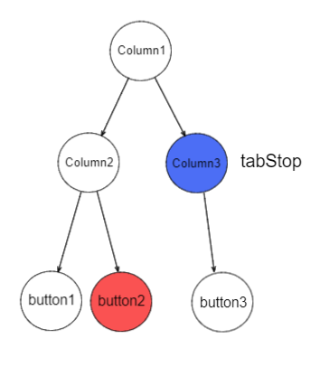
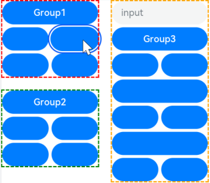
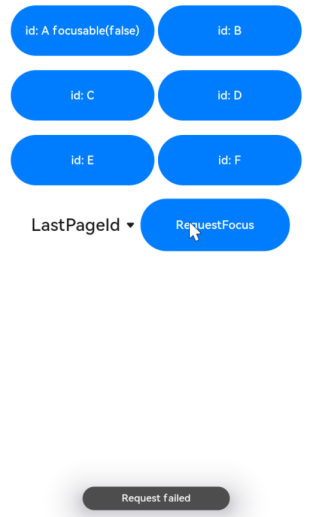
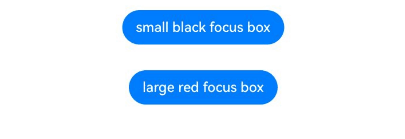
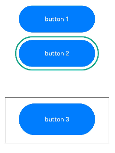
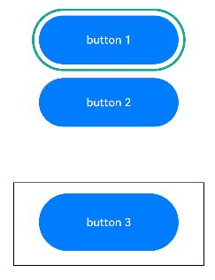

# 焦点控制

自定义组件的走焦效果，可设置组件是否走焦和具体的走焦顺序，tab键或者方向键切换焦点。

>  **说明：**
>
>  - 从API Version 8开始支持。后续版本如有新增内容，则采用上角标单独标记该内容的起始版本。
>  
>  - 自定义组件无获焦能力，当设置[focusable](#focusable)、[enabled](ts-universal-attributes-enable.md#enabled)等属性为false，或者设置[visibility](ts-universal-attributes-visibility.md#visibility)属性为Hidden、None时，也不影响其子组件的获焦。
>  
>  - 组件主动获取焦点不受窗口焦点的控制。
>  
>  - 焦点开发参考[焦点开发指南](../../../ui/arkts-common-events-focus-event.md)。

## focusable

focusable(value: boolean)

设置当前组件是否可以获焦。

**原子化服务API：** 从API version 11开始，该接口支持在原子化服务中使用。

**系统能力：** SystemCapability.ArkUI.ArkUI.Full

**参数：**

| 参数名 | 类型    | 必填 | 说明                                                         |
| ------ | ------- | ---- | ------------------------------------------------------------ |
| value  | boolean | 是   | 设置当前组件是否可以获焦。<br/>**说明：**<br/>存在默认交互逻辑的组件例如[Button](ts-basic-components-button.md)、[TextInput](ts-basic-components-textinput.md)等，默认即为可获焦，[Text](ts-basic-components-text.md)、[Image](ts-basic-components-image.md)等组件则默认状态为不可获焦。不可获焦状态下，无法触发[焦点事件](ts-universal-focus-event.md)。 |

## tabIndex<sup>9+</sup>

tabIndex(index: number)

自定义组件tab键走焦能力。

**原子化服务API：** 从API version 11开始，该接口支持在原子化服务中使用。

**系统能力：** SystemCapability.ArkUI.ArkUI.Full

**参数：**

| 参数名 | 类型   | 必填 | 说明                                                         |
| ------ | ------ | ---- | ------------------------------------------------------------ |
| index  | number | 是   | 自定义组件tab键走焦能力。若有配置了tabIndex大于0的组件，则tab键走焦只会在tabIndex大于0的组件内按照tabIndex的值从小到大并循环依次走焦。若没有配置tabIndex大于0的组件，则tabIndex等于0的组件按照组件预设的走焦规则走焦。<br />[UiExtension](../js-apis-arkui-uiExtension.md)组件未适配tabIndex，在含有[UiExtension](../js-apis-arkui-uiExtension.md)组件的页面使用tabIndex会导致走焦错乱。<br />- tabIndex >= 0：表示元素是可聚焦的，并且可以通过tab键走焦来访问到该元素。<br />- tabIndex < 0（通常是tabIndex = -1）：表示元素是可聚焦的，但是不能通过tab键走焦来访问到该元素。<br/>默认值：0 <br/> **说明：**<br/> tabIndex与focusScopeId不能混用。
|

## defaultFocus<sup>9+</sup>

defaultFocus(value: boolean)

设置当前组件是否为当前页面上的默认焦点。

**原子化服务API：** 从API version 11开始，该接口支持在原子化服务中使用。

**系统能力：** SystemCapability.ArkUI.ArkUI.Full

**参数：**

| 参数名 | 类型    | 必填 | 说明                                                         |
| ------ | ------- | ---- | ------------------------------------------------------------ |
| value  | boolean | 是   | 设置当前组件是否为当前页面上的默认焦点，仅在初次创建的页面第一次进入时生效。<br/>默认值：false<br/>**说明：** <br/>值为true则表示为默认焦点，值为false无效。<br/>若页面内无任何组件设置defaultFocus(true)，API version 11及之前，页面的默认焦点是当前页面上首个可获焦的非容器组件，API version 11之后，页面的默认焦点就是页面的根容器。<br/>若某页面内有多个组件设置了defaultFocus(true)，则以组件树深度遍历找到的第一个组件为默认焦点。 |

## groupDefaultFocus<sup>9+</sup>

groupDefaultFocus(value: boolean)

设置当前组件是否为当前组件所在容器获焦时的默认焦点。

**原子化服务API：** 从API version 11开始，该接口支持在原子化服务中使用。

**系统能力：** SystemCapability.ArkUI.ArkUI.Full

**参数：**

| 参数名 | 类型    | 必填 | 说明                                                         |
| ------ | ------- | ---- | ------------------------------------------------------------ |
| value  | boolean | 是   | 设置当前组件是否为当前组件所在容器获焦时的默认焦点，仅在初次创建容器节点第一次获焦时生效。<br/>默认值：false<br/>**说明：** <br/>必须与[tabIndex](#tabindex9)联合使用，当某个容器设置了tabIndex，且容器内某子组件或容器自身设置了groupDefaultFocus(true)，当该容器首次TAB键获焦时，会自动将焦点转移至该指定的组件上。若容器内（包含容器本身）有多个组件设置了groupDefaultFocus(true)，则以组件树深度遍历找到的第一个组件为最终结果。 |

## focusOnTouch<sup>9+</sup>

focusOnTouch(value: boolean)

设置当前组件是否支持点击获焦能力。

**原子化服务API：** 从API version 11开始，该接口支持在原子化服务中使用。

**系统能力：** SystemCapability.ArkUI.ArkUI.Full

**参数：**

| 参数名 | 类型    | 必填 | 说明                                                         |
| ------ | ------- | ---- | ------------------------------------------------------------ |
| value  | boolean | 是   | 设置当前组件是否支持点击获焦能力。<br/>默认值：false<br/>**说明：** <br/>仅在组件可点击时才能正常获取焦点。 |

## focusBox<sup>12+</sup>

focusBox(style: FocusBoxStyle): T

设置当前组件系统焦点框样式。

**原子化服务API：** 从API version 12开始，该接口支持在原子化服务中使用。

**系统能力：** SystemCapability.ArkUI.ArkUI.Full

**参数：**

| 参数名 | 类型 | 必填 | 说明 |
| ---- | ---- | ---- | ---- |
| style  | [FocusBoxStyle](#focusboxstyle12对象说明) | 是   | 设置当前组件系统焦点框样式。<br/>**说明：** <br/>该样式仅影响走焦状态下展示了系统焦点框的组件。 |


## focusControl<sup>9+</sup>

焦点控制模块

**原子化服务API：** 从API version 11开始，该接口支持在原子化服务中使用。

### requestFocus<sup>9+</sup>

requestFocus(value: string): boolean

方法语句中可使用的全局接口，调用此接口可以主动让焦点转移至参数指定的组件上。非当前帧生效，在下一帧才生效，建议使用FocusController中的[requestFocus](../js-apis-arkui-UIContext.md#requestfocus12)。

**原子化服务API：** 从API version 11开始，该接口支持在原子化服务中使用。

**参数：**

| 名称 | 类型 | 必填 | 描述 |
| ----- | ------ | ---- | ---- |
| value | string | 是   | 目标组件使用接口key(value: string)或id(value: string)绑定的字符串。 |

**返回值：**

| 类型 | 说明 |
| ------- | ---- |
| boolean | 返回是否成功给目标组件申请到焦点。若参数指向的目标组件存在，且目标组件可获焦，则返回true，否则返回false。 |

>  **说明：**
>
>  支持焦点控制的组件：[TextInput](ts-basic-components-textinput.md)、[TextArea](ts-basic-components-textarea.md)、[Search](ts-basic-components-search.md)、[Button](ts-basic-components-button.md)、[Text](ts-basic-components-text.md)、[Image](ts-basic-components-image.md)、[List](ts-container-list.md)、[Grid](ts-container-grid.md)。焦点事件当前仅支持在真机上显示运行效果。

## FocusBoxStyle<sup>12+</sup>对象说明

**原子化服务API：** 从API version 12开始，该接口支持在原子化服务中使用。

| 名称 | 参数类型 | 必填 | 描述 |
| ---- | ---- | ---- | ---- |
| margin  | [LengthMetrics](../js-apis-arkui-graphics.md#lengthmetrics12) | 否 | 焦点框相对组件边缘的距离。<br/>正数代表外侧，负数代表内侧。不支持百分比。 |
| strokeColor  | [ColorMetrics](../js-apis-arkui-graphics.md#colormetrics12) | 否 | 焦点框颜色。 |
| strokeWidth | [LengthMetrics](../js-apis-arkui-graphics.md#lengthmetrics12) | 否 | 焦点框宽度。<br/>不支持负数与百分比。|

## focusScopePriority<sup>12+</sup>

focusScopePriority(scopeId: string, priority?: FocusPriority): T

设置当前组件在指定容器内获焦的优先级。需要配合focusScopeId一起使用。

**原子化服务API：** 从API version 12开始，该接口支持在原子化服务中使用。

**系统能力：** SystemCapability.ArkUI.ArkUI.Full

**参数：**

| 参数名 | 类型    | 必填 | 说明                                                         |
| ------ | ------- | ---- | ------------------------------------------------------------ |
| scopeId  | string | 是   | 当前组件设置的获焦优先级生效的容器组件的id标识。<br/>**说明：** <br/>1.当前组件必须在scopeId所标识的容器内或者当前组件所属容器在scopeId所标识的容器内。<br/>2.组件不可重复设置多个优先级。<br/>3.设置了focusScopeId的容器组件不可设置优先级。 |
| priority  | [FocusPriority](#focuspriority12)  | 否   | 获焦优先级。<br/>**说明：** <br/>priority不设置则组件为默认AUTO优先级。<br/>优先级对走焦以及获焦组件的影响：<br/>1.容器整体获焦（层级页面切换/焦点切换到焦点组/容器组件使用requestFocus申请焦点）时，若容器内存在优先级为PREVIOUS的组件，则优先级为PREVIOUS的组件获焦，否则，由容器内上次获焦的组件获焦；<br/>2.容器非整体获焦（非焦点组场景下使用tab键/方向键走焦）时，若容器为首次获焦，则容器内优先级最高的组件获焦，若容器非首次获焦，不考虑优先级按照位置顺序走焦。 |

### FocusPriority<sup>12+</sup>

**原子化服务API：** 从API version 12开始，该接口支持在原子化服务中使用。

**系统能力：** SystemCapability.ArkUI.ArkUI.Full

| 名称          | 描述        |
| ----------- | --------- |
| AUTO | 默认的优先级，缺省时组件的获焦优先级。 |
| PRIOR | 容器内优先获焦的优先级。优先级高于AUTO。 |
| PREVIOUS | 上一次容器整体失焦时获焦节点的优先级。优先级高于PRIOR。 |

### KeyProcessingMode<sup>15+</sup>

设置按键事件处理的优先级。

**原子化服务API：** 从API version 15开始，该接口支持在原子化服务中使用。

**系统能力：** SystemCapability.ArkUI.ArkUI.Full

| 名称     | 值    | 说明        |
| -----------| ----------- | --------- |
| FOCUS_NAVIGATION  | 0 | 默认值，当前组件不消费按键时，tab/方向键优先在当前容器内走焦。 |
| ANCESTOR_EVENT  | 1  |  当前组件不消费按键时，tab/方向键优先冒泡给父组件。 |

## focusScopeId<sup>12+</sup>

focusScopeId(id: string, isGroup?: boolean)

设置当前容器组件的id标识，设置当前容器组件是否为焦点组。

**原子化服务API：**  从API version 12开始，该接口支持在原子化服务中使用。

**系统能力：** SystemCapability.ArkUI.ArkUI.Full

**参数：**

| 参数名 | 类型    | 必填 | 说明                                                         |
| ------ | ------- | ---- | ------------------------------------------------------------ |
| id  | string | 是   | 设置当前容器组件的id标识。<br/>**说明：** <br/>单个层级页面下，id标识全局唯一，不可重复。 |
| isGroup  | boolean | 否   | 设置当前容器组件是否为焦点组。<br/>**说明：** <br/>焦点组不可嵌套，不可重复配置。<br/> 焦点组不能和tabIndex混用。<br/>配置焦点组的目的时使得容器及容器内的元素可以按照焦点组规则走焦。焦点组走焦规则：<br/>1.焦点组容器内只能通过方向键走焦，tab键会使焦点跳出焦点组容器。<br/>2.通过方向键使焦点从焦点组容器外切换到焦点组容器内时，若焦点组容器内存在优先级为PREVIOUS的组件，则优先级为PREVIOUS的组件获焦，否则，由焦点组容器内上次获焦的组件获焦。|

## focusScopeId<sup>14+</sup>

focusScopeId(id: string, isGroup?: boolean, arrowStepOut?: boolean)

设置当前容器组件的id标识，设置当前容器组件是否为焦点组。

**系统能力：** SystemCapability.ArkUI.ArkUI.Full

**参数：**

| 参数名 | 类型    | 必填 | 说明                                                         |
| ------ | ------- | ---- | ------------------------------------------------------------ |
| id  | string | 是   | 设置当前容器组件的id标识。<br/>**说明：** <br/>单个层级页面下，id标识全局唯一，不可重复。<br/>**原子化服务API：** 从API version 12开始，该接口支持在原子化服务中使用。 |
| isGroup  | boolean | 否   | 设置当前容器组件是否为焦点组。<br/>**说明：** <br/>焦点组不可嵌套，不可重复配置。<br/> 焦点组不能和tabIndex混用。<br/>配置焦点组的目的时使得容器及容器内的元素可以按照焦点组规则走焦。焦点组走焦规则：<br/>1.焦点组容器内只能通过方向键走焦，tab键会使焦点跳出焦点组容器。<br/>2.通过方向键使焦点从焦点组容器外切换到焦点组容器内时，若焦点组容器内存在优先级为PREVIOUS的组件，则优先级为PREVIOUS的组件获焦，否则，由焦点组容器内上次获焦的组件获焦。<br/>**原子化服务API：** 从API version 12开始，该接口支持在原子化服务中使用。|
| arrowStepOut<sup>14+</sup>  | boolean | 否   | 设置能否使用方向键走焦出当前焦点组。<br/>**原子化服务API：** 从API version 14开始，该接口支持在原子化服务中使用。 |

## tabStop<sup>14+</sup>

tabStop(isTabStop: boolean) :T

设置当前容器组件的tabStop，可决定在走焦时焦点是否会停留在当前容器。

**原子化服务API：** 从API version 14开始，该接口支持在原子化服务中使用。

**系统能力：** SystemCapability.ArkUI.ArkUI.Full

**参数：**

| 参数名 | 类型    | 必填 | 说明                                                         |
| ------ | ------- | ---- | ------------------------------------------------------------ |
| isTabStop  | boolean | 是   | 设置当前容器组件是否为走焦可停留容器。<br/>**说明：** <br/>1.配置tabStop需要保障是容器组件且有可获焦的孩子组件，默认容器组件不能直接获焦。<br/> 2.通过[requestFocus](../js-apis-arkui-UIContext.md#requestfocus12)请求焦点，如果是容器组件且配置tabStop，焦点能够停留在容器组件，如果未配置tabStop，即使整条焦点链上有配置了tabStop的组件，该组件依然能获取到焦点。<br/>3.配置tabStop的容器不允许嵌套超过2层。<br/>tabStop走焦规则：<br/>1.通过tab键和方向键走焦，焦点会停留在配置了tabStop的组件上，如果焦点停留在配置了tabStop的容器内部时，可以走焦到容器内部的下一个可获焦组件，如果焦点停留在配置了tabStop的容器外部时，可以走焦到容器外的下一个可获焦组件。<br/>2.当焦点停留在tabStop上时，按Enter键可以走焦到内部第一个可获焦组件，按ESC能够将焦点退回到不超过当前层级页面根容器的上一个配置了tabStop的组件，按空格键可以响应该容器的onClick事件。<br/>3.不建议根容器配置tabStop。如果根容器配置了tabStop，通过[clearFocus](../js-apis-arkui-UIContext.md#clearfocus12)将焦点清理到根容器，再按Enter键会重新走回内部上一次获焦组件，通过ESC键将焦点清理到根容器，再按Enter键会走焦到内部第一个可获焦组件。|

**描述走焦的时候的按键以及获焦组件**



当前焦点如果停留在button2时，按下tab键将会走焦到Column3上，再按下tab键会循环走焦到button1上。

## nextFocus<sup>18+</sup>

nextFocus(nextStep: Optional\<FocusMovement>): T

设置组件的自定义焦点走焦的逻辑。

**原子化服务API：** 从API version 18开始，该接口支持在原子化服务中使用。

**系统能力：** SystemCapability.ArkUI.ArkUI.Full

**参数：**

| 参数名 | 类型    | 必填 | 说明                                                         |
| ------ | ------- | ---- | ------------------------------------------------------------ |
| nextStep  | [FocusMovement](#focusmovement18对象说明) | 否 | 设置当前容器组件的自定义走焦规则。<br/>**说明：** <br/>默认值为重置nextStep为空。<br/>没设置自定义走焦或者设置自定义组件容器不存在，仍进行默认走焦规则。|

## FocusMovement<sup>18+</sup>对象说明

设置对应的按键对应的走焦目的组件，缺省则遵循默认走焦规则。

**原子化服务API：** 从API version 18开始，该接口支持在原子化服务中使用。

**系统能力：** SystemCapability.ArkUI.ArkUI.Full

| 名称 | 类型 | 只读/可选 | 说明 |
| ---- | ---- | ---- | ---- |
| forward  | string | 可选 | 通过tab键走焦到组件的id。<br/>默认值为重置forward为空。 |
| backward  | string | 可选 | 通过shift+tab键走焦到组件的id。<br/>默认值为重置backward为空。 |
| up  | string | 可选 | 通过方向键上键走焦到组件的id。<br/>默认值为重置up为空。 |
| down  | string | 可选 | 通过方向键下键走焦到组件的id。<br/>默认值为重置down为空。 |
| left  | string | 可选 | 通过方向键左键走焦到组件的id。<br/>默认值为重置left为空。 |
| right  | string | 可选 | 通过方向键右键走焦到组件的id。<br/>默认值为重置right为空。 |

## 示例

### 示例1（设置组件获焦和走焦的效果）

该示例通过配置defaultFocus可以使绑定的组件成为页面创建后首次获焦的焦点，配置groupDefaultFocus可以使绑定的组件成为tabIndex容器创建后首次获焦的焦点，配置focusOnTouch可以使绑定的组件点击后立即获焦。

```ts
// focusTest.ets
@Entry
@Component
struct FocusableExample {
  @State inputValue: string = ''

  build() {
    Scroll() {
      Row({ space: 20 }) {
        Column({ space: 20 }) {
          Column({ space: 5 }) {
            Button('Group1')
              .width(165)
              .height(40)
              .fontColor(Color.White)
              .focusOnTouch(true)           // 该Button组件点击后可获焦
            Row({ space: 5 }) {
              Button()
                .width(80)
                .height(40)
                .fontColor(Color.White)
              Button()
                .width(80)
                .height(40)
                .fontColor(Color.White)
                .focusOnTouch(true)           // 该Button组件点击后可获焦
            }
            Row({ space: 5 }) {
              Button()
                .width(80)
                .height(40)
                .fontColor(Color.White)
              Button()
                .width(80)
                .height(40)
                .fontColor(Color.White)
            }
          }.borderWidth(2).borderColor(Color.Red).borderStyle(BorderStyle.Dashed)
          .tabIndex(1)                      // 该Column组件为按TAB键走焦的第一个获焦的组件
          Column({ space: 5 }) {
            Button('Group2')
              .width(165)
              .height(40)
              .fontColor(Color.White)
            Row({ space: 5 }) {
              Button()
                .width(80)
                .height(40)
                .fontColor(Color.White)
              Button()
                .width(80)
                .height(40)
                .fontColor(Color.White)
                .groupDefaultFocus(true)      // 该Button组件上级Column组件获焦时获焦
            }
            Row({ space: 5 }) {
              Button()
                .width(80)
                .height(40)
                .fontColor(Color.White)
              Button()
                .width(80)
                .height(40)
                .fontColor(Color.White)
            }
          }.borderWidth(2).borderColor(Color.Green).borderStyle(BorderStyle.Dashed)
          .tabIndex(2)                      // 该Column组件为按TAB键走焦的第二个获焦的组件
        }
        Column({ space: 5 }) {
          TextInput({placeholder: 'input', text: this.inputValue})
            .onChange((value: string) => {
              this.inputValue = value
            })
            .width(156)
            .defaultFocus(true)             // 该TextInput组件为页面的初始默认焦点
          Button('Group3')
            .width(165)
            .height(40)
            .fontColor(Color.White)
          Row({ space: 5 }) {
            Button()
              .width(80)
              .height(40)
              .fontColor(Color.White)
            Button()
              .width(80)
              .height(40)
              .fontColor(Color.White)
          }
          Button()
            .width(165)
            .height(40)
            .fontColor(Color.White)
          Row({ space: 5 }) {
            Button()
              .width(80)
              .height(40)
              .fontColor(Color.White)
            Button()
              .width(80)
              .height(40)
              .fontColor(Color.White)
          }
          Button()
            .width(165)
            .height(40)
            .fontColor(Color.White)
          Row({ space: 5 }) {
            Button()
              .width(80)
              .height(40)
              .fontColor(Color.White)
            Button()
              .width(80)
              .height(40)
              .fontColor(Color.White)
          }
        }.borderWidth(2).borderColor(Color.Orange).borderStyle(BorderStyle.Dashed)
        .tabIndex(3)                      // 该Column组件为按TAB键走焦的第三个获焦的组件
      }.alignItems(VerticalAlign.Top)
    }
  }
}
```
示意图：

首次进入，焦点默认在defaultFocus绑定的TextInput组件上：


首次按TAB键，焦点切换到tabIndex(1)的容器上，且自动走到其内部的groupDefaultFocus绑定的组件上：


第二次按TAB键，焦点切换到tabIndex(2)的容器上，且自动走到其内部的groupDefaultFocus绑定的组件上：


第三次按TAB键，焦点切换到tabIndex(3)的容器上，且自动走到其内部的groupDefaultFocus绑定的组件上：


点击绑定了focusOnTouch的组件，组件自身获焦，焦点框被清除，再按下Tab键显示焦点框：



### 示例2（设置指定组件获焦）

该示例通过配置focusControl.requestFocus使指定组件获取焦点。

> **说明：**
> 
> 直接使用focusControl可能导致实例不明确的问题，建议使用[getUIContext](../js-apis-arkui-UIContext.md#uicontext)获取UIContext实例，并使用[getFocusController](../js-apis-arkui-UIContext.md#getfocuscontroller12)获取绑定实例的focusControl。

```ts
// requestFocus.ets
@Entry
@Component
struct RequestFocusExample {
  @State idList: string[] = ['A', 'B', 'C', 'D', 'E', 'F', 'LastPageId']
  @State selectId: string = 'LastPageId'

  build() {
    Column({ space:20 }){
      Row({space: 5}) {
        Button("id: " + this.idList[0] + " focusable(false)")
          .width(200).height(70).fontColor(Color.White)
          .id(this.idList[0])
          .focusable(false)
        Button("id: " + this.idList[1])
          .width(200).height(70).fontColor(Color.White)
          .id(this.idList[1])
      }
      Row({space: 5}) {
        Button("id: " + this.idList[2])
          .width(200).height(70).fontColor(Color.White)
          .id(this.idList[2])
        Button("id: " + this.idList[3])
          .width(200).height(70).fontColor(Color.White)
          .id(this.idList[3])
      }
      Row({space: 5}) {
        Button("id: " + this.idList[4])
          .width(200).height(70).fontColor(Color.White)
          .id(this.idList[4])
        Button("id: " + this.idList[5])
          .width(200).height(70).fontColor(Color.White)
          .id(this.idList[5])
      }
      Row({space: 5}) {
        Select([{value: this.idList[0]},
                {value: this.idList[1]},
                {value: this.idList[2]},
                {value: this.idList[3]},
                {value: this.idList[4]},
                {value: this.idList[5]},
                {value: this.idList[6]}])
          .value(this.selectId)
          .onSelect((index: number) => {
            this.selectId = this.idList[index]
          })
        Button("RequestFocus")
          .width(200).height(70).fontColor(Color.White)
          .onClick(() => {
            // 建议使用this.getUIContext().getFocusController().requestFocus()
            let res = focusControl.requestFocus(this.selectId)      // 使选中的this.selectId的组件获焦
            if (res) {
              this.getUIContext().getPromptAction().showToast({message: 'Request success'})
            } else {
              this.getUIContext().getPromptAction().showToast({message: 'Request failed'})
            }
          })
      }
    }.width('100%').margin({ top:20 })
  }
}
```

示意图：

按下TAB键，激活焦点态显示。
申请不存在的组件获焦：



申请不可获焦的组件获焦：


申请存在且可获焦的组件获焦：


### 示例3（设置焦点框样式）

该示例通过配置focusBox修改组件的焦点框样式。

```ts
import { ColorMetrics, LengthMetrics } from '@kit.ArkUI'

@Entry
@Component
struct RequestFocusExample {
  build() {
    Column({ space: 30 }) {
      Button("small black focus box")
        .focusBox({
          margin: new LengthMetrics(0),
          strokeColor: ColorMetrics.rgba(0, 0, 0),
        })
      Button("large red focus box")
        .focusBox({
          margin: LengthMetrics.px(20),
          strokeColor: ColorMetrics.rgba(255, 0, 0),
          strokeWidth: LengthMetrics.px(10)
        })
    }
    .alignItems(HorizontalAlign.Center)
    .width('100%')
  }
}
```




### 示例4（设置焦点组走焦）

该示例通过配置focusScopePriority可以使绑定的组件成为所属容器首次获焦时的焦点，配置focusScopeId可以使绑定的容器组件组件成为焦点组。

```ts
// focusTest.ets
@Entry
@Component
struct FocusableExample {
  @State inputValue: string = ''

  build() {
    Scroll() {
      Row({ space: 20 }) {
        Column({ space: 20 }) {  // 标记为Column1
          Column({ space: 5 }) {
            Button('Group1')
              .width(165)
              .height(40)
              .fontColor(Color.White)
            Row({ space: 5 }) {
              Button()
                .width(80)
                .height(40)
                .fontColor(Color.White)
              Button()
                .width(80)
                .height(40)
                .fontColor(Color.White)
            }
            Row({ space: 5 }) {
              Button()
                .width(80)
                .height(40)
                .fontColor(Color.White)
              Button()
                .width(80)
                .height(40)
                .fontColor(Color.White)
            }
          }.borderWidth(2).borderColor(Color.Red).borderStyle(BorderStyle.Dashed)
          Column({ space: 5 }) {
            Button('Group2')
              .width(165)
              .height(40)
              .fontColor(Color.White)
            Row({ space: 5 }) {
              Button()
                .width(80)
                .height(40)
                .fontColor(Color.White)
              Button()
                .width(80)
                .height(40)
                .fontColor(Color.White)
                .focusScopePriority('ColumnScope1', FocusPriority.PRIOR)  // Column1首次获焦时获焦
            }
            Row({ space: 5 }) {
              Button()
                .width(80)
                .height(40)
                .fontColor(Color.White)
              Button()
                .width(80)
                .height(40)
                .fontColor(Color.White)
            }
          }.borderWidth(2).borderColor(Color.Green).borderStyle(BorderStyle.Dashed)
        }
        .focusScopeId('ColumnScope1')
        Column({ space: 5 }) {  // 标记为Column2
          TextInput({placeholder: 'input', text: this.inputValue})
            .onChange((value: string) => {
              this.inputValue = value
            })
            .width(156)
          Button('Group3')
            .width(165)
            .height(40)
            .fontColor(Color.White)
          Row({ space: 5 }) {
            Button()
              .width(80)
              .height(40)
              .fontColor(Color.White)
            Button()
              .width(80)
              .height(40)
              .fontColor(Color.White)
          }
          Button()
            .width(165)
            .height(40)
            .fontColor(Color.White)
            .focusScopePriority('ColumnScope2', FocusPriority.PREVIOUS)  // Column2获焦时获焦
          Row({ space: 5 }) {
            Button()
              .width(80)
              .height(40)
              .fontColor(Color.White)
            Button()
              .width(80)
              .height(40)
              .fontColor(Color.White)
          }
          Button()
            .width(165)
            .height(40)
            .fontColor(Color.White)
          Row({ space: 5 }) {
            Button()
              .width(80)
              .height(40)
              .fontColor(Color.White)
            Button()
              .width(80)
              .height(40)
              .fontColor(Color.White)
          }
        }.borderWidth(2).borderColor(Color.Orange).borderStyle(BorderStyle.Dashed)
        .focusScopeId('ColumnScope2', true)  // Column2为焦点组
      }.alignItems(VerticalAlign.Top)
    }
  }
}
```

### 示例5（设置tab走焦停留）

该示例通过配置tabstop实现使用tab走焦停留在组件上。

```ts
import { ColorMetrics, LengthMetrics } from '@kit.ArkUI'

@Entry
@Component
struct TabStop {
  build() {
    Column({ space: 20 }) {
      Column({ space: 20 }) {
        Column({ space: 20 }) {
          Row({ space: 5 }) {
            Button("button 1")
              .width(200).height(70).fontColor(Color.White)
              .focusBox({
                margin: LengthMetrics.px(20),
                strokeColor: ColorMetrics.rgba(23, 169, 141),
                strokeWidth: LengthMetrics.px(10)
              })
          }
          Row({ space: 5 }) {
            Button("button 2")
              .width(200).height(70).fontColor(Color.White)
              .focusBox({
                margin: LengthMetrics.px(20),
                strokeColor: ColorMetrics.rgba(23, 169, 141),
                strokeWidth: LengthMetrics.px(10)
              })
          }
        }.width('80%').margin({ top: 30 }).borderColor(Color.Black)
      }.width('95%').margin({ top: 60 }).borderColor(Color.Black)
      Column({ space: 20 }) {
        Column({ space: 20 }) {
          Row({ space: 5 }) {
            Button("button 3")
              .width(200)
              .height('70%')
              .fontColor(Color.White)
              .focusBox({
                margin: LengthMetrics.px(20),
                strokeColor: ColorMetrics.rgba(23, 169, 141),
                strokeWidth: LengthMetrics.px(10)
              })
              .margin({ top: 15 })
          }
        }
        .width('80%')
        .height('120')
        .borderColor(Color.Black)
        .margin({ top: 10 })
        .tabStop(true)
        .focusBox({
          margin: LengthMetrics.px(20),
          strokeColor: ColorMetrics.rgba(23, 169, 141),
          strokeWidth: LengthMetrics.px(10)
        })
        .borderWidth(1)
      }.width('95%').margin({ top: 50 }).borderColor(Color.Black)
    }
  }
}
```
示意图：

连续按下两次TAB键时，焦点转移到button2上。



接着按下TAB键，焦点转移到配置了tabStop的组件。


再按下Enter键，焦点转移至内部button3上。


再按下ESC键，焦点转移到配置了tabStop的组件上。


再按下TAB键，焦点循环走焦到button1上。



### 示例6（设置自定义走焦）

该示例通过配置nextFocus实现自定义走焦规则。
如果不配置nextFocus，默认点击tab的走焦顺序：M->A->B->C；配置了nextFocus以后,走焦顺序变更为：M->D->F->B。

```ts
class MyButtonModifier implements AttributeModifier<ButtonAttribute> {
  applyNormalAttribute(instance: ButtonAttribute): void {
    instance.id('M')
    instance.nextFocus({forward: 'D', up: 'C', down: 'D'})
  }
}

@Entry
@Component
struct Index {
  @State modifier: MyButtonModifier = new MyButtonModifier()
  @State idList: string[] = ['A', 'B', 'C', 'D', 'E', 'F']

  build() {
    Column({space: 10}) {
      Row({space: 10}) {
        Button("id: M")
          .attributeModifier(this.modifier)
        Button("id: " + this.idList[0])
          .id(this.idList[0])
          .nextFocus({forward: 'C', backward: 'M', up: 'E', right: 'F', down: 'B', left: 'D'});
        Button("id: " + this.idList[1])
          .id(this.idList[1])
      }
      Column({space: 10}) {
        Button("id: " + this.idList[2])
          .id(this.idList[2]);
        Button("id: " + this.idList[3])
          .id(this.idList[3])
          .nextFocus({forward: 'F'});
      }
      Row({space: 10}) {
        Button("id: " + this.idList[4])
          .id(this.idList[4]);
        Button("id: " + this.idList[5])
          .id(this.idList[5])
          .nextFocus({forward: 'B'});
      }
    }
  }
}
```

