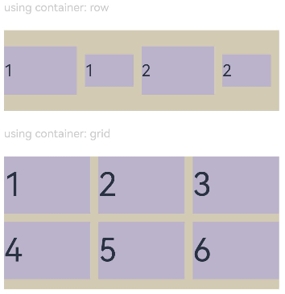
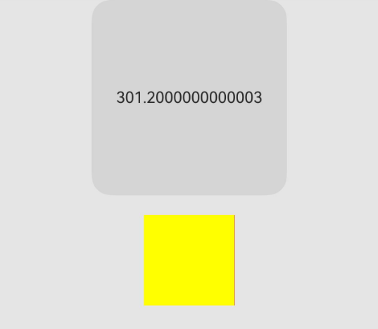

# 布局约束

通过组件的宽高比和显示优先级约束组件显示效果。

>  **说明：**
>
>  从API Version 7开始支持。后续版本如有新增内容，则采用上角标单独标记该内容的起始版本。

## aspectRatio

aspectRatio(value: number)

指定当前组件的宽高比。

**卡片能力：** 从API version 9开始，该接口支持在ArkTS卡片中使用。

**原子化服务API：** 从API version 11开始，该接口支持在原子化服务中使用。

**系统能力：** SystemCapability.ArkUI.ArkUI.Full

**参数：**

| 参数名 | 类型   | 必填 | 说明                                                         |
| ------ | ------ | ---- | ------------------------------------------------------------ |
| value  | number | 是   | 指定当前组件的宽高比，aspectRatio = width/height。同时设置width、height和aspectRatio，height不生效，通过width和aspectRatio计算宽高。设置aspectRatio属性后，组件宽高会受父组件内容区大小限制。<br/>API version 9及以前，默认值为：1.0。<br/>API version 10：无默认值。<br/>**说明：**<br/>该属性在不设置值或者设置非法值时不生效。<br/>例如，Row只设置宽度且没有子组件，aspectRatio不设置值或者设置成负数时，此时Row高度为0。 |

## displayPriority

displayPriority(value: number)

设置当前组件在布局容器中显示的优先级。

**卡片能力：** 从API version 9开始，该接口支持在ArkTS卡片中使用。

**原子化服务API：** 从API version 11开始，该接口支持在原子化服务中使用。

**系统能力：** SystemCapability.ArkUI.ArkUI.Full

**参数：**

| 参数名 | 类型   | 必填 | 说明                                                         |
| ------ | ------ | ---- | ------------------------------------------------------------ |
| value  | number | 是   | 设置当前组件在布局容器中显示的优先级。<br/>默认值：1<br/>**说明：**<br/>仅在[Row](./ts-container-row.md)/[Column](./ts-container-column.md)/[Flex(单行)](./ts-container-flex.md)容器组件中生效。<br/> 小数点后的数字不作优先级区分，即区间为[x, x + 1)内的数字视为相同优先级。例如：1.0与1.9为同一优先级。<br/>子组件的displayPriority均不大于1时，优先级没有区别。<br/>当子组件的displayPriority大于1时，displayPriority数值越大，优先级越高。若父容器空间不足，隐藏低优先级子组件。若某一优先级的子组件被隐藏，则优先级更低的子组件也都被隐藏。 |

## pixelRound<sup>11+</sup>

pixelRound(value: PixelRoundPolicy)

指定当前组件的像素级取整对齐方式。

**卡片能力：** 从API version 11开始，该接口支持在ArkTS卡片中使用。

**原子化服务API：** 从API version 11开始，该接口支持在原子化服务中使用。

**系统能力：** SystemCapability.ArkUI.ArkUI.Full

**参数：**

| 参数名 | 类型   | 必填 | 说明                                                         |
| ------ | ------ | ---- | ------------------------------------------------------------ |
| value | [PixelRoundPolicy](ts-types.md#pixelroundpolicy11) | 是 | 指定当前组件边界取整策略。<br/>**说明：**<br/>该属性用于因浮点数绘制产生视觉异常的场景。<br/>当前像素取整规则是：<br/>在水平方向上，对组件的左右边界到屏幕左边框的距离取整。<br/>在竖直方向上，对组件的上下边界到屏幕上边框的距离取整。<br/>在计算出上下左右边界取整后的位置后，才能确定组件最终的宽和高。因此，取整结果不仅和组件的宽高有关，也与组件的位置有关。即使设置组件的宽高相同，由于以浮点数描述的组件位置不同，舍入后组件的最终宽高也可能不同。|

## 示例

### 示例1

```ts
// xxx.ets
@Entry
@Component
struct AspectRatioExample {
  private children: string[] = ['1', '2', '3', '4', '5', '6']

  build() {
    Column({ space: 20 }) {
      Text('using container: row').fontSize(14).fontColor(0xCCCCCC).width('100%')
      Row({ space: 10 }) {
        ForEach(this.children, (item:string) => {
          // 组件宽度 = 组件高度*1.5 = 90
          Text(item)
            .backgroundColor(0xbbb2cb)
            .fontSize(20)
            .aspectRatio(1.5)
            .height(60)
          // 组件高度 = 组件宽度/1.5 = 60/1.5 = 40
          Text(item)
            .backgroundColor(0xbbb2cb)
            .fontSize(20)
            .aspectRatio(1.5)
            .width(60)
        }, (item:string) => item)
      }
      .size({ width: "100%", height: 100 })
      .backgroundColor(0xd2cab3)
      .clip(true)

      // grid子元素width/height=3/2
      Text('using container: grid').fontSize(14).fontColor(0xCCCCCC).width('100%')
      Grid() {
        ForEach(this.children, (item:string) => {
          GridItem() {
            Text(item)
              .backgroundColor(0xbbb2cb)
              .fontSize(40)
              .width('100%')
              .aspectRatio(1.5)
          }
        }, (item:string) => item)
      }
      .columnsTemplate('1fr 1fr 1fr')
      .columnsGap(10)
      .rowsGap(10)
      .size({ width: "100%", height: 165 })
      .backgroundColor(0xd2cab3)
    }.padding(10)
  }
}
```

**图1** 竖屏显示<br>


**图2** 横屏显示<br>


### 示例2

```ts
class ContainerInfo {
  label: string = '';
  size: string = '';
}

class ChildInfo {
  text: string = '';
  priority: number = 0;
}

@Entry
@Component
struct DisplayPriorityExample {
  // 显示容器大小
  private container: ContainerInfo[] = [
    { label: 'Big container', size: '90%' },
    { label: 'Middle container', size: '50%' },
    { label: 'Small container', size: '30%' }
  ]
  private children: ChildInfo[] = [
    { text: '1\n(priority:2)', priority: 2 },
    { text: '2\n(priority:1)', priority: 1 },
    { text: '3\n(priority:3)', priority: 3 },
    { text: '4\n(priority:1)', priority: 1 },
    { text: '5\n(priority:2)', priority: 2 }
  ]
  @State currentIndex: number = 0;

  build() {
    Column({ space: 10 }) {
      // 切换父级容器大小
      Button(this.container[this.currentIndex].label).backgroundColor(0x317aff)
        .onClick(() => {
          this.currentIndex = (this.currentIndex + 1) % this.container.length;
        })
      // 通过变量设置Flex父容器宽度
      Flex({ justifyContent: FlexAlign.SpaceBetween }) {
        ForEach(this.children, (item:ChildInfo) => {
          // 使用displayPriority给子组件绑定显示优先级
          Text(item.text)
            .width(120)
            .height(60)
            .fontSize(24)
            .textAlign(TextAlign.Center)
            .backgroundColor(0xbbb2cb)
            .displayPriority(item.priority)
        }, (item:ChildInfo) => item.text)
      }
      .width(this.container[this.currentIndex].size)
      .backgroundColor(0xd2cab3)
    }.width("100%").margin({ top: 50 })
  }
}
```

横屏显示


### 示例3

采用pixelRound指导布局。

```ts
@Entry
@Component
struct PixelRoundExample {
  build() {
    Column() {
      Row() {
        Row() {
        }
        .width('100%')
        .height('100%')
        .backgroundColor(Color.Yellow)
      }
      .width('300.6px')
      .height('300.6px')
      .backgroundColor(Color.Red)
      .position({x: '200.2px', y: '100.2px'})
      .pixelRound({
        start:PixelRoundCalcPolicy.FORCE_CEIL,
        top:PixelRoundCalcPolicy.FORCE_CEIL
       })
    }
    .width("100%")
    .height('100%')
    .backgroundColor('#ffe5e5e5')
  }
}
```
**图1** 采用pixelRound指导布局效果图


**图2** 不用pixelRound指导布局效果图


