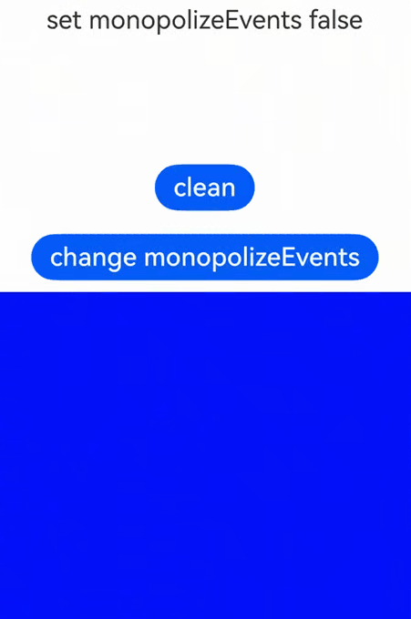

# 事件独占控制

设置组件是否独占事件，事件范围包括组件自带的事件和开发者自定义的点击、触摸、手势事件。<br />
在一个窗口内，设置了独占控制的组件上的事件如果首先响应，则本次交互只允许此组件上设置的事件响应，窗口内其他组件上的事件不会响应。

>  **说明：**
>
>  从API Version 11开始支持。后续版本如有新增内容，则采用上角标单独标记该内容的起始版本。

## monopolizeEvents

monopolizeEvents(monopolize: boolean)

设置组件是否独占事件。

**原子化服务API：** 从API version 12开始，该接口支持在原子化服务中使用。

**系统能力：** SystemCapability.ArkUI.ArkUI.Full

**参数：** 


| 参数名   | 类型 | 必填 | 说明                  |
| ----------- | -------- | ------------------------ | ------------------------ |
| monopolize | boolean  | 是 | 设置组件是否独占事件。true表示组件独占事件，false表示组件不独占事件。<br />默认值：false <br />**说明：**<br />1、如果第一根手指触发了组件事件独占，在抬起前又按下了一根手指，则第二根手指的交互继续处于组件独占状态，依次类推。<br />2、如果开发者通过[parallelGesture](ts-gesture-settings.md)绑定了与子组件同时触发的手势，如[PanGesture](ts-basic-gestures-pangesture.md)，子组件设置了独占控制且首个响应事件，则父组件的手势不会响应。|

## 示例

该示例通过配置monopolizeEvents实现组件是否独占事件。

```ts
// xxx.ets
@Entry
@Component
struct Index {
  @State message: string = 'set monopolizeEvents false';
  @State messageOut: string = ' ';
  @State messageInner: string = ' ';
  @State monopolize: boolean = false;

  build() {
    Column() {
      Text(this.message)
        .fontSize(22)
        .margin(10)
      Text(this.messageOut)
        .fontSize(22)
        .margin(10)
      Text(this.messageInner)
        .fontSize(22)
        .margin(10)
      Button('clean')
        .fontSize(22)
        .margin(10)
        // 通过button的点击事件来切换内层column的独占控制属性
        .onClick(()=>{
          this.messageOut = " "
          this.messageInner = " "
        })
      Button('change monopolizeEvents')
        .fontSize(22)
        .margin(10)
        // 通过button的点击事件来切换内层column的独占控制属性
        .onClick(()=>{
          this.monopolize = !this.monopolize
          if (!this.monopolize) {
            this.message = "set monopolizeEvents false"
          } else {
            this.message = "set monopolizeEvents true"
          }
        })
      Column() {
        Column(){}
        // this.monopolize是true时，点击内层column只会触发自身的触摸事件，不会触发外层column的触摸事件
        // this.monopolize是false时，点击内层column会同时触发自身的触摸事件和外层column的触摸事件
        .monopolizeEvents(this.monopolize)
        .width('100%')
        .height('40%')
        .backgroundColor(Color.Blue)
        // 内层column绑定触摸事件
        .onTouch((event:TouchEvent)=>{
          if (event.type == TouchType.Down) {
            console.log("inner column touch down")
            this.messageInner = "inner column touch down"
          }
        })
      }
      .backgroundColor(Color.Gray)
      .height('100%')
      .width('100%')
      // 外层column绑定触摸事件
      .onTouch((event)=>{
        if (event.type == TouchType.Down) {
          console.log("outside column touch down")
          this.messageOut = "inner column touch down"
        }
      })
    }
    .height('100%')
  }
}
```
