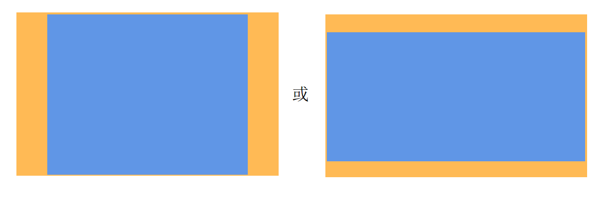
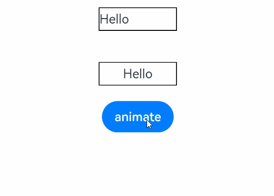

# 组件内容填充方式

用于决定在组件的宽高动画过程中，如何将动画最终的组件内容绘制在组件上。

>  **说明：**
>
>  从API Version 10开始支持。后续版本如有新增内容，则采用上角标单独标记该内容的起始版本。

## renderFit

renderFit(fitMode: RenderFit)

设置宽高动画过程中的组件内容填充方式。

**原子化服务API：** 从API version 11开始，该接口支持在原子化服务中使用。

**系统能力：** SystemCapability.ArkUI.ArkUI.Full

**参数：** 

| 参数名  | 类型                            | 必填 | 说明                                                         |
| ------- | ------------------------------- | ---- | ------------------------------------------------------------ |
| fitMode | [RenderFit](#renderfit枚举说明) | 是   | 设置宽高动画过程中的组件内容填充方式。<br/>当不设置renderFit属性时，取默认值RenderFit.TOP_LEFT。 |

## renderFit<sup>16+</sup>

renderFit(fitMode: Optional\<RenderFit>)

设置宽高动画过程中的组件内容填充方式。与[renderFit](#renderfit)相比，fitMode参数新增了对undefined类型的支持。

**原子化服务API：** 从API version 16开始，该接口支持在原子化服务中使用。

**系统能力：** SystemCapability.ArkUI.ArkUI.Full

**参数：** 

| 参数名  | 类型                                       | 必填 | 说明                                                         |
| ------- | ------------------------------------------ | ---- | ------------------------------------------------------------ |
| fitMode | Optional\<[RenderFit](#renderfit枚举说明)> | 是   | 设置宽高动画过程中的组件内容填充方式。<br/>当fitMode的值为undefined时，取默认值。恢复为内容填充方式为RenderFit.TOP_LEFT的效果。 |

>  **说明：**
>
>  对于TEXTURE和SURFACE类型的[XComponent](./ts-basic-components-xcomponent.md)组件，当不设置renderFit属性时，取默认值为RenderFit.RESIZE_FILL。
>
>  对于SURFACE类型的[XComponent](./ts-basic-components-xcomponent.md)组件，当组件背景色为不透明的纯黑色时，其renderFit通用属性仅支持设置为RenderFit.RESIZE_FILL，不推荐设置为其他的RenderFit枚举值。
>
>  对于使用[ArkUI NDK接口](../../../ui/ndk-access-the-arkts-page.md)创建的XComponent组件，不支持使用属性获取函数[getAttribute](../_ark_u_i___native_node_a_p_i__1.md#getattribute)获取其renderFit属性值。

## RenderFit枚举说明

**原子化服务API：** 从API version 11开始，该接口支持在原子化服务中使用。

| 名称                          | 描述                                       | 示意图                                      |
| --------------------------- | ---------------------------------------- | ---------------------------------------- |
| CENTER                      | 保持动画终态的内容大小，并且内容始终与组件保持中心对齐。             |  |
| TOP                         | 保持动画终态的内容大小，并且内容始终与组件保持顶部中心对齐。           |  |
| BOTTOM                      | 保持动画终态的内容大小，并且内容始终与组件保持底部中心对齐。           |  |
| LEFT                        | 保持动画终态的内容大小，并且内容始终与组件保持左侧对齐。             |  |
| RIGHT                       | 保持动画终态的内容大小，并且内容始终与组件保持右侧对齐。             |  |
| TOP_LEFT                    | 保持动画终态的内容大小，并且内容始终与组件保持左上角对齐。            |  |
| TOP_RIGHT                   | 保持动画终态的内容大小，并且内容始终与组件保持右上角对齐。            |  |
| BOTTOM_LEFT                 | 保持动画终态的内容大小，并且内容始终与组件保持左下角对齐。            |  |
| BOTTOM_RIGHT                | 保持动画终态的内容大小，并且内容始终与组件保持右下角对齐。            |  |
| RESIZE_FILL                 | 不考虑动画终态内容的宽高比，并且内容始终缩放到组件的大小。            |  |
| RESIZE_CONTAIN              | 保持动画终态内容的宽高比进行缩小或放大，使内容完整显示在组件内，且与组件保持中心对齐。 |  |
| RESIZE_CONTAIN_TOP_LEFT     | 保持动画终态内容的宽高比进行缩小或放大，使内容完整显示在组件内。当组件宽方向有剩余时，内容与组件保持左侧对齐，当组件高方向有剩余时，内容与组件保持顶部对齐。 |  |
| RESIZE_CONTAIN_BOTTOM_RIGHT | 保持动画终态内容的宽高比进行缩小或放大，使内容完整显示在组件内。当组件宽方向有剩余时，内容与组件保持右侧对齐，当组件高方向有剩余时，内容与组件保持底部对齐。 |  |
| RESIZE_COVER                | 保持动画终态内容的宽高比进行缩小或放大，使内容两边都大于或等于组件两边，且与组件保持中心对齐，显示内容的中间部分。 |  |
| RESIZE_COVER_TOP_LEFT       | 保持动画终态内容的宽高比进行缩小或放大，使内容的两边都恰好大于或等于组件两边。当内容宽方向有剩余时，内容与组件保持左侧对齐，显示内容的左侧部分。当内容高方向有剩余时，内容与组件保持顶部对齐，显示内容的顶侧部分。 |  |
| RESIZE_COVER_BOTTOM_RIGHT   | 保持动画终态内容的宽高比进行缩小或放大，使内容的两边都恰好大于或等于组件两边。当内容宽方向有剩余时，内容与组件保持右侧对齐，显示内容的右侧部分。当内容高方向有剩余时，内容与组件保持底部对齐，显示内容的底侧部分。 |  |

> **说明：**
>
> - 示意图中，蓝色区域表示内容，橙黄色区域表示节点大小。
> - 不同的内容填充方式在宽高动画过程中效果不一致，开发者需要选择合适的内容填充方式以实现需要的动画效果。

## 示例

该示例主要演示通过renderFit设置宽高动画过程中的组件内容不同填充方式。

```ts
// xxx.ets
import { uiEffect } from '@kit.ArkGraphics2D';

@Entry
@Component
struct FilterEffectExample {
  @State filterTest1: uiEffect.Filter = uiEffect.createFilter().blur(10)
  @State filterTest2: uiEffect.Filter = uiEffect.createFilter().blur(10)
  @State filterTest3: uiEffect.Filter = uiEffect.createFilter().blur(10)

  build() {
    Column({ space: 15 }) {

      Text('foregroundFilter').fontSize(20).width('75%').fontColor('#DCDCDC')
      Text('前景滤镜')
        .width(100)
        .height(100)
        .backgroundColor('#ADD8E6')
        .backgroundImage($r("app.media.app_icon"))
        .backgroundImageSize({ width: 80, height: 80 })
        .foregroundFilter(this.filterTest1) // 通过 foregroundFilter 设置模糊效果

      Text('backgroundFilter').fontSize(20).width('75%').fontColor('#DCDCDC')
      Text('背景滤镜')
        .width(100)
        .height(100)
        .backgroundColor('#ADD8E6')
        .backgroundImage($r("app.media.app_icon"))
        .backgroundImageSize({ width: 80, height: 80 })
        .backgroundFilter(this.filterTest2) // 通过 backgroundFilter 设置模糊效果

      Text('compositingFilter').fontSize(20).width('75%').fontColor('#DCDCDC')
      Text('合成滤镜')
        .width(100)
        .height(100)
        .backgroundColor('#ADD8E6')
        .backgroundImage($r("app.media.app_icon"))
        .backgroundImageSize({ width: 80, height: 80 })
        .compositingFilter(this.filterTest3) // 通过 compositingFilter 设置模糊效果
    }
    .height('100%')
    .width('100%')
  }
}
```


