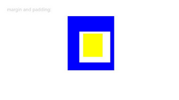
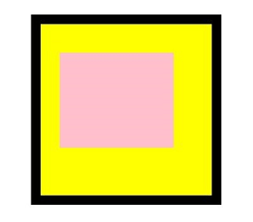

# 尺寸设置

设置组件的宽高、边距。

>  **说明：**
>
>  从API Version 7开始支持。后续版本如有新增内容，则采用上角标单独标记该内容的起始版本。

## width

width(value: Length)

设置组件自身的宽度，缺省时使用元素自身内容需要的宽度。若子组件的宽大于父组件的宽，则会画出父组件的范围。

从API version 10开始，该接口支持calc计算特性。

**卡片能力：** 从API version 9开始，该接口支持在ArkTS卡片中使用。

**原子化服务API：** 从API version 11开始，该接口支持在原子化服务中使用。

**系统能力：** SystemCapability.ArkUI.ArkUI.Full

**参数：**

| 参数名   | 类型                           | 必填   | 说明                  |
| ----- | ---------------------------- | ---- | ------------------- |
| value | [Length](ts-types.md#length) | 是    | 要设置的组件宽度。<br/>单位：vp |

>  **说明：**
>
>  - 在[TextInput](./ts-basic-components-textinput.md)组件中，width设置auto表示自适应文本宽度。
>
>  - 在[AlphabetIndexer](./ts-container-alphabet-indexer.md)组件中，width设置auto表示自适应宽度最大索引项的宽度。

## height

height(value: Length)

设置组件自身的高度，缺省时使用元素自身内容需要的高度。若子组件的高大于父组件的高，则会画出父组件的范围。

从API version 10开始，该接口支持calc计算特性。

**卡片能力：** 从API version 9开始，该接口支持在ArkTS卡片中使用。

**原子化服务API：** 从API version 11开始，该接口支持在原子化服务中使用。

**系统能力：** SystemCapability.ArkUI.ArkUI.Full

**参数：**

| 参数名   | 类型                           | 必填   | 说明                  |
| ----- | ---------------------------- | ---- | ------------------- |
| value | [Length](ts-types.md#length) | 是    | 要设置的组件高度。<br/>单位：vp |

>  **说明：**
>
>  在[Row](./ts-container-row.md)、[Column](./ts-container-column.md)、[RelativeContainer](./ts-container-relativecontainer.md)组件中，width、height设置auto表示自适应子组件。

## width<sup>15+</sup>

width(widthValue: Length | LayoutPolicy)

设置组件自身的宽度或水平方向布局策略，缺省时使用元素自身内容需要的宽度。若子组件的宽大于父组件的宽，则会画出父组件的范围。

**卡片能力：** 从API version 15开始，该接口支持在ArkTS卡片中使用。

**原子化服务API：** 从API version 15开始，该接口支持在原子化服务中使用。

**系统能力：** SystemCapability.ArkUI.ArkUI.Full

**参数：**

| 参数名   | 类型                           | 必填   | 说明                  |
| ----- | ---------------------------- | ---- | ------------------- |
| widthValue | [Length](ts-types.md#length)&nbsp;\|&nbsp;&nbsp;[LayoutPolicy](ts-types.md#layoutpolicy15) | 是    | 要设置的组件宽度。<br/>单位：vp |

## height<sup>15+</sup>

height(heightValue: Length | LayoutPolicy)

设置组件自身的高度或垂直方向布局策略，缺省时使用元素自身内容需要的高度。若子组件的高大于父组件的高，则会画出父组件的范围。

**卡片能力：** 从API version 15开始，该接口支持在ArkTS卡片中使用。

**原子化服务API：** 从API version 15开始，该接口支持在原子化服务中使用。

**系统能力：** SystemCapability.ArkUI.ArkUI.Full

**参数：**

| 参数名   | 类型                           | 必填   | 说明                  |
| ----- | ---------------------------- | ---- | ------------------- |
| heightValue | [Length](ts-types.md#length)&nbsp;\|&nbsp;&nbsp;[LayoutPolicy](ts-types.md#layoutpolicy15) | 是    | 要设置的组件高度。<br/>单位：vp |

>  **说明：**
> 
>  [Row](./ts-container-row.md)和[Column](./ts-container-column.md)组件的width和height属性支持设置[LayoutPolicy](ts-types.md#layoutpolicy15)类型参数。

## size

size(value: SizeOptions)

设置组件自身的宽高尺寸。

从API version 10开始，该接口支持calc计算特性。

**卡片能力：** 从API version 9开始，该接口支持在ArkTS卡片中使用。

**原子化服务API：** 从API version 11开始，该接口支持在原子化服务中使用。

**系统能力：** SystemCapability.ArkUI.ArkUI.Full

**参数：**

| 参数名   | 类型                              | 必填   | 说明                |
| ----- | ------------------------------- | ---- | ----------------- |
| value | [SizeOptions](#sizeoptions对象说明) | 是    | 设置高宽尺寸。<br/>单位：vp |

## padding

padding(value: Padding | Length | LocalizedPadding)

设置组件的内边距属性。

从API version 10开始，该接口支持calc计算特性。

**卡片能力：** 从API version 9开始，该接口支持在ArkTS卡片中使用。

**原子化服务API：** 从API version 11开始，该接口支持在原子化服务中使用。

**系统能力：** SystemCapability.ArkUI.ArkUI.Full

**参数：**

| 参数名   | 类型                                       | 必填   | 说明                                       |
| ----- | ---------------------------------------- | ---- | ---------------------------------------- |
| value | [Padding](ts-types.md#padding)&nbsp;\|&nbsp;&nbsp;[Length](ts-types.md#length)&nbsp;\|&nbsp;&nbsp; [LocalizedPadding](ts-types.md#localizedpadding12)<sup>12+</sup>| 是    | 设置组件的内边距。<br/>参数为Length类型时，四个方向内边距同时生效。<br/>默认值：0 <br/>单位：vp<br/>padding设置百分比时，上下左右内边距均以父容器的width作为基础值。 |

## margin

margin(value: Margin | Length | LocalizedMargin)

设置组件的外边距属性。

从API version 10开始，该接口支持calc计算特性。

**卡片能力：** 从API version 9开始，该接口支持在ArkTS卡片中使用。

**原子化服务API：** 从API version 11开始，该接口支持在原子化服务中使用。

**系统能力：** SystemCapability.ArkUI.ArkUI.Full

**参数：**

| 参数名 | 类型                                                         | 必填     | 说明                                                         |
| ------ | ------------------------------------------------------------ | -------- | ------------------------------------------------------------ |
| value  | [Margin](ts-types.md#margin)&nbsp;\|&nbsp;[Length](ts-types.md#length)&nbsp;\|&nbsp;[LocalizedMargin](ts-types.md#localizedmargin12)<sup>12+</sup> | &nbsp;是 | 设置组件的外边距。<br/>参数为Length类型时，四个方向外边距同时生效。<br/>默认值：0 <br/>单位：vp<br/>margin设置百分比时，上下左右外边距均以父容器的width作为基础值。在[Row](./ts-container-row.md)、[Column](./ts-container-column.md)、[Flex](./ts-container-flex.md)交叉轴上布局时，子组件交叉轴的大小与margin的和为整体。<br/>例如Column容器宽100，其中子组件宽50，margin left为10，right为20，子组件水平方向偏移10。 |

## safeAreaPadding<sup>14+</sup>

safeAreaPadding(value: Padding | LengthMetrics | LocalizedPadding)

设置安全区边距属性。允许容器向自身添加组件级安全区域，供子组件延伸，支持[attributeModifier](ts-universal-attributes-attribute-modifier.md#attributemodifier)动态设置属性方法。

**卡片能力：** 从API version 14开始，该接口支持在ArkTS卡片中使用。

**原子化服务API：** 从API version 14开始，该接口支持在原子化服务中使用。

**系统能力：** SystemCapability.ArkUI.ArkUI.Full

**参数：**

| 参数名   | 类型                                       | 必填   | 说明                                       |
| ----- | ---------------------------------------- | ---- | ---------------------------------------- |
| paddingValue | [Padding](ts-types.md#padding)&nbsp;\|&nbsp;&nbsp;[LengthMetrics](../js-apis-arkui-graphics.md#lengthmetrics12)&nbsp;\|&nbsp;&nbsp; [LocalizedPadding](ts-types.md#localizedpadding12)| 是    | 设置组件的安全区边距。<br/>默认值：0 <br/>单位：vp |

## layoutWeight

layoutWeight(value: number | string)

设置组件的布局权重，使组件在父容器（[Row](./ts-container-row.md)/[Column](./ts-container-column.md)/[Flex](./ts-container-flex.md)）的主轴方向按照权重分配尺寸。

**卡片能力：** 从API version 9开始，该接口支持在ArkTS卡片中使用。

**原子化服务API：** 从API version 11开始，该接口支持在原子化服务中使用。

**系统能力：** SystemCapability.ArkUI.ArkUI.Full

**参数：**

| 参数名   | 类型                         | 必填      | 说明                                       |
| ----- | -------------------------- | ------- | ---------------------------------------- |
| value | number&nbsp;\|&nbsp;string | &nbsp;是 | 父容器尺寸确定时，不设置layoutWeight属性或者layoutWeight属性生效值为0的元素优先占位，这些元素占位后在主轴留下的空间称为主轴剩余空间。设置了layoutWeight属性且layoutWeight属性生效值大于0的子元素会从主轴剩余空间中按照各自所设置的权重占比分配尺寸，分配时会忽略元素本身的尺寸设置。<br/>默认值：0<br/>**说明：** <br/>仅在[Row](./ts-container-row.md)/[Column](./ts-container-column.md)/[Flex](./ts-container-flex.md)布局中生效。<br/>可选值为大于等于0的数字，或者可以转换为数字的字符串。<br/>如果容器中有子元素设置了layoutWeight属性，且设置的属性值大于0，则所有子元素不会再基于flexShrink和flexGrow布局。 |

## constraintSize

constraintSize(value: ConstraintSizeOptions)

设置约束尺寸，组件布局时，进行尺寸范围限制。

从API version 10开始，该接口支持calc计算特性。

**卡片能力：** 从API version 9开始，该接口支持在ArkTS卡片中使用。

**原子化服务API：** 从API version 11开始，该接口支持在原子化服务中使用。

**系统能力：** SystemCapability.ArkUI.ArkUI.Full

**参数：**

| 参数名   | 类型                                       | 必填   | 说明                                       |
| ----- | ---------------------------------------- | ---- | ---------------------------------------- |
| value | [ConstraintSizeOptions](ts-types.md#constraintsizeoptions) | 是    | 设置约束尺寸。constraintSize的优先级高于Width和Height。取值结果参考constraintSize取值对width/height影响。<br/>默认值：<br/>{<br/>minWidth:&nbsp;0,<br/>maxWidth:&nbsp;Infinity,<br/>minHeight:&nbsp;0,<br/>maxHeight:&nbsp;Infinity<br/>}<br/>单位：vp<br/> |

**constraintSize(minWidth/maxWidth/minHeight/maxHeight)取值对width/height影响：**

| 缺省值                                      | 结果                                       |
| ---------------------------------------- | ---------------------------------------- |
| \ | width=MAX(minWidth,MIN(maxWidth,width))<br/>height=MAX(minHeight,MIN(maxHeight,height)) |
| maxWidth、maxHeight | width=MAX(minWidth,width)<br/>height=MAX(minHeight,height) |
| minWidth、minHeight | width=MIN(maxWidth,width)<br/>height=MIN(maxHeight,height) |
| width、height | 若minWidth<maxWidth，组件自身布局逻辑生效，width取值范围为[minWidth,maxWidth]；否则，width=MAX(minWidth,maxWidth)。<br/>若minHeight<maxHeight，组件自身布局逻辑生效，height取值范围为[minHeight,maxHeight]；否则，height=MAX(minHeight,maxHeight)。 |
| width与maxWidth、height与maxHeight | width=minWidth<br/>height=minHeight |
| width与minWidth、height与minHeight | 组件自身布局逻辑生效，width取值约束为不大于maxWidth。<br/>组件自身布局逻辑生效，height取值约束为不大于maxHeight。 |
| minWidth与maxWidth、minHeight与maxHeight | width以所设值为基础，根据其他布局属性发生可能的拉伸或者压缩。<br/>height以所设值为基础，根据其他布局属性发生可能的拉伸或者压缩。|
| width与minWidth与maxWidth | 使用父容器传递的布局限制进行布局。 |
| height与minHeight与maxHeight | 使用父容器传递的布局限制进行布局。 |

## SizeOptions对象说明

**卡片能力：** 从API version 9开始，该接口支持在ArkTS卡片中使用。

**原子化服务API：** 从API version 11开始，该接口支持在原子化服务中使用。

| 参数名   | 类型                                       | 必填   | 说明                                       |
| ----- | ---------------------------------------- | ---- | ---------------------------------------- |
| width  | [Length](ts-types.md#length) | &nbsp;否 | 设置组件宽度。 |
| height | [Length](ts-types.md#length) | &nbsp;否 | 设置组件高度。 |

## ConstraintSizeOptions对象说明

**卡片能力：** 从API version 9开始，该接口支持在ArkTS卡片中使用。

**原子化服务API：** 从API version 11开始，该接口支持在原子化服务中使用。

| 参数名   | 类型                                       | 必填   | 说明                                       |
| ----- | ---------------------------------------- | ---- | ---------------------------------------- |
| minWidth  | [Length](ts-types.md#length) | &nbsp;否 | 设置组件最小宽度。 |
| maxWidth  | [Length](ts-types.md#length) | &nbsp;否 | 设置组件最大宽度。 |
| minHeight | [Length](ts-types.md#length) | &nbsp;否 | 设置组件最小高度。 |
| maxHeight | [Length](ts-types.md#length) | &nbsp;否 | 设置组件最大高度。 |

>  **说明：**
>
>  在[Row](./ts-container-row.md)、[Column](./ts-container-column.md)、[RelativeContainer](./ts-container-relativecontainer.md)组件中，width、height设置auto表示自适应子组件。在[TextInput](./ts-basic-components-textinput.md)组件中，width设置auto表示自适应文本宽度。

## 示例

### 示例1（设置组件的宽高和边距）

设置组件的宽度、高度、内边距及外边距。

```ts
// xxx.ets
@Entry
@Component
struct SizeExample {
  build() {
    Column({ space: 10 }) {
      Text('margin and padding:').fontSize(12).fontColor(0xCCCCCC).width('90%')
      Row() {
        // 宽度80 ,高度80 ,外边距20(蓝色区域），上下左右的内边距分别为5、15、10、20（白色区域）
        Row() {
          Row().size({ width: '100%', height: '100%' }).backgroundColor(Color.Yellow)
        }
        .width(80)
        .height(80)
        .padding({ top: 5, left: 10, bottom: 15, right: 20 })
        .margin(20)
        .backgroundColor(Color.White)
      }.backgroundColor(Color.Blue)

      Text('constraintSize').fontSize(12).fontColor(0xCCCCCC).width('90%')
      Text('this is a Text.this is a Text.this is a Text.this is a Text.this is a Text.this is a Text.this is a Text.this is a Text.this is a Text.this is a Text.this is a Text.this is a Text.this is a Text.this is a Text.this is a Text')
        .width('90%')
        .constraintSize({ maxWidth: 200 })

      Text('layoutWeight').fontSize(12).fontColor(0xCCCCCC).width('90%')
      // 父容器尺寸确定时，设置了layoutWeight的子元素在主轴布局尺寸按照权重进行分配，忽略本身尺寸设置。
      Row() {
        // 权重1，占主轴剩余空间1/3
        Text('layoutWeight(1)')
          .size({ width: '30%', height: 110 }).backgroundColor(0xFFEFD5).textAlign(TextAlign.Center)
          .layoutWeight(1)
        // 权重2，占主轴剩余空间2/3
        Text('layoutWeight(2)')
          .size({ width: '30%', height: 110 }).backgroundColor(0xF5DEB3).textAlign(TextAlign.Center)
          .layoutWeight(2)
        // 未设置layoutWeight属性，组件按照自身尺寸渲染
        Text('no layoutWeight')
          .size({ width: '30%', height: 110 }).backgroundColor(0xD2B48C).textAlign(TextAlign.Center)
      }.size({ width: '90%', height: 140 }).backgroundColor(0xAFEEEE)
      // calc计算特性
      Text('calc:').fontSize(12).fontColor(0xCCCCCC).width('90%')
      Text('calc test')
        .fontSize(50)
        .fontWeight(FontWeight.Bold)
        .backgroundColor(0xFFFAF0)
        .textAlign(TextAlign.Center)
        .margin('calc(25vp*2)')
        // width和height设置百分比时，以父容器的width和height作为基础值。
        .size({ width: 'calc(90%)', height: 'calc(50vp + 10%)' })
    }.width('100%').margin({ top: 5 })
  }
}
```


### 示例2（LocalizedPadding和LocalizedMargin类型的使用）

使用LocalizedPadding类型和LocalizedMargin类型定义padding和margin属性。

```ts
// xxx.ets
import { LengthMetrics } from '@kit.ArkUI'

@Entry
@Component
struct SizeExample {
  build() {
    Column({ space: 10 }) {
      Text('margin and padding:').fontSize(12).fontColor(0xCCCCCC).width('90%')
      Row() {
        // 宽度80 ,高度80 ,上下开始结束的外边距40、20、30、10(蓝色区域），上下开始结束的内边距分别为5、15、10、20（白色区域）
        Row() {
          Row().size({ width: '100%', height: '100%' }).backgroundColor(Color.Yellow)
        }
        .width(80)
        .height(80)
        .padding({
          top: LengthMetrics.vp(5),
          bottom: LengthMetrics.vp(15),
          start: LengthMetrics.vp(10),
          end: LengthMetrics.vp(20)
        })
        .margin({
          top: LengthMetrics.vp(40),
          bottom: LengthMetrics.vp(20),
          start: LengthMetrics.vp(30),
          end: LengthMetrics.vp(10)
        })
        .backgroundColor(Color.White)
      }.backgroundColor(Color.Blue)
    }.width('100%').margin({ top: 5 })
  }
}
```

从左至右显示语言示例图



从右至左显示语言示例图


### 示例3（设置安全区）

对容器设置组件级安全区。

```ts
// xxx.ets
import { LengthMetrics } from '@kit.ArkUI';

@Entry
@Component
struct SafeAreaPaddingExample {
  build() {
    Column() {
      Column() {
        Column()
          .width("100%")
          .height("100%")
          .backgroundColor(Color.Pink)
      }
      .width(200)
      .height(200)
      .backgroundColor(Color.Yellow)
      .borderWidth(10)
      .padding(10)
      .safeAreaPadding(LengthMetrics.vp(40))
    }
    .height('100%')
    .width('100%')
  }
}
```


### 示例4（使用attributeModifier动态设置安全区）

使用attributeModifier对容器设置组件级安全区。

```ts
// xxx.ets
class MyModifier implements AttributeModifier<CommonAttribute> {
  applyNormalAttribute(instance: CommonAttribute): void {
    instance.safeAreaPadding({
      left: 10,
      top: 20,
      right: 30,
      bottom: 40
    })
  }
}

@Entry
@Component
struct SafeAreaPaddingExample {
  @State modifier: MyModifier = new MyModifier()

  build() {
    Column() {
      Column() {
        Column()
          .width("100%")
          .height("100%")
          .backgroundColor(Color.Pink)
      }
      .width(200)
      .height(200)
      .backgroundColor(Color.Yellow)
      .borderWidth(10)
      .padding(10)
      .attributeModifier(this.modifier)
    }
    .height('100%')
    .width('100%')
  }
}
```

