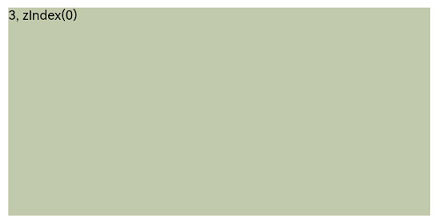
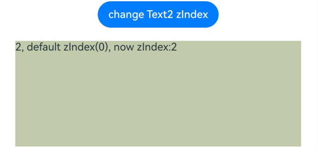

# Z序控制

组件的Z序，设置组件的堆叠顺序。

>  **说明：**
>
>  从API version 7开始支持。后续版本如有新增内容，则采用上角标单独标记该内容的起始版本。

## zIndex

zIndex(value: number): T

设置组件的堆叠顺序。

**卡片能力：** 从API version 9开始，该接口支持在ArkTS卡片中使用。

**原子化服务API：** 从API version 11开始，该接口支持在原子化服务中使用。

**系统能力：** SystemCapability.ArkUI.ArkUI.Full

**参数：** 

| 参数名 | 类型   | 必填 | 说明                                                         |
| ------ | ------ | ---- | ------------------------------------------------------------ |
| value  | number | 是   | 同一容器中兄弟组件显示层级关系。zIndex值越大，显示层级越高，即zIndex值大的组件会覆盖在zIndex值小的组件上方。当不涉及新增或减少兄弟节点，动态改变zIndex时会在zIndex改变前层级顺序的基础上进行稳定排序。 |

**返回值：**

| 类型 | 说明 |
| -------- | -------- |
| T | 返回当前组件。 |

## 示例

### 示例1（设置组件堆叠顺序）

该示例通过zIndex设置组件堆叠顺序。

```ts
// xxx.ets
@Entry
@Component
struct ZIndexExample {
  build() {
    Column() {
      Stack() {
        // stack会重叠组件，默认后定义的在最上面，具有较高zIndex值的元素在zIndex较小的元素前面
        Text('1, zIndex(2)')
          .size({ width: '40%', height: '30%' }).backgroundColor(0xbbb2cb)
          .zIndex(2)
        Text('2, default zIndex(1)')
          .size({ width: '70%', height: '50%' }).backgroundColor(0xd2cab3).align(Alignment.TopStart)
          .zIndex(1)
        Text('3, zIndex(0)')
          .size({ width: '90%', height: '80%' }).backgroundColor(0xc1cbac).align(Alignment.TopStart)
      }.width('100%').height(200)
    }.width('100%').height(200)
  }
}
```
Stack容器内子组件不设置zIndex的效果。



Stack容器子组件设置zIndex后的效果。


### 示例2（动态修改zIndex属性）

该示例使用Button组件动态修改zIndex属性。

```ts
// xxx.ets
@Entry
@Component
struct ZIndexExample {
  @State zIndex_ : number = 0
  build() {
    Column() {
      // 点击Button改变zIndex后，在点击Button前的层级顺序上根据zIndex进行稳定排序。
      Button("change Text2 zIndex")
        .onClick(()=>{
          this.zIndex_ = (this.zIndex_ + 1) % 3;
        })
      Stack() {
        Text('1, zIndex(1)')
          .size({ width: '70%', height: '50%' }).backgroundColor(0xd2cab3).align(Alignment.TopStart)
          .zIndex(1)
        Text('2, default zIndex(0), now zIndex:' + this.zIndex_)
          .size({ width: '90%', height: '80%' }).backgroundColor(0xc1cbac).align(Alignment.TopStart)
          .zIndex(this.zIndex_)
      }.width('100%').height(200)
    }.width('100%').height(200)
  }
}
```

不点击Button修改zIndex值的效果。


点击Button动态修改zIndex，使Text1和Text2的zIndex相等，因为在点击Button前的层级顺序上根据zIndex进行稳定排序，层级顺序不发生改变。


点击Button动态修改zIndex，使Text2的zIndex大于Text1，层级顺序发生改变。

