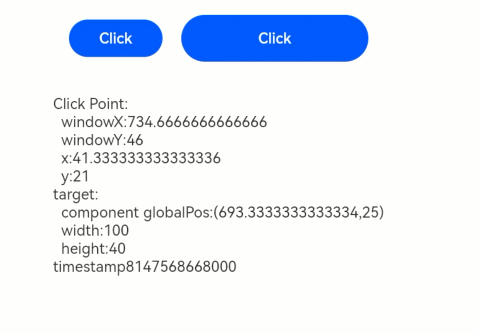

# 点击事件

组件被点击时触发的事件。

>  **说明：**
>
>  从API Version 7开始支持。后续版本如有新增内容，则采用上角标单独标记该内容的起始版本。

## onClick<sup>12+</sup>

onClick(event: Callback\<ClickEvent>, distanceThreshold: number): T

点击动作触发该回调。

相较于原有onClick接口，新增distanceThreshold参数作为点击事件移动阈值，当手指的移动距离超出所设置的点击手势移动阈值时，点击手势识别失败。
对于点击时手指移动距离没有限制的场景，建议采用原有接口。若要求点击时手指在一定区域范围内，建议使用该接口。

**卡片能力：** 从API version 12开始，该接口支持在ArkTS卡片中使用。

**原子化服务API：** 从API version 12开始，该接口支持在原子化服务中使用。

**系统能力：** SystemCapability.ArkUI.ArkUI.Full

**参数：** 

| 参数名 | 类型                              | 必填 | 说明                 |
| ------ | --------------------------------- | ---- | -------------------- |
| event  | [ClickEvent](#clickevent对象说明) | 是   | 获得[ClickEvent](#clickevent对象说明)对象。 |
| distanceThreshold  | number | 是   | 点击事件移动阈值。当设置的值小于0时，会被转化为默认值。<br/>默认值：2^31-1<br/>**说明：**<br/>当手指的移动距离超出所设置的点击手势移动阈值时，点击手势识别失败。当使用默认值时，当手指移动超出组件热区范围时，点击手势识别失败。 |

## onClick

onClick(event: (event: ClickEvent) => void): T

点击动作触发该回调。

**卡片能力：** 从API version 9开始，该接口支持在ArkTS卡片中使用。

**原子化服务API：** 从API version 11开始，该接口支持在原子化服务中使用。

**系统能力：** SystemCapability.ArkUI.ArkUI.Full

**参数：** 

| 参数名 | 类型                              | 必填 | 说明                 |
| ------ | --------------------------------- | ---- | -------------------- |
| event  | [ClickEvent](#clickevent对象说明) | 是   | 获得[ClickEvent](#clickevent对象说明)对象。 |

**返回值：**

| 类型 | 说明 |
| -------- | -------- |
| T | 返回当前组件。 |

## ClickEvent对象说明

继承于[BaseEvent](ts-gesture-customize-judge.md#baseevent对象说明)。

**系统能力：** SystemCapability.ArkUI.ArkUI.Full

| 名称            | 类型                                 | 描述                                                     |
| ------------------- | ------------------------------------ | -------------------------------------------------------- |
| x                   | number                               | 点击位置相对于被点击元素左边缘的X坐标。<br/>单位：vp<br/>**卡片能力：** 从API version 9开始，该接口支持在ArkTS卡片中使用。<br/>**原子化服务API：** 从API version 11开始，该接口支持在原子化服务中使用。     |
| y                   | number                               | 点击位置相对于被点击元素原始区域左上角的Y坐标。<br/>单位：vp<br/>**卡片能力：** 从API version 9开始，该接口支持在ArkTS卡片中使用。<br/>**原子化服务API：** 从API version 11开始，该接口支持在原子化服务中使用。          |
| target<sup>8+</sup> | [EventTarget](#eventtarget8对象说明) | 触发事件的元素对象显示区域。<br/>**卡片能力：** 从API version 9开始，该接口支持在ArkTS卡片中使用。<br/>**原子化服务API：** 从API version 11开始，该接口支持在原子化服务中使用。  |
| windowX<sup>10+</sup> | number                             | 点击位置相对于应用窗口左上角的X坐标。<br/>单位：vp<br/>**卡片能力：** 从API version 9开始，该接口支持在ArkTS卡片中使用。<br/>**原子化服务API：** 从API version 11开始，该接口支持在原子化服务中使用。 |
| windowY<sup>10+</sup> | number                             | 点击位置相对于应用窗口左上角的Y坐标。<br/>单位：vp<br/>**卡片能力：** 从API version 9开始，该接口支持在ArkTS卡片中使用。<br/>**原子化服务API：** 从API version 11开始，该接口支持在原子化服务中使用。 |
| displayX<sup>10+</sup> | number                            | 点击位置相对于应用屏幕左上角的X坐标。<br/>单位：vp<br/>**卡片能力：** 从API version 9开始，该接口支持在ArkTS卡片中使用。<br/>**原子化服务API：** 从API version 11开始，该接口支持在原子化服务中使用。 |
| displayY<sup>10+</sup> | number                            | 点击位置相对于应用屏幕左上角的Y坐标。<br/>单位：vp<br/>**卡片能力：** 从API version 9开始，该接口支持在ArkTS卡片中使用。<br/>**原子化服务API：** 从API version 11开始，该接口支持在原子化服务中使用。 |
| screenX<sup>(deprecated)</sup> | number                    | 点击位置相对于应用窗口左上角的X坐标。<br>从API Version 10开始不再维护，建议使用windowX代替。 |
| screenY<sup>(deprecated)</sup> | number                    | 点击位置相对于应用窗口左上角的Y坐标。<br>从API Version 10开始不再维护，建议使用windowY代替。 |
| preventDefault<sup>12+</sup>      | () => void | 阻止默认事件。<br/> **说明：**&nbsp;该接口仅支持部分组件使用，当前支持组件：RichEditor。<br/>**原子化服务API：** 从API version 12开始，该接口支持在原子化服务中使用。|

## EventTarget<sup>8+</sup>对象说明

**卡片能力：** 从API version 9开始，该接口支持在ArkTS卡片中使用。

**原子化服务API：** 从API version 11开始，该接口支持在原子化服务中使用。

**系统能力：** SystemCapability.ArkUI.ArkUI.Full

| 名称   | 参数类型                      | 描述         |
| ---- | ------------------------- | ---------- |
| area | [Area](ts-types.md#area8) | 目标元素的区域信息。 |

## 示例

```ts
// xxx.ets
@Entry
@Component
struct ClickExample {
  @State text: string = ''

  build() {
    Column() {
      Row({ space: 20 }) {
        Button('Click').width(100).height(40)
          .onClick((event?: ClickEvent) => {
            if(event){
              this.text = 'Click Point:' + '\n  windowX:' + event.windowX + '\n  windowY:' + event.windowY
              + '\n  x:' + event.x + '\n  y:' + event.y + '\ntarget:' + '\n  component globalPos:('
              + event.target.area.globalPosition.x + ',' + event.target.area.globalPosition.y + ')\n  width:'
              + event.target.area.width + '\n  height:' + event.target.area.height + '\ntimestamp' + event.timestamp;
            }
          }, 20)
        Button('Click').width(200).height(50)
          .onClick((event?: ClickEvent) => {
            if(event){
              this.text = 'Click Point:' + '\n  windowX:' + event.windowX + '\n  windowY:' + event.windowY
              + '\n  x:' + event.x + '\n  y:' + event.y + '\ntarget:' + '\n  component globalPos:('
              + event.target.area.globalPosition.x + ',' + event.target.area.globalPosition.y + ')\n  width:'
              + event.target.area.width + '\n  height:' + event.target.area.height + '\ntimestamp' + event.timestamp;
            }
          }, 20)
      }.margin(20)

      Text(this.text).margin(15)
    }.width('100%')
  }
}
```



