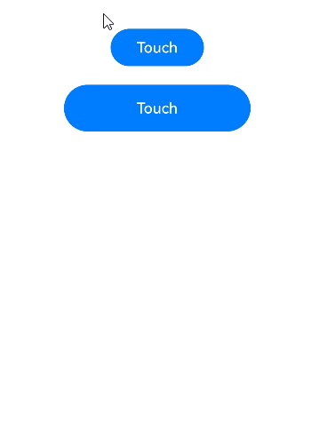

# 触摸事件

手指在组件上按下、滑动或抬起时触发。

> **说明：**
>
> 从API version 7开始支持。后续版本如有新增内容，则采用上角标单独标记该内容的起始版本。

## onTouch

onTouch(event: (event: TouchEvent) => void): T

手指触摸动作触发该回调。鼠标左键按下时对应的事件也会转化成触摸事件并触发该回调。

**原子化服务API：** 从API version 11开始，该接口支持在原子化服务中使用。

**系统能力：** SystemCapability.ArkUI.ArkUI.Full

**参数：**

| 参数名 | 类型                              | 必填 | 说明                 |
| ------ | --------------------------------- | ---- | -------------------- |
| event  | [TouchEvent](#touchevent对象说明) | 是   | 获得TouchEvent对象。 |

**返回值：**

| 类型 | 说明 |
| -------- | -------- |
| T | 返回当前组件。 |

## TouchEvent对象说明

继承于[BaseEvent](ts-gesture-customize-judge.md#baseevent对象说明8)。在非事件注入场景下，changedTouches是按屏幕刷新率重采样的点，而touches是按器件刷新率上报的点，因此changedTouches的数据可能与touches不同。

**系统能力：** SystemCapability.ArkUI.ArkUI.Full

| 名称                | 类型                                       | 描述           |
| ------------------- | ---------------------------------------- | ------------ |
| type                | [TouchType](ts-appendix-enums.md#touchtype)      | 触摸事件的类型。<br/>**原子化服务API：** 从API version 11开始，该接口支持在原子化服务中使用。     |
| touches             | Array&lt;[TouchObject](#touchobject对象说明)&gt; | 全部屏幕触点（多指）的信息，每个元素代表一个触点。<br/>**原子化服务API：** 从API version 11开始，该接口支持在原子化服务中使用。      |
| changedTouches      | Array&lt;[TouchObject](#touchobject对象说明)&gt; | 发生变化而产生事件的手指信息。<br/>**原子化服务API：** 从API version 11开始，该接口支持在原子化服务中使用。 |
| stopPropagation      | () => void | 阻塞事件冒泡。<br/>**原子化服务API：** 从API version 11开始，该接口支持在原子化服务中使用。 |
| preventDefault<sup>12+</sup>      | () => void |  阻止默认事件。<br/> **说明：**&nbsp;该接口仅支持部分组件使用，当前支持组件：Hyperlink，不支持的组件使用时会抛出异常。暂不支持异步调用和提供Modifier接口。<br/> **原子化服务API：** 从API version 12开始，该接口支持在原子化服务中使用。 |

**错误码：**

以下错误码的详细介绍请参见[交互事件错误码](../errorcode-event.md)。

| 错误码ID   | 错误信息 |
| --------- | ------- |
| 100017       | Component does not support prevent function. |

### getHistoricalPoints<sup>10+</sup>

getHistoricalPoints(): Array&lt;HistoricalPoint&gt;

获取当前帧所有的历史点。不同设备每帧的触摸事件频率不同，且该接口只能在[TouchEvent](#touchevent对象说明)中调用，可以通过该接口获取触发[onTouch](#ontouch)时当前帧历史点的相关信息。[onTouch](#ontouch)一帧通常只会调用一次，如果当前帧收到的[TouchEvent](#touchevent对象说明)大于1，会将该帧最后一个点通过[onTouch](#ontouch)返还，剩余点作为历史点。如果多指在同一帧上报事件，可能存在触发多次onTouch。

**原子化服务API：** 从API version 11开始，该接口支持在原子化服务中使用。

**系统能力：** SystemCapability.ArkUI.ArkUI.Full

**返回值：**

| 类型     | 描述                      |
| ------ | ----------------------- |
| Array&lt;[HistoricalPoint](#historicalpoint10对象说明)&gt; | 由历史点组成的数组。 |


## TouchObject对象说明

**系统能力：** SystemCapability.ArkUI.ArkUI.Full

| 名称    | 类型                                        | 描述                                  |
| ------- | ------------------------------------------- | ------------------------------------- |
| type    | [TouchType](ts-appendix-enums.md#touchtype) | 触摸事件的类型。<br/>**原子化服务API：** 从API version 11开始，该接口支持在原子化服务中使用。                      |
| id      | number                                      | 手指唯一标识符。<br/>**原子化服务API：** 从API version 11开始，该接口支持在原子化服务中使用。                      |
| x       | number                                      | 触摸点相对于事件响应组件的左上角的X坐标。<br/>单位：vp<br/>**原子化服务API：** 从API version 11开始，该接口支持在原子化服务中使用。 |
| y       | number                                      | 触摸点相对于事件响应组件的左上角的Y坐标。<br/>单位：vp<br/>**原子化服务API：** 从API version 11开始，该接口支持在原子化服务中使用。 |
| windowX<sup>10+</sup>  | number                       | 触摸点相对于应用窗口左上角的X坐标。<br/>单位：vp<br/>**原子化服务API：** 从API version 11开始，该接口支持在原子化服务中使用。   |
| windowY<sup>10+</sup>  | number                       | 触摸点相对于应用窗口左上角的Y坐标。<br/>单位：vp<br/>**原子化服务API：** 从API version 11开始，该接口支持在原子化服务中使用。   |
| displayX<sup>10+</sup> | number                       | 触摸点相对于应用屏幕左上角的X坐标。<br/>单位：vp<br/>**原子化服务API：** 从API version 11开始，该接口支持在原子化服务中使用。   |
| displayY<sup>10+</sup> | number                       | 触摸点相对于应用屏幕左上角的Y坐标。<br/>单位：vp<br/>**原子化服务API：** 从API version 11开始，该接口支持在原子化服务中使用。   |
| screenX<sup>(deprecated)</sup> | number               | 触摸点相对于应用窗口左上角的X坐标。<br/>单位：vp <br>从API version 10开始不再维护，建议使用windowX代替。   |
| screenY<sup>(deprecated)</sup> | number               | 触摸点相对于应用窗口左上角的Y坐标。<br/>单位：vp <br>从API version 10开始不再维护，建议使用windowY代替。   |
| PressedTime<sup>15+</sup> | number | 当前手指按下的时间。<br />**原子化服务API：** 从API version 15开始，该接口支持在原子化服务中使用。 |
| pressure<sup>15+</sup> | number | 当前手指按着的压力值。<br />**原子化服务API：** 从API version 15开始，该接口支持在原子化服务中使用。 |
| width<sup>15+</sup> | number | 当前手指按压区域的宽。<br />单位：vp<br/>**原子化服务API：** 从API version 15开始，该接口支持在原子化服务中使用。 |
| height<sup>15+</sup> | number | 当前手指按压区域的高。<br />单位：vp<br/>**原子化服务API：** 从API version 15开始，该接口支持在原子化服务中使用。 |
| hand<sup>15+</sup> | [InteractionHand](./ts-gesture-settings.md#interactionhand枚举说明15) | 表示事件是由左手点击还是右手点击触发。<br />**原子化服务API：** 从API version 15开始，该接口支持在原子化服务中使用。 |

## HistoricalPoint<sup>10+</sup>对象说明

**原子化服务API：** 从API version 11开始，该接口支持在原子化服务中使用。

**系统能力：** SystemCapability.ArkUI.ArkUI.Full

| 名称         | 类型                                 | 描述                                                                         |
| ----------- | ----------------------------------- | ----------------------------------------------------------------------------- |
| touchObject | [TouchObject](#touchobject对象说明)  | 历史点对应触摸事件的基础信息。                                                   |
| size        | number                              | 历史点对应触摸事件的手指与屏幕的触摸区域大小。<br/>默认值：0                                     |
| force       | number                              | 历史点对应触摸事件的压力大小。<br/>默认值：0<br/>取值范围：[0,65535)，压力越大值越大。|
| timestamp   | number                              | 历史点对应触摸事件的时间戳。触发事件时距离系统启动的时间间隔。<br>单位：ns           |

## 示例

该示例通过按钮设置了触摸事件，手指点击按钮时可获取触摸事件的相关参数。

```ts
// xxx.ets
@Entry
@Component
struct TouchExample {
  @State text: string = ''
  @State eventType: string = ''

  build() {
    Column() {
      Button('Touch').height(40).width(100)
        .onTouch((event?: TouchEvent) => {
          if(event){
            if (event.type === TouchType.Down) {
              this.eventType = 'Down'
            }
            if (event.type === TouchType.Up) {
              this.eventType = 'Up'
            }
            if (event.type === TouchType.Move) {
              this.eventType = 'Move'
            }
            this.text = 'TouchType:' + this.eventType + '\nDistance between touch point and touch element:\nx: '
            + event.touches[0].x + '\n' + 'y: ' + event.touches[0].y + '\nComponent globalPos:('
            + event.target.area.globalPosition.x + ',' + event.target.area.globalPosition.y + ')\nwidth:'
            + event.target.area.width + '\nheight:' + event.target.area.height + '\ntargetDisplayId:' +
            event.targetDisplayId + '\npressedTime:' + event.touches[0].pressedTime + '\npressure:' +
            event.touches[0].pressure +
              '\nwidth:' + event.touches[0].width + '\nheight:' + event.touches[0].height
          }
        })
      Button('Touch').height(50).width(200).margin(20)
        .onTouch((event?: TouchEvent) => {
          if(event){
            if (event.type === TouchType.Down) {
              this.eventType = 'Down'
            }
            if (event.type === TouchType.Up) {
              this.eventType = 'Up'
            }
            if (event.type === TouchType.Move) {
              this.eventType = 'Move'
            }
            this.text = 'TouchType:' + this.eventType + '\nDistance between touch point and touch element:\nx: '
            + event.touches[0].x + '\n' + 'y: ' + event.touches[0].y + '\nComponent globalPos:('
            + event.target.area.globalPosition.x + ',' + event.target.area.globalPosition.y + ')\nwidth:'
            + event.target.area.width + '\nheight:' + event.target.area.height + '\ntargetDisplayId:' +
            event.targetDisplayId + '\npressedTime:' + event.touches[0].pressedTime + '\npressure:' +
            event.touches[0].pressure +
              '\nwidth:' + event.touches[0].width + '\nheight:' + event.touches[0].height
          }
        })
      Text(this.text)
    }.width('100%').padding(30)
  }
}
```

