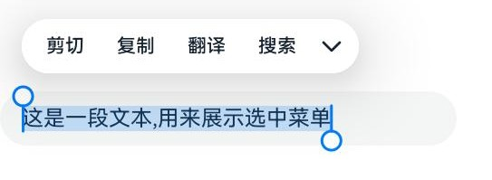
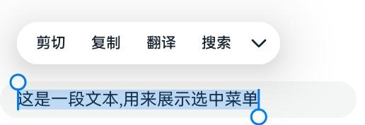

# 文本输入 (TextInput/TextArea)


TextInput、TextArea是输入框组件，用于响应用户输入，比如评论区的输入、聊天框的输入、表格的输入等，也可以结合其它组件构建功能页面，例如登录注册页面。具体用法请参考[TextInput](../reference/apis-arkui/arkui-ts/ts-basic-components-textinput.md)、[TextArea](../reference/apis-arkui/arkui-ts/ts-basic-components-textarea.md)。


## 创建输入框

TextInput为单行输入框、TextArea为多行输入框。通过以下接口来创建。

```ts
TextInput(value?:{placeholder?: ResourceStr, text?: ResourceStr, controller?: TextInputController})
```

```ts
TextArea(value?:{placeholder?: ResourceStr, text?: ResourceStr, controller?: TextAreaController})
```

- 单行输入框。

  ```ts
  TextInput()
  ```

  


- 多行输入框。

  ```ts
  TextArea()
  ```

  

- 多行输入框文字超出一行时会自动折行。


  ```ts
  TextArea({ text: "我是TextArea我是TextArea我是TextArea我是TextArea" }).width(300)
  ```

  


## 设置输入框类型

TextInput有以下类型可选择：Normal基本输入模式、Password密码输入模式、Email邮箱地址输入模式、Number纯数字输入模式、PhoneNumber电话号码输入模式、USER_NAME用户名输入模式、NEW_PASSWORD新密码输入模式、NUMBER_PASSWORD纯数字密码输入模式、<!--Del-->SCREEN_LOCK_PASSWORD锁屏应用密码输入模式、<!--DelEnd-->NUMBER_DECIMAL带小数点的数字输入模式、带URL的输入模式。通过type属性进行设置：


- 基本输入模式（默认类型）。

  ```ts
  TextInput()
    .type(InputType.Normal)
  ```

  

- 密码输入模式。

  ```ts
  TextInput()
    .type(InputType.Password)
  ```

  

- 邮箱地址输入模式。

  ```ts
  TextInput()
    .type(InputType.Email)
  ```

  

- 纯数字输入模式。

  ```ts
  TextInput()
    .type(InputType.Number)
  ```

  

- 电话号码输入模式。

  ```ts
  TextInput()
    .type(InputType.PhoneNumber)
  ```

  

- 带小数点的数字输入模式。

  ```ts
  TextInput()
    .type(InputType.NUMBER_DECIMAL)
  ```

  

- 带URL的输入模式。

  ```ts
  TextInput()
    .type(InputType.URL)
  ```

  

## 自定义样式

- 设置无输入时的提示文本。


  ```ts
  TextInput({ placeholder: '我是提示文本' })
  ```

  


- 设置输入框当前的文本内容。

  ```ts
  TextInput({ placeholder: '我是提示文本', text: '我是当前文本内容' })
  ```

  

- 添加backgroundColor改变输入框的背景颜色。

  ```ts
  TextInput({ placeholder: '我是提示文本', text: '我是当前文本内容' })
    .backgroundColor(Color.Pink)
  ```

  

  更丰富的样式可以结合[通用属性](../reference/apis-arkui/arkui-ts/ts-component-general-attributes.md)实现。


## 添加事件

文本框主要用于获取用户输入的信息，并将信息处理成数据进行上传，绑定onChange事件可以获取输入框内改变的文本内容，绑定onSubmit事件可以获取回车提交的文本信息，绑定onTextSelectionChange事件可以获取文本选中时手柄的位置信息或者编辑时光标的位置信息等等。用户也可以使用通用事件进行相应的交互操作。

>  **说明：**
>
>  在密码模式下，设置showPassword属性时，在onSecurityStateChange回调中，建议增加状态同步，具体详见如下示例。
>
> onWillInsert、onDidInsert、onWillDelete、onDidDelete回调仅支持系统输入法的场景。
>
> [onWillChange](../reference/apis-arkui/arkui-ts/ts-basic-components-textinput.md#onwillchange15)的回调时序晚于onWillInsert、onWillDelete，早于onDidInsert、onDidDelete。

```ts
TextInput({ text: this.text, placeholder: 'input your word...', controller: this.controller })
  .type(InputType.Password)
  .showPassword(this.passwordState)
  .onChange((value: string) => {
    // 文本内容发生变化时触发该回调
    console.info('onChange is triggering: ', value);
  })
  .onSubmit((enterKey: EnterKeyType, event: SubmitEvent) => {
    // 按下输入法回车键时触发该回调
    console.info('onSubmit is triggering: ', enterKey, event.text);
  })
  .onTextSelectionChange((selectionStart: number, selectionEnd: number) => {
    // 文本选择的位置发生变化或编辑状态下光标位置发生变化时，触发该回调
    console.info('onTextSelectionChange is triggering: ', selectionStart, selectionEnd);
  })
  .onSecurityStateChange((isShowPassword: boolean) => {
    // 密码显隐状态切换时，触发该回调
    console.info('onSecurityStateChange is triggering: ', isShowPassword);
    this.passwordState = isShowPassword;
  })
  .onWillInsert((info: InsertValue) => {
    // 在将要输入时，触发该回调
    console.info('onWillInsert is triggering: ', info.insertValue, info.insertOffset);
    return true;
  })
  .onDidInsert((info: InsertValue) => {
    // 在输入完成时，触发该回调
    console.info('onDidInsert is triggering: ', info.insertValue, info.insertOffset);
  })
  .onWillDelete((info: DeleteValue) => {
    // 在将要删除时，触发该回调
    console.info('onWillDelete is triggering: ', info.deleteValue, info.deleteOffset);
    return true;
  })
  .onDidDelete((info: DeleteValue) => {
    // 在删除完成时，触发该回调
    console.info('onDidDelete is triggering: ', info.deleteValue, info.deleteOffset);
  })
  .onFocus(() => {
    //绑定通用事件，输入框获焦时触发该回调
    console.info('onFocus is triggering')
  })
```

## 选中菜单

输入框中的文字被选中时会弹出包含剪切、复制、翻译、搜索的菜单。

TextInput:
```ts
TextInput({text : '这是一段文本，用来展示选中菜单'})
```


TextArea:
```ts
TextArea({text : '这是一段文本，用来展示选中菜单'})
```


## 自动填充

输入框可以通过[contentType](../reference/apis-arkui/arkui-ts/ts-basic-components-textinput.md#contenttype12)属性设置自动填充类型。

支持的类型请参考[ContentType](../reference/apis-arkui/arkui-ts/ts-basic-components-textinput.md#contenttype12枚举说明)。
```ts
TextInput({ placeholder: '输入你的邮箱...' })
  .width('95%')
  .height(40)
  .margin(20)
  .contentType(ContentType.EMAIL_ADDRESS)
```

## 设置省略属性

输入框可以通过[ellipsisMode](../reference/apis-arkui/arkui-ts/ts-basic-components-textinput.md#ellipsismode18)属性设置省略位置。

ellipsisMode属性需要配合overflow设置为TextOverflow.Ellipsis使用，单独设置ellipsisMode属性不生效。

```ts
TextInput({ text: '这是一段文本，用来展示省略模式'})
  .textOverflow(TextOverflow.Ellipsis)
  .ellipsisMode(EllipsisMode.END)
  .style(TextInputStyle.Inline)
  .fontSize(30)
  .margin(30)
```


## 键盘避让

键盘抬起后，具有滚动能力的容器组件在横竖屏切换时，才会生效键盘避让，若希望无滚动能力的容器组件也生效键盘避让，建议在组件外嵌套一层具有滚动能力的容器组件，比如[Scroll](../reference/apis-arkui/arkui-ts/ts-container-scroll.md)、[List](../reference/apis-arkui/arkui-ts/ts-container-list.md)、[Grid](../reference/apis-arkui/arkui-ts/ts-container-grid.md)。

```ts
// xxx.ets
@Entry
@Component
struct Index {
  placeHolderArr: string[] = ['1', '2', '3', '4', '5', '6', '7'];

  build() {
    Scroll() {
      Column() {
        ForEach(this.placeHolderArr, (placeholder: string) => {
          TextInput({ placeholder: 'TextInput ' + placeholder })
            .margin(30)
        })
      }
    }
    .height('100%')
    .width('100%')
  }
}
```


## 光标避让

[keyBoardAvoidMode](../reference/apis-arkui/js-apis-arkui-UIContext.md#keyboardavoidmode11)枚举中的OFFSET和RESIZE在键盘抬起后，不支持二次避让。如果想要支持光标位置在点击或者通过接口设置变化后发生二次避让，可以考虑使用OFFSET_WITH_CARET和RESIZE_CARET替换原有的OFFSET和RESIZE模式。<br>
对于滚动容器更推荐使用RESIZE_WITH_CARET，非滚动容器应该使用OFFSET_WITH_CARET。

```ts
// EntryAbility.ets
import { KeyboardAvoidMode } from '@kit.ArkUI';

// Used in UIAbility
onWindowStageCreate(windowStage: window.WindowStage) {
  // Main window is created, set main page for this ability
  hilog.info(0x0000, 'testTag', '%{public}s', 'Ability onWindowStageCreate');

  windowStage.loadContent('pages/Index', (err, data) => {
    let keyboardAvoidMode = windowStage.getMainWindowSync().getUIContext().getKeyboardAvoidMode();
  windowStage.getMainWindowSync().getUIContext().setKeyboardAvoidMode(KeyboardAvoidMode.OFFSET_WITH_CARET);
    if (err.code) {
      hilog.error(0x0000, 'testTag', 'Failed to load the content. Cause: %{public}s', JSON.stringify(err) ?? '');
      return;
    }
    hilog.info(0x0000, 'testTag', 'Succeeded in loading the content. Data: %{public}s', JSON.stringify(data) ?? '');
  });
}
```

```ts
// xxx.ets
@Entry
@Component
struct Index {
  @State caretPosition: number = 600;
  areaController: TextAreaController = new TextAreaController();
  text = "Most of us compare ourselves with anyone we think is happier — a relative, someone we know a lot, or someone we hardly know. As a result, what we do remember is anything that makes others happy, anything that makes ourselves unhappy, totally forgetting that there is something happy in our own life.\
  So the best way to destroy happiness is to look at something and focus on even the smallest flaw. It is the smallest flaw that would make us complain. And it is the complaint that leads to us becoming unhappy.\
  If one chooses to be happy, he will be blessed; if he chooses to be unhappy, he will be cursed. Happiness is just what you think will make you happy.Most of us compare ourselves with anyone we think is happier — a relative, someone we know a lot, or someone we hardly know. As a result, what we do remember is anything that makes others happy, anything that makes ourselves unhappy, totally forgetting that there is something happy in our own life.\
  ";

  build() {
    Scroll() {
      Column() {
        Row() {
          Button('CaretPosition++: ' + this.caretPosition).onClick(() => {
            this.caretPosition += 1;
          }).fontSize(10)
          Button('CaretPosition--: ' + this.caretPosition).onClick(() => {
            this.caretPosition -= 1;
          }).fontSize(10)
          Button('SetCaretPosition: ').onClick(() => {
            this.areaController.caretPosition(this.caretPosition);
          }).fontSize(10)
        }

        TextArea({ text: this.text, controller: this.areaController })
          .width('100%')
          .fontSize('20fp')
      }
    }.width('100%').height('100%')
  }
}
```


## 相关实例

针对文本输入开发，有以下相关实例可供参考：

- [聊天实例应用（ArkTS）](https://gitee.com/openharmony/applications_app_samples/tree/master/code/Solutions/IM/Chat#%E8%81%8A%E5%A4%A9%E5%AE%9E%E4%BE%8B%E5%BA%94%E7%94%A8)