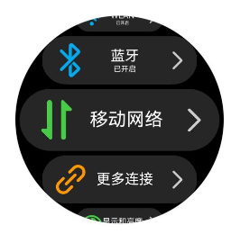

# 列表与网格概述
许多应用存在滚动展示同类项目集合的需求，例如显示图片、视频、音乐、新闻、商品等。此类场景可以根据项目排列方式分别选择[List](arkts-layout-development-create-list.md)、[Grid](arkts-layout-development-create-grid.md)、[WaterFlow](arkts-layout-development-create-waterflow.md)实现，在圆形屏幕推荐使用[ArcList](arkts-layout-development-create-arclist.md)。

## 列表

List适合单列和多列宽度相同的场景，如通讯录、音乐列表、购物清单等。

直播评论、即时聊天等应用场景需要在列表底部插入数据时，内容应自动向上滚动，以展示新插入的节点，此功能可通过配置[List从尾部开始布局](../reference/apis-arkui/arkui-ts/ts-container-list.md#stackfromend19)实现。

## 网格

网格布局由“行”和“列”分割的单元格组成，通过指定“项目”所在单元格实现多种布局，应用场景包括九宫格图片展示、日历、计算器等。

对于部分项目占用多行或多列的场景，可以通过在创建Grid时传入合适的[GridLayoutOptions](../reference/apis-arkui/arkui-ts/ts-container-grid.md#gridlayoutoptions10对象说明)来实现。

## 瀑布流

瀑布流布局是一种多列等宽但高度不等的布局方式，适用于需要错落排列的场景，如图片和视频展示、商品推荐等。

同一个页面内有不同列数分段混合布局的场景，可以通过设置[WaterFlowSections](../reference/apis-arkui/arkui-ts/ts-container-waterflow.md#waterflowoptions对象说明)实现。

## 弧形列表

弧形列表是一种专为圆形屏幕设备设计的特殊列表，支持列表项在接近屏幕上下两端自动缩放的效果。

## 能力对比

|业务场景| List | Grid | WaterFlow | ArcList |
|---------|---------|---------|---------|---------|
|滚动通用能力|支持|支持|支持|支持|
|项目分组|[ListItemGroup](../reference/apis-arkui/arkui-ts/ts-container-listitemgroup.md)|[GridLayoutOptions](../reference/apis-arkui/arkui-ts/ts-container-grid.md#gridlayoutoptions10对象说明)|[WaterFlowSections](../reference/apis-arkui/arkui-ts/ts-container-waterflow.md#waterflowoptions对象说明)|不支持|
|指定项目吸顶|[支持](../reference/apis-arkui/arkui-ts/ts-container-list.md#sticky9)|不支持|不支持|不支持|
|项目拖拽排序|[支持](https://gitee.com/openharmony/docs/blob/master/zh-cn/application-dev/reference/apis-arkui/arkui-ts/ts-universal-attributes-drag-sorting.md)，包括内置动画和拖动到边缘自动滚动|仅所有项目都占1行1列时[支持内置动画](../reference/apis-arkui/arkui-ts/ts-container-grid.md#supportanimation8)，且不支持拖动到边缘自动滚动|不支持|不支持|
|项目横滑|[支持](../reference/apis-arkui/arkui-ts/ts-container-listitem.md#swipeaction9)|不支持|不支持|不支持|
|项目间距|支持|支持|支持|支持|
|项目分割线|支持|不支持|不支持|不支持|