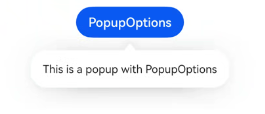
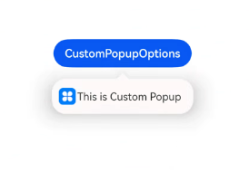
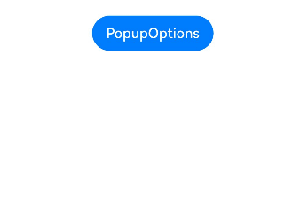

# 气泡提示（Popup）
Popup属性可绑定在组件上显示气泡弹窗提示，设置弹窗内容、交互逻辑和显示状态。主要用于屏幕录制、信息弹出提醒等显示状态。

气泡分为两种类型，一种是系统提供的气泡[PopupOptions](../reference/apis-arkui/arkui-ts/ts-universal-attributes-popup.md#popupoptions类型说明)，一种是开发者可以自定义的气泡[CustomPopupOptions](../reference/apis-arkui/arkui-ts/ts-universal-attributes-popup.md#custompopupoptions8类型说明)。其中，PopupOptions通过配置primaryButton和secondaryButton来设置带按钮的气泡，CustomPopupOptions通过配置[builder](../../application-dev/ui/state-management/arkts-builder.md)来设置自定义的气泡。

气泡可以通过配置[mask](../reference/apis-arkui/arkui-ts/ts-universal-attributes-popup.md#popupoptions类型说明)来实现模态和非模态窗口，mask为true或者颜色值的时候，气泡为模态窗口，mask为false时，气泡为非模态窗口。

## 文本提示气泡

文本提示气泡常用于展示带有文本的信息提示，适用于无交互的场景。Popup属性需绑定组件，当bindPopup属性的参数show为true时，会弹出气泡提示。

在Button组件上绑定Popup属性，每次点击Button按钮时，handlePopup会切换布尔值。当值为true时，触发bindPopup弹出气泡。

```ts
@Entry
@Component
struct PopupExample {
  @State handlePopup: boolean = false;

  build() {
    Column() {
      Button('PopupOptions')
        .onClick(() => {
          this.handlePopup = !this.handlePopup;
        })
        .bindPopup(this.handlePopup, {
          message: 'This is a popup with PopupOptions',
        })
    }.width('100%').padding({ top: 5 })
  }
}
```



## 添加气泡状态变化的事件

通过onStateChange参数为气泡添加状态变化的事件回调，可以判断气泡的当前显示状态。

```ts
@Entry
@Component
struct PopupExample {
  @State handlePopup: boolean = false;

  build() {
    Column() {
      Button('PopupOptions')
        .onClick(() => {
          this.handlePopup = !this.handlePopup;
        })
        .bindPopup(this.handlePopup, {
          message: 'This is a popup with PopupOptions',
          onStateChange: (e)=> { // 返回当前的气泡状态
            if (!e.isVisible) {
              this.handlePopup = false;
            }
          }
        })
    }.width('100%').padding({ top: 5 })
  }
}
```


## 带按钮的提示气泡

通过primaryButton、secondaryButton属性为气泡最多设置两个Button按钮，通过此按钮进行简单的交互，开发者可以通过配置action参数来设置想要触发的操作。

```ts
@Entry
@Component
struct PopupExample22 {
  @State handlePopup: boolean = false;

  build() {
    Column() {
      Button('PopupOptions').margin({ top: 200 })
        .onClick(() => {
          this.handlePopup = !this.handlePopup;
        })
        .bindPopup(this.handlePopup, {
          message: 'This is a popup with PopupOptions',
          primaryButton: {
            value: 'Confirm',
            action: () => {
              this.handlePopup = !this.handlePopup;
              console.info('confirm Button click');
            }
          },
          secondaryButton: {
            value: 'Cancel',
            action: () => {
              this.handlePopup = !this.handlePopup;
            }
          },
          onStateChange: (e) => {
            if (!e.isVisible) {
              this.handlePopup = false;
            }
          }
        })
    }.width('100%').padding({ top: 5 })
  }
}
```


## 气泡的动画

通过定义transition，可以控制气泡的进场和出场动画效果。

```ts
// xxx.ets
@Entry
@Component
struct PopupExample {
  @State handlePopup: boolean = false;
  @State customPopup: boolean = false;

  // popup构造器定义弹框内容
  @Builder popupBuilder() {
    Row() {
      Text('Custom Popup with transitionEffect').fontSize(10)
    }.height(50).padding(5)
  }

  build() {
    Flex({ direction: FlexDirection.Column }) {
      // PopupOptions 类型设置弹框内容
      Button('PopupOptions')
        .onClick(() => {
          this.handlePopup = !this.handlePopup;
        })
        .bindPopup(this.handlePopup, {
          message: 'This is a popup with transitionEffect',
          placementOnTop: true,
          showInSubWindow: false,
          onStateChange: (e) => {
            if (!e.isVisible) {
              this.handlePopup = false;
            }
          },
          // 设置弹窗显示动效为透明度动效与平移动效的组合效果，无退出动效
          transition:TransitionEffect.asymmetric(
            TransitionEffect.OPACITY.animation({ duration: 1000, curve: Curve.Ease }).combine(
              TransitionEffect.translate({ x: 50, y: 50 })),
            TransitionEffect.IDENTITY)
        })
        .position({ x: 100, y: 150 })

      // CustomPopupOptions 类型设置弹框内容
      Button('CustomPopupOptions')
        .onClick(() => {
          this.customPopup = !this.customPopup;
        })
        .bindPopup(this.customPopup, {
          builder: this.popupBuilder,
          placement: Placement.Top,
          showInSubWindow: false,
          onStateChange: (e) => {
            if (!e.isVisible) {
              this.customPopup = false;
            }
          },
          // 设置弹窗显示动效与退出动效为缩放动效
          transition:TransitionEffect.scale({ x: 1, y: 0 }).animation({ duration: 500, curve: Curve.Ease })
        })
        .position({ x: 80, y: 300 })
    }.width('100%').padding({ top: 5 })
  }
}
```


## 自定义气泡

开发者可以使用CustomPopupOptions的builder创建自定义气泡，\@Builder中可以放自定义的内容。除此之外，还可以通过popupColor等参数控制气泡样式。

```ts
@Entry
@Component
struct Index {
  @State customPopup: boolean = false;
  // popup构造器定义弹框内容
  @Builder popupBuilder() {
    Row({ space: 2 }) {
      Image($r("app.media.icon")).width(24).height(24).margin({ left: 5 })
      Text('This is Custom Popup').fontSize(15)
    }.width(200).height(50).padding(5)
  }
  build() {
    Column() {
      Button('CustomPopupOptions')
        .position({x:100,y:200})
        .onClick(() => {
          this.customPopup = !this.customPopup;
        })
        .bindPopup(this.customPopup, {
          builder: this.popupBuilder, // 气泡的内容
          placement:Placement.Bottom, // 气泡的弹出位置
          popupColor:Color.Pink, // 气泡的背景色
          onStateChange: (e) => {
            if (!e.isVisible) {
              this.customPopup = false;
            }
          }
        })
    }
    .height('100%')
  }
}
```

使用者通过配置placement参数将弹出的气泡放到需要提示的位置。弹窗构造器会触发弹出提示信息，来引导使用者完成操作，也让使用者有更好的UI体验。



## 气泡样式

气泡除了可以通过builder实现自定义气泡，还可以通过接口设置气泡的样式和显示效果。

背景颜色：气泡的背景色默认为透明，但是会有一个默认的模糊效果，手机上为COMPONENT\_ULTRA\_THICK。
蒙层样式：气泡默认有蒙层，且蒙层的颜色为透明。
显示大小：气泡大小由内部的builder大小或者message的长度决定的。
显示位置：气泡默认显示在宿主组件的下方，可以通过Placement接口来配置其显示位置以及对齐方向。
以下示例通过设置popupColor（背景颜色）、mask（蒙层样式）、width（气泡宽度）、placement（显示位置）实现气泡的样式。

```ts
// xxx.ets

@Entry
@Component
struct PopupExample {
  @State handlePopup: boolean = false;

  build() {
    Column({ space: 100 }) {
      Button('PopupOptions')
        .onClick(() => {
          this.handlePopup = !this.handlePopup;
        })
        .bindPopup(this.handlePopup, {
          width: 200,
          message: 'This is a popup.',
          popupColor: Color.Red, // 设置气泡的背景色
          mask: {
            color: '#33d9d9d9'
          },
          placement: Placement.Top,
          backgroundBlurStyle: BlurStyle.NONE // 去除背景模糊效果需要关闭气泡的模糊背景
        })
    }
    .width('100%')
  }
}
```



## 气泡避让软键盘

当软键盘弹出时，气泡默认不会对其避让，可能导致气泡被软键盘覆盖，这时需要设置keyboardAvoidMode为KeyboardAvoidMode.DEFAULT，来使气泡避让键盘。这时如果当前没有位置放下气泡时，气泡会从预设位置平移覆盖宿主组件。

```ts
// xxx.ets

@Entry
@Component
struct PopupExample {
  @State handlePopup: boolean = false;

  @Builder popupBuilder() {
    Column({ space: 2 }) {
      Text('Custom Popup').fontSize(20)
        .borderWidth(2)
      TextInput()
    }.width(200).padding(5)
  }

  build() {
    Column({ space: 100 }) {
      TextInput()
      Button('PopupOptions')
        .onClick(() => {
          this.handlePopup = !this.handlePopup;
        })
        .bindPopup(this.handlePopup!!, {
          width: 200,
          builder: this.popupBuilder(),
          placement: Placement.Bottom,
          mask: false,
          autoCancel: false,
          keyboardAvoidMode: KeyboardAvoidMode.DEFAULT
        })
        .position({x: 100, y: 300})
    }
    .width('100%')
  }
}
```


