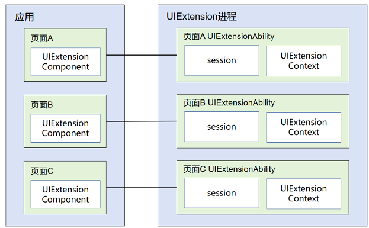
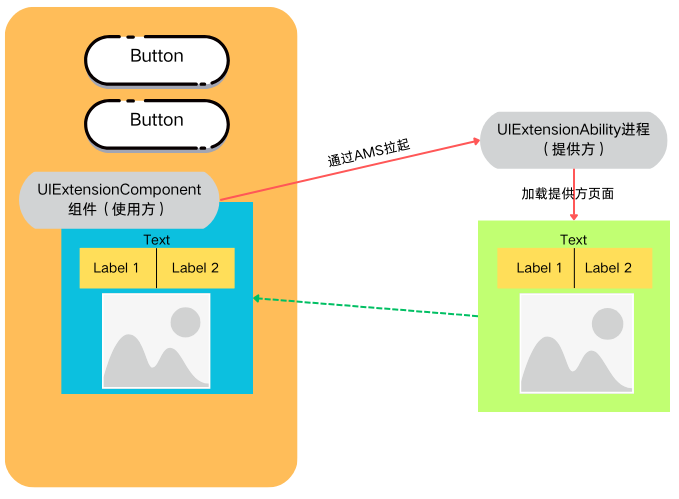
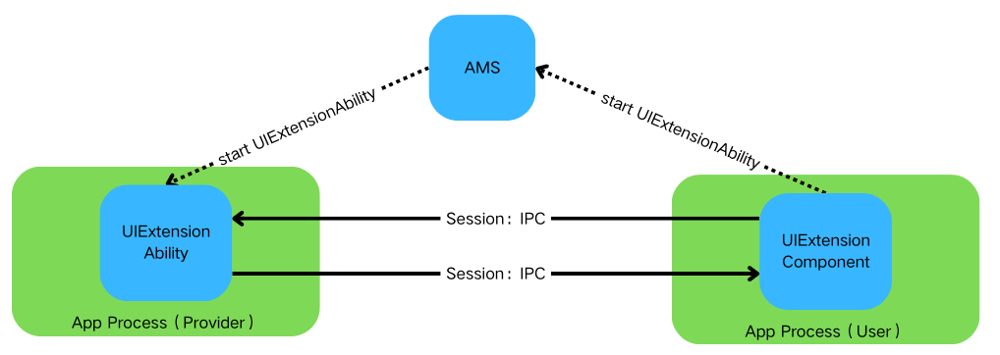

# 跨进程应用能力扩展（UIExtension，仅对系统应用开放）

UIExtension允许开发者创建可以嵌入到其他应用窗口上的界面扩展，使得应用能够提供更加丰富和灵活的用户体验。

## 基本概念

- [UIExtensionComponent](../reference/apis-arkui/arkui-ts/ts-container-ui-extension-component-sys.md)组件

​	在使用方应用定义使用，在是ArkUI提供的提供的组件，可以使用ArkTS的声明式范式在应用中使用。

- [UIExtensionAbility](../application-models/uiextensionability.md)组件

  提供方应用中定义使用，用于运行提供方应用在一个独立进程中，在使用方应用中创建可以嵌入到其他应用窗口上的界面扩展，从而增强应用间的交互性和用户体验。

## 实现原理

UIExtension提供的一种跨进程的应用共享能力，在使用方应用（系统应用）进程中使用UIExtensionComponent以组件方式嵌入集成到应用。当应用启动时，通过AMS（Application Management Service）调度拉起提供方应用进程。它主要负责应用程序的启动、退出、切换等管理任务。

实现后能够在使用方应用页面中以组件方式展示提供方应用的页面：

通过AMS拉起后，提供方和使用方之间可以进行数据交互。

- 使用方应用向提供方应用发送消息：使用方可以通过[UIExtensionProxy.send](../reference/apis-arkui/arkui-ts/ts-container-ui-extension-component-sys.md#send)和提供方应用进行消息的通信，提供方应用中可以使用[UIExtensionContentSession.setReceiveDataCallback](../reference/apis-ability-kit/js-apis-app-ability-uiExtensionContentSession-sys.md#uiextensioncontentsessionsetreceivedatacallback)获取使用方应用发送的数据信息。
- 提供方应用向使用方应用发送消息：提供方可以使用 [UIExtensionContentSession.sendData](../reference/apis-ability-kit/js-apis-app-ability-uiExtensionContentSession-sys.md#uiextensioncontentsessionsenddata)向使用方应用发送数据，使用方使用 [UIExtensionProxy.onReceive](../reference/apis-arkui/arkui-ts/ts-container-ui-extension-component-sys.md#onreceive)接收消息。

## 能力范围

### 组件基本能力

- 组件式[UIExtensionComponent](../reference/apis-arkui/arkui-ts/ts-container-ui-extension-component-sys.md): 提供嵌入式的扩展能力，能够在应用页面中嵌入调用其他应用的页面扩展。
- 全屏模态式UIExtension：该显示全屏模态页面进行交互，不可被遮挡。由系统应用基于UIExtension的内部能力开放组件或Node-API，提供特定能力供三方应用使用。

### UIExtensionAbility进程应用可用能力范围

UIExtension为了实现跨应用的能力共享，存在较开放的灵活性，通过跨进程的方式拉起提供方应用提供的能力供当前使用方（宿主方）使用。在运行机制上，是两个进程之间的业务交互行为，和一般组件和宿主方存在根本上的差异。

以下给出针对UIExtension，在UIExtensionAbility内提供方应用能够使用的属性、事件、组件、Node-Api接口等方面的范围，便于使用方应用与提供方应用在使用UIExtension组件时进行参照。

由于组件相关的能力更新较快，当前列举的不支持以及部分支持的能力，仅代表当前的能力范围。新增能力是否支持可通过各项能力支持原则说明进行判断，不支持的能力需要通过提出issue给相关不支持组件以及UIExtension，由组件和UIExtension分析可行性后支持。

**通用属性**

当前组件可以通过属性影响其他组件或者使用方应用信息（应用上下文UIContext、应用窗口信息等）的能力，由于跨进程的机制问题，则UIExtension组件默认不支持。

组件支持的属性存在跨组件场景的情况下，不支持如下能力：

- 提供方组件的属性对其他组件、宿主应用组件的属性存在控制、赋值、合并整合等场景，如[组件标识](../reference/apis-arkui/arkui-ts/ts-universal-attributes-component-id.md)。
- 提供方组件的属性控制提供方组件显示效果、动效等超出UIExtension组件边界的场景，如[全屏模态转场](../reference/apis-arkui/arkui-ts/ts-universal-attributes-modal-transition.md)。

详情如下：

| 属性                                                         | 能力规格 | 功能说明                                                     | 规格补充说明                                                 |
| ------------------------------------------------------------ | -------- | ------------------------------------------------------------ | ------------------------------------------------------------ |
| [组件标识](../reference/apis-arkui/arkui-ts/ts-universal-attributes-component-id.md) | 不支持   | id为组件的唯一标识，在整个应用内唯一。本模块提供组件标识相关接口，可以获取指定id组件的属性，也提供向指定id组件发送事件的功能。 | UIExtensionComponent自身可以使用组件标识，提供方也可以正常设置组件标识。但针对宿主方和提供方并未实现统一的标识管理，宿主方无法通过组件标识查询提供方内组件的信息，所以提供方内部设置组件标识无效。 |
| [背景模糊设置](../reference/apis-arkui/arkui-ts/ts-universal-attributes-image-effect.md) | 不支持   | 设置组件的模糊、阴影、球面效果以及设置图片的图像效果。       | —                                                            |
| [分布式迁移标识](../reference/apis-arkui/arkui-ts/ts-universal-attributes-restoreId.md) | 不支持   | 组件的分布式迁移标识，指明了该组件在分布式迁移场景下可以将特定状态恢复到对端设备。 | —                                                            |
| [拖拽控制](../reference/apis-arkui/arkui-ts/ts-universal-attributes-drag-drop.md) | 不支持   | 设置组件是否可以响应拖拽事件。                               | —                                                            |
| [全屏模态转场](../reference/apis-arkui/arkui-ts/ts-universal-attributes-modal-transition.md) | 部分支持 | 通过bindContentCover属性为组件绑定全屏模态页面，在组件插入和删除时可通过设置转场参数ModalTransition显示过渡动效。 | 在UIExtension内的提供方产生的页面无法超出UIExtension组件的范围，不能像其他组件一样直接达到效果，需要应用开发者设置UIExtension的全屏模式。 |
| [半模态专场](../reference/apis-arkui/arkui-ts/ts-universal-attributes-sheet-transition.md) | 部分支持 | 通过bindSheet属性为组件绑定半模态页面，在组件插入时可通过设置自定义或默认的内置高度确定半模态大小。 | 在UIExtension内的提供方产生的页面无法超出UIExtension组件的范围，不能像其他组件一样直接达到效果，需要应用开发者设置UIExtension的全屏模式。 |
|                                                              |          |                                                              |                                                              |

**组件**

应用提供方使用组件时，需要和使用方（宿主方）的组件、应用进程上下文交互的场景，默认不支持。主要包括如下场景：

- 组件展示效果范围超过组件本身的范围、控制影响到使用方应用侧的场景，如Navigation展示到安全区的场景。
- 组件能力依赖其他组件或者支持跨组件、跨应用控制与访问的场景，如PluginComponent提供访问其他组件，FormComponent卡片提供跨进程载体展示其他应用页面的能力。
- 组件能力依赖宿主方窗口信息、进程实例UIContext上下文实现能力、交互、动效等场景，如FolderStack组件。

详情如下：

| 组件                                                         | 能力规格 | 功能说明                                                     | 规格补充说明                                                 |
| ------------------------------------------------------------ | -------- | ------------------------------------------------------------ | ------------------------------------------------------------ |
| [PluginComponent (系统接口)](../reference/apis-arkui/arkui-ts/ts-basic-components-plugincomponent-sys.md) | 不支持   | 用于给插件组件的使用者请求组件和数据，使用者发送组件模板和数据。支撑SystemUI实现插件化方式集成其他业务提供的UI。 | 1、和UIExtension能力类似，容易出现嵌套，增加复杂度； 2、由于UIExtension组件的提供方已经在另一个进程中，默认能力下，无法提供访问宿主组件访问的能力。 |
| [FormComponent（系统接口）](../reference/apis-arkui/arkui-ts/ts-basic-components-formcomponent-sys.md) | 不支持   | 提供卡片组件，实现卡片的显示功能。                           | 卡片组件提供的是跨进程的组件调用能力，UIExtension中嵌套使用会导致进程关系复杂，导致功能性能方面的问题。 |
| [IsolatedComponent (系统接口)](../reference/apis-arkui/arkui-ts/ts-container-isolated-component-sys.md) | 不支持   | IsolatedComponent用于支持在本页面内嵌入显示独立Abc（.abc文件）提供的UI，展示的内容在受限worker线程中运行。 | 由于云卡能力也是一种跨应用调度的能力，UIExtension中暂不支持拉起云卡。 |
| [FullScreenLaunchComponent (全屏启动元服务组件)](../reference/apis-arkui/arkui-ts/ohos-arkui-advanced-FullScreenLaunchComponent.md) | 不支持   | 全屏启动元服务组件，当被拉起方授权使用方可以嵌入式运行元服务时，使用方全屏嵌入式运行元服务；未授权时，使用方跳出式拉起元服务。 | 由于是一种跨应用调度的能力，UIExtension中暂不支持嵌套拉起。  |
| [EmbeddedComponent](../reference/apis-arkui/arkui-ts/ts-container-embedded-component.md) | 不支持   | EmbeddedComponent用于支持在当前页面嵌入本应用内其他[EmbeddedUIExtensionAbility](../reference/apis-ability-kit/js-apis-app-ability-embeddedUIExtensionAbility.md)提供的UI。EmbeddedUIExtensionAbility在独立进程中运行，完成页面布局和渲染。 | 由于是一种跨应用调度的能力，UIExtension中暂不支持嵌套拉起。  |
| [RemoteWindow](../reference/apis-arkui/arkui-ts/ts-basic-components-remotewindow-sys.md) | 不支持   | 远程控制窗口组件，可以通过此组件控制应用窗口，提供启动退出过程中控件动画和应用窗口联动动画能力。 | UIExtension中的组件已经在另一个进程中，无法影响控制宿主应用的窗口。 |
| [RichText](../reference/apis-arkui/arkui-ts/ts-basic-components-richtext.md) | 不支持   | 富文本组件，解析并显示HTML格式文本。                         | —                                                            |
| [FolderStack](../reference/apis-arkui/arkui-ts/ts-container-folderstack.md) | 不支持   | 通常用于有Abc热更新诉求的模块化开发场景。FolderStack继承于Stack(层叠布局)控件，新增了折叠屏悬停能力，通过识别upperItems自动避让折叠屏折痕区后移到上半屏。 | 折叠屏划分组件能力，需要和宿主方窗口形成联动，从而需要在提供方内获取宿主主窗的信息，目前无法支持。 |
| [XComponent](../reference/apis-arkui/arkui-ts/ts-basic-components-xcomponent.md) | 不支持   | 可用于EGL/OpenGLES和媒体数据写入，并显示在XComponent组件。   | —                                                            |
| [FormLink](../reference/apis-arkui/arkui-ts/ts-container-formlink.md) | 不支持   | 提供静态卡片交互组件，用于静态卡片内部和提供方应用间的交互，当前支持router、message和call三种类型的事件。 | 卡片提供的是跨进程的组件调用能力，UIExtension中嵌套使用会导致进程关系复杂，导致功能性能方面的问题。 |
| [HyperLink](../reference/apis-arkui/arkui-ts/ts-container-hyperlink.md) | 不支持   | 超链接组件，组件宽高范围内点击实现跳转。                     | —                                                            |
| [ContextMenu](../reference/apis-arkui/arkui-ts/ts-methods-menu.md) | 不支持   | 在页面范围内关闭通过[bindContextMenu](../reference/apis-arkui/arkui-ts/ts-universal-attributes-menu.md#属性)属性绑定的菜单。 | —                                                            |
| [警告弹窗](../reference/apis-arkui/arkui-ts/ts-methods-alert-dialog-box.md) | 部分支持 | 显示警告弹窗组件，可设置文本内容与响应回调。若在UIExtension中设置showInSubWindow为true, 弹窗将基于UIExtension的宿主窗口对齐。 | 需要依赖主窗的信息实现弹窗对齐，弹窗组件基于UIExtension提供的信息获取宿主应用的窗口信息实现了对齐应用窗口的能力。仅限于窗口对齐。 |
| [列表选择弹窗](../reference/apis-arkui/arkui-ts/ts-methods-action-sheet.md) | 部分支持 | 列表弹窗。若在UIExtension中设置showInSubWindow为true, 弹窗将基于UIExtension的宿主窗口对齐。 | 需要依赖主窗的信息实现弹窗对齐，弹窗组件基于UIExtension提供的信息获取宿主应用的窗口信息实现了对齐应用窗口的能力。仅限于窗口对齐。 |
| [自定义弹窗](../reference/apis-arkui/arkui-ts/ts-methods-custom-dialog-box.md) | 部分支持 | 通过CustomDialogController类显示自定义弹窗。使用弹窗组件时，可优先考虑自定义弹窗，便于自定义弹窗的样式与内容。若在UIExtension中设置showInSubWindow为true, 弹窗将基于UIExtension的宿主窗口对齐。 | 需要依赖主窗的信息实现弹窗对齐，弹窗组件基于UIExtension提供的信息获取宿主应用的窗口信息实现了对齐应用窗口的能力。仅限于窗口对齐。 |
| [Navigation](../reference/apis-arkui/arkui-ts/ts-basic-components-navigation.md) | 部分支持 | 该组件从API Version 11开始默认支持安全区避让特性(默认值为：expandSafeArea([SafeAreaType.SYSTEM], [SafeAreaEdge.TOP, SafeAreaEdge.BOTTOM]))，开发者可以重写该属性覆盖默认行为。 | 1、如果UIExtension未设置模态或沉浸式，Navigation无法扩展到安全区； 2、无法路由到宿主方的页面中。 |

**Node-API接口**

Native API接口提供能力，在UIExtension场景下也需要考虑是否是跨出当前组件的能力，以及和使用方（宿主方）组件、应用进程上下文交互的场景。主要包括如下场景：

- 接口功能所需的信息依赖使用方的上下文、窗口等信息，如UIContext。
- 接口功能控制非组件本身，需要控制影响其他组件或者使用方应用侧的场景，如用户界面外观。

详情如下：

| 模块                                                         | 能力规格 | 功能说明                                                     | 规格补充说明                                                 |
| ------------------------------------------------------------ | -------- | ------------------------------------------------------------ | ------------------------------------------------------------ |
| [页面间转场](../reference/apis-arkui/arkui-ts/ts-page-transition-animation.md) | 不支持   | 当路由进行切换时，可以通过在pageTransition函数中自定义页面入场和页面退场的转场动效。 | —                                                            |
| [组件内隐式共享元素转场](../reference/apis-arkui/arkui-ts/ts-transition-animation-geometrytransition.md) | 不支持   | 在视图切换过程中提供丝滑的上下文传承过渡。通用transition机制提供了opacity、scale等转场效果，geometryTransition通过安排绑定的in/out组件(in指新视图、out指旧视图)的frame、position使得原本独立的transition动画在空间位置上发生联系，将视觉焦点由旧视图位置引导到新视图位置。 | —                                                            |
| [componentUtils](../reference/apis-arkui/js-apis-arkui-componentUtils.md) | 不支持   | 提供获取组件绘制区域坐标和大小的能力。                       | 获取信息来自于窗口，默认情况下直接获取到的位置信息是UIExtensionAbility的WindowProxy的信息，非宿主应用的主窗口信息。 |
| [UIContext](../reference/apis-arkui/js-apis-arkui-UIContext.md) | 不支持   | @ohos.window在API version 10 新增[getUIContext](../reference/apis-arkui/js-apis-window.md#getuicontext10)接口，获取UI上下文实例UIContext对象，使用UIContext对象提供的替代方法，可以直接作用在对应的UI实例上。 | 基于window获取，但UIExtension内部默认方式下，提供方无真正的窗口承载，无法使用该接口获取到正确的UIContext。 |
| [DragController](../reference/apis-arkui/js-apis-arkui-dragController.md) | 不支持   | 本模块提供发起主动拖拽的能力，当应用接收到触摸或长按等事件时可以主动发起拖拽的动作，并在其中携带拖拽信息。 本模块功能依赖UI的执行上下文，不可在UI上下文不明确的地方使用，参见UIContext说明。 | 拖拽时通过UIContext上下文传递组件间的事件传递，使用方应用和提供方应用不共享UIContext内容，默认能力下无法支持拖拽事件的传递。 |
| [布局回调](../reference/apis-arkui/js-apis-arkui-inspector.md) | 部分支持 | 提供注册组件布局和绘制完成回调通知的能力。                   | 如果指定UIExtension组件，预期是获得所有UIExtension中的组件信息，尚未支持该能力；提供方内部可以正常使用。 |
| [性能监测](../reference/apis-arkui/js-apis-arkui-performancemonitor-sys.md) | 不支持   | 用户操作场景提供性能相关指标监测能力，目前仅包含响应时延、完成时延、丢帧。不支持 | —                                                            |
| [注册自定义字体](../reference/apis-arkui/js-apis-font.md)    | 不支持   | 本模块提供注册自定义字体。                                   | 注册字体存在影响范围的问题，提供方侧无法影响使用方应用的字体。 |
| [PluginComponentManager](../reference/apis-arkui/js-apis-plugincomponent.md) | 不支持   | 用于给插件组件的使用者请求组件与数据，使用者发送组件模板和数据。 | 依赖获取其他组件的数据，提供方组件在另一个进程中，无法提供访问宿主组件的能力。 |
| [用户界面外观(系统接口)](../reference/apis-arkui/js-apis-uiappearance-sys.md) | 不支持   | 用户界面外观提供管理系统外观的一些基础能力，目前仅包括深浅色模式配置。 | 提供方不能通过该能力影响使用方。                             |

## 约束与限制

**安全能力约束**

UIExtensionComponent组件（使用方）可以访问调用集成了UIExtensionAbility的应用（提供方），提供了一种通用应用共享能力。UIExtension能力无法独立提供安全保障机制，作为提供服务的应用（提供方）保护自己不被使用方应用攻击，需要提供方应用结合使用其他ArkUI的能力进行安全保护。（包括CreateModalUIExtension场景）。

由于UIExtension能力（包含基于UIExtension衍生的相关能力，如提供给系统内CreateModalUIExtension）机制的灵活性，如果提供方应用存在安全方面的诉求，无法在现有UIExtension的场景下解决的，建议优先使用其他方案。如选择继续采用UIExtension能力，提供方应用以及使用方应用都需要承担一定的安全风险。

使用模式

- CreateModalUIExtension全屏模态模式：CreateModalUIExtension是一个内部类接口，该接口不对外开放，由系统应用通过开发Node-API或者组件的方式使用该接口实现跨进程的拉起。在该模式下，创建全屏模态页面覆盖在应用上，不允许使用方应用的组件、窗口遮挡UIExtension，不可调节组件大小。

- UIExtensionComponent组件模式：只允许系统应用使用，可以通过ArkTS声明式范式在应用中使用。以组件的方式集成在应用中使用，能够实现和其他组件类似的交互效果。

组件模式下避免被使用方的子窗遮挡

- 提供方应用可以根据自身业务的情况，设置是否允许使用方应用进行遮挡。

- 推荐消减措施：[hideNonSecureWindows](../reference/apis-arkui/js-apis-uiExtensionHost-sys.md#hidenonsecurewindows)。

- 缺点：设置后使用方的交互行为将受限，使用方无法再创建任何子窗覆盖到提供方的窗口上。

**嵌套约束**

由于UIExtension的能力特点，可以实现 A应用(UIAbility)->B应用(UIExtensionAbility)->C应用(UIExtensionAbility)这种嵌套能力依赖。但是，由于跨进程的关系，过多的嵌套层次会导致应用交互性能体验急剧下降。所以，做出如下约束：

- 嵌套层次不超过3层：过多的嵌套层次会导致多次跨进程的交互，导致交互响应性能下降，最终的交互体验差。
- 不允许循环嵌套：循环嵌套是指 A应用(UIAbility)->B应用(UIExtensionAbility)->C应用(UIExtensionAbility)->B应用(UIExtensionAbility)，由于应用的处理是存在同步场景的，在同步场景下，会导致B应用无法响应，最终死锁。

**事件处理机制约束**

对事件传递处理方式进行区分，针对不同事件使用场景确定同步或异步方式：

- 宿主进程与提供方进程的交互默认均是异步处理：优先考虑从默认机制上避免性能（影响整体交互体验）和死锁问题。
- 同步事件处理原则：能够支持同步的事件，触发频率较低，性能影响较小；尽量满足应用实际场景。

应用开发者使用UIExtension能力时，需要遵守如下设计场景约束：

- 同步处理的事件场景：可能由于嵌套层次较多存在的性能问题或循环嵌套应用导致的功能问题，无法从UIExtension组件机制上解决，需要应用开发者根据自身业务场景分析解决，如减少嵌套层次，或使用非UIExtension组件方案代替。
- 异步处理的事件场景：UIExtension组件以及宿主应用侧组件可以同时收到事件。需要应用开发者结合应用场景进行处理，如宿主应用侧组件不做事件处理。如果无法避免，建议替换UIExtension组件来保障交互体验。

| 场景     | 分类                       | 是否支持 | 同步/异步（宿主与提供方） | 备注                                                         |
| -------- | -------------------------- | -------- | ------------------------- | ------------------------------------------------------------ |
| 通用事件 | 点击事件（Click）          | 支持     | 异步                      | —                                                            |
| 通用事件 | 触摸事件（Touch）          | 支持     | 异步                      | —                                                            |
| 通用事件 | 拖拽事件（onDragXXX）      | 支持     | 异步                      | —                                                            |
| 通用事件 | 按键事件（KeyEvent）       | 支持     | 同步                      | 循环嵌套或者嵌套过深会导致应用无法响应，提供默认兜底机制：支持超时等待机制，超时后会结束等待，对上层来说相当于事件未处理。 |
| 通用事件 | 焦点事件（onFocus/onBlur） | 支持     | 同步                      | 循环嵌套或者嵌套过深会导致应用无法响应，提供默认兜底机制：支持超时等待机制，超时后会结束等待，对上层来说相当于事件未处理。 |
| 通用事件 | 鼠标事件（onHove/onMouse） | 支持     | 异步                      | —                                                            |
| 手势处理 | —                          | 支持     | 异步                      | —                                                            |
| 无障碍   | —                          | 支持     | 同步                      | 循环嵌套或者嵌套过深会导致应用无法响应，提供默认兜底机制：支持超时等待机制，超时后会结束等待，对上层来说相当于事件未处理。 |

**页面渲染效果体验约束**

由于UIExtension是一种跨进程的应用调用，使用方应用进程和提供方应用进程的处理不能实现同步，会导致在交互体验上存在和一般组件不同的体验问题。应用开发者应知悉本组件存在跨多个进程渲染页面的性能约束，从而进行针对性的处理。

- **闪白现象**：UIExtension创建并拉起另一个进程为应用提供能力，创建、拉起进程并完成页面渲染是一个耗时的过程，使用方在等待的过程中会感知到UIExtensionComponent的背景色（默认是白色），所以会有闪白的现象。
- **渲染显示不同步现象**：当使用方应用页面快速变化时（如横竖屏切换、拖拽窗口大小），会出现使用方页面渲染过程和UIExtension组件中展示的内容不同步的情况。这种现象是跨进程交互带来的，提供方进程任务是使用方触发，而对于布局等任务均是在各自进程的JS线程中，无法保障使用方和提供方的渲染任务同步，最终导致了不同步的效果。

应用开发者（提供方）需要考虑如下设计约束：

- 尽量使用布局变化少的场景。
- 当由布局变化时，提供方js线程尽量少的执行任务，确保js线程能够及时响应布局变化的任务。

应用开发者（使用方）可以通过如下方式消减闪白问题：

- 根据使用方应用的页面以及提供方页面的背景色，更改UIExtensionComponent的背景色（[背景设置](../reference/apis-arkui/arkui-ts/ts-universal-attributes-background.md)），做到在加载过程中配合场景过渡显示，从而实现无跳变感知。
- 通过本组件提供的[placeholder](../reference/apis-arkui/arkui-ts/ts-container-ui-extension-component-sys.md#uiextensionoptions11)机制，设置自定义UI，等待提供方完全显示出来之前，显示自定义的背景UI。

如果消减后效果不能完全满足应用交互诉求，由于跨进程的能力约束，建议应用优先考虑其他方案。

