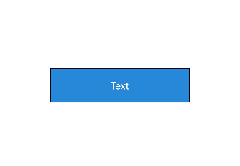

# AttributeUpdater

## 概述
大量属性频繁更新时，如果使用状态变量，会导致前端状态管理计算量太大，并需要对单个组件进行全量的属性更新。虽然可以通过`AttributeModifier`的机制按需更新，但是前端还是默认会有一些diff和reset的策略。

为此引入了`AttributeUpdater`的能力，它是一个特殊的`AttributeModifier`，除了继承`AttributeModifier`的能力，还提供了获取属性对象的能力。通过属性对象可以不经过状态变量，直接更新对应属性。使用`AttributeUpdater`，开发者可实现自定义的更新策略，进一步提高属性更新的性能。但是由于该能力比较灵活，无法限制“单一数据源”的规则，同时和状态变量更新相同属性时，存在相互覆盖的情况，需要开发者自己保障属性设置的合理性。

## 接口定义

```ts
export declare class AttributeUpdater<T, C = Initializer<T>> implements AttributeModifier<T> {
  applyNormalAttribute?(instance: T): void;
  initializeModifier(instance: T): void;
  get attribute(): T | undefined;
  updateConstructorParams: C;
}
```

`AttributeUpdater`实现了`AttributeModifier`接口，额外提供了`initializeModifier`，可以对组件的属性进行初始化，并且通过`attribute`属性方法，获取到属性对象，通过该对象直接更新对应组件的属性。另外也可以直接通过updateConstructorParams更新组件的构造参数。

## 行为规格

- 开发者可以实现一个`AttributeUpdater<T>`的类，并通过组件的`AttributeModifier`设置，首次绑定时会触发`initializeModifier`方法，进行属性的初始化，后续其它的生命周期和`AttributeModifier`保持一致。
- 组件初始化完成之后，可以通过`AttributeUpdater`实例的`attribute`属性方法，获取到属性对象，否则为undefined。
- 通过`attribute`属性对象直接修改属性，会将最新设置的属性记录在当前对象中，并立即触发组件属性的更新。
- 如果将`AttributeUpdater`实例标记为状态变量进行修改，或者通过其它状态变量更新对应组件的属性，会触发`applyNormalAttribute`的流程，如果开发者没有覆写该逻辑，默认会将属性对象记录的所有属性，批量进行一次更新。
- 如果开发者复写`applyNormalAttribute`的逻辑，并且不调用super的该方法，将会失去获取`attribute`属性对象的能力，不会调用`initializeModifier`方法。
- 一个`AttributeUpdater`对象只能同时关联一个组件，否则只会有一个组件生效属性设置。

## 通过modifier直接修改属性

组件初始化完成之后，可以通过`AttributeUpdater`实例的`attribute`属性方法，获取到属性对象，通过属性对象直接修改属性，会立即触发组件属性的更新。

```ts
import { AttributeUpdater } from '@ohos.arkui.modifier'

class MyButtonModifier extends AttributeUpdater<ButtonAttribute> {
  initializeModifier(instance: ButtonAttribute): void {
    instance.backgroundColor('#2787D9')
      .width('50%')
      .height(30)
  }
}

@Entry
@Component
struct updaterDemo {
  modifier: MyButtonModifier = new MyButtonModifier()

  build() {
    Row() {
      Column() {
        Button("Button")
          .attributeModifier(this.modifier)
          .onClick(() => {
            this.modifier.attribute?.backgroundColor('#17A98D').width('30%')
          })
      }
      .width('100%')
    }
    .height('100%')
  }
}
```


## 通过modifier更新组件的构造参数
可以直接通过`AttributeUpdater`实例的updateConstructorParams方法，更新组件的构造参数。

```ts
import { AttributeUpdater } from '@ohos.arkui.modifier'

class MyTextModifier extends AttributeUpdater<TextAttribute, TextInterface> {
  initializeModifier(instance: TextAttribute): void {
  }
}

@Entry
@Component
struct updaterDemo {
  modifier: MyTextModifier = new MyTextModifier()

  build() {
    Row() {
      Column() {
        Text("Text")
          .attributeModifier(this.modifier)
          .fontColor(Color.White)
          .fontSize(14)
          .border({ width: 1 })
          .textAlign(TextAlign.Center)
          .lineHeight(20)
          .width(200)
          .height(50)
          .backgroundColor('#2787D9')
          .onClick(() => {
            this.modifier.updateConstructorParams('Update');
          })
      }
      .width('100%')
    }
    .height('100%')
  }
}
```
