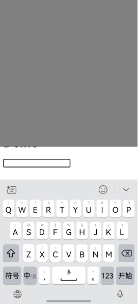
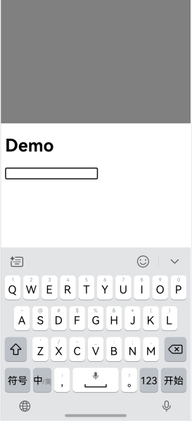
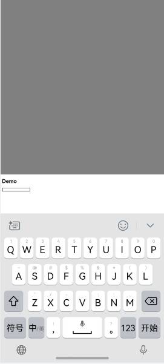
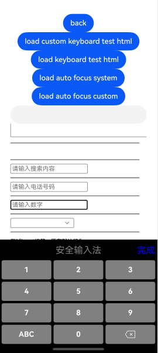
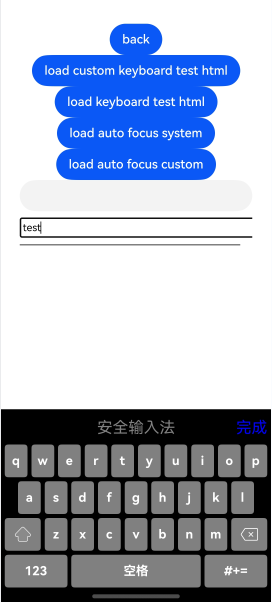
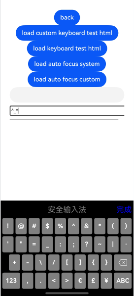

# Web组件对接软键盘

开发者能够通过Web组件对接软键盘，来处理系统软键盘的显示与交互问题，同时实现软键盘的自定义功能。主要有以下场景。

- 拉起系统软键盘输入文字：用户在点击网页输入框时，会在屏幕下方弹出系统默认的软键盘（输入法），用户可以通过软键盘输入文字，输入的内容会显示在输入框中。
- 自定义系统软键盘的回车键类型：应用指定网页输入框拉起不同类型的软键盘回车键。例如：确认、下一个、提交等。
- 软键盘避让：在移动设备上，由于输入法通常固定在屏幕下半段，应用可设置不同的Web页面软键盘避让模式。例如：平移、调整大小、不避让等。
- 自定义软键盘输入：在移动设备上，应用可以使用自绘制输入法在Web页面输入，以此替代系统软键盘。


## Web页面输入框输入与软键盘交互的W3C标准支持

为支持Web页面与系统软键盘、自定义软键盘等的良好交互，ArkWeb遵循并实现了W3C规范中的以下输入控制属性：
- type属性

  type属性定义了input元素的类型，影响输入的验证、显示方式和键盘类型。常见的type值包括：

  | type值    | 描述         |
  | -------- | ---------- |
  | text     | 默认值。普通文本输入 |
  | number   | 数字输入       |
  | email    | 电子邮件地址输入   |
  | password | 密码输入       |
  | tel      | 电话号码输入     |
  | url      | URL输入      |
  | date     | 日期选择器      |
  | time     | 时间选择器      |
  | checkbox | 复选框        |
  | radio    | 单选按钮       |
  | file     | 文件上传       |
  | submit   | 提交按钮       |
  | reset    | 重置按钮       |
  | button   | 普通按钮       |

- inputmode属性

  inputmode属性用于配置输入法类型。

  | inputmode | 描述                                       |
  | --------- | ---------------------------------------- |
  | decimal   | 只显示数字键盘，通常还有一个逗号键                        |
  | email     | 文本键盘，键通常用于电子邮件地址，如[@]。                   |
  | none      | 不应出现键盘                                   |
  | numeric   | 只显示数字键盘                                  |
  | search    | 文本键盘，[enter]键通常显示为[go]                   |
  | tel       | 只显示数字键盘，通常还有[+]、[*]和[#]键。                |
  | text      | 默认。文本键盘                                  |
  | url       | 文本键盘，键通常用于网址，如[.]和[/]，以及特殊的[.com]键，或者其他通常用于本地设置的域名结束符。 |

- enterkeyhint属性

  enterkeyhint属性用于指定移动设备虚拟键盘上回车键的显示方式。

  | enterkeyhint值 | 描述        |
  | ------------- | --------- |
  | enter         | 显示默认的回车键  |
  | done          | 表示输入完成    |
  | go            | 表示跳转或执行   |
  | next          | 进入下一个输入字段 |
  | previous      | 返回上一个输入字段 |
  | search        | 执行搜索      |
  | send          | 发送信息      |

>**说明：**
>
>用户在点击网页输入框时，会在屏幕下方弹出系统默认的软键盘（输入法），并可进行文字输入上屏。
>
>type属性更广泛，不仅影响键盘显示，还会影响输入验证和元素的外观。
>
>inputmode主要用于优化移动设备上的键盘输入体验，不会改变input的基本行为或验证。


## 设置软键盘避让模式

在移动设备上，支持设置Web页面的软键盘避让模式。

1. 在应用代码中设置UIContext的软键盘避让模式[setKeyboardAvoidMode()](../reference/apis-arkui/arkui-ts/ts-universal-attributes-expand-safe-area.md#setkeyboardavoidmode11)情况下，ArkWeb组件可支持Resize和Offset两种模式。

- Resize模式下，应用窗口高度可缩小避开软键盘，ArkWeb组件跟随ArkUI重新布局。
- Offset模式下（以及默认模式），应用窗口高度不变，ArkWeb组件根据自身的避让模式进行避让。

（1）在应用代码中设置UIContext的软键盘避让模式。

```ts
// EntryAbility.ets
import { KeyboardAvoidMode } from '@kit.ArkUI';

onWindowStageCreate(windowStage: window.WindowStage) {
  hilog.info(0x0000, 'testTag', '%{public}s', 'Ability onWindowStageCreate');

  windowStage.loadContent('pages/Index', (err, data) => {
    let keyboardAvoidMode = windowStage.getMainWindowSync().getUIContext().getKeyboardAvoidMode();
    // 设置虚拟键盘抬起时压缩页面大小为减去键盘的高度
  windowStage.getMainWindowSync().getUIContext().setKeyboardAvoidMode(KeyboardAvoidMode.RESIZE);
    if (err.code) {
      hilog.error(0x0000, 'testTag', 'Failed to load the content. Cause: %{public}s', JSON.stringify(err) ?? '');
      return;
    }
    hilog.info(0x0000, 'testTag', 'Succeeded in loading the content. Data: %{public}s', JSON.stringify(data) ?? '');
  });
}
```
（2）再在Web组件中拉起软键盘。

```html
<!DOCTYPE html>
<html>
  <head>
    <title>测试网页</title>
  </head>
  <body>
    <h1>DEMO</h1>
    <input type="text" id="input_a">
  </body>
</html>
```

```ts
//Index.ets
@Entry
@Component
struct KeyboardAvoidExample {
  controller: web_webview.WebviewController = new web_webview.WebviewController();
  build() {
    Column() {
      Row().height("50%").width("100%").backgroundColor(Color.Gray)
      Web({ src: $rawfile("index.html"),controller: this.controller})
      Text("I can see the bottom of the page").width("100%").textAlign(TextAlign.Center).backgroundColor(Color.Pink).layoutWeight(1)
    }.width('100%').height("100%")
  }
}
```
此时ArkWeb组件跟随ArkUI重新布局，效果如图1、图2所示。

**图1**  Web组件网页默认软键盘避让模式



**图2**  Web组件网页跟随Arkui软键盘避让模式



2.在UIContext的键盘避让模式为Offset模式情况下，应用可通过[WebKeyboardAvoidMode()](../reference/apis-arkweb/ts-basic-components-web.md#webkeyboardavoidmode12)设置ArkWeb组件的键盘避让模式。[Web组件的WebKeyboardAvoidMode()接口](../reference/apis-arkweb/ts-basic-components-web.md#webkeyboardavoidmode12)优先级高于W3C侧virtualKeyboard.overlayContens。

- RESIZE_VISUAL：仅调整可视视口的大小，而不调整布局视口的大小。
- RESIZE_CONTENT：调整视觉视口和布局视口的大小。
- OVERLAYS_CONTENT：不调整任何视口的大小，获焦input元素没有滚动到可识区域的行为。

>**说明：** 
>
>可视视口指用户正在看到的网站的区域，该区域的宽度等于移动设备的浏览器窗口的宽度。
>
>布局视口指网页本身的宽度。

（1）在应用代码中设置ArkWeb的软键盘避让模式。

```ts
// Index.ets
@Entry
@Component
struct KeyboardAvoidExample {
  controller: web_webview.WebviewController = new web_webview.WebviewController();
  build() {
    Column() {
      Row().height("50%").width("100%").backgroundColor(Color.Gray)
      Web({ src: $rawfile("index.html"),controller: this.controller})
        .keyboardAvoidMode(WebKeyboardAvoidMode.OVERLAYS_CONTENT) //此时ArkWeb组件不会调整任何视口的大小大小
      Text("I can see the bottom of the page").width("100%").textAlign(TextAlign.Center).backgroundColor(Color.Pink).layoutWeight(1)
    }.width('100%').height("100%")
  }
}
```
此时ArkWeb组件根据自身的避让模式进行避让，效果如图3所示。

**图3**  Web组件网页自身软键盘避让模式



与其他Web组件行为的交叉场景：

| 交叉场景         | 规格                                       |
| ------------ | ---------------------------------------- |
| 同层渲染         | 同层Web：软键盘避让行为与普通场景行为一致  同层原生组件：由ArkUI负责软键盘避让模式。 |
| 离屏创建组件       | 默认使用与非离屏创建一致的软键盘避让模式 在上树前设置其他避让模式可需生效。   |
| customDialog | customDialog自身避让。                        |
| 折叠屏          | 软键盘避让行为与普通场景行为一致 软件键盘需跟随屏幕开合状态进展开合变化。    |
| 软键盘托管        | 软键盘避让行为与普通场景行为一致。                        |
| Web嵌套滚动      | 嵌套滚动场景下不推荐使用Web软键盘避让，包括RESIZE_VISUAL与RESIZE_CONTENT。 |


## 拦截系统软键盘与自定义软键盘输入

应用能够通过调用[onInterceptKeyboardAttach](../reference/apis-arkweb/ts-basic-components-web.md#oninterceptkeyboardattach12)来拦截系统软键盘的弹出。在网页中，当可编辑元素如input标签即将触发软键盘显示时，[onInterceptKeyboardAttach](../reference/apis-arkweb/ts-basic-components-web.md#oninterceptkeyboardattach12)会被回调。应用可利用此接口来控制软键盘的显示，包括使用系统默认软键盘、定制带有特定Enter键的软键盘，或是完全自定义软键盘。借助这一功能，开发者能够实现对软键盘的灵活管理。

- 使用系统默认软键盘
- 使用定制Enter键的系统软键盘
- 使用完全由应用自定义的软键盘

```ts
 // xxx.ets
  import { webview } from '@kit.ArkWeb';
  import { inputMethodEngine } from '@kit.IMEKit';

  @Entry
  @Component
  struct WebComponent {
    controller: webview.WebviewController = new webview.WebviewController();
    webKeyboardController: WebKeyboardController = new WebKeyboardController()
    inputAttributeMap: Map<string, number> = new Map([
        ['UNSPECIFIED', inputMethodEngine.ENTER_KEY_TYPE_UNSPECIFIED],
        ['GO', inputMethodEngine.ENTER_KEY_TYPE_GO],
        ['SEARCH', inputMethodEngine.ENTER_KEY_TYPE_SEARCH],
        ['SEND', inputMethodEngine.ENTER_KEY_TYPE_SEND],
        ['NEXT', inputMethodEngine.ENTER_KEY_TYPE_NEXT],
        ['DONE', inputMethodEngine.ENTER_KEY_TYPE_DONE],
        ['PREVIOUS', inputMethodEngine.ENTER_KEY_TYPE_PREVIOUS]
      ])

      /**
       * 自定义键盘组件Builder
       */
      @Builder
      customKeyboardBuilder() {
		  // 这里实现自定义键盘组件，对接WebKeyboardController实现输入、删除、关闭等操作。
        Row() {
          Text("完成")
            .fontSize(20)
            .fontColor(Color.Blue)
            .onClick(() => {
              this.webKeyboardController.close();
            })
          // 插入字符。
          Button("insertText").onClick(() => {
            this.webKeyboardController.insertText('insert ');
          }).margin({
            bottom: 200,
          })
          // 从后往前删除length参数指定长度的字符。
          Button("deleteForward").onClick(() => {
            this.webKeyboardController.deleteForward(1);
          }).margin({
            bottom: 200,
          })
          // 从前往后删除length参数指定长度的字符。
          Button("deleteBackward").onClick(() => {
            this.webKeyboardController.deleteBackward(1);
          }).margin({
            left: -220,
          })
          // 插入功能按键。
          Button("sendFunctionKey").onClick(() => {
            this.webKeyboardController.sendFunctionKey(6);
          })
        }
      }

    build() {
      Column() {
        Web({ src: $rawfile('index.html'), controller: this.controller })
        .onInterceptKeyboardAttach((KeyboardCallbackInfo) => {
          // option初始化，默认使用系统默认键盘
          let option: WebKeyboardOptions = {
            useSystemKeyboard: true,
          };
          if (!KeyboardCallbackInfo) {
            return option;
          }

          // 保存WebKeyboardController，使用自定义键盘时候，需要使用该handler控制输入、删除、软键盘关闭等行为
          this.webKeyboardController = KeyboardCallbackInfo.controller
          let attributes: Record<string, string> = KeyboardCallbackInfo.attributes
          // 遍历attributes
          let attributeKeys = Object.keys(attributes)
          for (let i = 0; i < attributeKeys.length; i++) {
            console.log('WebCustomKeyboard key = ' + attributeKeys[i] + ', value = ' + attributes[attributeKeys[i]])
          }

          if (attributes) {
            if (attributes['data-keyboard'] == 'customKeyboard') {
              // 根据html可编辑元素的属性，判断使用不同的软键盘，例如这里如果属性包含有data-keyboard，且值为customKeyboard，则使用自定义键盘
              console.log('WebCustomKeyboard use custom keyboard')
              option.useSystemKeyboard = false;
              // 设置自定义键盘builder
              option.customKeyboard = () => {
                this.customKeyboardBuilder()
              }
              return option;
            }

            if (attributes['keyboard-return'] != undefined) {
              // 根据html可编辑元素的属性，判断使用不同的软键盘，例如这里如果属性包含有keyboard-return，使用系统键盘，并且指定系统软键盘enterKey类型
              option.useSystemKeyboard = true;
              let enterKeyType: number | undefined = this.inputAttributeMap.get(attributes['keyboard-return'])
              if (enterKeyType != undefined) {
                option.enterKeyType = enterKeyType
              }
              return option;
            }
          }

          return option;
        })
      }
    }
  }
```

```html
<!-- index.html -->
    <!DOCTYPE html>
    <html>

    <head>
        <meta charset="utf-8">
        <meta name="viewport" content="width=device-width,minimum-scale=1.0,maximum-scale=1.0">
    </head>

    <body>

    <p style="font-size:12px">input标签，原有默认行为：</p>
    <input type="text" style="width: 300px; height: 20px"><br>
    <hr style="height:2px;border-width:0;color:gray;background-color:gray">

    <p style="font-size:12px">input标签，系统键盘自定义enterKeyType属性 enter key UNSPECIFIED：</p>
    <input type="text" keyboard-return="UNSPECIFIED" style="width: 300px; height: 20px"><br>
    <hr style="height:2px;border-width:0;color:gray;background-color:gray">

    <p style="font-size:12px">input标签，系统键盘自定义enterKeyType属性 enter key GO：</p>
    <input type="text" keyboard-return="GO" style="width: 300px; height: 20px"><br>
    <hr style="height:2px;border-width:0;color:gray;background-color:gray">

    <p style="font-size:12px">input标签，系统键盘自定义enterKeyType属性 enter key SEARCH：</p>
    <input type="text" keyboard-return="SEARCH" style="width: 300px; height: 20px"><br>
    <hr style="height:2px;border-width:0;color:gray;background-color:gray">

    <p style="font-size:12px">input标签，系统键盘自定义enterKeyType属性 enter key SEND：</p>
    <input type="text" keyboard-return="SEND" style="width: 300px; height: 20px"><br>
    <hr style="height:2px;border-width:0;color:gray;background-color:gray">

    <p style="font-size:12px">input标签，系统键盘自定义enterKeyType属性 enter key NEXT：</p>
    <input type="text" keyboard-return="NEXT" style="width: 300px; height: 20px"><br>
    <hr style="height:2px;border-width:0;color:gray;background-color:gray">

    <p style="font-size:12px">input标签，系统键盘自定义enterKeyType属性 enter key DONE：</p>
    <input type="text" keyboard-return="DONE" style="width: 300px; height: 20px"><br>
    <hr style="height:2px;border-width:0;color:gray;background-color:gray">

    <p style="font-size:12px">input标签，系统键盘自定义enterKeyType属性 enter key PREVIOUS：</p>
    <input type="text" keyboard-return="PREVIOUS" style="width: 300px; height: 20px"><br>
    <hr style="height:2px;border-width:0;color:gray;background-color:gray">

    <p style="font-size:12px">input标签，应用自定义键盘：</p>
    <input type="text" data-keyboard="customKeyboard" style="width: 300px; height: 20px"><br>

    </body>

    </html>
```

ArkWeb自定义键盘示例效果如图4、图5、图6所示。

**图4**  ArkWeb自定义键盘数字键盘



**图5**  ArkWeb自定义键盘字母键盘



**图6**  ArkWeb自定义键盘符号键盘

