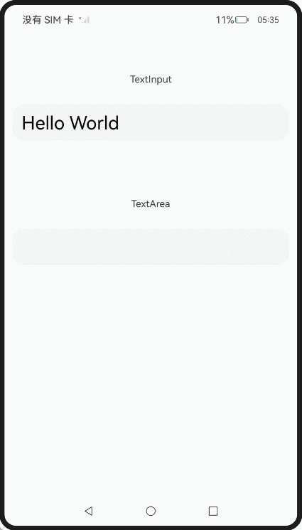

# ArkUI子系统Changelog

## cl.arkui.1 按钮默认值变更为新增圆角矩形类型

**访问级别**

公开接口

**变更原因**

原有默认类型按钮是胶囊按钮，在适老化场景下字体过大，在多行等场景下胶囊按钮文字易超出其圆角范围。不符合简单易用及高端精致原则，因此新增圆角矩形类型按钮，默认值变为新增的圆角矩形类型。

**变更影响**

该变更为不兼容变更。

变更前：ButtonOptions中type的默认值为ButtonType.Capsule。

变更后：ButtonOptions中type的默认值为ButtonType.ROUNDED_RECTANGLE

| 变更前 | 变更后 |
|---------|---------|
|||

**起始API Level**

API 9

**变更发生版本**

从OpenHarmony SDK 5.0.0.43开始。

**变更的接口/组件**

Button组件中ButtonOptions对象的type属性默认值。

**适配指导**

开发者在使用Button组件，创建默认类型的Button按钮时，Button按钮为ROUNDED_RECTANGLE类型。

```ts

@Entry
@Component
struct ButtonExample {
  build() {
    Flex({ direction: FlexDirection.Column, alignItems: ItemAlign.Start, justifyContent: FlexAlign.SpaceBetween }) {
      Text('Capsule button with rounded corners by default.').fontSize(9).fontColor(0xCCCCCC)
      Flex({ alignItems: ItemAlign.Center, justifyContent: FlexAlign.SpaceBetween }) {
        Button('Capsule')
          .type(ButtonType.Capsule)
          .backgroundColor(0x317aff)
          .height(60)
          .controlSize(ControlSize.NORMAL)
          .width(180)
      }
      Text('Rounded rectangle button with rounded corners by default.').fontSize(9).fontColor(0xCCCCCC)
      Flex({ alignItems: ItemAlign.Center, justifyContent: FlexAlign.SpaceBetween }) {
        Button('Rounded rectangle')
          .type(ButtonType.ROUNDED_RECTANGLE)
          .backgroundColor(0x317aff)
          .controlSize(ControlSize.NORMAL)
          .height(60)
          .width(180)
      }
    }.height(400).padding({ left: 35, right: 35, top: 35 })
  }
}

```

## cl.arkui.2 半模态顶部高度位置优化

**访问级别**

公开接口

**变更原因**

半模态顶部高度位置优化。

**变更影响**

该变更为不兼容变更。

变更前：

1. 当使用Length设置的高度大于最大高度或者设置类型为SheetSize.LARGE、竖屏无状态栏时，最大高度为距离屏幕顶部8vp。
2. 当使用Length设置的高度大于最大高度或者设置类型为SheetSize.LARGE、竖屏有状态栏时，最大高度为距离信号栏8vp。
3. 当使用Length设置的高度大于最大高度或者设置类型为SheetSize.LARGE，横屏有无状态栏，最大高度都为距离屏幕顶部8vp。


变更后：

1. 当使用Length设置的高度大于最大高度或者设置类型为SheetSize.LARGE，竖屏有无状态栏，最大高度都为距离信号栏8vp。
2. 当使用Length设置的高度大于最大高度或者设置类型为SheetSize.LARGE、横屏无状态栏时，最大高度为距离屏幕顶部8vp。
3. 当使用Length设置的高度大于最大高度或者设置类型为SheetSize.LARGE、横屏有状态栏时，最大高度为距离信号栏8vp。

**起始API Level**

14

**变更发生版本**

从OpenHarmony 5.0.0.40 版本开始。

**变更的接口/组件**

bindSheet组件。

**适配指导**

默认行为变更，无需适配。

## cl.arkui.3  文本拖拽结束键盘行为变更

**访问级别**

公开接口

**变更原因**

优化系统易用性，提升用户体验

**变更影响**

该变更为兼容性变更。

变更前：从文本框A拖拽到文本框B，文本框B获焦拉起键盘，触发onEditChange回调。

变更后：从文本框A拖拽到文本框B，焦点转移到根节点。文本框B没有获焦，因此不触发onEditChange回调。

| 变更前 | 变更后 |
|---------|---------|
|  |  |

**起始API Level**

API 8

**变更发生版本**

从OpenHarmony 5.0.0.40 版本开始。

**变更的接口/组件**

textInput/textArea/search组件的onEditChange接口

**适配指导**

onEditChange接口的规格没有发生变化，系统默认行为变更，不需要适配。

## cl.arkui.4 ui-extension-component的onReceive/UIExtensionProxy相关接口入参调整

**访问级别**

系统接口

**变更原因**

匿名函数/接口整改

**变更影响**

该变更为兼容性变更。

| 变更前 | 变更后 |
|---------|---------|
| data: { [key: string]: Object } | data: Record\<string, Object\> |
| callback: (proxy: UIExtensionProxy) | callback: Callback\<UIExtensionProxy\> |
| callback?: (proxy: UIExtensionProxy) | callback?: Callback\<UIExtensionProxy\> |
| callback: [callback] | callback: ReceiveCallback |

**起始API Level**

API 14

**变更发生版本**

从OpenHarmony 5.0.0.40 版本开始。

**变更的接口/组件**

onReceive/UIExtensionProxy

**适配指导**

onReceive/UIExtensionProxy接口的规格没有发生变化，系统默认行为变更，不需要适配。