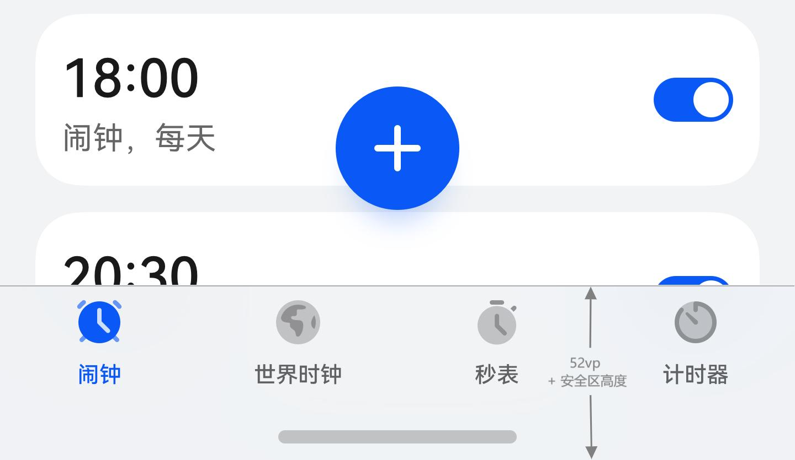

# ArkUI子系统Changelog

## cl.arkui.1 Tabs组件底部页签默认高度由52vp变更为48vp

**访问级别**

公开接口

**变更原因**

Tabs组件底部页签默认高度由52vp调整到48vp，优化用户体验。

**变更影响**

该变更为不兼容性变更。

变更前：设置BottomTabBarStyle样式且vertical属性为false时，barHeight的默认值为52vp。

变更后：设置BottomTabBarStyle样式且vertical属性为false时，barHeight的默认值为48vp。

|               变更前                |              变更后               |
| :---------------------------------: | :-------------------------------: |
|  |  |

**起始API Level**

11

**变更发生版本**

从OpenHarmony SDK 5.0.0.53开始

**变更的接口/组件**

barHeight

**适配指导**

若发现组件高度变化导致界面内容出现留白，可通过修改内容区高度或自适应内容区高度。

若组件高度发生变化，开发者期望保持原有高度样式。示例如下：

```ts
@Entry
@Component
struct barHeightTest {
  build() {
    Column() {
      Tabs({ barPosition: BarPosition.End }) {
        TabContent() {
          Column().width('100%').width('100%').height('100%').backgroundColor(Color.Pink)
        }
        .tabBar(new BottomTabBarStyle($r('sys.media.ohos_app_icon'), "Pink"))

        TabContent() {
          Column().width('100%').width('100%').height('100%').backgroundColor(Color.Green)
        }
        .tabBar(new BottomTabBarStyle($r('sys.media.ohos_app_icon'), "Green"))
      }
      .barHeight(52)
    }
  }
}
```

## cl.arkui.2 轴事件分发到XComponent组件变更

**访问级别**

其他

**变更原因**

轴事件分发错误，开发者如果改了组件z序，组件显示、隐藏后不能正确分发到挂载轴事件的XComponent组件上。

**变更影响**

该变更为不兼容变更。

变更前：开发者改变组件z序，不能正确分发到挂载轴事件的XComponent组件上。

变更后：开发者改变组件z序，能正确分发到挂载轴事件的XComponent组件上。

**起始API Level**

11

**变更发生版本**

从OpenHarmony SDK 5.0.0.53开始

**变更的接口/组件**

不涉及

**适配指导**

默认行为变更，无需适配，但应注意变更后的行为是否对整体应用逻辑产生影响。

## cl.arkui.3 sharedTransition在id入参为undefined或空字符串时的行为变更

**访问级别**

公开接口

**变更原因**

sharedTransition的id从非空字符串变为空字符串或undefined时，无法实现清空共享元素转场id的效果。

**变更影响**

该变更为不兼容变更。

变更前：sharedTransition的id从非空字符串变为空字符串或undefined时，会维持之前的有效id值。

变更后：sharedTransition的id从非空字符串变为空字符串或undefined时，会将共享元素转场id置为空字符串，达到取消sharedTransition匹配的效果。

**起始API Level**

API 7

**变更发生版本**

从OpenHarmony SDK 5.0.0.53版本开始。

**变更的接口/组件**

common.d.ts文件的sharedTransition接口

**适配指导**

如果同一组件sharedTransition的id需要保持不变，应维持原状，而非将其更改为空字符串或undefined。若需清空sharedTransition的id，可将sharedTransition的id设置为空字符串或undefined来实现。

## cl.arkui.4 getSnapshot接口行为变更

**访问级别**

系统接口

**变更原因**

window.getSnapshot接口当前获取到的图片尺寸是windowRect*0.5，不是窗口实际尺寸。

**变更影响**

该变更为不兼容变更。

变更前：window.getSnapshot接口获取到的图片尺寸是windowRect*0.5。

变更后：window.getSnapshot接口获取到的图片尺寸是窗口实际尺寸。

**起始API Level**

API 12

**变更发生版本**

从OpenHarmony 5.0.0.53版本开始。

**变更的接口/组件**

@ohos.window.d.ts

getSnapshot接口

**适配指导**

默认行为变更，无需适配，但应注意变更后的行为是否对整体应用逻辑产生影响。

## cl.arkui.5 setWindowBrightness在2in1设备的行为变更

**访问级别**

公开接口

**变更原因**

2in1设备下，在视频播放页面，通过快捷键调节屏幕亮度不生效，原因是快捷键调节系统亮度，而在视频播放页面屏幕亮度跟随窗口亮度值。

**变更影响**

该变更为不兼容变更。

变更前：2in1设备下，窗口设置屏幕亮度生效时，控制中心和快捷键不可以调整系统屏幕亮度，窗口恢复默认系统亮度之后，控制中心和快捷键可以调整屏幕亮度。

变更后：2in1设备下，窗口设置屏幕亮度生效时，控制中心和快捷键也可以调整系统屏幕亮度。

**起始API Level**

API 9

**变更发生版本**

从OpenHarmony 5.0.0.53版本开始。

**变更的接口/组件**

@ohos.window.d.ts

setWindowBrightness接口

**适配指导**

默认行为变更，无需适配。