# ArkUI子系统Changelog

## cl.arkui.1  半模态底部样式最大高度默认避让状态栏安全区

**访问级别**

公开接口

**变更原因**

UX规格变更。

半模态底部样式最大高度默认避让状态栏安全区。

**变更影响**

此变更不涉及应用适配。
 
场景1：竖屏下，状态栏隐藏时，半模态底部样式最大高度也需要避让状态栏安全区。

- 变更前：状态栏隐藏时，半模态底部样式最大高度距离屏幕上边界8vp，未避让状态栏安全区。
- 变更后：API version 18及以后，状态栏隐藏时，半模态底部样式最大高度距离状态栏下边界8vp，避让状态栏安全区。该样式的最大高度为屏幕高度 - (窗口状态栏安全区高度 + 安全间距8vp)。

| 变更前 | 变更后 |
|------ |--------|
|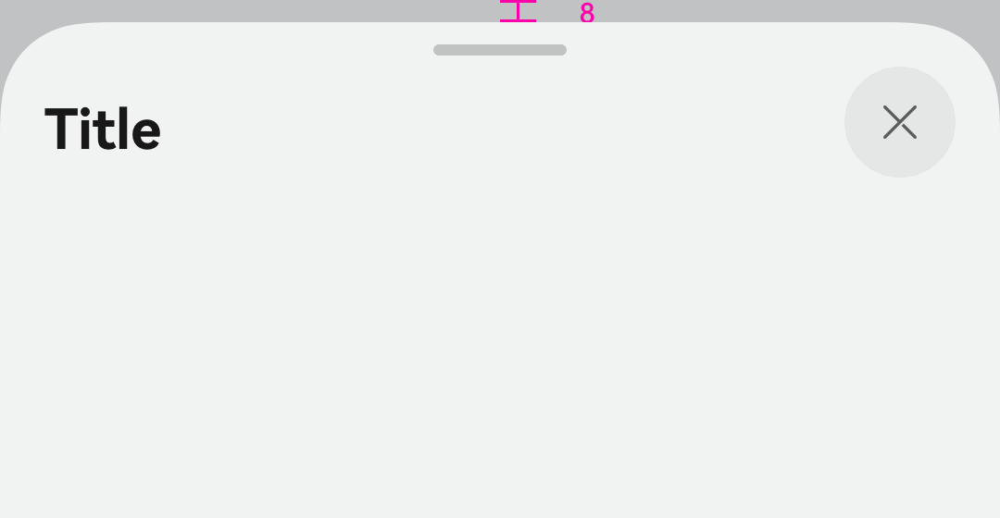|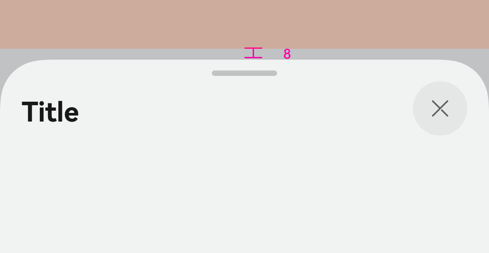|
 
场景2：横屏下，状态栏不隐藏时，半模态底部样式最大高度也需要避让状态栏安全区。

- 变更前：状态栏不隐藏时，半模态底部样式最大高度距离屏幕上边界8vp，未避让状态栏安全区，且与状态栏区域重合。
- 变更后：API version 18及以后，状态栏不隐藏时，半模态底部样式最大高度距离状态栏下边界8vp，避让状态栏安全区。该样式的最大高度为屏幕高度 - (窗口状态栏安全区高度 + 安全间距8vp)。

| 变更前 | 变更后 |
|------ |--------|
|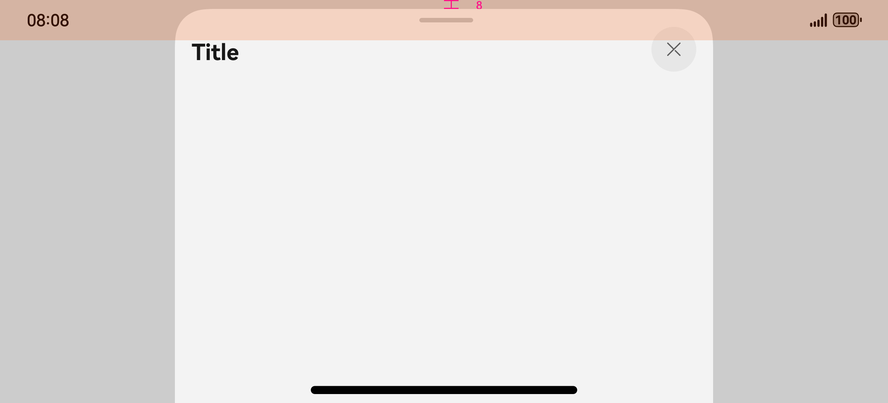|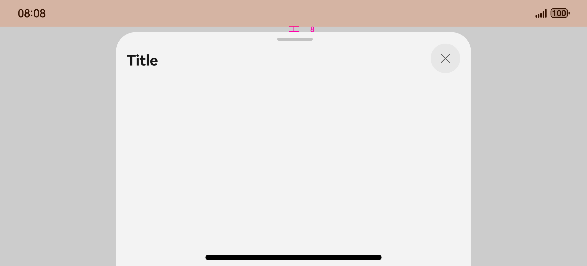|

**起始API Level**

11

**变更发生版本**

从OpenHarmony SDK 5.1.0.54 版本开始。

**变更的接口/组件**

bindSheet的LARGE属性

**适配指导**

若开发者自定义的builder面板内容是固定高度，建议使用100%布局，变更后自定义的内容也可以自动撑满半模态面板。

若按变更前的最大高度规格限制的builder内容，需要变更为新规格计算。

## cl.arkui.2 sharedTransition在id入参为undefined或空字符串时的行为变更

**访问级别**

公开接口

**变更原因**

sharedTransition的id从非空字符串变为空字符串或undefined时，无法实现清空共享元素转场id的效果。

**变更影响**

此变更涉及应用适配，API18之前不变，API18及以后，发生变更。

变更前：sharedTransition的id从非空字符串变为空字符串或undefined时，会维持之前的有效id值。

变更后：sharedTransition的id从非空字符串变为空字符串或undefined时，会将共享元素转场id置为空字符串，达到取消sharedTransition匹配的效果。

**起始API Level**

API 7

**变更发生版本**

从OpenHarmony SDK 5.1.0.54版本开始。

**变更的接口/组件**

common.d.ts文件的sharedTransition接口

**适配指导**

开发者如果希望同一组件的sharedTransition的id维持有效值不变，且开发者已经主动设置id为空字符串或undefined时，需要适配。适配方式为不更改sharedTransition的id，维持之前的有效值不变。其余情况无需适配。


## cl.arkui.3 bindSheet在2in1设备中默认避让窗口安全区

**访问级别**

公开接口

**变更原因**

UX规格变更。

半模态内容需默认避让窗口安全区，否则会有重叠区域。

**变更影响**

此变更涉及应用适配，API18之前不变，API18及以后，发生变更。

当自由窗口标题栏类型为悬浮标题栏时，需要半模态面板默认避让标题安全区。

场景1：半模态居中弹窗样式

- 变更前：半模态居中弹窗样式的面板最大高度为窗口高度的90%。
- 变更后：API version 18及以后，该样式的最大高度为窗口高度 - (窗口安全区高度 + 安全间距8vp) * 2。

| 变更前 | 变更后 |
|------ |--------|
||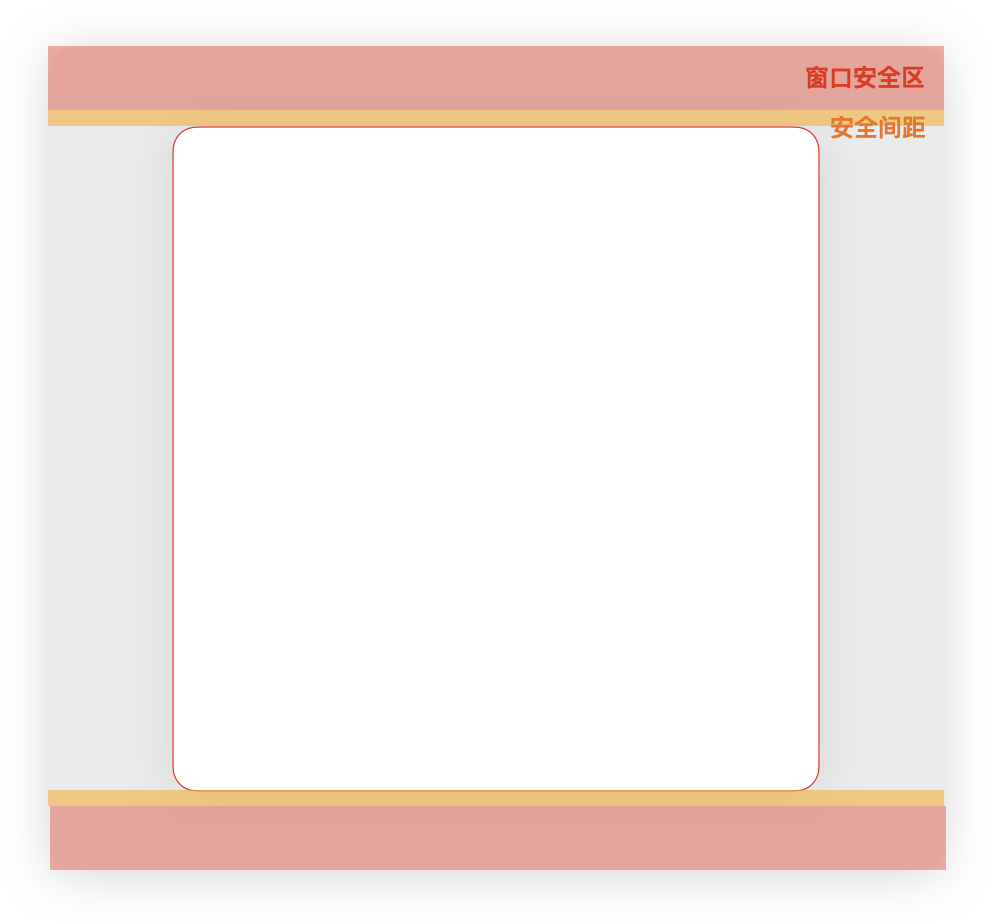|

场景2：半模态底部弹窗样式

- 变更前：半模态底部弹窗样式的面板最大高度为窗口高度 - 8vp。
- 变更后：API version 18及以后，该样式的最大高度为窗口高度 - (窗口安全区高度 + 安全间距8vp)。

| 变更前 | 变更后 |
|------ |--------|
|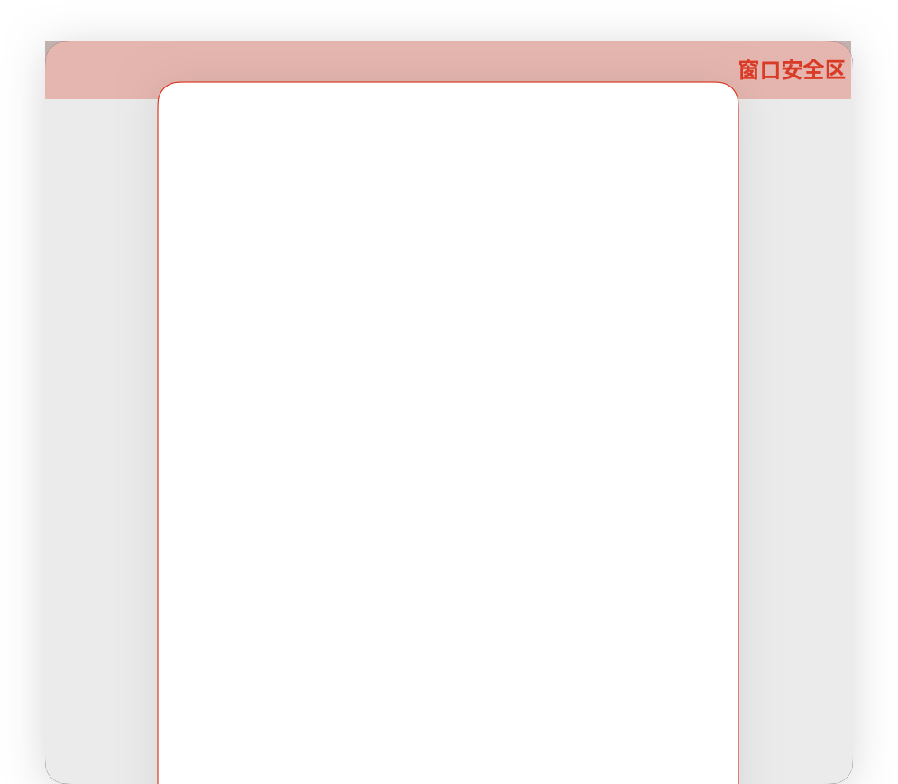||

**起始API Level**

11

**变更发生版本**

从OpenHarmony SDK 5.1.0.54版本开始。

**变更的接口/组件**

bindSheet的preferType属性

**适配指导**

若开发者自定义的builder面板内容是固定高度，建议使用100%布局，变更后自定义的内容也可以自动撑满半模态面板。

若按变更前的最大高度规格限制的builder内容，需要变更为新规格计算。

## cl.arkui.4 XComponent设置为Texture模式使用blendMode接口的行为由不生效变更为正常生效
**访问级别**

公开接口

**变更原因**

用户使用XComponent组件并设置为Texture模式时，使用blendMode接口没有效果，不符合接口正常规格，需要变更为blendMode接口正常生效。

**变更影响**

此变更涉及应用适配。

变更前：XComponent组件设置为Texture模式，使用blendMode接口不生效。

变更后：XComponent组件设置为Texture模式，使用blendMode接口正常生效。

**起始API Level**

API 11

**变更发生版本**

从OpenHarmony SDK 5.1.0.54开始。

**变更的接口/组件**

common.d.ts文件的blendMode接口。

**适配指导**

需适配场景：
当应用使用XComponent组件并设置为Texture模式（`type`设置为`XComponentType.TEXTURE`）时，使用blendMode接口，可能会出现显示效果变更前后不一致的情况，以下是使用场景示意：

```ts
@Entry
@Component
struct Index {
  private contextOne: Record<string, () => void> = {};
  private contextTwo: Record<string, () => void> = {};

  build() {
    Column() {
      Stack() {
        XComponent({
          id: 'circle',
          type: XComponentType.TEXTURE,
          libraryname: 'nativerender'
        }).height(50)
          .backgroundColor(Color.Transparent)
          .onLoad((contextOne?: object | Record<string, () => void>) => {
            if (contextOne) {
              this.contextOne = contextOne as Record<string, () => void>;
            }
          })

        XComponent({
          id: 'rect',
          type: XComponentType.TEXTURE,
          libraryname: 'nativerender'
        }).height(50)
          .backgroundColor(Color.Transparent)
          .onLoad((contextTwo?: object | Record<string, () => void>) => {
            if (contextTwo) {
              this.contextTwo = contextTwo as Record<string, () => void>;
            }
          })
          .blendMode(BlendMode.XOR) // 变更后生效，若需保持变更前行为，可使用BlendMode.None入参
      }
      .height(50)
      .onClick(() => {
        if (this.contextOne) {
          this.contextOne.drawCircle();
        }
        if (this.contextTwo) {
          this.contextTwo.drawRectangle();
        }
      })
    }
    .blendMode(BlendMode.SRC_OVER, BlendApplyType.OFFSCREEN)
    .width('100%')
    .height('100%')
  }
}
```
| 混合类型 | 变更前 | 变更后 |
| ------- | - | ---- |
| BlendMode.XOR |  |  |
| BlendMode.NONE  |  |  |

应用若需保持变更前行为，XComponent组件上的blendMode接口使用BlendMode.None入参即可。

## cl.arkui.5 半模态跟手样式弹窗显示位置避让规则变更
**访问级别**

公开接口

**变更原因**

基础能力增强，半模态跟手样式弹窗支持开发者自定义弹出方向，并根据位置避让流程决定弹窗最终显示位置

**变更影响**

此变更不涉及应用适配，

变更前行为：半模态跟手样式弹窗默认弹出位置为绑定组件底部，会根据剩余空间情况同绑定组件左边和右边作对齐布局，不做任何半模态面板高度的压缩。

变更后行为：开发者可使用bindOptions中的placement(设置弹窗默认弹出位置，默认值Bottom) 和 placementOnTarget(所有位置均放不下时，是否允许弹窗覆盖在绑定节点上)两个字段，自定义半模态跟手样式弹窗相关的弹出位置信息。半模态跟手样式弹窗在确保指定位置能容纳弹窗尺寸的前提下，优先依据设定的placement展示弹窗。若不可行，则遵循先垂直翻转，后尝试90°水平旋转的规则调整显示位置，以预设方向为下方为例，调整顺序依次为：下、上、右、左。如果设置的对齐方式导致组件布局超出窗口范围，将根据该对齐方式在水平或垂直方向上进行位移，直至组件完全显示在窗口内。如果在四个方向上均无法容纳跟手样式弹窗，处理方式遵循开发者设置的placementOnTarget属性。若属性值为True，将依据设定的placement，向其镜像方向平移，直至弹窗能够完全显示，且允许覆盖在绑定的弹出节点上；若属性值为false，则在四个方向中，选择能够完全展示弹窗宽度且剩余高度最大的方向，通过调整半模态高度以适应当前方向，确保弹窗能够放下，同时保持预设placement对应的对齐方式不变。

| 场景 | 变更前 | 变更后placementOnTarget为true | 变更后placementOnTarget为false |
|------ |------ |--------|--------|
|半模态跟手弹窗大小过大导致底部空间不足以容纳弹窗面板|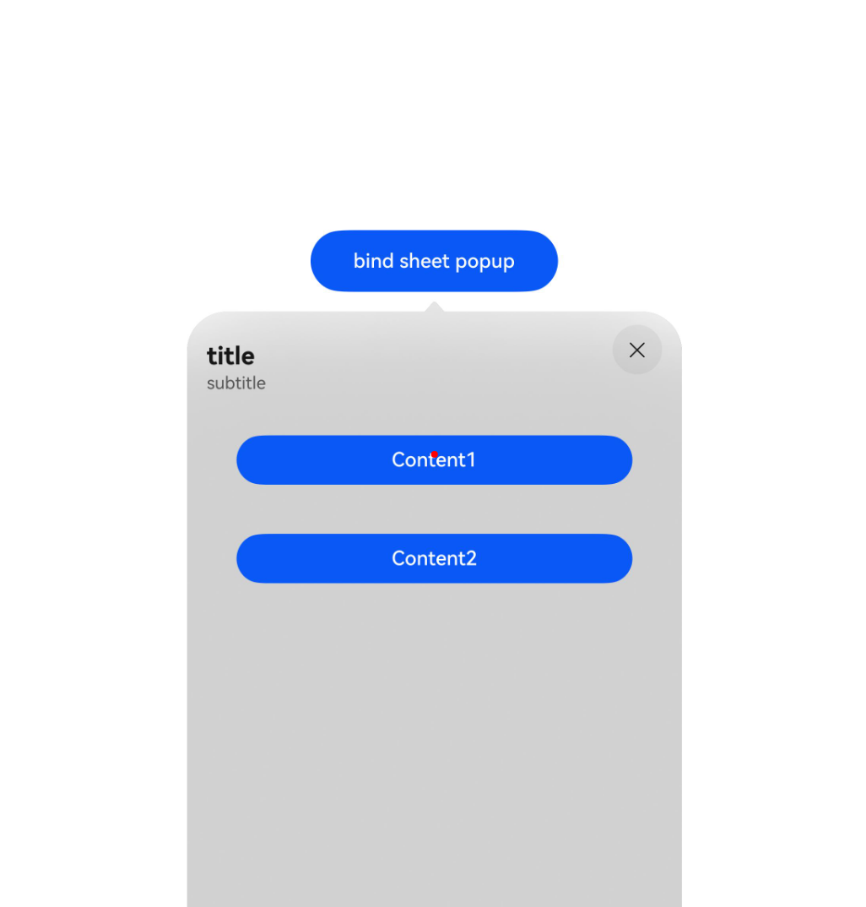|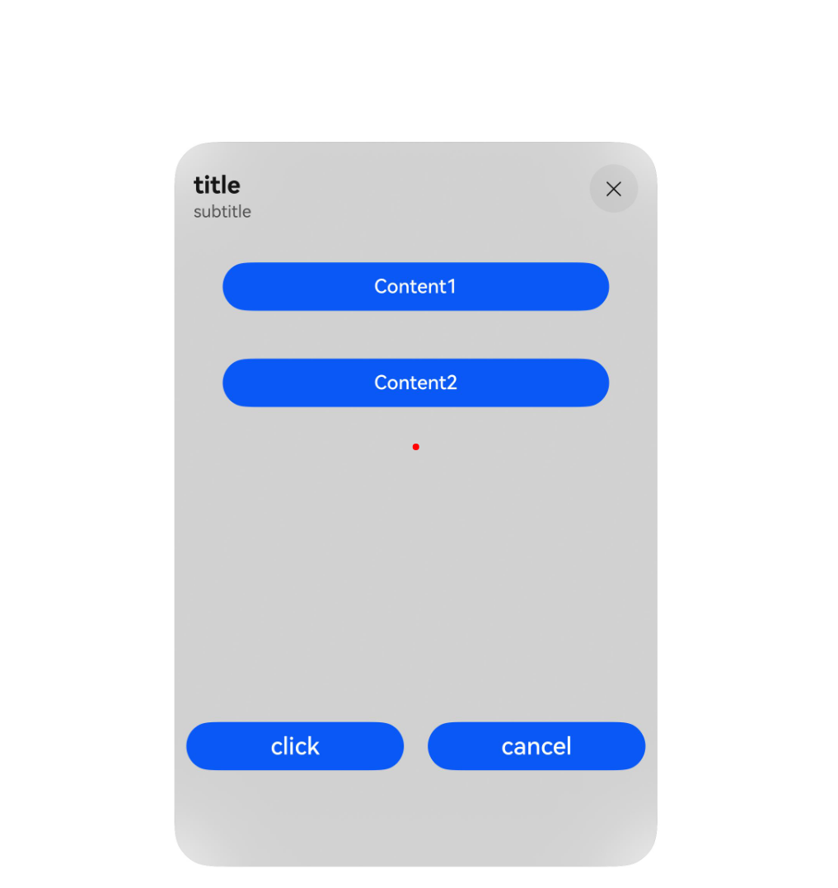|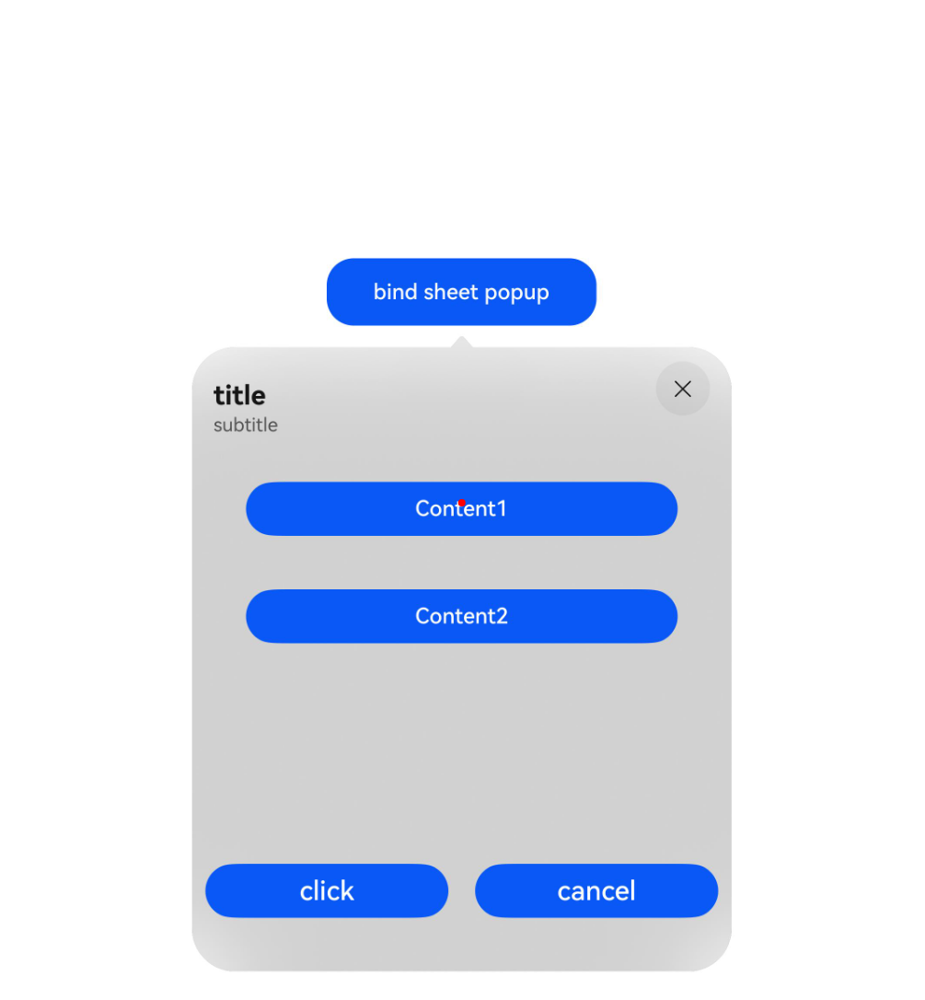|

| 场景 | 变更前 | 变更后 |
|------ |--------|--------|
|半模态跟手弹窗弹出位置过于靠近左侧边界导致左侧剩余空间不足以保持同绑定节点居中对齐|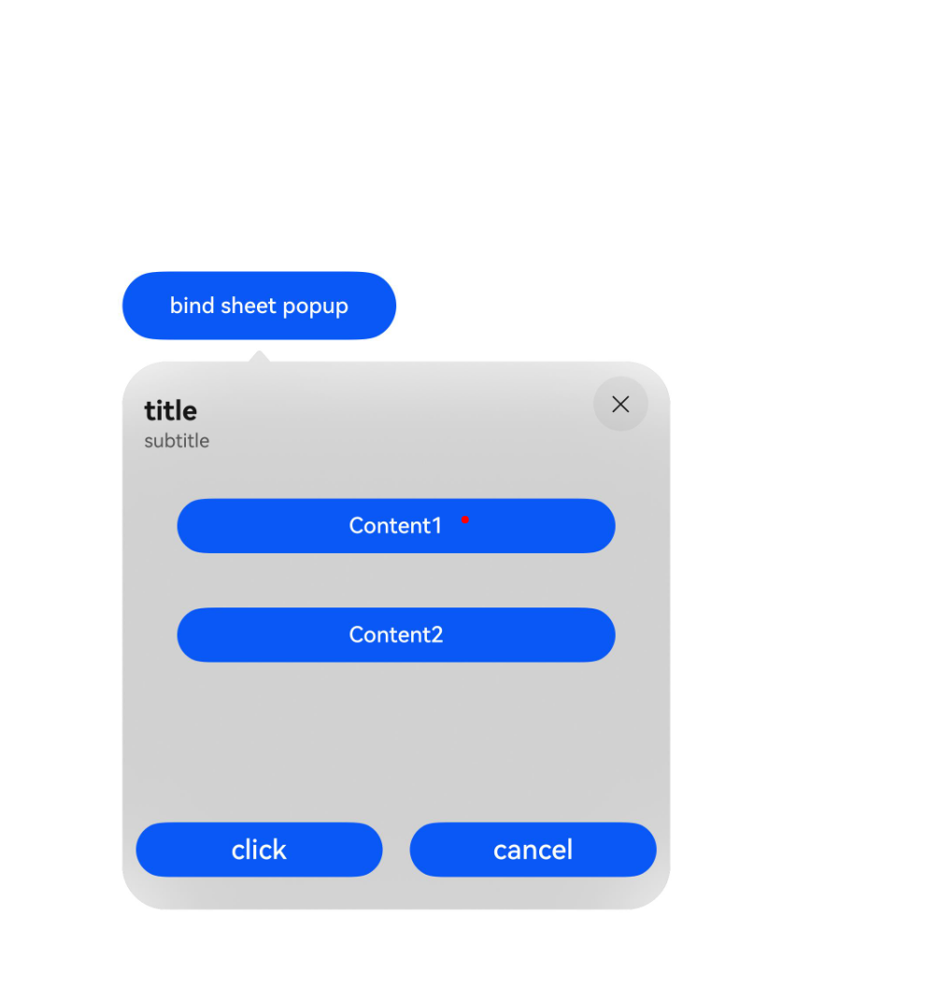|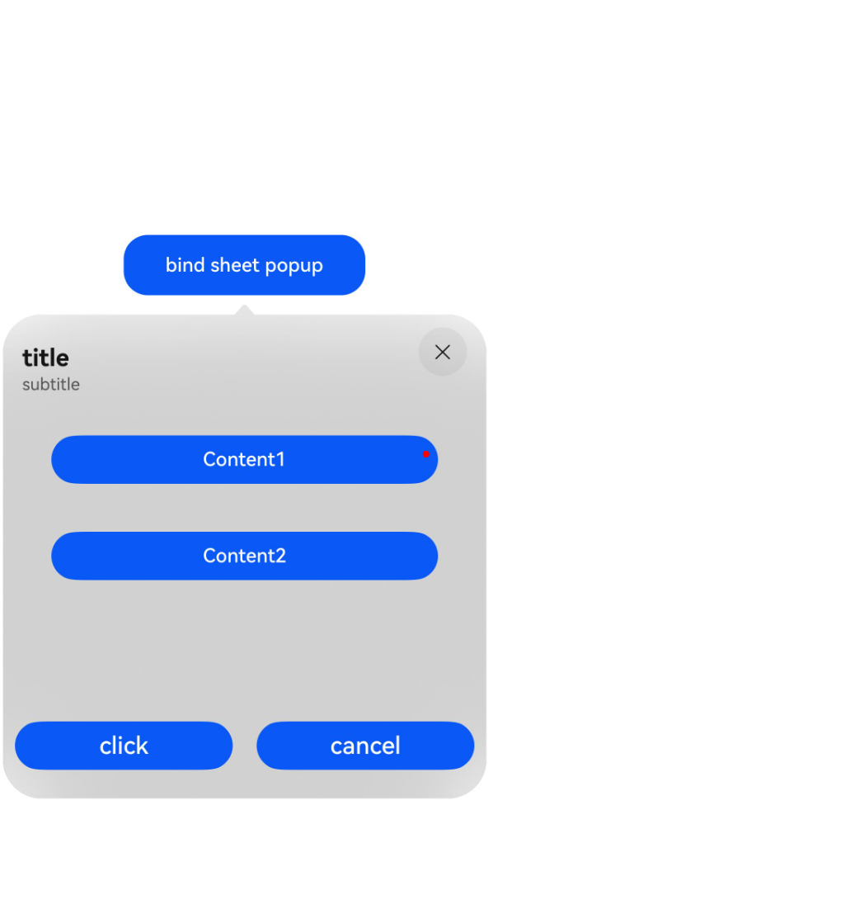|
|半模态跟手弹窗弹出位置过于靠近右侧边界导致右侧剩余空间不足以保持同绑定节点居中对齐|||
|半模态绑定的弹出节点在y轴位置上更偏底部，但绑定节点的底部空间不足以容纳半模态弹窗面板，而顶部空间足以容纳|||
|半模态绑定的弹出节点在x轴位置上更偏左边，但绑定节点的底部、顶部空间不足以容纳半模态弹窗面板，而右边空间足以容纳|||
|半模态绑定的弹出节点在x轴位置上更偏右边，但绑定节点的底部、顶部、右边空间不足以容纳半模态弹窗面板，而左边空间足以容纳||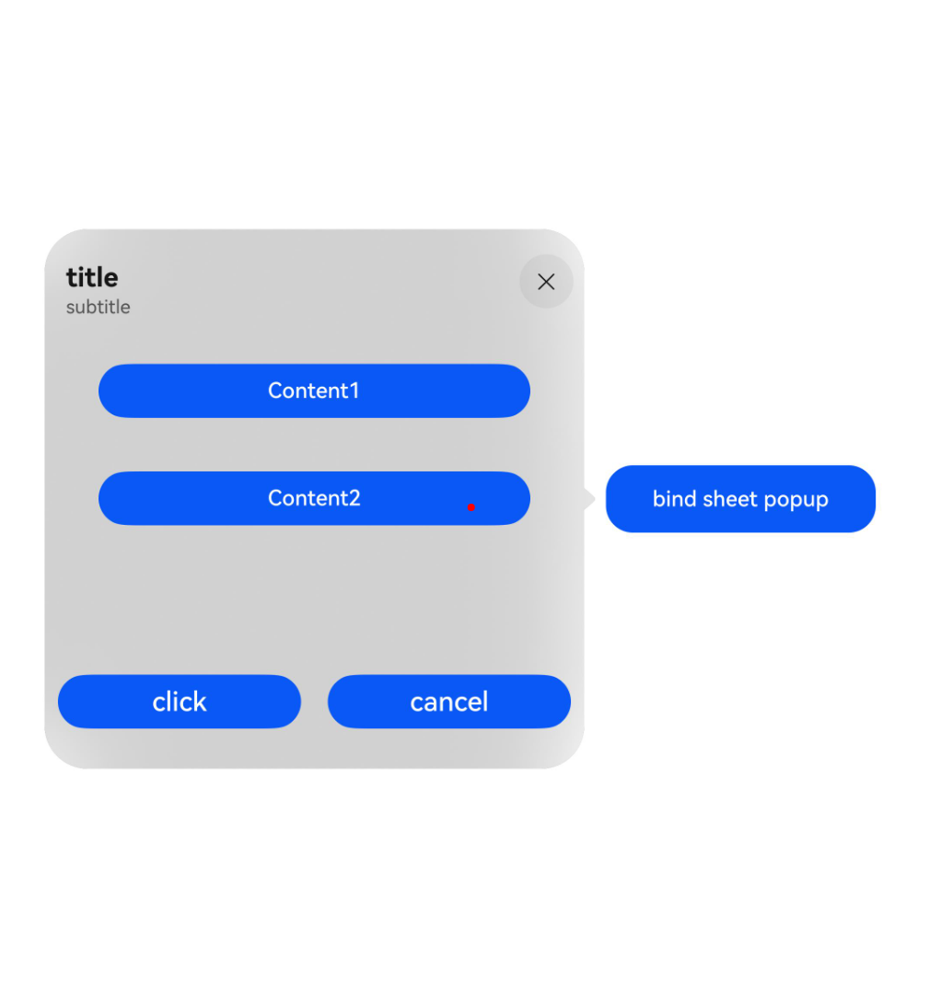|

**起始API Level**

11

**变更发生版本**

从OpenHarmony SDK 5.1.0.54 版本开始。

**变更的接口/组件**

bindSheet
SheetType.POPUP

**适配指导**

默认行为变更，开发者无需适配。若API version 18前希望实现的效果为位于弹出节点底部并且同弹出节点左对齐或者右对齐，可以通过设置placement值为BottomLeft或BottomRight来实现对应显示效果。
